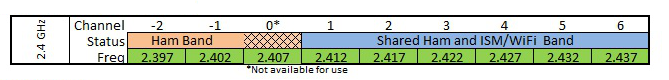
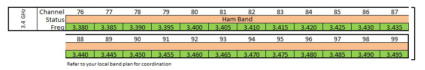

========================
Frequencies and Channels
========================

The frequencies and channels that are available for AREDN |trade| networking are shown in the charts below.

**2.4 GHz**

**3.4 GHz**

**5.8 GHz**

.. image:: _images/5.8ghz.png
   :alt: 5.8 GHz Channels
   :align: center

.. |trade|  unicode:: U+00AE .. Registered Trademark SIGN
   :ltrim:
