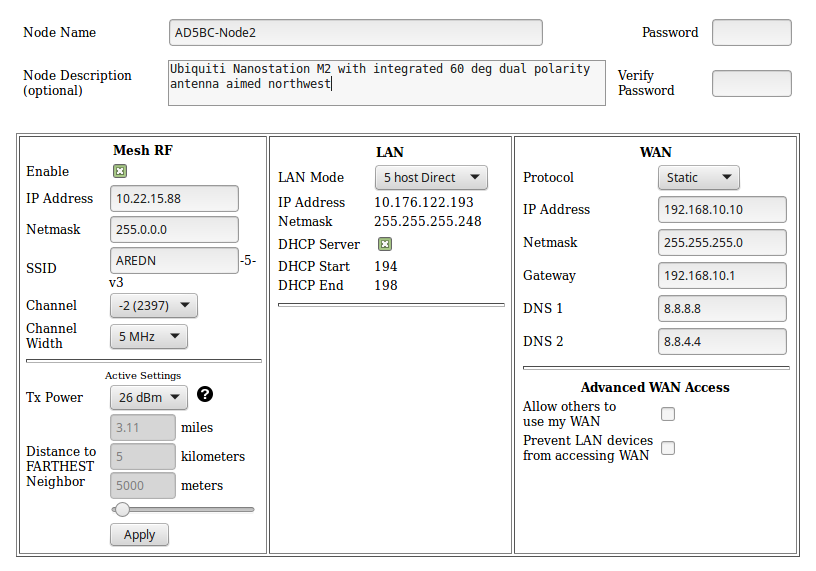
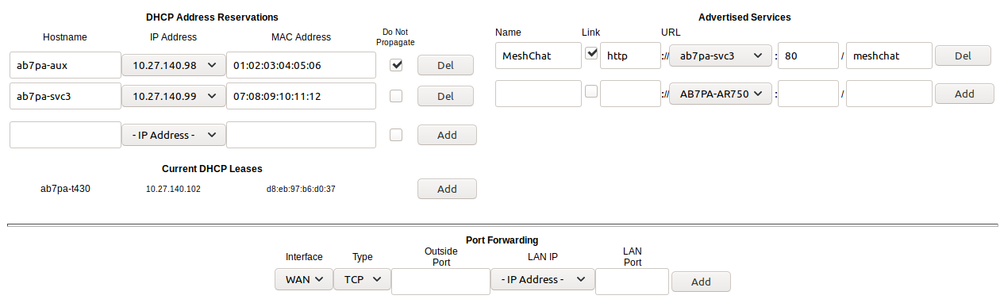
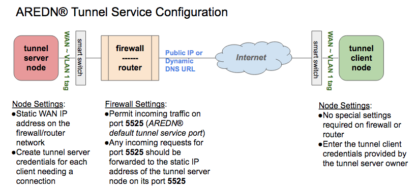
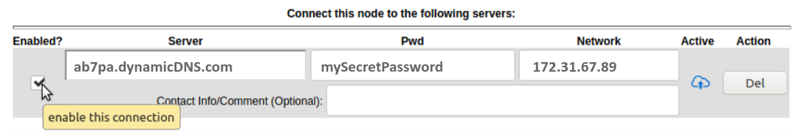
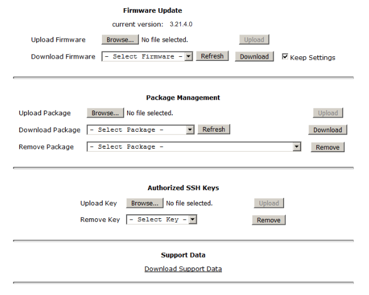

======================
Advanced Configuration
======================

During your node's *Basic Setup* you used the configuration display by clicking the **Setup** button and typing your username and password. The configuration area has several additional features which will be described in more detail below. Clicking **Node Status** exits configuration mode without saving any changes, returning you to the *Node Status* display.

.. image:: _images/06-admin-header.png
   :alt: Admin Navigation Controls
   :align: center

There are several control buttons below the configuration links section.

**Help**
   Opens a new window or tab to display the node help page.

**Save Changes**
  Click this button to save any configuration changes you have made. Saving changes will first do a basic validation of the new settings, saving them to flash memory if no errors are found. The new settings take effect in about 20 seconds and a reboot may or may not be required.

**Reset Values**
  Click this button to reload the currently saved settings from flash memory, effectively undoing any changes that were made.

**Default Values**
  Click this button to reset your node's basic settings to the default values. This action does not affect your existing node name.

**Reboot**
  Click this button to force your node to reboot.

Basic Setup
-----------

You have already configured many of the basic settings, but there are several additional features that will be explained below.

Mesh RF Column
^^^^^^^^^^^^^^

*Mesh RF* is the node's *radio* interface. The AREDN |trade| firmware has been designed to simplify the process of configuring networking interfaces. Network values are automatically calculated based on the unique :abbr:`MAC (Media Access Control)` addresses of your node. Normally you will not need to change any of the network settings on this page, so keep these values unless you fully understand how the mesh works and why the defaults may not be suitable for your situation.

The *Active Settings* can be adjusted and applied without saving changes or rebooting your node. However, they will return to their original values after a reboot unless you click *Save Changes*. A node may decrease its output power as it increases its data rate in order to maintain a linear spectrum. The *Distance* setting increases the packet retry timer to allow stations that are farther away more time to respond.

LAN Column
^^^^^^^^^^

The LAN column contains the settings for the Local Area Network hosted by the AREDN |trade| node. There are several options under the *LAN Mode* dropdown.

The default mode is ``5 Host Direct``. In this mode every host on the LAN has direct access to and from the mesh. This mode was created to reduce the amount of manual configuration needed to provide services to the mesh, since many services do not work well if they are hosted behind a :abbr:`NAT (Network Address Translation)` router. With *Direct* mode the LAN shares the same address space as the mesh at large. Port forwarding is not needed because NAT is not used, and there is no firewall between the LAN and the mesh.

The mesh address space is automatically managed, so you cannot configure the LAN network settings in *Direct* mode. The only configurable option available in *Direct* mode is the size of the LAN subnet which can accommodate either 1, 5, or 13 LAN hosts. A one host subnet can be used for either a single server or a separate network router using its own NAT which is capable of more advanced routing functions than those available on a mesh node.

It is important not to use a subnet larger than is necessary because the chance of an IP address conflict on the mesh increases with the size of the subnet. The LAN subnet parameters are automatically calculated and depend on the IP address of the *Mesh RF* interface. If a conflict does occur it can be fixed by changing the *Mesh RF* IP address.

The other LAN Mode is ``NAT``, and in this mode the LAN is isolated from the mesh. All outgoing traffic has its source address modified to be the *Mesh RF* IP address of the node. This is the same way that most routers use an Internet connection, and all services provided by computers on the LAN can only be accessed through port forwarding rules. A single :abbr:`DMZ (DeMilitarized Zone)` server can be used to accept all incoming traffic that is not already handled by other rules or by the node itself.

By default each node runs a :abbr:`DHCP (Dynamic Host Control Protocol)` server for its LAN interface, which lets the node assign IP addresses automatically for devices connected to the node's local area network. The last octet of the start/end range for host IP addresses is shown in the LAN column. If you choose to disable the DHCP server, you must manually configure the host IP addresses to be within the LAN network range. There should be only one DHCP server for each IP address scope or range, so you may need to disable your node's DHCP server if there is already another device providing DHCP services on your node's local area network. Click this link for additional information on `Dynamic Host Control Protocol <https://en.wikipedia.org/wiki/Dynamic_Host_Configuration_Protocol>`_.

The *Disable Default Route* checkbox will tell the node not to advertise that it can be used as a default gateway. This means that computers on the LAN network will have no route to reach the Internet or other networks via the mesh node. If this checkbox is selected your hosts will not be able to access the Internet even if your node has Internet available on its WAN port. You may need to disable the default route if your node needs to be connected to two networks at once, such as being wired to the mesh and connected to a local served agency WiFi network.

WAN Column
^^^^^^^^^^

The :abbr:`WAN (Wide Area Network)` interface on your node is typically used to connect it to the Internet or to another external network. By default the WAN interface is set to obtain an IP address via DHCP from your upstream network. The :abbr:`DNS (Domain Name System)` servers are set by default to use Google's DNS services and should not be changed under normal circumstances. Google's name resolution servers are configured properly to detect error conditions and report them correctly.

If you are not going to use the WAN interface on your node, you can select *disabled* from the *Protocol* dropdown list. If you will be using your node as a *Tunnel Server*, you should assign the node a *Static* IP address on your WAN network. This will be explained in the *Tunnel Server* section below.

When a node has Internet access from either the WAN or LAN interface, that access is available to the node itself and to any computers connected via the *LAN* port. Checking the *Mesh Gateway* box will also allow this node to route traffic from the *Mesh RF* interface to/from the Internet or other external network. By default the *Mesh Gateway* box is unchecked because it is not desirable to route Internet traffic over the radio interface. AREDN |trade| is an FCC Part 97 amateur radio network, so be sure that any traffic which will be sent over the radio complies with FCC Part 97 rules. If you want local wireless Internet access, consider using a standard FCC Part 15 compliant access point instead of the node's *Mesh Gateway* feature.

Node VLANs
^^^^^^^^^^

Many of the devices used as AREDN |trade| nodes have only one Ethernet port, but more than one type of network traffic must share that single port. The AREDN |trade| firmware implements :abbr:`VLANs (Virtual Local Area Network)` in order to accomplish this. Different types of traffic are tagged to identify the network to which they belong.

VLAN 1
  Packets received by the node that are tagged for VLAN 1 will be identified as WAN traffic from the Internet or another external network.

VLAN 2
  Packets received by the node that are tagged for VLAN 2 will be identified as traffic from a :abbr:`DtD (Device to Device)` node directly connected via Ethernet cable.

No VLAN tag
  Packets received by the node that are untagged will be identified as LAN traffic from computers on the local area network.

It is important to understand AREDN |trade| VLANs when configuring network smart switches for Internet access, tunneling, or DtD linking of nodes. There are some useful tutorials available on the AREDN |trade| website for configuring VLAN-capable switches: `Video <https://www.arednmesh.org/content/understanding-vlans>`_ or `Text+Images <https://www.arednmesh.org/content/configuring-netgear-gs105e-switch-lanwan-ports>`_. Also, on the AREDN |trade| GitHub site there is more information about node VLANs that have been preconfigured in the firmware images for specific types of radio hardware. For additional information visit this link: `Ethernet Port Usage <https://github.com/aredn/aredn_ar71xx#ethernet-port-usage>`_

Port Forwarding, DHCP, and Services
-----------------------------------

Click the **Port Forwarding, DHCP, and Services** link to navigate to these settings. This section provides a way for you to configure LAN network address reservations and service advertisements on your node. If your LAN network uses ``NAT`` mode, you may also need to define port forwarding rules.

----------

----------

If your node is running its default DHCP server on the LAN network, it will automatically provide IP addresses to connected hosts. Look under the **Current DHCP Leases** heading to see the existing hosts and their assigned IP address.

.. attention:: The hostnames of computers connected to the mesh at large must be unique. Typically you should prefix your amateur radio callsign to the computer's hostname in order to have the best chance of it being unique on the mesh network.

Since DHCP leases are dynamic and can change over time, there may be a reason why a host's assigned IP address should be made permanent. This is especially useful if that host will provide an application, program, or service through your node to the mesh network at large. You can permanently reserve that host's DHCP address by clicking the *Add* button to the right of the host in the *DHCP Leases* list. You will see that host now appears in the list under the **DHCP Address Reservations** heading above the list of leases.

Advertised Services
^^^^^^^^^^^^^^^^^^^

*Services* include the required applications, programs, or functions that are available to devices on the mesh network. The purpose of the network is to transport data for the services which are being used. Network services may include keyboard-to-keyboard chat or email programs, document sharing applications, Voice over IP phone or video conferencing services, streaming video from surveillance cameras, and a variety of other network-enabled features. Services can run on the node itself or on any of its LAN-connected devices.

Remember that AREDN |trade| nodes have a limited amount of system resources with which to run services, so installing add-on services directly on the mesh node should be avoided because the node will become unstable and the mesh network can fail if insufficient RAM is available for the node to function, particularly on devices with only 32 MB of memory. It is a best practice to run services on an external computer connected to the node's LAN network. In the example above you can see that an external host has been given a reserved DHCP address, and it is also running the *meshchat* program as a service that is advertised on the network through this node. Use the following steps to create an advertised service.

Name
  Enter a service name in the *Name* field.

Link
  Check this box if your want your advertised service to display an active link in the web browser. This allows mesh users to navigate to your service by clicking the link.

Protocol
  Enter the protocol to use in the field between *Link* and *URL*. Common protocols include ``http`` for website services and ``ftp`` for file transfer services. Other services may use other protocols.

URL
  From the dropdown list select the node or host on which this service is running.

Port
  Enter the network port on which the service is listening for user connections. There may be several applications provided through a single web server on a node or host using a single port, and in that case a valid application *Path* must be entered after the port number (as in the example above). In other cases the network port alone uniquely identifies the application or program that is listening for user connections to that service. You can click this link for additional information about `network ports <https://en.wikipedia.org/wiki/Port_(computer_networking)>`_.

Once you have entered the values for your advertised service, click *Add* to add the service to the **Advertised Services** list. You may also remove an existing advertised service by clicking the *Del* button to delete it from the list.

Port Forwarding
^^^^^^^^^^^^^^^

If you are using ``NAT`` for your LAN mode, then *Port Forwarding* rules are the only way other devices have for connecting to your services. To create a port forwarding rule, select the network interface on which the traffic will enter your node. Select the protocol used by the incoming packets (TCP, UDP, or Both). Enter the port number that the external request is using to connect to your service. When your node receives traffic on the selected interface, protocol, and port, the request will be routed to the LAN IP address and port on which that host is listening for incoming service requests.

See your node's **Help** file for additional insights on how this configuration section changes based on the LAN mode of your node. Click this link for more information on `Port Forwarding <https://en.wikipedia.org/wiki/Port_forwarding>`_.

Tunnel Server
-------------

Click the **Tunnel Server** link to navigate to these settings. This section provides a way for you to configure your node with a special service that allows node-to-node connections across the Internet. Unless you have a specific need for this type of network connection, it is recommended that you do not install the *Tunnel Server* feature. This is because it will cause your node to dedicate limited system resources to running a service that may rarely or never be used. In order to increase the performance of your node you should conserve system resources so they will be available for normal node operations, which is especially important for nodes with limited memory and storage.

Internet Connectivity Requirements
^^^^^^^^^^^^^^^^^^^^^^^^^^^^^^^^^^
In order to run your node as either a *Tunnel Server* or *Tunnel Client*, you will need to configure additional settings and equipment.

Managed Switch Settings (both Client and Server networks)
  Set your VLAN-capable network switch to appropriately tag traffic from the Internet with "VLAN 1" before sending it to your node. This allows your node to properly identify the traffic as coming from the Internet connection on its WAN interface. See the equipment manual for your managed switch to determine how to configure these settings. There are also AREDN |trade| `website posts <https://www.arednmesh.org/content/configuring-netgear-gs105e-switch-lanwan-ports>`_ which contain helpful information.

  Your node should have Internet access after the smart switch is configured, and you can use the node's new Internet connection to install the *tunneling* software package. This package should be installed on both the tunnel server and the tunnel client nodes.

WAN Interface IP (Tunnel Server *node* only)
  Set a static IP address on your tunnel server node's WAN interface so your Internet-connected router/firewall has a consistent way to forward traffic to your node.

Internet Firewall/Router Settings (Tunnel Server network only)
  Set your network firewall or router to permit traffic from the Internet on port 5525, which is the default AREDN |trade| tunnel service port. Then configure a port forwarding rule on your firewall or router to send any traffic from the Internet on port 5525 to the static IP address of your node's WAN interface on the *node's* port 5525. See the equipment manual for your firewall or router to determine how to configure these settings. Also, some Internet Service Providers may not allow port forwarding by default, so you should check with your ISP if you have difficulty opening ports.

Tunnel Server Node Settings
^^^^^^^^^^^^^^^^^^^^^^^^^^^

The following diagram shows an overview of tunnel services between two nodes.

----------

----------

The tunnel network address ranges are automatically calculated, and it is not necessary to change these settings unless there is a specific reason why the defaults will not work for your situation.

Tunnel Server DNS Name
  Enter the *Public IP Address* or the *Dynamic DNS URL* by which Internet-connected nodes can reach your network.

Client Node Name
  Enter the exact node name of the client node that will be allowed to connect to your node over the tunnel. Do not include the "local.mesh" suffix.

Client Password
  Enter a complex password that the client node will use to connect to your node over the tunnel. Use only uppercase and lowercase characters and numbers in your password.

Once these settings are correct, click *Add* to add the new client to the list of authorized tunnel clients. On the right of each entry there is an envelope icon which will automatically open your computer's email program and copy the client settings into a new email which allows you to quickly and easily send credentials to the owners of the client nodes.

To allow a client to connect to your tunnel server, select the **Enabled?** checkbox and click the **Save Changes** button. When a tunnel connection becomes active, the cloud icon at the right of each row will change to indicate that the tunnel is active.

Tunnel Client
-------------

Click the **Tunnel Client** link to navigate to these settings. In this section you can configure your node to connect over the Internet to another node running as a *Tunnel Server*. You should already have your VLAN-capable network switch configured as explained in the *Tunnel Server* section above.

Contact the amateur operator who controls the tunnel server and request client credentials by providing your specific node name. The tunnel server administrator will provide you with the public IP or :abbr:`DDNS (Dynamic Domain Name Service)` URL for the tunnel server, the password you are to use, and the network IP address for your client node. Enter these values into the appropriate fields on your node and click *Add* to create a client entry in the list.

----------

----------

To allow your client to connect to the tunnel server, select the **Enabled?** checkbox and click the **Save Changes** button. When a tunnel connection becomes active, the cloud icon at the right of each row will change to indicate that the tunnel is active.

Administration
--------------

Click the **Administration** link to navigate to these settings. There are four sections that provide a way for you to update the AREDN |trade| firmware, as well as to install or remove software packages on your node.

.. attention:: Files cannot be uploaded to a node while a tunnel server or client connection is enabled. Disable tunnel client or server connections before uploading firmware, packages, or ssh key files. The *Upload* buttons will be disabled until tunnels are disabled.

**Firmware Update**
  If you have a new firmware image that has already been downloaded to your computer, click the *Browse* button and select the firmware file to upload. Click *Upload* and the file will be uploaded and installed on the node.

  If the node has Internet access (either from its WAN interface or from the mesh) you can use the *Download Firmware* option. Click *Refresh* to update the list of available images. Select the image to download, click *Download*, and wait for the firmware to download and be installed. When upgrading firmware, you can retain your existing configuration settings by selecting the *Keep Settings* checkbox.

**Package Management**
  Here you can install or remove software packages on the node. *Upload Package* allows you to install a package file from your computer. *Download Package* allows you do retrieve a package over the Internet from the AREDN |trade| website. Clicking *Refresh* will update the list of packages available for download, but try to avoid updating this list unless you absolutely require it. The package information database is stored locally and will use quite a bit of storage space. Under normal circumstances it is rare to require a package refresh.

  The *Remove Package* list shows all packages currently installed on the node. Selecting a package and clicking *Remove* will uninstall the package. You will only be able to remove packages that you have added. All installed packages are shown, but the pre-installed packages cannot be deleted since they are necessary for proper operation of the node.

**Authorized SSH Keys**
  Uploading ssh keys allows computers to connect to a node via ssh without having to know the password. The ssh keys are generated on your computer using built-in utilities or the `PuTTY <https://www.chiark.greenend.org.uk/~sgtatham/putty/latest.html>`_ program's *Key Generator*. Once you have the key files on your computer, you can upload its *public* key to your AREDN |trade| node. If you want to remove an installed key, select it and click the *Remove* button.

**Support Data**
  There may be times when you want to view more detailed information about the configuration and operation of your node, or even forward this information to the AREDN |trade| forum in order to get help with a problem. Click *Download Support Data* to save a compressed archive file to your local computer.

Node Reset Button
-----------------

The reset button on an AREDN |trade| node has two built-in functions based on the length of time the button is pressed.

With the node powered on and fully booted:

* **Hold for 5 seconds to reset the password and DHCP server**
* **Hold for 15 seconds to return the node to “just-flashed” condition**

On some equipment models it may be possible to accomplish these reset procedures by pressing the *Reset* button on the PoE unit.

.. |trade|  unicode:: U+02122 .. TRADE MARK SIGN
   :ltrim:
