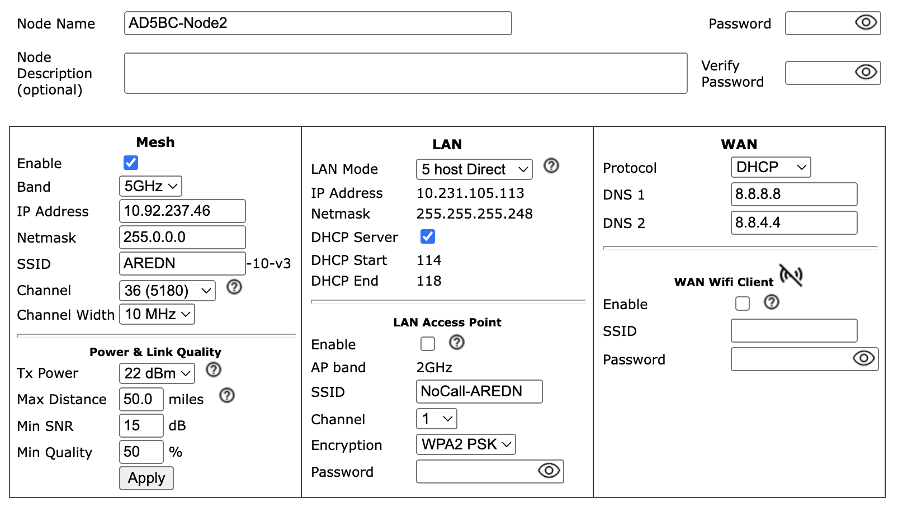
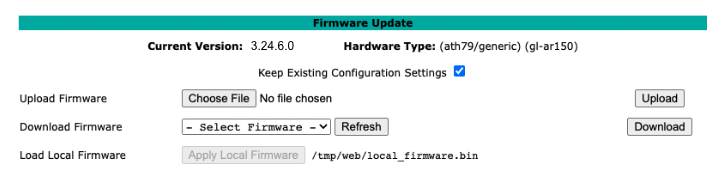
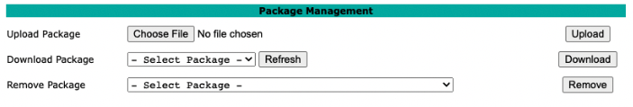
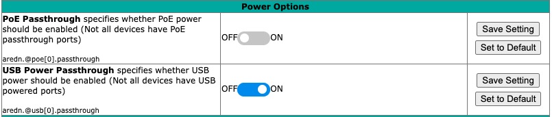
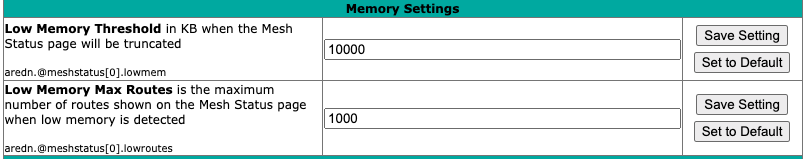
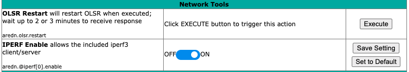
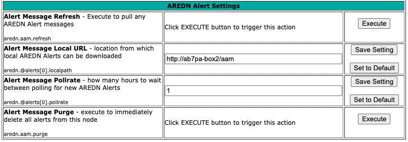

=======================
Configuration Deep Dive
=======================

During your node's *Basic Setup* you used the configuration display by clicking the **Setup** button and typing your username and password. The configuration area has many additional features which will be described in more detail below. Clicking **Node Status** exits configuration mode without saving any changes, returning you to the *Node Status* display.

.. image:: _images/admin-header.png
   :alt: Admin Navigation Controls
   :align: center

There are several control buttons below the configuration links section.

Help
   Opens a new window or tab to display the node help page.

Save Changes
  Click this button to save any configuration changes you have made. Saving changes will first do a basic validation of the new settings, saving them to flash memory if no errors are found. The new settings take effect in about 20 seconds and a reboot may or may not be required.

Reset Values
  Click this button to reload the currently saved settings from flash memory, effectively undoing any changes that were made.

Default Values
  Click this button to reset your node's basic settings to the default values. This action does not affect your existing node name.

Reboot
  Click this button to force your node to reboot.

Basic Setup
-----------

You have already configured many of the basic settings, but there are several additional features that will be explained below.

|

Mesh RF Column
^^^^^^^^^^^^^^

*Mesh RF* is the node's *radio* interface. The AREDN |trade| firmware has been designed to simplify the process of configuring networking interfaces. Network values are automatically calculated based on the unique :abbr:`MAC (Media Access Control)` addresses of your node. You may need to change the *Channel* and possibly the *Channel Width* parameters to match those of your local AREDN |trade| mesh, as explained previously in the **Basic Radio Setup** section. Normally you will not need to change the other network settings on this page, so keep these values unless you fully understand how the mesh works and why the defaults may not be suitable for your situation.

Channel Width Setting
  AREDN |trade| devices have a choice of using 20 MHz, 10 MHz, or 5 MHz channel widths. As a general rule, a larger channel width will allow more data to be transferred, but it can only do this over shorter distances (as will be illustrated in the following section). One suggestion is to start with the largest channel width that yields a *Signal to Noise Ratio* (SNR) of at least 15 dB.

  There may be several reasons why you might want to reduce the *Channel Width* setting:

  - To achieve a better SNR on a marginal link.
  - To extend the usable distance between neighbor nodes.
  - To increase the number of available channels in a crowded RF coverage area.

  Please review the **Network Design** section for more information about designing a network that meets the specific requirements of your applications and services.

Distance Setting
  .. image:: _images/basic-pwr-dist.png
    :alt: Basic Power and Distance Settings
    :align: right

  The *Distance* setting is only applicable to nodes that can communicate directly over RF. This setting adjusts the RF retry timer to define how long the transmitter will wait for an acknowledgement from a neighbor station. If the distance parameter is too short, the transmitter will send duplicate data packets before an acknowledgement has time to be received. If the distance parameter is too long, the transmitter will wait extra time before considering the data lost and retransmitting the packets.

  The maximum distance settings the ath9k wireless driver allows depends on the channel width:

  =============  =================
  Channel Width   Maximum Distance
  =============  =================
  20 MHz         46666 meters
  10 MHz         103030 meters
  5 MHz          215757 meters
  =============  =================

  **Auto-Distance**: A value of zero will cause the radio to automatically determine the RF retry timer by measuring the actual time it takes acknowledgement packets to be received. The timer is set using an Exponential Weighted Moving Average (EWMA). The auto-distance setting is best used on high quality, long distance point-to-point links between backbone or relay nodes. Fifty percent performance increases have been observed on those links compared to using a static distance setting.

  Since auto-distance causes the node to calculate the best value based on actual data flow, it will require both time and adequate data traffic to arrive at the optimal setting. The node may not be able to arrive at the optimal values if a link is not being used to send a significant amount of data, because it starts at the max value and then drops down to the optimal setting. Over time the auto-distance setting should stabilize around the best value.

  .. attention:: The auto-distance setting does **not** work well when nodes are in close proximity, when link quality is marginal, or when there are many nodes sharing the channel. In these cases the round-trip packet timing has a very wide range of values, so the timeout value becomes inflated and inconsistent. Static settings should be used in these situations.

  A basic rule of thumb is when nodes are within five kilometers of each other you should test several *static* distance settings to see which one works best. The best way to test each distance setting is to use the **iperf3** package between endpoint nodes to measure the throughput of the RF channel under different distance settings. See *Test Network Links with iperf3* in the **How-To Section** for additional information.

Configuring LQM Settings
  .. image:: _images/lqm-basic-settings.png
    :alt: LQM Basic Settings
    :align: right

  When *Link Quality Manager* is enabled, the **Basic Setup** page will show a slightly different group of settings for *Power & Link Quality* under the **Mesh RF** column.

  Max Distance
    The maximum distance between nodes at which you can expect to achieve a usable radio link. The default value is 50 miles / 80 kilometers, but you can adjust this setting if your node is only able to maintain a usable radio link with closer nodes. Local conditions may dictate a shorter distance based, for example, on dense tree cover or other terrain features which impact line of sight communication. You can lower this value if you want to limit your node to linking only with nearby nodes.

  Min SNR
    The minimum Signal-to-Noise ratio that you require in order to reliably pass data between nodes. The default is 15 dB, but you can adjust this value if you require your node to continue passing data even on links that have reduced signal characteristics.

  Min Quality
    The minimum Link Quality required in order to reliably pass data between nodes. This is calculated as the moving average of total sent packets over total sent packets plus retransmissions. For example, if the node had to send every packet twice for it to be successfully received, the link quality would be 50%. An additional penalty is subtracted from Link Quality if the neighbor node is unpingable, and this is explained below under *Ping Penalty* in the *Advanced Configuration* section.

The **Power & Distance** settings can be adjusted and applied without saving changes or rebooting your node. However, they will return to their original values after a reboot unless you click *Save Changes*.

Enable/Disable Mesh RF
  You can disable your node's radio interface by deselecting the *Enable* checkbox, saving your changes, and rebooting the node. With the Mesh RF interface disabled the *Power & Distance* settings no longer apply and will be hidden. Since your node now has an unused RF interface, you will notice that a new section appears which allows you to use the node's radio as an FCC Part 15 *LAN Access Point*. You can enable or disable the LAN AP using the *Enable* checkbox. See the details below for configuring the LAN Access Point.

|

LAN Column
^^^^^^^^^^

The LAN column contains the settings for the Local Area Network hosted by the AREDN |trade| node. There are several options under the *LAN Mode* dropdown.

The default mode is ``5 Host Direct``. In this mode every host on the LAN has direct access to and from the mesh. This mode was created to reduce the amount of manual configuration needed to provide services to the mesh, since many services do not work well if they are hosted behind a :abbr:`NAT (Network Address Translation)` router. With *Direct* mode the LAN shares the same address space as the mesh at large. Port forwarding is not needed because NAT is not used, and there is no firewall between the LAN and the mesh.

The mesh address space is automatically managed, so you cannot configure the LAN network settings in *Direct* mode. The only configurable option available in *Direct* mode is the size of the LAN subnet which can accommodate either 1, 5, 13, or 29 LAN hosts. A one host subnet can be used for either a single server or a separate network router using its own NAT which is capable of more advanced routing functions than those available on a mesh node.

It is important not to use a subnet larger than is necessary because the chance of an IP address conflict on the mesh increases with the size of the subnet. The LAN subnet parameters are automatically calculated and depend on the IP address of the *Mesh RF* interface. If a conflict does occur it can be fixed by changing the *Mesh RF* IP address.

The other LAN Mode is ``NAT``, and in this mode the LAN is isolated from the mesh. All outgoing traffic has its source address modified to be the *Mesh RF* IP address of the node. This is the same way that most home routers use an Internet connection, and all services provided by computers on the LAN can only be accessed through port forwarding rules. A single :abbr:`DMZ (DeMilitarized Zone)` server can be used to accept all incoming traffic that is not already handled by other rules or by the node itself.

By default each node runs a :abbr:`DHCP (Dynamic Host Control Protocol)` server for its LAN interface, which lets the node assign IP addresses automatically for devices connected to the node's local area network. The last octet of the start/end range for host IP addresses is shown in the LAN column. If you choose to disable the DHCP server, you must manually configure the host IP addresses to be within the LAN network range. There should be only one DHCP server for each IP address scope or range, so you may need to disable your node's DHCP server if there is already another device providing DHCP services on your node's local area network. Click this link for additional information on `Dynamic Host Control Protocol <https://en.wikipedia.org/wiki/Dynamic_Host_Configuration_Protocol>`_.

When you connect a device to your node's LAN, not only should it have an IP address in the LAN IP address range, but it is best practice for LAN devices to obtain their DNS Server information *automatically* from the node. Be aware that if a LAN device does not use the DNS Server entry provided by the node to which it is connected, then that device will be unable to resolve hostnames on the mesh network. Also, hard-coding a device's DNS Server entry with the mesh node's IP address could result in unexpected failures if that device is moved to another mesh node or network.

If you enabled the **LAN Access Point** feature mentioned previously, edit the access point's SSID, channel, encryption method, and password. Select an AP channel that is within the range supported by your WiFi client devices. Click *Save Changes* to write your information to the node's configuration, and a node reboot will also be required. Now wireless devices can connect to your node's LAN wirelessly, and their DHCP IP address will be assigned by the node's LAN DHCP server. If your node hardware has more than one unused radio, for example the *Mikrotik hAP ac* family with both 2.4 and 5.8 GHz radios in a single unit, the *LAN Access Point* section will always be visible whether or not your *Mesh RF* interface is enabled.

WAN Column
^^^^^^^^^^

The :abbr:`WAN (Wide Area Network)` interface on your node is typically used to connect it to the Internet or to another external network. By default the WAN interface is set to obtain an IP address via DHCP from your upstream network. The :abbr:`DNS (Domain Name System)` servers are set by default to use Google's DNS services and should not be changed under normal circumstances. Google's name resolution servers are configured properly to detect error conditions and report them correctly.

If you are not going to use the WAN interface on your node, you can select *disabled* from the *Protocol* dropdown list. If you will be using your node as a *Tunnel Server*, you should reserve an IP address on your router for the node's WAN interface. This will be explained in the *Tunnel Server* section below. When a node has Internet access on its WAN interface, that access is available to the node itself and to any computers connected via the LAN port by default.

.. note:: The *Advanced WAN Access* settings have been moved to the **Advanced Configuration** display.

WAN WiFi Client
  As mentioned above in the *Mesh RF* section, if your node has a radio on which you have *disabled* Mesh RF and you are not using it as a LAN AP, you can enable this available radio as a WAN interface by checking the **WAN Wifi Client** checkbox. Enter the SSID and authentication string for the wifi AP that you want to connect through for Internet access.

  The mesh node uses "WPA2 PSK" encryption to connect to the wifi AP. The password length must be between zero and 64 characters. If the key length is 64, it is treated as hex encoded. If the length is 0, then no encryption will be used to connect to an open AP. A single quote character must not be used in the passphrase.

  To the right of the *WAN WiFi Client* label is an icon with hover text indicating the status of the WAN WiFi connection.  |icon1| indicates no wifi connection to the local access point.  |icon2| indicates a wifi connection but no Internet connection.  |icon3| indicates both a wifi connection to the local access point and a connection to the Internet.

  After you *Save Changes* and reboot, the node will have Internet access via wifi rather than requiring a cable plugged into the node's WAN port. In fact, enabling the *WAN Wifi Client* will disable VLAN1, so Internet access will no longer be possible through the physical WAN port. Also, on the *Node Status* display you will see the **WiFi WAN Address** label and IP address to indicate that your WAN connection is using the WAN WiFi Client.

  .. |icon1| image:: _images/wifi-noConn.png
    :alt: No WiFi onnection

  .. |icon2| image:: _images/wifi-noInternet.png
    :alt: WiFi connection without Internet

  .. |icon3| image:: _images/wifi-internet.png
    :alt: WiFi connection and Internet access

Node VLANs
^^^^^^^^^^

Many of the devices used as AREDN |trade| nodes have only one Ethernet port, but more than one type of network traffic must share that single port. The AREDN |trade| firmware implements :abbr:`VLANs (Virtual Local Area Network)` in order to accomplish this. Different types of traffic are tagged to identify the network to which they belong.

VLAN 1
  Packets received by the node that are tagged for VLAN 1 will be identified as WAN traffic from the Internet or another external network.

VLAN 2
  Packets received by the node that are tagged for VLAN 2 will be identified as traffic from a :abbr:`DtD (Device to Device)` node directly connected via Ethernet cable.

No VLAN tag
  Packets received by the node that are untagged will be identified as LAN traffic from computers on the local area network.

It is important to understand AREDN |trade| VLANs when configuring network smart switches for Internet access, tunneling, or DtD linking of nodes. There are some useful tutorials available on the AREDN |trade| website for configuring VLAN-capable switches: `Video <https://www.arednmesh.org/content/understanding-vlans>`_ or `Text+Images <https://www.arednmesh.org/content/configuring-netgear-gs105e-switch-lanwan-ports>`_. Also, on the AREDN |trade| GitHub site there is more information about node VLANs that have been preconfigured in the firmware images for specific types of radio hardware. For additional information visit this link: `Ethernet Port Usage <http://downloads.arednmesh.org/snapshots/readme.md>`_

Port Forwarding, DHCP, Services, and DNS Aliases
------------------------------------------------

Click the **Port Forwarding, DHCP, and Services** link to navigate to these settings. This provides a way for you to configure LAN network address reservations and service advertisements on your node. The page works differently based on the LAN Mode (Direct or NAT) that you are using on your node.

Direct Mode Operation
^^^^^^^^^^^^^^^^^^^^^

.. image:: _images/ports-direct-mode.png
   :alt: Ports - Direct Mode Operation
   :align: center

|

In ``Direct`` mode the LAN hosts are directly accessible from the mesh since no address translation or port forwarding is involved.

DHCP Address Reservations
  If your node has its DHCP server enabled, it will automatically provide IP addresses to connected hosts. Look under the **Current DHCP Leases** heading to see the existing hosts and their assigned IP addresses.

  .. attention:: The hostnames of every device connected to the mesh at large must be unique. It is best practice to prefix your Amateur Radio callsign to the hostname of each of your devices in order to have the best chance of it being unique on the mesh network.

  Since DHCP leases are dynamic and can change over time, there may be a reason why a host's assigned IP address should be made permanent. This is especially useful if that host will provide an application, program, or service through your node to the mesh network at large. You can permanently reserve that host's DHCP address by clicking the *Add* button at the right of the row in the *Current DHCP Leases* list. You will see that host now appears in the list under the **DHCP Address Reservations** heading above the list of leases.

  There may be some devices on which you are not able to set the hostname prefixed by your callsign. Once you add that device to your **DHCP Address Reservations**, however, click the *Hostname* box to edit the hostname what will be propagated across the mesh network by your node. You may also want to assign a specific IP Address to the device by selecting it from the drop-down list. If you have a device which needs to be reachable on its host node, but which should not be accessed across the mesh network, click the *Do Not Propagate* checkbox to prevent OLSR from propagating that information to the mesh.

  Once you have entered the values for your DHCP Reservation, click *Add* to add it to the list. You may also remove an existing reservation by clicking the *Del* button to delete it from the list. Click the **Save Changes** button to write your changes to the node's configuration.

Advertised Services
  *Advertised Services* include the applications, programs, or functions that are available to devices on the mesh network. The purpose of the network is to transport data for the services which are being used. Network services may include keyboard-to-keyboard chat or email programs, document sharing applications, Voice over IP phone or video conferencing services, streaming video from surveillance cameras, and a variety of other network-enabled features.

  Services can run on the node itself or on any of its LAN-connected devices. Remember that AREDN |trade| nodes have limited system resources with which to run services, so installing add-on services directly on the node should be avoided because the node could become unstable if sufficient resources are not available for normal operation, particularly on devices with only 32 MB of memory. It is best practice to run services on an external computer connected to the node's LAN network. In the example above you can see that an external host has been given a reserved DHCP address, and it is also running the *MeshChat* program as a service that is advertised on the network through this node. Use the following steps to create an Advertised Service.

  Name
    Enter a service name in the *Name* field.

  Link
    Check this box if your want your advertised service to display an active link in the web browser. This allows mesh users to navigate to your service by clicking the link in their web browser.

  Protocol
    Enter the protocol to use in the field between *Link* and *URL*. Common protocols include ``http`` for website services and ``ftp`` for file transfer services. Other services may use other protocols.

  URL
    From the dropdown list select the node or host on which this service is running. If you defined DNS Aliases as described below, you can also select a host alias from the dropdown list.

  Port
    Enter the network port on which the host is listening for service connections. There may be several applications provided through a single web server on a node or host using a single port, and in that case a valid application *Path* must be entered after the port number (as in the example above). In other cases the network port alone uniquely identifies the application or program that is listening for user connections to that service. You can find additional information at the following link: `Network Ports <https://en.wikipedia.org/wiki/Port_(computer_networking)>`_.

  Once you have entered the values for your advertised service, click *Add* to add the service to the **Advertised Services** list. You may also remove an existing advertised service by clicking the *Del* button to delete it from the list. Click the **Save Changes** button to write your changes to the node's configuration. A reboot is not required, and your new settings should take effect within thirty seconds.

  Service Advertisement Process
    `OLSR (Optimized Link State Routing) <https://en.wikipedia.org/wiki/Optimized_Link_State_Routing_Protocol>`_ propagates service entries to other nodes across the network. Once every hour your node will verify that its own service entries are valid. Your node will **not** propagate services across the network if it finds any of these conditions:

    1. The host is not pingable across the network
    2. There is no service listening on the specified port
    3. The HTTP link does not return a *success* status code
    4. The package for this service is not yet installed

    The node's *Advertised Services* list will still show the defined service (with an alert icon and hover text marking it as non-advertised), but your node will not actually *advertise* that service to the network. If the service URL becomes reachable in the future or if the dependent package is later installed, then your node will resume advertising the service across the network.

Port Forwarding
  In Direct mode you will only be allowed to select the WAN interface so Port Forwarding is only meaningful for WAN-connected nodes. Enter the Outside Port being passed to your node from its upstream gateway, select a LAN host to process the requests, and enter the LAN Port on that host which is listening for those requests. Finally, click *Add* to add the port forwarding rule. You may also remove an existing rule by clicking the *Del* button to delete it from the list. Click the **Save Changes** button to write your port forwarding changes to the node's configuration. More information can be found at this link for `Port Forwarding <https://en.wikipedia.org/wiki/Port_forwarding>`_.

DNS Aliases
  **DNS Aliases** provide a way for you to create a hostname alias for a services computer. This can be useful if you want a computer or device on your node's LAN network to be identified by something other than its actual hostname. Your DNS Alias will be propagated across the network even if the actual hostname has *Do Not Propagate* checked in its DHCP Reservation, allowing you to hide the actual hostname while still advertising the alias on the mesh.

  To create an alias, enter an **Alias Name**. The alias should be prefixed with your callsign in order to follow the naming convention used when defining any unique host on the network. Then use the dropdown selector to choose the name or *IP Address* of the existing host for which you are defining the alias. Once you have entered these values, click *Add* to add the alias to the list. You may also remove an existing alias by clicking the *Del* button to delete it from the list. Click the **Save Changes** button to write your changes to the node's configuration.

  Once an alias is defined, the **DNS Aliases** become available for creating *Advertised Services*. This feature can be used for virtual domain email servers, virtual machine identifiers, virtual web site URLs, and many other services.

NAT Mode Operation
^^^^^^^^^^^^^^^^^^

.. image:: _images/ports-nat-mode.png
   :alt: Ports - NAT Mode Operation
   :align: center

|

If you are using ``NAT`` for your LAN mode, then hosts on the LAN are isolated from both the Wifi and WAN interfaces by a firewall. This makes them inaccessible from either of these interfaces unless Port Forwarding is configured. In this mode all outgoing LAN traffic has its source address modified to be the Mesh RF IP address of the node. This is the same way that most home routers use an ISP Internet connection.

Port Forwarding
  Port forwarding rules can redirect inbound connections from the Wifi, WAN, or both interfaces and forward them to an IP address and port on the LAN. The destination port need not be the same unless you are forwarding a range of ports as explained below.

  To create a port forwarding rule, select the network *Interface* on which the traffic will enter your node. Select the *Protocol Type* used by the incoming packets (TCP, UDP, or Both). Enter the *Outside Port* number that the external request is using to connect to your service. When your node receives traffic on the selected interface, protocol, and port then that request will be routed to the *LAN IP* address and *LAN Port* of the host which is listening for incoming requests for that service.

  Once you have entered these values, click *Add* to add the rule to the **Port Forwarding** list. You may also remove an existing rule by clicking the *Del* button to delete it from the list. Click the **Save Changes** button to write your port forwarding changes to the node's configuration.

  Example:
    On the LAN of a mesh node called ``ad5oo-mobile`` there is an IP camera with an IP address of 172.27.0.240 which is running its own web display. To make that camera available to everyone on the mesh, create a port forwarding rule on the WiFi interface whose Outside Port is any unused port on your node (for example ``8100``) with an LAN IP of 172.27.0.240 and LAN Port of ``80``. This takes all connections to port ``8100`` on ``ad5oo-mobile`` and redirects them to port ``80`` on 172.27.0.240. In a web browser on a remote computer connected to the mesh you could go to ``http://ad5oo-mobile:8100`` to view the IP camera.

  If you want to forward a range of ports, the *Outside Port* field will accept a hyphen-separated range in the form "xxxx-xxxx". When doing this, set the LAN Port to the low value of the port range.

  If you want to forward every port that is not already in use to a single computer on the LAN, choose that host's IP Address from the **DMZ Server** dropdown. There can be only one DMZ Server. Be aware that this bypasses the firewall in the node, so the DMZ server should run its own firewall to prevent unauthorized access.

  Note that port forwarding to an FTP server, which uses both ports 20 and 21, can be done with a single rule using port 21 if the ftp client is capable of using passive ftp mode. Web browsers are able to do this and handle ftp downloads seamlessly.

Advertised Services
  In ``NAT`` mode Advertised Services will not be accessible until at least one port forwarding rule or a DMZ server has been defined as described above. Advertised Services are entered as they are for Direct mode, except that the URL field is always that of your node which is handling network address translation. The port number should be the one used as the *Outside Port* in the forwarding rule through which the service will be accessed. In the last field you can enter an optional path if needed, such as the name of a specific folder on a web server or a directory on an ftp server.

  Click *Add* to add the service to the **Advertised Services** list. You may also remove an existing service by clicking the *Del* button. Click the **Save Changes** button to write your changes to the node's configuration.

DHCP Address Reservations
  DHCP Address Reservations make a LAN device's IP address permanent so it can be used consistently when defining Port Forwarding rules, and they are added the same way as in Direct mode. If a LAN device is currently connected and has been given an IP address by DHCP then it will appear under *Current DHCP Leases*. If you click the *Add* button next to the lease then it will be added to the DHCP Reservations list. You may also remove an existing reservation by clicking the *Del* button to delete it from the list. Click the **Save Changes** button to write your changes to the node's configuration. When using ``NAT`` mode the IP addresses of LAN devices are **never** propagated across the mesh, so the *Do Not Propagate* checkbox will not appear on this page.

DNS Aliases
  DNS Aliases work differently in ``NAT`` mode. Aliases **cannot** be propagated across the mesh, and they **cannot** be used when defining an *Advertised Service*. They can only be used as an alternate name for a device on the nodes’ LAN.

Tunnel Server
-------------

Click the **Tunnel Server** link to navigate to these settings. This section provides a way for you to configure your node with unencrypted node-to-node connections across the Internet. Unless you have a specific need for this type of network connection, it is recommended that you do not activate tunnels. This is because it will cause your node to dedicate limited resources to maintaining the tunnel connections. In order to increase the performance of your node you should conserve system resources so they will be available for normal node operations, which is especially important for nodes with limited memory and storage.

Tunnels should be used as a temporary means of connecting mesh islands when RF links have yet to be established. They should be removed as soon as RF links are operational. Remember that AREDN |trade| is first and foremost an emergency communication resource, so it's likely that Internet-dependent links and the assets they provide will not be available during a disaster. Their presence could create a false expectation for served agency personnel, with the possibility that AREDN |trade| might fail to meet their expectations when tunneled resources become unavailable during a disaster.

Also, before using the AREDN |trade| tunnel feature, be aware of how this type of connection could impact your local mesh network. If your node participates in a local mesh via RF, then adding one or more tunnel connections on that node will cause the nodes and hosts on the far side of the tunnel(s) to appear on your local *Mesh Status* display. This adds complexity and makes everyone's display a little more difficult to navigate. If you want to participate in remote mesh networks via tunnel, consider establishing those tunnels from one of your nodes that is *not* connected to your local mesh network via RF.

Internet Connectivity Requirements
^^^^^^^^^^^^^^^^^^^^^^^^^^^^^^^^^^
In order to run your node as either a *Tunnel Server* or *Tunnel Client*, you will need to configure additional settings and equipment.

Managed Switch Settings (both Client and Server networks)
  Set your VLAN-capable network switch to appropriately tag traffic from the Internet with "VLAN 1" before sending it to your node. This allows your node to properly identify the traffic as coming from the Internet connection on its WAN interface. See the equipment manual for your managed switch to determine how to configure these settings.

  .. note:: If you are using a *Mikrotik hAP ac lite* or *GL.iNET AR150/AR300M/AR750*, then you do not need a separate VLAN-capable switch as described above. These nodes have built-in switches with the appropriate VLANs preconfigured in the AREDN |trade| firmware.

WAN Interface IP (Tunnel Server *node* only)
  Set a static IP address on your tunnel server node's WAN interface so your Internet-connected router/firewall has a consistent way to forward traffic to your node.

Internet Firewall/Router Settings (Tunnel Server network only)
  Set your network firewall or router to permit traffic from the Internet on port 5525, which is the default AREDN |trade| tunnel service port. Then configure a port forwarding rule on your firewall or router to send any traffic from the Internet on port 5525 to the static IP address of your node's WAN interface on the *node's* port 5525. See the equipment manual for your firewall or router to determine how to configure these settings. Also, some Internet Service Providers may not allow port forwarding by default, so you should check with your ISP if you have difficulty opening ports.

Also, remember that the tunneling feature on AREDN |trade| nodes was not compiled with `Secure Sockets Layer (SSL) <https://en.wikipedia.org/wiki/Secure_Sockets_Layer>`_ libraries and that tunnel traffic is unencrypted.

Tunnel Server Node Settings
^^^^^^^^^^^^^^^^^^^^^^^^^^^

The following diagram shows an overview of tunnel services between two nodes.

.. image:: _images/tunneling-diagram.png
   :alt: Tunneling Diagram
   :align: center

|

The tunnel network address ranges are automatically calculated, and it is not necessary to change these settings unless there is a specific reason why the defaults will not work for your situation.

Tunnel Server DNS Name
  Enter the *Public IP Address* or the *Dynamic DNS URL* by which Internet-connected nodes can reach your network.

Client Node Name
  Enter the exact node name of the client node that will be allowed to connect to your node over the tunnel. Do not include the "local.mesh" suffix.

Client Password
  Enter a complex password that the client node will use to connect to your node over the tunnel. Use only uppercase and lowercase characters and numbers in your password.

Contact Info/Comment (optional)
  You have the option to enter a line of text which may include the contact information of the person responsible for the tunnel endpoint. It is a 50 character freeform text field which can contain any other useful identifier or information as needed.

Once these settings are correct, click *Add* to add the new client to the list of authorized tunnel clients. On the right of each entry there is an envelope icon which will automatically open your computer's email program and copy the client settings into a new email which allows you to quickly and easily send credentials to the owners of the client nodes.

To allow a client to connect to your tunnel server, select the **Enabled?** checkbox and click the **Save Changes** button. When a tunnel connection becomes active, the cloud icon at the right of each row will change to indicate that the tunnel is active. Depending on the timing of the webpage refresh, you may need to press the **Refresh** button to see the active icon.

Tunnel Client
-------------

Click the **Tunnel Client** link to navigate to these settings. In this section you can configure your node to connect over the Internet to another node running as a *Tunnel Server*. You should already have your VLAN-capable network switch configured as explained in the *Tunnel Server* section above.

Contact the amateur operator who controls the tunnel server and request client credentials by providing your specific node name. The tunnel server administrator will provide you with the public IP or :abbr:`DDNS (Dynamic Domain Name Service)` URL for the tunnel server, the password you are to use, and the network IP address for your client node. Enter these values into the appropriate fields on your node and click *Add* to create a client entry in the list.

|

To allow your client to connect to the tunnel server, select the **Enabled?** checkbox and click the **Save Changes** button. When a tunnel connection becomes active, the cloud icon at the right of each row will change to indicate that the tunnel is active. Depending on the timing of the webpage refresh, you may need to press the **Refresh** button to see the active icon.

Administration
--------------

Click the **Administration** link to navigate to these settings. There are four sections that provide ways for you to manage the firmware, packages, security keys, and support data on your node.

Firmware Update
  There are currently three ways to update the firmware on your node. No matter which method you choose, you can retain your existing configuration settings by selecting the *Keep Settings* checkbox.

|

  #) **Upload Firmware**: If you have a new firmware image that you have already downloaded to your computer from the AREDN |trade| website, click the *Browse* button and select the firmware file from the location on your computer where you saved it. Click *Upload* and the file will be uploaded and installed on the node.

  #) **Download Firmware**: If your node has Internet access you can use the *Download Firmware* option. Click *Refresh* to update the list of available images. The source URLs that are queried are those listed on the *Advanced Configuration* page of your node. Select the image to download, click *Download*, and wait for the firmware to download and be installed.

  #) **Load Local Firmware**: If you need to upgrade the firmware on a node which has a marginal connection to the network, the standard web/http method may not reliably transfer the image to the node. In this situation you may want to use an independent means of uploading the firmware to the node before beginning the upgrade process. Choose an upload method such as ``scp`` (secure copy) with a long connection timeout, which may allow the file transfer to continue the upload in the event of a network interruption. Transfer the new firmware file to your node, place it in the ``/tmp/web`` folder, and name it ``local_firmware.bin``. Refresh your node's *Administration* page and once the page detects the ``/tmp/web/local_firmware.bin`` file, then the *Apply Local Firmware* button will become active. Press this button to begin the update process using the firmware you previously uploaded.

Package Management
  Here you can install or remove software packages on the node. *Upload Package* allows you to install a package file by uploading it from your computer to your node. *Download Package* allows Internet-connected nodes to retrieve a package from the AREDN |trade| website. Clicking *Refresh* will update the list of packages available for download.

|

  The *Remove Package* list shows all packages currently installed on the node. Selecting a package and clicking *Remove* will uninstall the package. You will only be able to remove packages that you have added. All installed packages are shown, but the pre-installed packages cannot be deleted since they are necessary for proper operation of the node.

Authorized SSH Keys
  Uploading ssh keys allows computers to connect to a node via ssh without having to know the password. The ssh keys are generated on your computer using built-in utilities or the `PuTTY <https://www.chiark.greenend.org.uk/~sgtatham/putty/latest.html>`_ program's *Key Generator*. Once you have the key files on your computer, you can upload its *public* key to your AREDN |trade| node. If you want to remove an installed key, select it and click the *Remove* button.

|

  .. note:: If you plan to use ssh keys you may want to review **Use PuTTYGen to Make SSH Keys** in the **How-To Guide** section which describes this process in detail for users of Microsoft Windows computers.

Support Data
  There may be times when you want to view more detailed information about the configuration and operation of your node, or even forward this information to the AREDN |trade| team in order to get help with a problem. Click the *Download Support Data* button to save a compressed archive file to your local computer.

Advanced Network
----------------

If you have a supported multiport device (currently *Mikrotik hAP ac2* or *ac3* only), then you will see a menu option for **Advanced Network**. This provides a way for you to configure the ports on your multiport node. For more information on the AREDN |trade| VLANs being used, refer to the *Node VLANs* description in the **Basic Setup** section above.

.. image:: _images/advnet.png
  :alt: Advanced Networking
  :align: center

|

Ports
  The **Ports** section shows the available ports across the top and the possible configurations along the left side. The default configuration is as follows:

  - The first port is configured as a WAN port. The data entry field to the right of the *vlan* label can contain any valid vlan identifier if it is required, typically in the range between 1 and 4094. The default for these multiport devices is no vlan (untagged), so leave the default unless there is a specific reason why it is required in your situation.
  - The middle ports are configured as LAN ports with no vlan (untagged).
  - The last port is configured for DtD linking to another AREDN |trade| node with vlan2 (tagged).

  You should only have one box checked for each port. If you want to change a port's configuration, simply uncheck the existing box and check the box for the new setting on that port.

Xlinks
  A cross-link allows your node to pass AREDN |trade| traffic across non-AREDN |trade| point-to-point RF links. To add a cross-link click the *plus* icon, enter an unused VLAN number for the link, the IP address of the near-side radio, the IP address of the far-side radio, a weighting factor, and the port to which the near-side radio is connected on your node. The *Weight* will be used by `OLSR <https://en.wikipedia.org/wiki/Optimized_Link_State_Routing_Protocol>`_ to determine the best route for AREDN |trade| traffic. If you want to remove a cross-link, simply click the *minus* icon on the right side of the row to remove.

When you have finished making configuration changes to the ports and cross-links, click the *Save Changes* button. You will be notified if a reboot is required to activate your changes, and you can then click the *Reboot* button.

Advanced Configuration
----------------------

The **Advanced Configuration** section allows you to change settings for various items that may be available on the type of hardware you are using. Not all hardware can support every value. These settings are best left as default unless you have a clear understanding of why you need to change the defaults for your node or network.

Above the settings table there are links that allow you to view the node help file, reboot the node, or reset the node to a firstboot or "NOCALL" configuration. You can edit or select a setting and then click the *Save Setting* button at the right side of the row to implement the change. You may also reset an item to default values by clicking the *Set to Default* button. For some settings you may need to reboot your node to apply the change, and in that case a message will be displayed notifying you that a reboot is required.

Link Quality Manager (LQM) Settings
^^^^^^^^^^^^^^^^^^^^^^^^^^^^^^^^^^^

|

The basic LQM settings were described above under the **Mesh RF Column**, but additional LQM settings are also available here in the **Advanced Configuration** section.

Enable
  Enable or disable the LQM feature in its entirety.

SNR Margin
  The margin above the *Minimum SNR* that must be detected in order for a node to be returned to the active list based on signal level. The default value is 1 dB.

Minimum Distance
  The minimum distance (in meters) that must exist between nodes in order for a link to be considered for activation. The default value is 0 meters. This value can be increased if you do not want your node to pass traffic with nearby nodes, for example at a tower site with collocated backbone nodes designed to link only with other distant nodes.

Default Distance
  The distance (in meters) to use when the actual distance between nodes cannot be calculated from their GPS coordinates. The default value is zero, which causes the node to treat nodes as being collocated.

Quality Margin
  The margin above the *Minimum Quality* that must be detected in order for a node to be returned to the active list based on quality. The default value is 1 percent.

Ping Penalty
  The Link Quality penalty that is imposed on calculations if a remote node does not respond to a ping request. The default value is 5 percent. This setting may be helpful for cases when a link would otherwise be marked *active* but the remote node is currently unreachable on the network.

RTS Threshold
  The packet size in bytes triggering RTS/CTS when LQM detects hidden nodes. The default value is 1.

Maximum Packet Size
  The maximum size of a packet which is sent over WiFi. The default is 1500 bytes, but this value can be decreased if your hardware is unable to handle larger packet sizes.

User Blocked Nodes
  A comma-separated list of MAC addresses which you desire to block from your neighbors list. This feature allows you to "blacklist" specific nodes. RF nodes are blocked by their Wifi MAC address, while DtD nodes are blocked by their LAN MAC address. MAC addresses are typically entered as uppercase characters with the hex pairs separated by colons.

User Allowed Nodes
  A comma-separated list of MAC addresses which you always want to allow. This feature allows you to "whitelist" specific nodes. RF nodes are allowed by their Wifi MAC address, while DtD nodes are allowed by their LAN MAC address. MAC addresses are typically entered as uppercase characters with the hex pairs separated by colons.

WAN Settings
^^^^^^^^^^^^

|

Several WAN access settings can be adjusted in this section. It is recommended that these settings be left at their default values, but specific use cases may require you to change them.

Allow MESH nodes to use my WAN
  The default value is ``OFF`` and it is recommended that you use this default unless there is a special reason to enable it. Setting the value to ``ON`` will allow this node to route traffic from its MESH RF interface to/from your WAN interface. Since the WAN interface typically provides a gateway to the Internet, it is not desirable to route Internet traffic over your Mesh RF interface. AREDN |trade| is an FCC Part 97 amateur radio network, so be sure that any traffic which will be sent over the radio complies with FCC Part 97 rules. If you want local devices to have wireless Internet access, consider using an FCC Part 15 access point instead of your node's WAN gateway.

  In older firmware releases there was a checkbox on the *Basic Setup* display for this setting. In the past if you checked "Allow others to use my WAN" then here is what your slider would look like in the current firmware:

  .. image:: _images/advConfig-wanAllow.png
    :alt: Advanced Configuration - Allow WAN
    :align: center

  Remember that the default value is ``OFF`` and you should not turn it on unless you have a special use case.

Allow my LAN devices to access my WAN
  The default value is ``ON`` which allows your LAN-connected devices to access your node's WAN network. Setting this value to ``OFF`` will prevent LAN devices from accessing the WAN, which means that your LAN hosts will not be able to reach the Internet even if your node has Internet access via its WAN. You may need to disable WAN access if your device needs to be connected to two networks at once, such as an Ethernet connection to your node as well as a WiFi connection to a local served agency network.

  In older firmware releases there was a checkbox on the *Basic Setup* display for this setting. In the past if you checked "Prevent LAN devices from accessing the WAN" then here is what your slider would look like in the current firmware:

  .. image:: _images/advConfig-wanPrevent.png
    :alt: Advanced Configuration - Prevent WAN
    :align: center

  Remember that the default value is ``ON`` and you should not turn it off unless you have a special reason to do so.

Provide my LAN devices with a default route
  Your node's DHCP server provides routes to LAN devices so they can access its available networks. A default route is required for WAN access, and that is provided automatically if "Allow my LAN devices to access my WAN" is ``ON`` as discussed above. However, some LAN devices (such as certain IP cameras) may not support DHCP option 121 and will require a default route in order to access the mesh network. Setting this value to ``ON`` will provide a default route to those devices. If a LAN device is connected to two networks at once, such as an Ethernet connection to your node as well as a WiFi connection to a local served agency network, care should be taken to understand how the device will deal with default routes to more than one network.

  Remember that the default value is ``OFF`` and you should not turn it on unless you have a special reason to do so.

WAN VLAN Number
  .. important:: This feature only applies to node hardware which requires a VLAN tag for the WAN interface. It will not appear on hardware where the Ethernet ports are on a switch chip, since changing the default VLAN number is not supported on those devices at the present time. It will appear as a ``blank`` field on devices that have a dedicated WAN port and therefore do not need a VLAN tag for their WAN interface.

  If you have node hardware that uses a VLAN tag for the WAN interface, then the default WAN VLAN identifier is ``1``. In some cases this default VLAN may be in use already or may be reserved by other equipment on your network. This field allows you to change the VLAN number being used on your node's WAN interface.

  .. warning:: If you plan to change this setting, do not use single digit identifiers or any number larger than can be supported by your network equipment. Different types of network equipment can support various numbers of VLANS, but the maximum number is limited by the `802.1Q standard <https://en.wikipedia.org/wiki/IEEE_802.1Q#Frame_format>`_ to no more than 4094.

Enable Web access
  Access to your node from the WAN is now disabled by default. If you need to have web access to your node from the WAN, then you can turn it ``ON`` here. Remember that the default value is ``OFF`` and you should not turn it on unless you have a special reason to do so.

Enable SSH access
  Access to your node from the WAN is now disabled by default. If you need to have command line access to your node from the WAN, then you can turn ``ON`` SSH access here. Remember that the default value is ``OFF`` and you should not turn it on unless you have a special reason to do so.

PoE and USB Power Passthrough
^^^^^^^^^^^^^^^^^^^^^^^^^^^^^

These rows will only appear in the table if you have node hardware which supports PoE or USB power passthrough. One example is the *Mikrotik hAP ac lite* which provides one USB-A power jack, as well as PoE power passthrough on Ethernet port 5. You are allowed to enable or disable power passthrough on nodes with ports that support this feature. Move the slider to **ON** and click *Save Setting* to enable power passthrough.

Tunnel Options
^^^^^^^^^^^^^^

.. image:: _images/advConfig-maxTunValues.png
  :alt: Advanced Configuration - tunnel max values
  :align: center

|

Tunnel Server *maxclients* and Tunnel Client *maxservers*
  These rows will appear in the table only if the AREDN |trade| tunneling package is installed on your node. By default a node is allowed to host up to 10 clients in its *Tunnel Server* display and connect with up to 10 servers in its *Tunnel Client* display. The *maxclients* and *maxservers* settings provide a method for adjusting the defaults.

  .. important:: If you plan to change these settings, review **Changing Tunnel Max Settings** in the **How-To Guide** section.

  Use caution when increasing the *maxclients* or *maxservers* values. Enter only *zero* or positive integers up to a maximum value for the number of active connections your node hardware can handle, since each active tunnel connection consumes system resources that the node may need for normal operation.

Tunnel WAN Only Setting
  This setting is enabled by default and it prevents tunnel traffic from being routed over the Mesh RF network. It limits tunnels to using the WAN interface, which is typically the intended route. If in your situation you need tunnel traffic to be routed over RF to a node with WAN access, then you can disable this setting to allow that traffic to pass.

Memory Thresholds
^^^^^^^^^^^^^^^^^

As the number of nodes increases in a mesh network, the processing requirements also increase for displaying all of the mesh routes on your node's *Mesh Status* display. For older nodes with limited memory resources, the mesh status display may become very sluggish on large mesh networks.

Recent firmware improvements have made the *Mesh Status* display much more responsive, but two **Advanced Configuration** values have been included for setting the *Low Memory Threshold* and maximum number of routes to be displayed.

Currently the default low memory threshold is 10,000 KB, which if reached will limit the *Mesh Status* display to the 1,000 closest routes. These values can be adjusted to lower values if your node has limited memory.

Network Tools
^^^^^^^^^^^^^

|

OLSR Restart
  The `OLSR (Optimized Link State Routing) <https://en.wikipedia.org/wiki/Optimized_Link_State_Routing_Protocol>`_ process can be restarted when you want your node to rebuild its mesh routing table but you do not want to do a full reboot. Click the *Execute* button to restart OLSR.

  There is a known intermittent issue that may occur when a node boots. If OLSR fails to propagate information or does not receive all the network hostnames, a one-time restart of OLSR should resolve the issue. OLSR should be restarted on your node if other nodes' *Mesh Status* display have your node's IP address rather than hostname or if "dtdlink" or "mid" is shown in your node's hostname on their *Mesh Status* display. If your node's *Mesh Status* display shows the IP address rather than hostname for a remote node, then that remote node should restart OLSR.

iperf CGI Feature
  The *iperf CGI* feature is described in the "Test Network Links with iperf3" section of the **How-To Guide**. It is enabled by default, but if you do not want your node to participate in any remote iperf tests then you can disable its ability to respond to those queries using this setting. Move the slider to ``OFF`` and click *Save Setting*.

Map Tile and Script Paths
^^^^^^^^^^^^^^^^^^^^^^^^^

.. image:: _images/advConfig-leaflet.png
  :alt: Advanced Configuration - map paths
  :align: center

These fields contain the external URLs for map tiles and `leafletjs <https://leafletjs.com/>`_ *css* and *javascript* files used for interactive maps.

Firmware and Package Download Paths
^^^^^^^^^^^^^^^^^^^^^^^^^^^^^^^^^^^

|

These fields contain the URLs used by the node for downloading firmware and package files during upgrades. By default they point to the AREDN |trade| downloads server available across the Internet. You can change these paths to point to a local mesh package server in order to upgrade nodes that do not have Internet access. If you plan to create a local software repository for your mesh network, review **Creating a Local Package Server** in the **How-To Guide** section.

The **Dangerous Upgrade** setting allows you to disable the normal firmware compatibility safety checks that typically prevent you from loading the wrong firmware image on your node. The default setting is *OFF* which means that the safety checks remain enabled, and this setting should not be changed unless you have a specific reason to disable the firmware compatibility checks. One example for using this setting would be if you mistakenly installed an incorrect firmware image and would like to correct that mistake by installing the correct firmware image (e.g., you installed the Mikrotik LHG version when you meant to install the LHG XL version).

AREDN |trade| Alert Messages
^^^^^^^^^^^^^^^^^^^^^^^^^^^^

|

Alert Message Refresh
  The AREDN |trade| development team may post messages which Internet-connected nodes can automatically download. You can execute the *aam.refresh* action if you want your node to retrieve any new messages without having to wait for the next auto-refresh window. Click the *Execute* button to trigger an immediate message retrieval. This will retrieve all alerts eligible for display on your node, whether they come from the AREDN |trade| server over the Internet or from a local message source on your mesh network.

Alert Message Local URL
  This field allows you to enter the URL for a local alert message repository. If you configure such a local repository then your nodes without Internet access can also receive alert messages pertinent to your local mesh. Enter the URL without a trailing backslash.

  A local message repository should be configured on a mesh-connected web server which allows nodes to query the URL you entered. No Internet access is required for this feature to work as designed. You can consult with your local web server administrator in order to obtain the correct URL for the local message repository. Use the following file naming convention on the web server:

  - Create text files for individual nodes by using only lowercase characters with the exact node name, followed by the ``.txt`` extension as shown below.
  - To create a broadcast message intended for all local nodes, enter your message text in a file named ``all.txt`` using only lowercase characters for the filename.

  .. image:: _images/url-content.png
     :alt: Local Alert Message Repository Content
     :align: center

|

  It is possible to include HTML tags in your message text, such as using the `` `` tag to display subsequent text on the next line. However, it is best practice to keep alert messages short in order to minimize the height of the alert banner displayed on node webpages.

Alert Message Pollrate
  This field allows you to set the polling rate or interval in hours at which the node will check for message updates. The default polling rate is once every 12 hours, but you can make this value smaller if you want your node to check for updates more frequently.

Alert Message Purge
  Use this purge setting if you want to immediately remove the AREDN |trade| Alert Message banner from your node. Click the *Execute* button to trigger an immediate message banner removal. This will remove all alert messages, whether they originated from the AREDN |trade| server over the Internet or from a local message source on your mesh network.

Node Reset Button Actions
-------------------------

The reset button on an AREDN |trade| node has two built-in functions based on the length of time the button is pressed.

With the node powered on and fully booted:

* **Hold for 5 seconds to reset the password and DHCP service**
* **Hold for 15 seconds to return the node to “just-flashed” condition**

On some equipment models it may be possible to accomplish these reset procedures by pressing the *Reset* button on the PoE unit.
