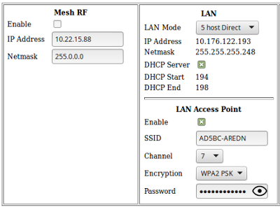

=======================
Configuration Deep Dive
=======================

During your node's *Basic Setup* you used the configuration display by clicking the **Setup** button and typing your username and password. The configuration area has many additional features which will be described in more detail below. Clicking **Node Status** exits configuration mode without saving any changes, returning you to the *Node Status* display.

.. image:: _images/admin-header.png
   :alt: Admin Navigation Controls
   :align: center

There are several control buttons below the configuration links section.

Help
   Opens a new window or tab to display the node help page.

Save Changes
  Click this button to save any configuration changes you have made. Saving changes will first do a basic validation of the new settings, saving them to flash memory if no errors are found. The new settings take effect in about 20 seconds and a reboot may or may not be required.

Reset Values
  Click this button to reload the currently saved settings from flash memory, effectively undoing any changes that were made.

Default Values
  Click this button to reset your node's basic settings to the default values. This action does not affect your existing node name.

Reboot
  Click this button to force your node to reboot.

Basic Setup
-----------

You have already configured many of the basic settings, but there are several additional features that will be explained below.

.. image:: _images/setup-options-with-auto-distance.png
   :alt: Setup Options
   :align: center

----------

Mesh RF Column
^^^^^^^^^^^^^^

*Mesh RF* is the node's *radio* interface. The AREDN |trade| firmware has been designed to simplify the process of configuring networking interfaces. Network values are automatically calculated based on the unique :abbr:`MAC (Media Access Control)` addresses of your node. You may need to change the *Channel* and possibly the *Channel Width* parameters to match those of your local AREDN |trade| mesh, as explained previously in the **Basic Radio Setup** section. Normally you will not need to change the other network settings on this page, so keep these values unless you fully understand how the mesh works and why the defaults may not be suitable for your situation.

The **Active Settings** can be adjusted and applied without saving changes or rebooting your node. However, they will return to their original values after a reboot unless you click *Save Changes*. A node may decrease its output power as it increases its data rate in order to maintain a linear spectrum.

Distance Setting
   The *Distance* setting is only applicable to nodes that can communicate directly over RF. This setting adjusts the RF retry timer to define how long the transmitter will wait for an acknowledgement from a neighbor station. If the distance parameter is too short, the transmitter will send duplicate data packets before an acknowledgement has time to be received. If the distance parameter is too long, the transmitter will wait extra time before considering the data lost and retransmitting the packets.

   The maximum distance settings the ath9k wireless driver allows depends on the channel width:

   * 20 MHz: 46666 meters
   * 10 MHz: 103030 meters
   * 5 MHz: 215757 meters

   **Auto-Distance**: A value of zero will cause the radio to automatically determine the RF retry timer by measuring the actual time it takes acknowledgement packets to be received. The timer is set using an Exponential Weighted Moving Average (EWMA). The auto-distance setting is best used on high quality point-to-point links between backbone or relay nodes. Fifty percent performance increases have been observed on those links compared to using a static distance setting.

   Since the node must calculate the best value based on actual data flow, it will require both time and adequate data traffic to arrive at the optimal setting. The node may not be able to arrive at the optimal values if a link is not being used to send a significant amount of data, because it starts at the max value and then drops down to the optimal setting. Over time the auto-distance setting should stabilize around the best value.

   However, the auto-distance setting does not work well when link quality is marginal or when there are many nodes sharing the channel. In this scenario the round-trip packet timing has a very wide range of values, so the timeout value becomes inflated and inconsistent. Static settings should be used in this situation.

Enable/Disable Mesh Radio
  You can disable your node's radio interface by deselecting the *Enable* checkbox, saving your changes, and rebooting the node. With the Mesh RF interface disabled the *Active Settings* no longer apply and will disappear. Since your node now has an unused RF interface, you will notice that a new section appears which allows you to use the node's radio as an FCC Part 15 *LAN Access Point*. You can enable or disable the LAN AP using the *Enable* checkbox. See the details below for configuring the LAN Access Point.

----------

LAN Column
^^^^^^^^^^

The LAN column contains the settings for the Local Area Network hosted by the AREDN |trade| node. There are several options under the *LAN Mode* dropdown.

The default mode is ``5 Host Direct``. In this mode every host on the LAN has direct access to and from the mesh. This mode was created to reduce the amount of manual configuration needed to provide services to the mesh, since many services do not work well if they are hosted behind a :abbr:`NAT (Network Address Translation)` router. With *Direct* mode the LAN shares the same address space as the mesh at large. Port forwarding is not needed because NAT is not used, and there is no firewall between the LAN and the mesh.

The mesh address space is automatically managed, so you cannot configure the LAN network settings in *Direct* mode. The only configurable option available in *Direct* mode is the size of the LAN subnet which can accommodate either 1, 5, 13, or 29 LAN hosts. A one host subnet can be used for either a single server or a separate network router using its own NAT which is capable of more advanced routing functions than those available on a mesh node.

It is important not to use a subnet larger than is necessary because the chance of an IP address conflict on the mesh increases with the size of the subnet. The LAN subnet parameters are automatically calculated and depend on the IP address of the *Mesh RF* interface. If a conflict does occur it can be fixed by changing the *Mesh RF* IP address.

The other LAN Mode is ``NAT``, and in this mode the LAN is isolated from the mesh. All outgoing traffic has its source address modified to be the *Mesh RF* IP address of the node. This is the same way that most routers use an Internet connection, and all services provided by computers on the LAN can only be accessed through port forwarding rules. A single :abbr:`DMZ (DeMilitarized Zone)` server can be used to accept all incoming traffic that is not already handled by other rules or by the node itself.

By default each node runs a :abbr:`DHCP (Dynamic Host Control Protocol)` server for its LAN interface, which lets the node assign IP addresses automatically for devices connected to the node's local area network. The last octet of the start/end range for host IP addresses is shown in the LAN column. If you choose to disable the DHCP server, you must manually configure the host IP addresses to be within the LAN network range. There should be only one DHCP server for each IP address scope or range, so you may need to disable your node's DHCP server if there is already another device providing DHCP services on your node's local area network. Click this link for additional information on `Dynamic Host Control Protocol <https://en.wikipedia.org/wiki/Dynamic_Host_Configuration_Protocol>`_.

When you connect a device to your node's LAN, not only should it have an IP address in the LAN IP address range, but it is best practice for LAN devices to obtain their DNS Server information *automatically* from the node. Be aware that if a LAN device does not use the DNS Server entry provided by the node to which it is connected, then that device will be unable to resolve hostnames on the mesh network. Also, hard-coding a device's DNS Server entry with the mesh node's IP address could result in unexpected failures if that device is moved to another mesh node or network.

If you enabled the *LAN Access Point* feature mentioned previously, edit the access point's SSID, channel, encryption method, and password. Click *Save Changes* to write your information to the node's configuration, and a node reboot will also be required. Now wireless devices can connect to your node through this new WiFi AP, and their DHCP IP address will be assigned by the node's DHCP server. If your node hardware has two radios, for example the *Mikrotik hAP ac lite* with both 2.4 and 5.8 GHz radios in a single unit, the *LAN Access Point* section will always be visible whether or not your *Mesh RF* interface is enabled.

WAN Column
^^^^^^^^^^

The :abbr:`WAN (Wide Area Network)` interface on your node is typically used to connect it to the Internet or to another external network. By default the WAN interface is set to obtain an IP address via DHCP from your upstream network. The :abbr:`DNS (Domain Name System)` servers are set by default to use Google's DNS services and should not be changed under normal circumstances. Google's name resolution servers are configured properly to detect error conditions and report them correctly.

If you are not going to use the WAN interface on your node, you can select *disabled* from the *Protocol* dropdown list. If you will be using your node as a *Tunnel Server*, you should reserve an IP address on your router for the node's WAN interface. This will be explained in the *Tunnel Server* section below.

When a node has Internet access on its WAN interface, that access is available to the node itself and to any computers connected via the LAN port. Checking the *Allow others to use my WAN* box will allow this node to route traffic from *all* its interfaces to/from the Internet or other external network. This box is unchecked by default because it is not desirable to route Internet traffic over the radio interface. AREDN |trade| is an FCC Part 97 amateur radio network, so be sure that any traffic which will be sent over the radio complies with FCC Part 97 rules. If you want local wireless Internet access, consider using an FCC Part 15 access point instead of the node's WAN gateway.

The *Prevent LAN devices from accessing WAN* checkbox will tell the node not to advertise that it can be used as a default gateway. This means that computers on the LAN network will lose their route to the Internet or other networks via your mesh node. This checkbox is deselected by default. If this checkbox is selected your LAN hosts will have no access to the Internet even if your node has Internet access on its WAN interface. You may need to disable the default route if your node needs to be connected to two networks at once, such as being wired to the mesh and connected to a local served agency WiFi network.

.. image:: _images/wifi-as-wan.png
   :alt: WiFi as WAN
   :align: right

As mentioned above in the *Mesh RF* section, if your node has a radio on which you have *disabled* Mesh RF and you are not using it as a LAN AP, you can enable this available radio as a WAN interface by checking the **WAN Wifi Client** checkbox. Enter the SSID and authentication string for the wifi AP that you want to connect through for Internet access.

The mesh node uses "WPA2 PSK" encryption to connect to the wifi AP. The password length must be a minimum of 8 and maximum of 64 characters. If the key length is 64, it is treated as hex encoded. If the length is 0, then no encryption will be used to connect to an open AP. A single quote character must not be used in the passphrase.

After you have saved changes and rebooted, the node will have Internet access via wifi rather than requiring a cable plugged into the node's WAN port. In fact, enabling the *WAN Wifi Client* will disable VLAN1, so Internet access will no longer be possible through the physical WAN port.

Node VLANs
^^^^^^^^^^

Many of the devices used as AREDN |trade| nodes have only one Ethernet port, but more than one type of network traffic must share that single port. The AREDN |trade| firmware implements :abbr:`VLANs (Virtual Local Area Network)` in order to accomplish this. Different types of traffic are tagged to identify the network to which they belong.

VLAN 1
  Packets received by the node that are tagged for VLAN 1 will be identified as WAN traffic from the Internet or another external network.

VLAN 2
  Packets received by the node that are tagged for VLAN 2 will be identified as traffic from a :abbr:`DtD (Device to Device)` node directly connected via Ethernet cable.

No VLAN tag
  Packets received by the node that are untagged will be identified as LAN traffic from computers on the local area network.

It is important to understand AREDN |trade| VLANs when configuring network smart switches for Internet access, tunneling, or DtD linking of nodes. There are some useful tutorials available on the AREDN |trade| website for configuring VLAN-capable switches: `Video <https://www.arednmesh.org/content/understanding-vlans>`_ or `Text+Images <https://www.arednmesh.org/content/configuring-netgear-gs105e-switch-lanwan-ports>`_. Also, on the AREDN |trade| GitHub site there is more information about node VLANs that have been preconfigured in the firmware images for specific types of radio hardware. For additional information visit this link: `Ethernet Port Usage <https://github.com/aredn/aredn#ethernet-port-usage>`_

Port Forwarding, DHCP, and Services
-----------------------------------

Click the **Port Forwarding, DHCP, and Services** link to navigate to these settings. This section provides a way for you to configure LAN network address reservations and service advertisements on your node. If your LAN network uses ``NAT`` mode, you may also need to define port forwarding rules.

----------

.. image:: _images/08-port-forward.png
   :alt: Port Forwarding, DHCP, and Services
   :align: center

----------

If your node is running its default DHCP server on the LAN network, it will automatically provide IP addresses to connected hosts. Look under the **Current DHCP Leases** heading to see the existing hosts and their assigned IP address.

.. attention:: The hostnames of computers connected to the mesh at large must be unique. Typically you should prefix your amateur radio callsign to the computer's hostname in order to have the best chance of it being unique on the mesh network.

Since DHCP leases are dynamic and can change over time, there may be a reason why a host's assigned IP address should be made permanent. This is especially useful if that host will provide an application, program, or service through your node to the mesh network at large. You can permanently reserve that host's DHCP address by clicking the *Add* button at the right of the row in the *DHCP Leases* list. You will see that host now appears in the list under the **DHCP Address Reservations** heading above the list of leases.

There may be some devices on which you are not able to set the hostname prefixed by your callsign. Once you add that device to your **DHCP Address Reservations**, however, click the *Hostname* box to edit the hostname what will be propagated across the mesh network. You may also want to assign a specific IP Address to the device by selecting it from the drop-down list. If you have a device which needs to be reachable on its host node, but which should not be accessed across the mesh network, click the *Do Not Propagate* checkbox to prevent OLSR from propagating that information to the mesh.

Advertised Services
^^^^^^^^^^^^^^^^^^^

*Services* include the required applications, programs, or functions that are available to devices on the mesh network. The purpose of the network is to transport data for the services which are being used. Network services may include keyboard-to-keyboard chat or email programs, document sharing applications, Voice over IP phone or video conferencing services, streaming video from surveillance cameras, and a variety of other network-enabled features. Services can run on the node itself or on any of its LAN-connected devices.

Remember that AREDN |trade| nodes have a limited amount of system resources with which to run services, so installing add-on services directly on the mesh node should be avoided because the node will become unstable and the mesh network can fail if insufficient RAM is available for the node to function, particularly on devices with only 32 MB of memory. It is a best practice to run services on an external computer connected to the node's LAN network. In the example above you can see that an external host has been given a reserved DHCP address, and it is also running the *meshchat* program as a service that is advertised on the network through this node. Use the following steps to create an advertised service.

Name
  Enter a service name in the *Name* field.

Link
  Check this box if your want your advertised service to display an active link in the web browser. This allows mesh users to navigate to your service by clicking the link.

Protocol
  Enter the protocol to use in the field between *Link* and *URL*. Common protocols include ``http`` for website services and ``ftp`` for file transfer services. Other services may use other protocols.

URL
  From the dropdown list select the node or host on which this service is running.

Port
  Enter the network port on which the service is listening for user connections. There may be several applications provided through a single web server on a node or host using a single port, and in that case a valid application *Path* must be entered after the port number (as in the example above). In other cases the network port alone uniquely identifies the application or program that is listening for user connections to that service. You can click this link for additional information about `network ports <https://en.wikipedia.org/wiki/Port_(computer_networking)>`_.

Once you have entered the values for your advertised service, click *Add* to add the service to the **Advertised Services** list. You may also remove an existing advertised service by clicking the *Del* button to delete it from the list. Click the **Save Changes** button to write your changes to the node's configuration.

Port Forwarding
^^^^^^^^^^^^^^^

If you are using ``NAT`` for your LAN mode, then *Port Forwarding* rules are the only way other devices have for connecting to your services. To create a port forwarding rule, select the network **Interface** on which the traffic will enter your node. Select the Protocol **Type** used by the incoming packets (TCP, UDP, or Both). Enter the **Port** number that the external request is using to connect to your service. When your node receives traffic on the selected interface, protocol, and port, that request will be routed to the **LAN IP** address and **LAN Port** on which the service host is listening for incoming requests.

Once you have entered these values, click *Add* to add the rule to the **Port Forwarding** list. You may also remove an existing rule by clicking the *Del* button to delete it from the list. Click the **Save Changes** button to write your port forwarding changes to the node's configuration.

See your node's **Help** file for additional insights on how this configuration section changes based on the LAN mode of your node. Click this link for more information on `Port Forwarding <https://en.wikipedia.org/wiki/Port_forwarding>`_.

DNS Aliases
^^^^^^^^^^^

**DNS Aliases** provide a way for you to create a mesh alias or synonym for a services computer. This can be useful if you want a computer or device on your node's LAN network to be identified by something other than its actual hostname.

To create an alias, enter an **Alias Name**. The alias should be prefixed with your callsign in order to follow the naming convention used when defining any unique host on the network. Then use the drop-down selector to choose the name or **IP Address** of the existing host for which you are defining the alias. Once you have entered these values, click *Add* to add the alias to the **DNS Aliases** list. You may also remove an existing alias by clicking the *Del* button to delete it from the list. Click the **Save Changes** button to write your changes to the node's configuration.

Aliases in Direct Mode
  When your node is using ``Direct Mode`` for its LAN, *DNS Aliases* allow your computer or device to be reachable by its alias from across the mesh network. This provides functionality similar to DNS *CNAME* records, so the computer will respond to network requests using its real hostname as well as any aliases that are defined for it.

  Once they are defined the **DNS Aliases** become available for creating *Advertised Services* by choosing the alias from the host drop-down selector. This feature can be used for virtual domain email servers, virtual machine identifiers, virtual web site URLs, and many other services.

Aliases in NAT Mode
  *DNS Aliases* work differently in ``NAT Mode``. Aliases **cannot** be propagated across the mesh when using ``NAT Mode``. They are only visible within the local LAN network on the node. ``NAT Mode`` aliases **cannot** be used when defining an *Advertised Services* listing. They can only be used as an alternate hostname for a computer or device on the nodes' LAN.

Tunnel Server
-------------

Click the **Tunnel Server** link to navigate to these settings. This section provides a way for you to configure your node with a special service that allows node-to-node connections across the Internet. Unless you have a specific need for this type of network connection, it is recommended that you do not install the *Tunnel Server* feature. This is because it will cause your node to dedicate limited system resources to running a service that may be used rarely. In order to increase the performance of your node you should conserve system resources so they will be available for normal node operations, which is especially important for nodes with limited memory and storage.

Tunnels should be used as a temporary means of connecting mesh islands when RF links have yet to be established. They should be removed as soon as RF links are operational. Remember that AREDN |trade| is first and foremost an emergency communication resource, so it's likely that Internet-dependent links and the assets they provide will not be available during a disaster. Their presence could create a false expectation for served agency personnel, so the network will fail to meet their expectations when tunneled resources become unavailable during a disaster.

Also, before using the AREDN |trade| tunnel feature, be aware of how this type of connection could impact your local mesh network. If your node participates in a local mesh via RF, then adding one or more tunnel connections on that node will cause the nodes and hosts on the far side of the tunnel(s) to appear on your local *Mesh Status* display. This adds complexity and makes everyone's display a little more difficult to navigate. If you want to participate in remote mesh networks via tunnel, consider establishing those tunnels from one of your nodes that is *not* connected to your local mesh network via RF.

Internet Connectivity Requirements
^^^^^^^^^^^^^^^^^^^^^^^^^^^^^^^^^^
In order to run your node as either a *Tunnel Server* or *Tunnel Client*, you will need to configure additional settings and equipment.

Managed Switch Settings (both Client and Server networks)
  Set your VLAN-capable network switch to appropriately tag traffic from the Internet with "VLAN 1" before sending it to your node. This allows your node to properly identify the traffic as coming from the Internet connection on its WAN interface. See the equipment manual for your managed switch to determine how to configure these settings. There are also AREDN |trade| `website posts <https://www.arednmesh.org/content/configuring-netgear-gs105e-switch-lanwan-ports>`_ which contain helpful information.

  .. note:: If you are using a *Mikrotik hAP ac lite* or *GL.iNET AR150/AR300M/AR750*, then you do not need a separate VLAN-capable switch as described above. These nodes have built-in switches with the appropriate VLANs preconfigured in the AREDN |trade| firmware.

  Your node should have Internet access after the smart switch is configured, and you can use the node's new Internet connection to install the *tunneling* software package. This package should be installed on both the tunnel server and the tunnel client nodes.

WAN Interface IP (Tunnel Server *node* only)
  Set a static IP address on your tunnel server node's WAN interface so your Internet-connected router/firewall has a consistent way to forward traffic to your node.

Internet Firewall/Router Settings (Tunnel Server network only)
  Set your network firewall or router to permit traffic from the Internet on port 5525, which is the default AREDN |trade| tunnel service port. Then configure a port forwarding rule on your firewall or router to send any traffic from the Internet on port 5525 to the static IP address of your node's WAN interface on the *node's* port 5525. See the equipment manual for your firewall or router to determine how to configure these settings. Also, some Internet Service Providers may not allow port forwarding by default, so you should check with your ISP if you have difficulty opening ports.

Tunnel Server Node Settings
^^^^^^^^^^^^^^^^^^^^^^^^^^^

The following diagram shows an overview of tunnel services between two nodes.

----------

.. image:: _images/10-tunneling-diagram.png
   :alt: Tunneling Diagram
   :align: center

----------

The tunnel network address ranges are automatically calculated, and it is not necessary to change these settings unless there is a specific reason why the defaults will not work for your situation.

Tunnel Server DNS Name
  Enter the *Public IP Address* or the *Dynamic DNS URL* by which Internet-connected nodes can reach your network.

Client Node Name
  Enter the exact node name of the client node that will be allowed to connect to your node over the tunnel. Do not include the "local.mesh" suffix.

Client Password
  Enter a complex password that the client node will use to connect to your node over the tunnel. Use only uppercase and lowercase characters and numbers in your password.

Contact Info/Comment (optional)
  You have the option to enter a line of text which may include the contact information of the person responsible for a the tunnel endpoint. It is a 50 character freeform text field which can contain any other useful identifier or information as needed.

Once these settings are correct, click *Add* to add the new client to the list of authorized tunnel clients. On the right of each entry there is an envelope icon which will automatically open your computer's email program and copy the client settings into a new email which allows you to quickly and easily send credentials to the owners of the client nodes.

To allow a client to connect to your tunnel server, select the **Enabled?** checkbox and click the **Save Changes** button. When a tunnel connection becomes active, the cloud icon at the right of each row will change to indicate that the tunnel is active.

Tunnel Client
-------------

Click the **Tunnel Client** link to navigate to these settings. In this section you can configure your node to connect over the Internet to another node running as a *Tunnel Server*. You should already have your VLAN-capable network switch configured as explained in the *Tunnel Server* section above.

Contact the amateur operator who controls the tunnel server and request client credentials by providing your specific node name. The tunnel server administrator will provide you with the public IP or :abbr:`DDNS (Dynamic Domain Name Service)` URL for the tunnel server, the password you are to use, and the network IP address for your client node. Enter these values into the appropriate fields on your node and click *Add* to create a client entry in the list.

----------

.. image:: _images/11-tunnel-client.png
   :alt: Tunnel Client Settings
   :align: center

To allow your client to connect to the tunnel server, select the **Enabled?** checkbox and click the **Save Changes** button. When a tunnel connection becomes active, the cloud icon at the right of each row will change to indicate that the tunnel is active.

.. warning:: The add-on tunnel package (vtun) has a character limitation on the client node name which could prevent a tunnel from connecting. Keep node names as short as possible in order to avoid this issue. More information and discussion can be found in `this Forum thread <https://www.arednmesh.org/comment/4174>`_.

Administration
--------------

Click the **Administration** link to navigate to these settings. There are four sections that provide a way for you to update the AREDN |trade| firmware, as well as to install or remove software packages on your node.

.. image:: _images/09-admin-upgrade.png
   :alt: Upgrade and Packages
   :align: center

.. important:: Files cannot be uploaded to a node while a tunnel server or client connection is enabled. Disable tunnel client or server connections before uploading firmware, packages, or ssh key files. The *Upload* buttons will be disabled until tunnels are disabled.

Firmware Update
  If you have a new firmware image that has already been downloaded to your computer, click the *Browse* button and select the firmware file to upload. Click *Upload* and the file will be uploaded and installed on the node.

  If the node has Internet access (either from its WAN interface or from the mesh) you can use the *Download Firmware* option. Click *Refresh* to update the list of available images. Select the image to download, click *Download*, and wait for the firmware to download and be installed. When upgrading firmware, you can retain your existing configuration settings by selecting the *Keep Settings* checkbox.

Package Management
  Here you can install or remove software packages on the node. *Upload Package* allows you to install a package file from your computer. *Download Package* allows you do retrieve a package over the Internet from the AREDN |trade| website. Clicking *Refresh* will update the list of packages available for download, but try to avoid updating this list unless you absolutely require it. The package information database is stored locally and will use quite a bit of storage space. Under normal circumstances it is rare to require a package refresh.

  The *Remove Package* list shows all packages currently installed on the node. Selecting a package and clicking *Remove* will uninstall the package. You will only be able to remove packages that you have added. All installed packages are shown, but the pre-installed packages cannot be deleted since they are necessary for proper operation of the node.

Authorized SSH Keys
  Uploading ssh keys allows computers to connect to a node via ssh without having to know the password. The ssh keys are generated on your computer using built-in utilities or the `PuTTY <https://www.chiark.greenend.org.uk/~sgtatham/putty/latest.html>`_ program's *Key Generator*. Once you have the key files on your computer, you can upload its *public* key to your AREDN |trade| node. If you want to remove an installed key, select it and click the *Remove* button.

  .. note:: If you plan to use ssh keys you may want to review **Use PuTTYGen to Make SSH Keys** in the **How-To Guide** section which describes this process in detail.

Support Data
  There may be times when you want to view more detailed information about the configuration and operation of your node, or even forward this information to the AREDN |trade| forum in order to get help with a problem. Click *Download Support Data* to save a compressed archive file to your local computer.

Advanced Configuration
----------------------

The **Advanced Configuration** section allows you to change settings for various items that may be available on the type of hardware you are using. Not all hardware can support every value. These settings are best left as default unless you have a clear understanding of why you need to change the defaults for your node or network.

Above the settings table there are links that allow you to view the node help file, reboot the node, or reset the node to a firstboot or "NOCALL" configuration. You can edit or select a setting and then click the *Save Setting* button at the right side of the row to implement the change. You may also reset an item to default values by clicking the *Set to Default* button. Each row has hover help which can be displayed by hovering your cursor over the question mark icon at the left side of each row.

Map Tile and Script Paths
  These fields contain the external URLs for map tiles and `leafletjs <https://leafletjs.com/>`_ *css* and *javascript* files used for interactive maps.

  .. image:: _images/advConfig-leaflet.png
    :alt: Advanced Configuration - map paths
    :align: center

----------

Firmware and Package Download Paths
  These fields contain the URLs used by the node for downloading firmware and package files during upgrades. By default they point to the AREDN |trade| downloads server available across the Internet. You can change these paths to point to a local mesh package server in order to upgrade nodes that do not have Internet access.

  .. note:: If you plan to create a local software repository for your mesh network, review **Creating a Local Package Server** in the **How-To Guide** section.

  .. image:: _images/advConfig-downloads.png
    :alt: Advanced Configuration - downloads
    :align: center

----------

PoE and USB Power Passthrough
  These rows will only appear in the table if you have node hardware which supports PoE or USB power passthrough. One example is the *Mikrotik hAP ac lite* which provides one USB-A power jack, as well as PoE power passthrough on Ethernet port 5. You are allowed to enable or disable power passthrough on nodes with ports that support this feature. Move the slider to **ON** and click *Save Setting* to enable power passthrough.

  .. image:: _images/advConfig-passthrough.png
    :alt: Advanced Configuration - passthrough
    :align: center

----------

Tunnel Server *maxclients* and Tunnel Client *maxservers*
  These rows will appear in the table only if the AREDN |trade| tunneling package is installed on your node. By default a node is allowed to host up to 10 clients in its *Tunnel Server* display and connect with up to 10 servers in its *Tunnel Client* display. The *maxclients* and *maxservers* settings provide a method for adjusting the defaults.

  .. image:: _images/advConfig-maxTunValues.png
    :alt: Advanced Configuration - tunnel max values
    :align: center

----------

  .. important:: If you plan to change these settings, review **Changing Tunnel Max Settings** in the **How-To Guide** section.

  Use caution when increasing the *maxclients* or *maxservers* values. Enter only *zero* or positive integers up to a maximum value for the number of active connections your node hardware can handle, since each active tunnel connection consumes system resources that the node may need for normal operation.

OLSR Restart
  The `OLSR (Optimized Link State Routing) <https://en.wikipedia.org/wiki/Optimized_Link_State_Routing_Protocol>`_ process can be restarted when you want your node to rebuild its mesh routing table but you do not want to do a full reboot. Click the *Execute* button to restart OLSR.

  There is a known intermittent issue that may occur when a node boots. If OLSR fails to propagate information or does not receive all the network hostnames, a one-time restart of OLSR should resolve the issue. OLSR should be restarted on your node if other nodes' *Mesh Status* display have your node's IP address rather than hostname or if "dtdlink" or "mid" is shown in your node's hostname on their *Mesh Status* display. If your node's *Mesh Status* display shows the IP address rather than hostname for a remote node, then that remote node should restart OLSR.

.. image:: _images/advConfig-olsr-alerts.png
  :alt: Advanced Configuration - OLSR and Alerts
  :align: center

----------

AREDN Alert Message (AAM) Refresh
  The AREDN |trade| development team may post messages which Internet-connected nodes can automatically download. You can execute the *aam.refresh* action if you want your node to retrieve any new messages without having to wait for the next auto-refresh window. Click the *Execute* button to trigger an immediate message retrieval. This will retrieve all alerts eligible for display on your node, whether they come from the AREDN |trade| server over the Internet or from a local message source on your mesh network.

AREDN Alerts Local Path
  This field allows you to enter the URL for a local alert message repository. If you configure such a local repository then your nodes without Internet access can also receive alert messages pertinent to your local mesh. Enter the URL without a trailing backslash.

  A local message repository should be configured on a mesh-connected web server which allows nodes to query the URL you entered. No Internet access is required for this feature to work as designed. You can consult with your local web server administrator in order to obtain the correct URL for the local message repository. Use the following file naming convention on the web server:

  * Create text files for individual nodes by using only lowercase characters with the exact node name, followed by the ``.txt`` extension as shown below.
  * To create a broadcast message intended for all local nodes, enter your message text in a file named ``all.txt`` using only lowercase characters for the filename.

  .. image:: _images/url-content.png
     :alt: Local Alert Message Repository Content
     :align: center

----------

  It is possible to include HTML tags in your message text, such as using the `` `` tag to display subsequent text on the next line. However, it is best practice to keep alert messages short in order to minimize the height of the alert banner displayed on node webpages.

AREDN Alert Message Purge
  Use this purge setting if you want to immediately remove the AREDN |trade| Alert Message banner from your node. Click the *Execute* button to trigger an immediate message banner removal. This will remove all alert messages, whether they originated from the AREDN |trade| server over the Internet or from a local message source on your mesh network.

Node Reset Button
-----------------

The reset button on an AREDN |trade| node has two built-in functions based on the length of time the button is pressed.

With the node powered on and fully booted:

* **Hold for 5 seconds to reset the password and DHCP service**
* **Hold for 15 seconds to return the node to “just-flashed” condition**

On some equipment models it may be possible to accomplish these reset procedures by pressing the *Reset* button on the PoE unit.
