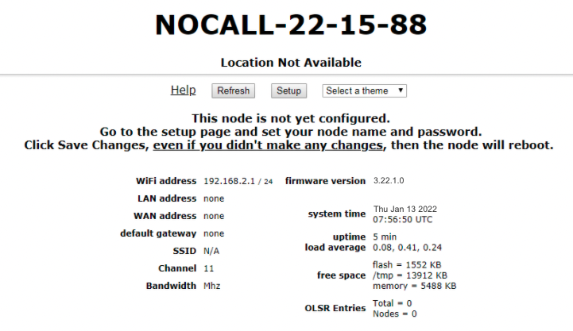
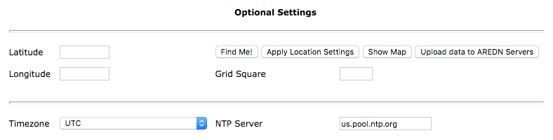

==================
Basic Radio Setup
==================

First-Time Setup
----------------

After you have installed the AREDN |trade| firmware, rebooted the device, and connected your computer to a LAN port on the node or the :abbr:`PoE (Power over Ethernet)` unit, you can navigate to your node's web interface at ``http://192.168.1.1`` or ``http://localnode.local.mesh`` for first-time radio setup. Some computers may have DNS search paths configured that require you to use the `fully qualified domain name (FQDN) <https://en.wikipedia.org/wiki/Fully_qualified_domain_name>`_ to resolve *localnode* to the mesh node's IP address. Each node will serve its web interface on ports 80 and 8080.

The initial status page will be displayed, instructing you to configure your node by clicking the **Setup** button. This is sometimes referred to as the "NOCALL" or *firstboot* display.

----------

----------

You will be prompted to enter the administrative login credentials. The default authentication credentials are:

| Username: ``root``
| Password: ``hsmm``

The **Basic Setup** page will be displayed, as shown below.

   .. image:: _images/02-basic-setup.png
      :alt: Basic Setup
      :align: center

----------

Many of these settings will be described in detail in subsequent sections of this documentation. In order to get your new AREDN |trade| node on the air for the first time, you need to enter the following items.

Node Name
  Begin the node name with your callsign, followed by unique identifying information of your choice. Node names may contain up to 63 letters, numbers, and dashes, but cannot begin or end with a dash. Underscores, spaces, or any other characters are not allowed. Node names are not case sensitive, but the case will be preserved on the node status display.
  Amateur radio operators are required to identify all transmitting stations. The AREDN |trade| node name is beaconed automatically by the node every five minutes, so the node name must contain your callsign. Recommended names follow the (callsign)-(label) format, such as AD5BC-MOBILE or AD5BC-120SE. As a general rule node names should be kept as short as possible, while clearly and uniquely identifying the node.

Password
  Set a new administration password for the node. Enter it again in the *Retype Password* box to verify it is correct. The first time a node is configured it will require you to change the password. Be sure to remember or record the new password so you can use it for any future administrative tasks on the node.

Node Description
  This is not a required field, but it is a good place to describe the features or function of this device. Many operators use this field to list their contact information, the radio model and antenna specifications, or the tactical purpose for the node. There are no character restrictions in the field, but the maximum length allowed is 210 characters.

Mesh RF
  The *IP Address, Netmask, and SSID* fields are automatically calculated for you based on the unique :abbr:`MAC (Media Access Control)` address of your node. Do not change these settings. Everything under the **LAN** and **WAN** columns can be left unchanged for now.

Channel and Channel Width
  Nodes communicate only with other nodes that use the same channel and channel width. You can determine the correct settings by talking with other local node operators to find out which settings are required for joining their networks.

Active Settings
  See the *Configuration Deep Dive* section for more information about these and other settings in the **Mesh RF** column.

  - Use the dropdown list to select the maximum output power for this device. Remember that amateur operators are required to use the minimum power necessary to make contact with other stations.

  - Use the slider to select the maximum distance you estimate between your node and other neighboring nodes. The default value is *zero* which tells the node to automatically determine the correct distance value. See the *Configuration Deep Dive* section for additional information.

  - Some devices have max power levels that change depending on the channel or frequency being used, and in that case the max level may change when you save the settings. The output power will be capped at the max level supported by the hardware for that frequency.

  - Once these settings have been adjusted, click the **Apply** button.

Once you have entered, applied, and verified that your node settings are correct, click the **Save Changes** button. Your node will record the new configuration settings and automatically reboot.

Optional Settings
-----------------

In this section you can enter your node's latitude and longitude, as well as the grid square designator. The latitude/longitude values should be in decimal format (for example, 30.5432 and -95.1234). The optional node location settings are not required in order for your node to function normally.

----------

- If you are using a location-aware web browser, you can click the **Find Me** button to populate the latitude/longitude fields. This works well if you are viewing the *Basic Settings* page on a mobile device with built-in GPS.

- If your node has an Internet connection available, the **Show Map** and **Upload Data to AREDN Servers** buttons will become active. The **Show Map** button will display a map that allows you to click the position where your node is located or to drag an existing location marker to a different spot on the map. Both of these actions will automatically update the latitude/longitude fields on the page.

- The **Upload Data to AREDN Servers** button will send your node information to an AREDN |trade| server on the Internet. By submitting this information you are agreeing to allow AREDN |trade| to publish your node location on a public mapping service and utilize the information for other purposes such as statistical analysis. No sensitive data such as passwords are sent to the AREDN |trade| servers. If you wish to remove your node location from the public mapping service, simply clear or erase your latitude/longitude values, click *Apply Location Settings* and then *Upload Data to AREDN Servers*.

- Click the **Apply Location Settings** button after entering new location information on this page. The new settings become active without clicking the *Save Changes* button.

You may also change the timezone for your node's system time, as well as selecting a `Network Time Protocol (NTP) <https://en.wikipedia.org/wiki/Network_Time_Protocol>`_ source if your node is connected to a network which has a network time server.
