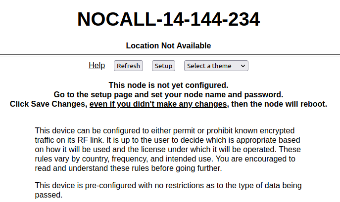

==================
Basic Radio Setup
==================

First-Time Setup
----------------

After you have installed the AREDN |trade| firmware and rebooted the device, the node will have a default IP address of 192.168.1.1. Make sure your computer has an IP address on the 192.168.1.x network. After connecting your computer to a LAN port on the node or the :abbr:`PoE (Power over Ethernet)` unit, you should be able to ping the node at 192.168.1.1.  Navigate to your node's web interface at ``http://192.168.1.1`` or ``http://localnode.local.mesh``. Some computers may have DNS search paths configured that require you to use the `fully qualified domain name (FQDN) <https://en.wikipedia.org/wiki/Fully_qualified_domain_name>`_ to resolve *localnode* to the mesh node's IP address. Each node will serve its web interface on ports 80 and 8080.

The initial status page will be displayed, instructing you to configure your node by clicking the **Setup** button. This is sometimes referred to as the "NOCALL" or *firstboot* display.

|

You will be prompted to enter the administrative login credentials. The default authentication credentials are:

| Username: ``root``
| Password: ``hsmm``

The **Basic Setup** page will be displayed, as shown below.

   .. image:: _images/basic-setup.png
      :alt: Basic Setup
      :align: center

|

Many of these settings will be described in detail in subsequent sections of this documentation. In order to get your new AREDN |trade| node on the air for the first time, you need to enter the following items.

Node Name
  Begin the node name with your callsign, followed by unique identifying information of your choice. Node names may contain up to 63 letters, numbers, and dashes, but cannot begin or end with a dash. Underscores, spaces, or any other characters are not allowed. Node names are not case sensitive, but the case will be preserved on the node status display.
  Amateur radio operators are required to identify all transmitting stations. The AREDN |trade| node name is beaconed automatically by the node every five minutes, so the node name must contain your callsign. Recommended names follow the (callsign)-(label) format, such as AD5BC-MOBILE or AD5BC-120SE. As a general rule node names should be kept as short as possible, while clearly and uniquely identifying the node.

Password
  Set a new administration password for the node. Typically passwords may contain the characters ``a-z``, ``A-Z``, ``0-9``, period ``.``, dash ``-``, underscore ``_``, exclamation ``!``, and tilde ``~``. Avoid linux-reserved characters, including but not limited to ``#``, ``$``, ``&``, ``*``, ``<``, ``>``. Enter your new password again in the *Retype Password* box to verify it is correct. You can click the *eye* icon at the right of the password fields to toggle between hidden and visible text. The first time a node is configured it will require you to change the password. Be sure to remember or record the new password so you can use it for any future administrative tasks on the node.

Node Description
  This is not a required field, but it is a good place to describe the features or function of this device. Many operators use this field to list their contact information, the radio model and antenna specifications, or the tactical purpose for the node. There are no character restrictions in the field, but the maximum length allowed is 210 characters.

Mesh RF
  The *IP Address, Netmask, and SSID* fields are automatically calculated for you based on the unique :abbr:`MAC (Media Access Control)` address of your node. Do not change these settings. Everything under the **LAN** and **WAN** columns can be left unchanged for now.

Channel and Channel Width
  Nodes communicate only with other nodes that use the same SSID, channel and channel width. You can determine the correct settings by talking with other local node operators to find out which settings are required for joining their networks.

See the **Configuration Deep Dive** section for more information about these and other settings in the *Mesh RF* column.

Power & Distance Settings
  If you have *Link Quality Manager* disabled, you will see the *Power & Distance* settings.

  - Use the dropdown list to select the maximum output power for this device. Remember that amateur operators are required to use the minimum power necessary to make contact with other stations.

  - Use the slider to select the maximum distance you estimate between your node and other neighboring nodes. The default value is *zero* which tells the node to automatically determine the correct distance value to the farthest neighbor node.

  - Some devices have max power levels that change depending on the channel or frequency being used, and in that case the max level may change when you save the settings. The output power will be capped at the max level supported by the hardware for that frequency.

Power & Link Quality Settings
  If you have *Link Quality Manager* enabled, you will see the *Power & Link Quality* settings.

  - Use the dropdown list to select the maximum output power for this device. Remember that amateur operators are required to use the minimum power necessary to make contact with other stations.

  - *Max Distance* is the maximum distance between nodes at which you can expect to achieve a usable radio link. The default value is 50 miles / 80 kilometers, but you can adjust this setting if your node is only able to maintain a usable radio link with nearby nodes.

  - *Min SNR* is the minimum Signal-to-Noise ratio that you require in order to reliably pass data between nodes. The default is 15 dB, but you can lower this value if you require your node to continue passing data even on links that have reduced signal characteristics.

  - *Min Quality* is the minimum Link Quality required in order to reliably pass data between nodes. This is calculated as the moving average of total sent packets over total sent packets plus retransmissions. For example, if the node had to send every packet twice for it to be successfully received, the link quality would be 50%.

Once you have entered, applied, and verified that your node settings are correct, click the **Save Changes** button. Your node will record the new configuration settings and automatically reboot.

Optional Settings
-----------------

Location Settings
  In this section you can enter your node's latitude and longitude, as well as the grid square designator. The values should be in decimal format (for example, 30.5432 and -95.1234). The node location settings are optional, but if you have *Link Quality Manager* enabled then the location becomes important for calculating the distance between linked nodes.

  .. image:: _images/basic-location.png
    :alt: Optional Settings - Location
    :align: center

There are several options for setting your node's location:

- If you are using a location-aware web browser, you can click the **Find Me** button to populate the latitude/longitude fields. This works well if you are viewing the *Basic Settings* page on a mobile device with built-in GPS.

- If your node has an Internet connection available, the **Show Map** and **Upload Data to AREDN Servers** buttons will become active. The **Show Map** button will display a map that allows you to click the position where your node is located or to drag an existing location marker to a different spot on the map. Both of these actions will automatically update the latitude/longitude fields on the page.

- The **Upload Data to AREDN Servers** button will send your node information to an AREDN |trade| server on the Internet. By submitting this information you are agreeing to allow AREDN |trade| to publish your node location on a public mapping service and utilize the information for other purposes such as statistical analysis. No sensitive data such as passwords are sent to the AREDN |trade| servers. If you wish to remove your node location from the public mapping service, simply clear or erase your latitude/longitude values, click *Apply Location Settings* and then *Upload Data to AREDN Servers*.

- Click the **Apply Location Settings** button after entering new location information on this page. The new settings become active without clicking the *Save Changes* button.

Timezone and NTP Server
  Here you select the timezone for your node's system clock, and the default value is ``UTC``. You can also enter the hostname for a `Network Time Protocol (NTP) <https://en.wikipedia.org/wiki/Network_Time_Protocol>`_ source if your node is connected to a network which has a network time server. In the *NTP Server* field you should enter a valid hostname for the network time source, for example ``us.pool.ntp.org`` or ``AD5BC-ntp.local.mesh``. You may also choose how often NTP will update the node's clock by selecting a value from the dropdown list. The default is once per day [``daily``] but you may also select once per hour [``hourly``].

  .. image:: _images/basic-time.png
    :alt: Optional Settings - Time
    :align: center

  If your node is unable to connect to the NTP server specified here then it will briefly search for another NTP service which might be defined on your local mesh network. The node hosting that service must enter its Advertised Service with "NTP" as part of the service name. The protocol should be set to "ntp://", the hostname should point to the host providing the service, and the port should be set to "123", the standard NTP port. For example, ``ntp://ab7pa-box2.local.mesh:123`` would identify the NTP server portion of the Advertised Service. See the **Configuration Deep Dive** section for additional information about Advertised Services.

Next Steps
----------

After you finish configuring your node and click *Save Changes*, your node will immediately reboot using your new configuration. Your node will have an IP address in the 10.x.x.x range, so you should set your computer to use `DHCP <https://en.wikipedia.org/wiki/Dynamic_Host_Configuration_Protocol>`_ to obtain a new IP address from your node. As explained in the installation checklists, you may need to disconnect/reconnect or disable/enable your computer's Ethernet interface so that it begins using the new IP address. You can open a web browser and enter ``http://localnode.local.mesh`` or ``http://<your-nodename>.local.mesh`` to login to your node.
