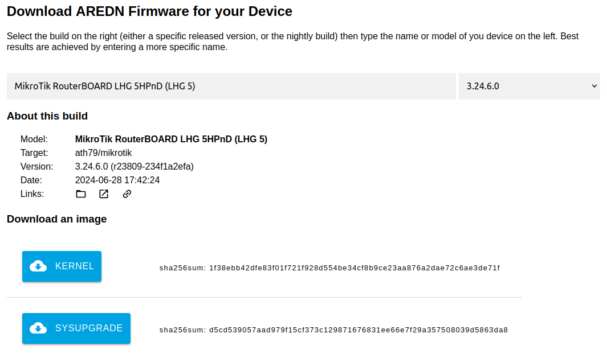

==================================
Downloading AREDN |trade| Firmware
==================================

Types of Firmware
-----------------

**Stable Release** firmware has been tested and shown work on the devices that were supported at the time of the release. This firmware is considered to be stable and suitable for production devices deployed in the field. Stable Release firmware is identified by numbers such as ``3.23.4.0``. In this example ``23.4`` indicates the year (2023) and month (April) of the Stable Release.

**Nightly Build** firmware contains the latest bug fixes, features, and support for new devices. It allows the wider mesh community to test new code before it is included in a Stable Release. The Nightly Build is considered more experimental or cutting-edge and may not be suitable for production nodes. However, it might make sense to install the Nightly Build if you are having a specific issue that has been addressed in newly developed code or if you are loading AREDN |trade| firmware onto a device that is newly supported. The Nightly Build filename shows the build date and the software commit identifier for that specific firmware build.

Choosing Firmware to Download
-----------------------------

The first step is to choose the AREDN |trade| firmware image for your specific hardware. You can find the available firmware images for your device by using the `AREDN Firmware Selector (AFS) <http://downloads.arednmesh.org/afs/www/>`_.

|

Enter the first few characters of the hardware manufacturer in the *Model* search field (case insensitive), then click the firmware image dropdown on the right to choose the firmware release that you want to download. Next, find your device model in the search results list and click the row for your hardware.

|

There are usually two types of firmware images shown for each device: one for the first-time replacement of the manufacturer's firmware, and the other for upgrades of nodes that are already running AREDN |trade| firmware.

TP-LINK or Ubiquiti
  If you are loading firmware on TP-LINK or Ubuquiti devices for the first time you must download the *FACTORY* firmware. Otherwise download the *SYSUPGRADE* firmware image.

Mikrotik
  If you are loading firmware on Mikrotik devices for the first time you must download **both** the *KERNEL* and *SYSUPGRADE* images. Otherwise download only the *SYSUPGRADE* firmware image.

GL.iNET
  For GL.iNet devices you will only see the *SYSUPGRADE* image for both first-time installs or firmware upgrades.

Click the appropriate button to download the image file to your local computer. Make a note of the download location on your computer, since you will use the downloaded image(s) to install the AREDN |trade| firmware on your device.

Features Inherited from OpenWRT for New Architectures
  The latest AREDN |trade| firmware contains features which are inherited from the newest OpenWRT upstream releases. The `OpenWRT *Release Notes* <https://openwrt.org/>`_ describe these new features. One important change is the inclusion of new *target* architectures for the firmware. The legacy "ar71xx" target has been retired and is replaced by the "ath79" and "ipq40xx" targets.

  All supported devices have been migrated to the new targets. **You should select the latest recommended target image based on the type of hardware on which it will be installed.** Refer to the latest `Supported Devices <http://downloads.arednmesh.org/snapshots/SUPPORTED_DEVICES.md>`_ in order to ensure you have the correct firmware image for your specific device.

Nightly Build Direct Download
  To download the *Nightly Build* directly, navigate to `http://downloads.arednmesh.org/snapshots/targets/ <http://downloads.arednmesh.org/snapshots/targets/>`_. Nightly Build filenames are prefixed with the firmware build date and a unique software commit identifier. As explained above, select the correct target and subtarget for the device you will be flashing. To return your device to the current stable release, download the correct *Stable Release* firmware and reflash your device.

  Be aware that when a new nightly build becomes available, any older builds automatically become obsolete. If you want to install add-on packages for nodes running a nightly build, understand that specific packages will not be available for an *older* build if a *newer* build has superseded it. Be sure to upgrade to the current nightly build before installing packages.
