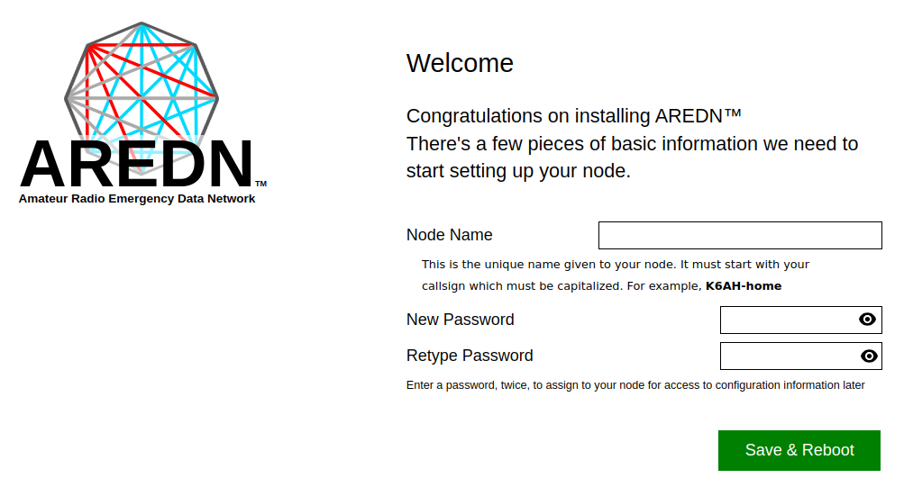

====================
Firstboot Node Setup
====================

After you have installed the AREDN® firmware and rebooted the device, the node will have a default IP address of 192.168.1.1. You can set your computer to receive an IP address from your node via `DHCP <https://en.wikipedia.org/wiki/Dynamic_Host_Configuration_Protocol>`_. After connecting your computer to a LAN port on the node or the :abbr:`PoE (Power over Ethernet)` unit, you should be able to ping the node at 192.168.1.1. Navigate to your node's web interface at ``http://192.168.1.1`` or ``http://localnode.local.mesh``. Some computers may have DNS search paths configured that require you to use the `fully qualified domain name (FQDN) <https://en.wikipedia.org/wiki/Fully_qualified_domain_name>`_ to resolve *localnode* to the mesh node's IP address.

The firstboot status page will be displayed, instructing you to configure your node by entering a node name and password for administrative access to your node.

|

Node Name
  Begin the node name with your CALLSIGN in all capital letters followed by a dash character and some unique identifying information of your choice. Node names may contain up to 63 letters, numbers, and dashes, but cannot begin or end with a dash. Underscores, spaces, or any other characters are not allowed. Amateur radio operators are required to identify all transmitting stations, so your node name is beaconed automatically by the node every five minutes. Recommended names follow the (CALLSIGN)-(label) format, such as AD5BC-MOBILE or AD5BC-120SE. As a general rule node names should be kept as short as possible, while clearly and uniquely identifying the node.

Password
  Set a new administration password for the node. Typically passwords may contain the characters ``a-z``, ``A-Z``, ``0-9``, period ``.``, dash ``-``, underscore ``_``, exclamation ``!``, and tilde ``~``. Avoid Linux reserved characters, including but not limited to ``#``, ``$``, ``&``, ``*``, ``<``, ``>``. Enter your new password again in the *Retype Password* box to verify it is correct. You can click the *eye* icon at the right of the password fields to toggle between hidden and visible text. The first time a node is configured it will require you to set the password. Be sure to remember or record the password so you can use it for any future administrative tasks on the node.

After providing the new node name and password, click the *Save & Reboot* button. Once your node reboots it will have an IP address in the 10.x.x.x range, so you should set your computer to use `DHCP <https://en.wikipedia.org/wiki/Dynamic_Host_Configuration_Protocol>`_ to obtain a new IP address from your node. You may need to disconnect/reconnect or disable/enable your computer's Ethernet interface so that it connects using the new IP address.

Resetting a node to *firstboot* state
-------------------------------------

There are two ways to reset an existing node to its *firstboot* state, which allows you to start fresh to reconfigure a node.

1. In *admin* mode you can navigate to the firmware section to turn off the *Keep Configuration* switch under **Advanced Options**, then click ``Done`` and ``Commit`` your change. Now you can reinstall the existing firmware version on your node, at which time you can configure the node from its *firstboot* state.

2. With your node powered on and running its current AREDN® firmware, press and hold the reset button on your node for 15 seconds. This will cause your node to enter its *firstboot* state from which you can start fresh with your node's configuration.
