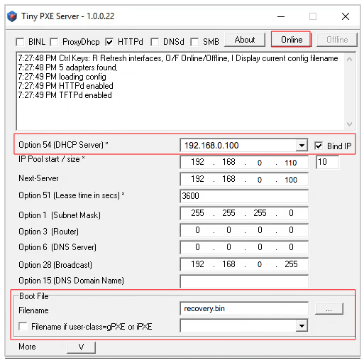

=================================
Installing AREDN |trade| Firmware
=================================

The steps for installing device firmware are documented on the AREDN |trade| website in the `Current Software <https://www.arednmesh.org/content/current-software>`_ section. Under the **Software** menu, select **Download** to reach the *Current Software* page.

There are two cases for installing AREDN |trade| firmware:

1. If you already have an existing version of AREDN |trade| running on your device, then you can use your computer's web interface to navigate to **Setup > Administration > Firmware Update** to install your new firmware. This process will be explained in more detail in the **Advanced Configuration** section of this guide.

----------

2. If you are installing AREDN |trade| firmware on a device for the first time, each hardware platform may require a unique procedure.

   .. image:: _images/firmware-install.png
      :alt: Firmware Install Connections
      :align: center

   The diagram above shows that your computer with the downloaded firmware image must be connected to the node using Ethernet cables in order to install the AREDN |trade| image. It is helpful to connect the computer and node through a simple Ethernet switch so that the switch can maintain the computer's link while the node is being rebooted.

   Different node hardware will require different methods for installing the AREDN |trade| firmware. For Ubiquiti devices, your computer's TFTP client will connect to the node's TFTP server in order to upload the firmware image. For TP-LINK and GL-iNET devices, your computer's web browser will connect to the node's web server to upload the firmware image. For Mikrotik devices, your computer will run a remote boot server and the node's remote boot client will load its boot image from your computer. Refer to the specific procedures below for your node hardware.

Ubiquiti First Install Process
------------------------------

**Ubiquiti** devices have a built-in `TFTP <https://en.wikipedia.org/wiki/Trivial_File_Transfer_Protocol>`_ server to which you can upload the AREDN |trade| *factory* image. Your computer must have TFTP client software available. Linux and Mac both have native TFTP clients, but you may need to enable or obtain a TFTP client for Windows computers. If you are using a Windows computer, `enable the TFTP client <https://www.trishtech.com/2014/10/enable-tftp-telnet-in-windows-10>`_ or download and install a `TFTP command line client <https://www.pcwdld.com/tftp-client-for-windows-7>`_.

Download the appropriate *factory* file for your device by following the instructions in the **Downloading AREDN Firmware** section of this documentation.

1. Set your computer’s Ethernet network adapter to a static IP address of 192.168.1.5 with a netmask of 255.255.255.0

2. Connect an Ethernet cable from your computer to the dumb switch, and another cable from the LAN port of the PoE adapter to the switch.

3. Put the Ubiquiti device into TFTP mode by holding the reset button while plugging your node's Ethernet cable into the POE port on the PoE adapter.

4. Continue holding the device's reset button for approximately 30 to 45 seconds until you see the LEDs on the node alternating in a 1-3, 2-4, 1-3, 2-4 pattern, then release the reset button.

5. Open a command window on your computer and execute the following commands to send the AREDN firmware to your device:

  >>>
  > tftp 192.168.1.20   [If your device is an AirRouter use 192.168.1.1]
  > bin                 [This puts the transfer in the required "binary" mode]
  > trace on            [This will show the transfer in progress]
  > put <full path to the AREDN firmware file>
          [For example, put c:\temp\aredn-3.19.3.0-ubnt-nano-m-xw-factory.bin]

  The TFTP client should indicate that data is being transferred and eventually completes.

6. Watch the LEDs for about 2-3 minutes until the node has finished rebooting. The reboot is completed when the LED 4 light (farthest on the right) is lit and is steady green.

7. Configure your computer’s Ethernet network interface to use DHCP for obtaining an IP address from the node.

8. After the node reboots, open a web browser and enter the following URL: ``http://localnode.local.mesh``

9. Navigate to the *Setup* page and configure the new “firstboot” node as described in the **Basic Radio Setup** section.

TP-LINK First Install Process
-----------------------------

Preferred Process
+++++++++++++++++

**TP-LINK** devices currently allow you to use the manufacturer's pre-installed *PharOS* web browser user interface to upload and apply new firmware images. This is the most user-friendly way to install AREDN |trade| firmware. Navigate to the *Setup* section to select and upload new firmware. Check the TP-LINK documentation for your device if you have questions about using their built-in user interface.

Alternate Process
+++++++++++++++++

TP-LINK devices also have a built-in :abbr:`TFTP (Trivial File Transfer Protocol)` and `Bootp <https://en.wikipedia.org/wiki/Bootstrap_Protocol>`_ client which allows them to obtain new firmware from an external source. Your computer must run a TFTP/Bootp server in order to provide firmware images to the node. In certain situations you may need to use this method to update the firmware or to restore a TP-LINK recovery file by following the steps below.

*Preparation*

1. Download the appropriate TP-LINK *factory* file and rename this file as ``recovery.bin``

2. Set your computer’s Ethernet network adapter to a static IP address of 192.168.0.100 with a netmask of 255.255.255.0

3. Connect an Ethernet cable from your computer to the dumb switch, and another cable from the LAN port of the PoE adapter to the switch.

*Linux Procedure*

1. Create a directory on your computer called ``/tftp`` and copy the TP-LINK ``recovery.bin`` file there.

2. Determine your computer’s Ethernet interface name with ``ifconfig``. It will be the interface you set to 192.168.0.100 above. You will use this interface name in the command below as the name after ``-i`` and you must substitute your login user name after ``-u`` below.

3. Become ``root`` and open a terminal window to execute the following dnsmasq command:

  >>>
  # dnsmasq -i eth0 -u joe --dhcp-range=192.168.0.150,192.168.0.200  \
    --dhcp-boot=recovery.bin --enable-tftp --tftp-root=/tftp/  \
    -d -p0 -K --log-dhcp --bootp-dynamic

4. With the PoE unit powered off, connect an Ethernet cable from the TP-LINK node to the POE port.

5. Push the reset button on the TP-LINK and hold it while powering on the PoE unit.  Continue to hold the reset button until you see output information from the computer window where you ran the dnsmasq command, which should happen after about 10 seconds.  Release the reset button as the computer starts communicating with the node.  When you see the "sent" message, this indicates success, and the TP-LINK node has downloaded the image and will reboot. You can now <ctrl>C or kill dnsmasq.

*Windows Procedure*

You will need `Tiny PXE <http://reboot.pro/files/file/303-tiny-pxe-server/>`_ software on your Windows computer. Download this software and extract it on your computer.

1. Navigate to the folder where you extracted the *Tiny PXE* software and edit the ``config.ini`` file.  Directly under the ``[dhcp]`` tag, add the following line:  ``rfc951=1`` then save and close the file.

2. Copy the ``recovery.bin`` firmware image into the ``files`` folder under the Tiny PXE server directory location.

3. Start the Tiny PXE server exe and select your Ethernet interface IP from the dropdown list called ``Option 54 [DHCP Server]``, making sure to check the ``Bind IP`` checkbox. Under the "Boot File" section, enter ``recovery.bin`` into the the *Filename* field, and uncheck the checkbox for "Filename if user-class = gPXE or iPXE". Click the *Online* button at the top of the Tiny PXE window.

4. With the PoE unit powered off, connect an Ethernet cable from the TP-LINK node to the POE port. Press and hold the reset button on the node while powering on the PoE unit.

5. Continue holding the reset button until you see ``TFTPd: DoReadFile: recovery.bin`` in the Tiny PXE log window.

6. Release the node’s reset button and click the *Offline* button in Tiny PXE.  You are finished using Tiny PXE when the firmware image has been read by the node.

*Final Configuration Steps*

1. Configure your computer’s Ethernet network interface to use DHCP for obtaining an IP address from the node.

2. After the node reboots, open a web browser and enter the following URL: ``http://localnode.local.mesh``

3. Navigate to the *Setup* page and configure the new “firstboot” node as described in the **Basic Radio Setup** section.

Mikrotik First Install Process
------------------------------

**Mikrotik** devices must be flashed using steps that are similar to the alternate TP-LINK process described above. Your computer must run a TFTP/Bootp server in order to provide firmware images to Mikrotik nodes. Mikrotik nodes require a **two-part install** process: First, install and boot the correct mikrotik-vmlinux-initramfs file with the **elf** extension, and then use the in-memory-only AREDN |trade| Administration UI to complete the installation of the appropriate mikrotik-rb file with the **bin** extension.

**Preparation**

1. Download the appropriate Mikrotik **elf** and **bin** files. Rename the *elf* file to ``rb.elf`` and keep the *bin* file available for later.

2. Set your computer’s Ethernet network adapter to a static IP address of 192.168.1.10 with a netmask of 255.255.255.0

3. Connect an Ethernet cable from your computer to the dumb switch, and another cable from the LAN port of the PoE adapter to the switch. If you are flashing a Mikrotik hAP ac lite device, connect the Ethernet cable from *Port 1* of the Mikrotik to the dumb switch.

**Linux Procedure**

1. Create a directory on your computer called ``/tftp`` and copy the ``rb.elf`` file there.

2. Determine your computer’s Ethernet interface name with ``ifconfig``. It will be the interface you set to 192.168.1.10 above. You will use this interface name in the command below as the name after ``-i`` and you must substitute your login user name after ``-u`` below.

3. Become ``root`` and open a terminal window to execute the following dnsmasq command:

  >>>
  # dnsmasq -i eth0 -u joe --dhcp-range=192.168.1.100,192.168.1.200  \
    --dhcp-boot=rb.elf --enable-tftp --tftp-root=/tftp/  \
    -d -p0 -K --log-dhcp --bootp-dynamic

4. With the PoE unit powered off, connect the Mikrotik node to the POE port. Press and hold the reset button on the Mikrotik while powering on the PoE unit or the hAP device.

5. Continue to hold the reset button until you see output information from the computer window where you ran the dnsmasq command, which should happen after about ten seconds. Release the reset button as the computer starts communicating with the node. When you see the "sent" message, this indicates success, and the node has downloaded the image and will reboot. You can now <ctrl>C or kill dnsmasq.

**Windows Procedure**

You will need `Tiny PXE <http://reboot.pro/files/file/303-tiny-pxe-server/>`_ software on your Windows computer. Download this software and extract it on your computer.

1. Navigate to the folder where you extracted the *Tiny PXE* software and edit the ``config.ini`` file.  Directly under the ``[dhcp]`` tag, add the following line:  ``rfc951=1`` then save and close the file.

2. Copy the ``rb.elf`` file into the ``files`` folder under the Tiny PXE server directory location.

3. Start the Tiny PXE server exe and select your Ethernet interface IP from the dropdown list called ``Option 54 [DHCP Server]``, making sure to check the ``Bind IP`` checkbox. Under the "Boot File" section, enter ``rb.elf`` into the the *Filename* field, and uncheck the checkbox for "Filename if user-class = gPXE or iPXE". Click the *Online* button at the top of the Tiny PXE window.

4. With the PoE unit powered off, connect the Mikrotik node to the POE port. If you are flashing a Mikrotik hAP ac lite device, connect the LAN cable from *Port 1* of the Mikrotik to the dumb switch.

5. Press and hold the reset button on the node while powering on the PoE unit or the device. Continue holding the reset button until you see ``TFTPd: DoReadFile: rb.elf`` in the Tiny PXE log window.

6. Release the node’s reset button and click the *Offline* button in Tiny PXE.  You are finished using Tiny PXE when the firmware image has been read by the node.

**Final Configuration Steps**

1. After booting the AREDN firmware image the node should have a default IP address of 192.168.1.1.  Change your computer’s Ethernet interface to DHCP mode to obtain an IP address from the node. For the hAP ac lite, pull the Ethernet cable from the WAN port (1) on the Mikrotik and insert it into one of the LAN ports (2,3,4). You should be able to ping the node at 192.168.1.1.  If this does not work, then something is wrong. Don't proceed until you can ping the node. You may need to disconnect and reconnect your computer's network cable to ensure that your IP address has been reset. Also, you may need to clear your web browser's cache in order to remove cached pages remaining from your node's previous firmware version.

2. In a web browser, open the node’s Administration page ``http://192.168.1.1/cgi-bin/admin`` (user = 'root' password = 'hsmm') and navigate to the *Setup > Administration > Firmware Update* section. Select the **bin** file you previously downloaded and click the *Upload* button.

   As an alternative to using the node's web interface, if your node has plenty of free memory you can copy the **bin** file to the node and run a command line program to install the image. This will allow you to see any error messages that are not displayed when using the web interface upgrade procedure. Execute the following commands from your computer:

   >>>
   my-computer:$ scp -P 2222 aredn-firmware-filename.bin root@192.168.1.1:/tmp
   my-computer:$ ssh -p 2222 root@192.168.1.1
   ~~~~~~~ after logging into the node with ssh ~~~~~~~
   node:# sysupgrade -n /tmp/aredn-firmware-filename.bin

3. After the node reboots, navigate to the node’s *Setup* page and configure the new “firstboot” node as described in the **Basic Radio Setup** section.

GL-iNET First Install Process
------------------------------

**GL-iNET** devices allow you to use the manufacturer's pre-installed *OpenWRT* web interface to upload and apply new firmware images. Check the GL-iNET documentation for your device if you have questions about initial configuration. Both GL-iNET and AREDN devices provide DHCP services, so you should be able to connect your computer and automatically receive an IP address on the correct subnet. GL-iNET devices have a default IP address of 192.168.8.1, so if for some reason you need to give your computer a static IP address you can use that subnet.

After the GL-iNET device has been booted and configured, navigate to the *Upgrade* section and click *Local Upgrade* to select the AREDN |trade| "sysupgrade.bin" file you downloaded for your device. Be sure to uncheck/deselect the "Keep Settings" checkbox, since GL-iNET settings are incompatible with AREDN. After the device has rebooted to the AREDN |trade| image, you should be able to navigate to ``http://192.168.1.1:8080`` for the firstboot or NOCALL page to appear.

If for some reason your GL-iNET device gets into an unusable state, you should be able to recover using the process documented here:
`GL-iNET debrick procedure <https://docs.gl-inet.com/en/2/troubleshooting/debrick/>`_

----------

Once your device is running AREDN |trade| firmware, you can display its web interface by connecting your computer to the LAN port on the :abbr:`PoE (Power over Ethernet)` and navigating to the following URL: ``http://localnode``. Each node will serve its web interface on both port 80 and 8080.

By default AREDN |trade| devices run the :abbr:`DHCP (Dynamic Host Control Protocol)` service on their LAN interface, so your computer will receive an IP address from the node as soon as it is connected with an Ethernet cable. Ensure that your computer is set to obtain its IP address via :abbr:`DHCP (Dynamic Host Control Protocol)`. You may also need to clear your web browser's cache in order to remove cached pages remaining from your node's previous firmware version.

.. |trade|  unicode:: U+00AE .. Registered Trademark SIGN
   :ltrim:
