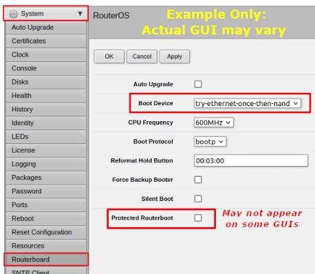

=================================
Installing AREDN® Firmware
=================================

The diagram below shows your computer with the downloaded firmware image connected to the node using Ethernet cables in order to install the AREDN® image. It is highly recommended that you connect the computer and node through a simple (dumb) Ethernet switch so that the switch can maintain the computer's network link even when the node is rebooting. Do *not* use a network router for this purpose -- only a dumb switch. This is not for the sake of the radio, but it allows your computer to maintain its Ethernet interface link even when the node reboots.

.. image:: _images/firmware-install.png
  :alt: Firmware Install Connections
  :align: center

Different radio hardware will require different methods for installing the AREDN® firmware.

- For **Ubiquiti** 802.11n devices, your computer's `TFTP <https://en.wikipedia.org/wiki/Trivial_File_Transfer_Protocol>`_ *client* will connect to the node's TFTP *server* in order to upload the firmware image. For Ubiquiti 802.11ac devices you will follow a separate procedure explained below.

- For **Mikrotik** and **TP-LINK** devices, your computer will run a `Preboot eXecution Environment (PXE) <https://en.wikipedia.org/wiki/Preboot_Execution_Environment>`_ and the node's remote boot *client* will download the boot image from your computer.

- For **GL-iNet** devices, your computer's web browser will connect to the node's web server to upload the firmware image. Refer to the specific procedures below for your node hardware.

In the *Firmware Tips* section of the **How-To Guide** you will find assistance if you experience an issue uploading firmware to your device. The **How-To Guide** also contains a *Virtual Machine Installs* section for help installing x86_64 firmware images on a VM for a virtualized node.

Preparing Your Computer
-----------------------

Setting a Static IP Address on your Computer
  For all of the device models discussed below you will be asked to set a static IP address on your computer as part of the install process. Various computer operating systems have different ways of accomplishing this, so you should check your computer manuals, publications, and online resources to walk you through the steps for your specific computer.

  As mentioned above, AREDN® recommends that you connect your computer to the node through an intermediate network switch. This allows your computer to activate its Ethernet interface with the static IP address even when the node is not powered on. Since node hardware needs to be powered on/off or rebooted during the install process, the network switch will keep your computer's network interface active on its static IP address.

  If you choose not to use an intermediate network switch, then you will be responsible for making sure your computer maintains an active interface with the static IP address. You may need to power on the node temporarily in order for your computer to bring up its interface, but then immediately power off the node in order to follow the installation instructions for your model. Having an intermediate network switch eliminates these steps.

Depending on your computer operating system you may not have various command line tools available on your computer. The required tools are native to both Linux and MacOS computers. For Windows computers you may need to enable specific features or install appropriate programs as noted below.

For Ubiquiti 802.11n Installs
  Your computer should have `TFTP <https://en.wikipedia.org/wiki/Trivial_File_Transfer_Protocol>`_ *client* software available. If you have a Windows computer, use a web search engine to find information for your specific operating system (for example search "tftp client for windows"). There is a wealth of information available online for configuring your Windows computer with a TFTP client program.

  - `Example 1 <https://www.thewindowsclub.com/enable-tftp-windows-10>`_
  - `Example 2 <https://www.sysprobs.com/install-test-tftp-client-on-windows-10>`_

For Ubiquiti 802.11ac Installs
  Your computer should have `ssh <https://en.wikipedia.org/wiki/Secure_Shell>`_ and `scp <https://en.wikipedia.org/wiki/Secure_copy_protocol>`_ software available. *Ssh* and *scp* are native to both Linux and MacOS. The OpenSSH package (which contains both commands) can be enabled on Windows computers. Use a web search engine to find information for your specific operating system (for example search "openssh for windows"). Here are some examples for enabling OpenSSH on Windows computers:

  - `Example for Windows 10 <https://learn.microsoft.com/en-us/windows-server/administration/openssh/openssh_install_firstuse?tabs=gui>`_
  - `Example for Windows 11 <https://technoresult.com/how-to-install-and-use-openssh-server-in-windows-11/>`_
  - `Example for Windows 7 & 8 <https://linuxbsdos.com/2015/01/17/how-to-install-the-latest-openssh-on-windows-7-and-windows-8/>`_

  On Windows computers you may also use programs such as `PuTTY <https://www.chiark.greenend.org.uk/~sgtatham/putty/>`_ and `WinSCP <https://winscp.net>`_ to connect to your device.

For Mikrotik and TP-LINK Installs
  These devices are programmed to download a boot image from an external source. Your computer will provide the `Preboot eXecution Environment (PXE) <https://en.wikipedia.org/wiki/Preboot_Execution_Environment>`_ which will give the node an IP address via `DHCP <https://en.wikipedia.org/wiki/Dynamic_Host_Configuration_Protocol>`_ as well as providing the firmware image via `TFTP <https://en.wikipedia.org/wiki/Trivial_File_Transfer_Protocol>`_.

  - If you have a Windows computer you must install and configure a PXE *server*. The examples below use *Tiny PXE* which can be downloaded from `erwan.labalec.fr <https://erwan.labalec.fr/tinypxeserver/>`_. There may be other alternative Windows programs that accomplish the same goal, such as `ERPXE <https://erpxe.com/>`_ or `Serva <https://www.vercot.com/~serva/>`_. For TP-LINK devices you may be able to run a simple TFTP server such as `Tftpd64 <https://pjo2.github.io/tftpd64/>`_ as explained in the TP-LINK section below.

  - If you have a Linux or MacOS computer, your "Preboot eXecution Environment (PXE)" will be provided by the native ``dnsmasq`` program, as described in the Linux procedures below.

Firmware First Install Checklists
---------------------------------

The recommended method for installing AREDN® firmware is to download and follow the appropriate *Install Checklist* below which matches your device hardware. Additional descriptions are also provided in the sections that follow.

:download:`GL.iNet First Install Checklist (PDF) <_images/GL.iNet_First_Install_Checklist.pdf>`

:download:`Mikrotik First Install Checklist (PDF) <_images/Mikrotik_First_Install_Checklist.pdf>`

:download:`TP-LINK First Install Checklist (PDF) <_images/TP-LINK_First_Install_Checklist.pdf>`

:download:`Ubiquiti N First Install Checklist (PDF) <_images/Ubiquiti_N_First_Install_Checklist.pdf>`

Ubiquiti 802.11n First Install Process
--------------------------------------

Download the *Install Checklist* for Ubiquiti 802.11n devices. These devices have a built-in `TFTP <https://en.wikipedia.org/wiki/Trivial_File_Transfer_Protocol>`_ *server* to which you can upload the AREDN® *factory* image. Your computer must have TFTP *client* software available. For more information, see the **Preparing Your Computer** section above.

Different TFTP client programs may have different command line options or flags that must be used, so be sure to study the command syntax for your TFTP client software. The example shown below may not include the specific options required by your client program.

Download the appropriate *factory* file for your device by following the instructions in the **Downloading AREDN® Firmware** section of this documentation.

1. Set your computer’s Ethernet network adapter to a static IP address that is a member of the correct subnet for your device. Check the documentation for your specific hardware to determine the correct network number. As in the example below, most Ubiquiti devices have a default IP address of 192.168.1.20, so you can give your computer a static IP on the 192.168.1.x network with a netmask of 255.255.255.0. For example, set your Ethernet adapter to a static IP address of 192.168.1.10. You can choose any number for the fourth octet, as long as it is not the same as the IP address of the node. Of course you must also avoid using 192.168.1.0 and 192.168.1.255, which are reserved addresses that identify the network itself and the broadcast address for that network. Other devices may have different default IP addresses or subnets, so select a static IP for your computer which puts it on the same subnet but does not conflict with the default IP of the device.

2. Connect an Ethernet cable from your computer to the dumb switch, and another cable from the LAN port of the PoE adapter to the switch.

3. Put the Ubiquiti device into TFTP mode by holding the reset button while plugging your node's Ethernet cable into the *POE* port on the PoE adapter. Continue holding the device's reset button for approximately 30 to 45 seconds until you see the LEDs on the node alternating in a 1-3, 2-4, 1-3, 2-4 pattern, then release the reset button.

4. Open a command window on your computer and execute a file transfer command to send the AREDN® firmware to your device. Target the default IP address of your Ubiquiti node, such as 192.168.1.20 (or 192.168.1.1 for AirRouters). The TFTP client should indicate that data is being transferred and eventually completes. The following is one example of TFTP commands that transfer the firmware image to a node:

::

  [Linux/Mac]
  > tftp 192.168.1.20
  > bin                 [Transfer in "binary" mode]
  > trace on            [Show the transfer in progress]
  > put <full path to the firmware file>
    [For example, put /tmp/aredn-<release>-factory.bin]
  -----------------------------------
  [Windows with command on a single line]
  > tftp.exe -i 192.168.1.20 put C:\temp\aredn-<release>-factory.bin

5. The node will now automatically reboot with the new AREDN® firmware image.

Ubiquiti 802.11ac First Install Process
---------------------------------------

*Contributor: Tim Wilkinson KN6PLV*

.. attention:: The install process for these devices requires detailed steps that are best followed using the procedure below, so no separate *Install Checklist* is provided for Ubiquiti 802.11ac devices.

Prerequisites
  The installing computer must be capable of connecting to the command line of the target device. This will require that the computer support both the *ssh* and *scp* protocols. *SSH* and *scp* are native to both Linux and MacOS. The OpenSSH package (which contains both commands) can be enabled on Windows computers. For more information, see the **Preparing Your Computer** section above.

Step 1: Preparing the device
  Before you install AREDN® firmware on a Ubiquiti 802.11ac device, you must first make sure it is running a specific version of the standard Ubiquiti AirOS software. This procedure will not work if the device is running any other version. Fortunately you can upgrade or downgrade the standard Ubiquiti software.

  As described in the first paragraphs of this document, it is best to connect your computer to the device using a simple Ethernet switch so that your computer's network interface remains unaffected by reboots on the radio. The IP address for a new Ubiquiti device is 192.168.1.20. Set the IP address of your computer to 192.168.1.10 and, when the device is powered up, enter 192.168.1.20 in a web browser. For a brand new device you’ll be asked to select your country and agree to the EULA. Then click *Continue*. Next you will be prompted to create a user account and password on the radio. You can enter the username ``admin`` and the password ``admin!23`` (for example) and then click *Save*. Make a note of this username and password because you will use it in the following steps.

  You should now see the main Dashboard view in AirOS. On the left, click the *Gear* icon. This will take you to the System page. At the top of this page you will find the radio's current firmware version. For example, it might read ``FIRMWARE VERSION XC.V8.7.1``. If the firmware version shows either **XC.V8.7.0** or **WA.V8.7.0** then you have the correct AirOS software and can move on to **Step 2**.

  But if you see any version other than 8.7.0 you must upload new firmware to the device. You will need to download the correct firmware to your installing computer. The firmware can be found here:

  - `WA: https://dl.ubnt.com/firmwares/XC-fw/v8.7.0/WA.v8.7.0.42152.200203.1256.bin <https://dl.ubnt.com/firmwares/XC-fw/v8.7.0/WA.v8.7.0.42152.200203.1256.bin>`_

  - `XC: https://dl.ubnt.com/firmwares/XC-fw/v8.7.0/XC.v8.7.0.42152.200203.1256.bin <https://dl.ubnt.com/firmwares/XC-fw/v8.7.0/XC.v8.7.0.42152.200203.1256.bin>`_

  Select the firmware appropriate for your device. If the radio's current firmware starts with *WA* download that version. If it starts *XC* download that version.

  On the top right of the System page you will see “UPLOAD FIRMWARE” and UPLOAD in blue. Clicking the blue UPLOAD text will open a dialog and let you select the **8.7.0** firmware you downloaded to your computer. Now that firmware will be uploaded to the device. Once completed a dialog in the top right will be displayed allowing you to either UPDATE or DISCARD the newly uploaded firmware. Click *UPDATE*. The upgrade process will now start. Do **not** unplug the device until this step is completed.

  Once the upgrade has been completed, the device will return you to the login page. Log in using the username and password you created earlier (``admin`` / ``admin!23``). Once again you will see the System page and if everything has been successful, the firmware version will now read either WA.V8.7.0 or XC.V8.7.0 and you can move to **Step 2**.

  .. attention:: The upgrade can fail on newer hardware which requires **8.7.4** firmware. This problem has only been observed and tested on newer LiteBeam 5AC devices. For these devices, follow the same firmware downgrade procedure but use the following firmware instead:

    - `WA: https://dl.ubnt.com/firmwares/XC-fw/v8.7.4/WA.v8.7.4.45112.210415.1103.bin <https://dl.ubnt.com/firmwares/XC-fw/v8.7.4/WA.v8.7.4.45112.210415.1103.bin>`_

    The rest of the process remains unchanged, so once the downgrade is successful you can move to **Step 2**.

Step 2: Copy the AREDN® firmware to the device
  Before you can install AREDN® firmware on the device, you first need to put the AREDN® image in the device’s ``/tmp`` directory. Note that each 802.11ac model will have a *different* AREDN® image name, as opposed to past releases where one AREDN® image supported multiple models. Be sure to download the correct firmware image from the AREDN® download site. On your computer, open a terminal session (“CMD” in windows). Copy the firmware to the device using the scp command with the username and password you created in **Step 1**. The example command below shows the placeholder ``<aredn-image-factory.bin>`` for the firmware filename, but be sure to replace this with the actual filename of the firmware you are installing.

  ::

    scp <aredn-image-factory.bin> admin@192.168.1.20:/tmp/factory.bin

  If you see the error “Unable to negotiate” it means that the SCP program you are using on your computer does not support the default security key type being used on the device. You should refer to the documentation for that SCP program to resolve the issue. You can try the following:

  ::

    scp -oHostKeyAlgorithms=+ssh-rsa -oPubkeyAcceptedAlgorithms=+ssh-rsa <aredn-image-factory.bin> admin@192.168.1.20:/tmp/factory.bin

  If you see an error “sftp-server: not found” you can try the following:

  ::

    scp -O -oHostKeyAlgorithms=+ssh-rsa -oPubkeyAcceptedAlgorithms=+ssh-rsa <aredn-image-factory.bin> admin@192.168.1.20:/tmp/factory.bin

  If you see an error “Remote host identification has changed” you can try the following:

  ::

    scp -O -oHostKeyAlgorithms=+ssh-rsa -oPubkeyAcceptedAlgorithms=+ssh-rsa -oUserKnownHostsFile=/dev/null -oStrictHostKeyChecking=no <aredn-image-factory.bin> admin@192.168.1.20:/tmp/factory.bin

  Once this is successful, the AREDN® firmware will be in ``/tmp`` on the device waiting to be installed.

Step3: Install the firmware
  The installation procedure requires you to **ssh** to the command line of the device. On your computer, open a terminal session (“CMD” in windows). Type or copy/paste the following command:

  ::

    ssh admin@192.168.1.20

  If you see the error “Unable to negotiate” please try the following:

  ::

    ssh -oHostKeyAlgorithms=+ssh-rsa -oPubkeyAcceptedAlgorithms=+ssh-rsa admin@192.168.1.20

  If you see an error “Remote host identification has changed” you can try the following:

  ::

    ssh -oHostKeyAlgorithms=+ssh-rsa -oPubkeyAcceptedAlgorithms=+ssh-rsa -oUserKnownHostsFile=/dev/null -oStrictHostKeyChecking=no admin@192.168.1.20

  You will be asked for the password created in **Step 1** (for example, admin!23) and once entered you will be logged into the device and shown the shell prompt.

  To install the AREDN® firmware you first need to create a program to do this. Ubiquiti devices expect signed firmware but AREDN® is not signed, so we need to bypass the checking process. To do this type or copy/paste the following two commands:

  ::

    hexdump -Cv /bin/ubntbox | sed 's/14 40 fe 27/00 00 00 00/g' | hexdump -R > /tmp/fwupdate.real

    chmod +x /tmp/fwupdate.real

  These commands take the standard Ubiquiti program used for flashing new firmware and change a few bytes to create our own version with the signature checking code disabled. The first command can take a little while to complete but when successful will return you to the shell prompt.

  Finally flash the AREDN® firmware by typing:

  ::

    /tmp/fwupdate.real -m /tmp/factory.bin

  Do **not** unplug the device until the flashing process is complete and the device has rebooted. The device will install the AREDN® image, boot into it, and end up on IP address 192.168.1.1 as a normal AREDN® device. If you cannot connect to the device on its new IP address after five minutes, power cycle the device and try connecting to 192.168.1.1 again. You can then configure the device by following the steps in the **Basic Radio Setup** section of the documentation.

Mikrotik First Install Process
------------------------------

Download the *Install Checklist* for Mikrotik devices. These devices require a **two-part install** process: First, boot the correct Mikrotik *initramfs-kernel* file, and then use that temporary AREDN® environment to complete the installation of the appropriate *sysupgrade* file.

Mikrotik devices have a built-in `PXE <https://en.wikipedia.org/wiki/Preboot_Execution_Environment>`_ *client* which allows them to download a boot image from an external source. See the **Preparing Your Computer** section above for an explanation. The Windows example below uses *Tiny PXE*, while the Linux example uses the native ``dnsmasq`` program.

For Mikrotik devices you will use what is called *Etherboot* mode, and there are several ways to put your device into *Etherboot* mode (depending on the version of the manufacturer's firmware it is running). The easiest way is to use the device's reset button as described in the procedure below. If for some reason this does not work, then you can try logging into the Mikrotik RouterOS and setting *System > Routerboard > Settings > Boot Device* to ``try-ethernet-once-then-nand`` (either through the RouterOS web interface or via command line). Next time the device boots it will try *Etherboot* once before defaulting back to regular boot mode.

If your Mikrotik device has "Protected Routerboot" enabled, then you will need to disable it before proceeding. Use the manufacturer's instructions to connect to your device and display the RouterOS web interface or command line. Navigate to *System > Routerboard > Settings > Boot Device* to uncheck or deselect ``Protected Routerboot``. Click the *Apply* button, then you should be able to power down the device and continue with the steps in the AREDN® firmware install checklist.

Install Preparation
  - Download *both* of the appropriate Mikrotik *kernel* and *sysupgrade* files from the AREDN® website. Rename the *initramfs-kernel* file to ``rb.elf`` and keep the *sysupgrade* **bin** file available for later.

  - Set your computer’s Ethernet network adapter to a static IP address on the subnet you will be using for the new device. This can be any network number of your choice, but it is recommended that you use the 192.168.1.x subnet. Using the 192.168.1.x network on your server will avoid having to change IP addresses on your computer during the install process. AREDN® firmware uses the 192.168.1.x network once it is loaded, so using it all the way through the process will simplify things for you. For example, you can give your computer a static IP such as 192.168.1.10 with a netmask of 255.255.255.0. You can choose any number for the fourth octet, as long as it is *not* within the range of DHCP addresses you will be providing as shown below.

  - Connect an Ethernet cable from your computer to the network switch as described at the top of this document, then connect another cable from the LAN port of the PoE adapter to the switch. Finally connect an Ethernet cable from the *POE* port to the node, but leave the device powered off for now. If you are flashing a device which uses a separate power adapter (such as a *Mikrotik hAP ac* family device), connect the last Ethernet cable from the switch to the device's WAN port [1].

Linux Procedure
  If you are using a Linux or MacOS computer, use the following steps.

  1. Create a directory on your computer called ``/tftp`` and copy the ``rb.elf`` file there.

  2. Determine your computer’s Ethernet *interface name* with ``ifconfig``. It will be the interface you set to 192.168.1.10 above. You will use this interface name in the command below as the name after ``-i`` and you must substitute your login user name after ``-u`` below. Use a ``dhcp-range`` of IP addresses that are also on the same subnet as the computer: for example 192.168.1.100,192.168.1.200 as shown below.

  3. Open a terminal window to execute the following dnsmasq command with escalated privileges:

  ::

    > sudo dnsmasq -i eth0 -u joe --log-dhcp --bootp-dynamic --dhcp-range=192.168.1.100,192.168.1.200 -d -p0 -K --dhcp-boot=rb.elf --enable-tftp --tftp-root=/tftp/

  4. With the unit powered off, press and hold the reset button on the radio while powering on the device. Continue to hold the reset button until you see output information from the computer window where you ran the dnsmasq command, which should happen after 20-30 seconds. Release the reset button when you see the "sent" message, which indicates success, and you can now <ctrl>-C or end dnsmasq.

  5. The node will now automatically reboot with the temporary AREDN® Administration image.

Windows Procedure
  If you are using a Windows computer, use the following steps.

  Configure the PXE Server on your Windows computer. The example below uses *Tiny PXE*. For more information, see the **Preparing Your Computer** section above.

  1. Navigate to the folder where you extracted the *Tiny PXE* software and edit the ``config.ini`` file.  Directly under the ``[dhcp]`` tag, add the following line: ``rfc951=1`` then save and close the file.

  2. Copy the ``rb.elf`` file into the ``files`` folder under the *Tiny PXE* server directory location.

  3. Start the *Tiny PXE* server exe and select your computer's Ethernet IP address from the dropdown list called ``Option 54 [DHCP Server]``, making sure to check the ``Bind IP`` checkbox. Under the "Boot File" section, enter ``rb.elf`` into the the *Filename* field, and uncheck the checkbox for "Filename if user-class = gPXE or iPXE". Click the *Online* button at the top of the *Tiny PXE* window.

  .. image:: _images/tiny-pxe-mik.png
    :alt: Tiny PXE Display for Mikrotik
    :align: center

  4. With the unit powered off, press and hold the reset button on the node while powering on the device. Continue holding the reset button until you see ``TFTPd: DoReadFile: rb.elf`` in the *Tiny PXE* log window.

  5. Release the node’s reset button and wait for the image to be transferred to the device. You are finished using *Tiny PXE* when the firmware image has been read by the node, so you can click the *Offline* button in *Tiny PXE*.

  6. The node will now automatically reboot with the temporary AREDN® Administration image.

  .. tip:: If you have followed the install procedure above but your Mikrotik device does not boot the AREDN® *initramfs-kernel* file, you may be able to try the procedure on this page (`OpenWRT - downgrading RouterOS <https://openwrt.org/toh/mikrotik/common#downgrading_routeros>`_) to downgrade Mikrotik RouterOS prior to flashing the AREDN® firmware. You can find earlier versions in the `Mikrotik Download Archive <https://mikrotik.com/download/archive>`_. Download the ARM version (routeros-arm) for devices that use the *ipq40xx* AREDN® firmware, or download the MIPSBE version (routeros-mipsbe) for other Mikrotik devices. You need to download a RouterOS version that is equal or newer than the RouterOS version shown in the *Factory Firmware* field on your device.

Install the *sysupgrade* Firmware Image
  1. After booting the **elf** image the node will have a default IP address of 192.168.1.1. Your computer should already have a static IP address on this subnet, but if not then give your computer an IP address on this subnet.

  .. warning:: **For the Mikrotik hAP ac family of devices, disconnect the Ethernet cable from the WAN port (1) on the Mikrotik and insert it into one of the LAN ports (2,3,4) before you proceed.**

  2. You should be able to ping the node at 192.168.1.1. Don't proceed until you can ping the node. You may need to disconnect and reconnect your computer's network cable to ensure that your IP address has been reset. Also, you may need to clear your web browser's cache in order to remove cached pages remaining from your node's previous firmware version.

  3. NEED TO UPDATE THIS SECTION FOR THE NEWUI <<< In a web browser, open the node’s Administration page ``http://192.168.1.1/cgi-bin/admin`` (user = 'root', password = 'hsmm') and immediately navigate to the *Firmware Update* section. Browse to find the *sysupgrade* **bin** file you previously downloaded to your computer, select it, and click the *Upload* button.

  As an alternative to using the node's web interface, you can manually copy the *sysupgrade* **bin** file to the node and run a command line program to install the firmware. This will allow you to see any error messages that may not appear when using the web interface. Note that devices running AREDN® firmware images use port 2222 for secure copy/shell access.

  Execute the following commands from a Linux computer:

  ::

    my-computer:$ scp -P 2222 <aredn-firmware-filename>.bin root@192.168.1.1:/tmp
    my-computer:$ ssh -p 2222 root@192.168.1.1
    ~~~~~~~ after logging into the node with ssh ~~~~~~~
    node:# sysupgrade -n /tmp/<aredn-firmware-filename>.bin

  To transfer the image from a Windows computer you can use a *Secure Copy* program such as *WinSCP*. Then use a terminal program such as *PuTTY* to connect to the node via ssh or telnet in order to run the sysupgrade command shown as the last line above.

  The node will now automatically reboot with the new AREDN® firmware image.

TP-LINK First Install Process
-----------------------------

Download the *Install Checklist* for TP-LINK devices. These devices may allow you to use the manufacturer's native *PharOS* web browser interface to apply new firmware images. If available, this is the most user-friendly way to install AREDN® firmware. Navigate to the system setup menu to select and upload new firmware. Check the TP-LINK documentation for your device if you have questions about using their built-in user interface. If this process works then you will have AREDN® firmware installed on your device and you skip all of the steps described below.

If the process above does not work or if you choose not to use the *PharOS* web interface, then you can install AREDN® firmware on your device using steps similar to those described above for Mikrotik devices. TP-LINK devices are programmed to use `TFTP <https://en.wikipedia.org/wiki/Trivial_File_Transfer_Protocol>`_ for downloading a boot image from an external source. If you already have a `PXE <https://en.wikipedia.org/wiki/Preboot_Execution_Environment>`_ *server* on your Windows computer then you can use that. The example below uses *Tiny PXE*. It may also be possible to use a simple TFTP server instead. For more information, see the **Preparing Your Computer** section above.

Install Preparation
  - Download the appropriate TP-LINK *factory* file and rename this file as ``recovery.bin``

  - Set your computer’s Ethernet network adapter to a static IP address of 192.168.0.100.

  - Connect an Ethernet cable from your computer to the network switch, and another cable from the LAN port of the PoE adapter to the switch. Finally connect an Ethernet cable from the *POE* port to the node, but leave the device powered off for now.

Linux Procedure
  1. Create a directory on your computer called ``/tftp`` and copy the TP-LINK ``recovery.bin`` file there.

  2. Determine your computer’s Ethernet interface name with ``ifconfig``. It will be the interface you set to 192.168.0.100 above. You will use this interface name in the command below as the name after ``-i`` and you must substitute your login user name after ``-u`` below. Use a ``dhcp-range`` of IP addresses that are also on the same subnet as the computer: for example 192.168.0.110,192.168.0.120 as shown below.

  3. Open a terminal window to execute the following dnsmasq command with escalated privileges:

  ::

    > sudo dnsmasq -i eth0 -u joe --log-dhcp --bootp-dynamic --dhcp-range=192.168.0.110,192.168.0.120 -d -p0 -K --dhcp-boot=recovery.bin --enable-tftp --tftp-root=/tftp/

  4. With the unit powered off, press and hold the reset button on the radio while powering on the device. Continue to hold the reset button until you see output information from the computer window where you ran the dnsmasq command, which should happen after 20-30 seconds. Release the reset button when you see the "sent" message, which indicates success, and you can now <ctrl>-C or end dnsmasq.

  5. The node will now automatically reboot with the new AREDN® firmware image.

Windows Procedure
  Configure the PXE or TFTP Server on your Windows computer. The example below uses *Tiny PXE*. For more information, see the **Preparing Your Computer** section above.

  1. Navigate to the folder where you extracted the *Tiny PXE* software and edit the ``config.ini`` file.  Directly under the ``[dhcp]`` tag, add the following line:  ``rfc951=1`` then save and close the file.

  2. Copy the ``recovery.bin`` firmware image into the ``files`` folder under the *Tiny PXE* server directory location.

  3. Start the *Tiny PXE* server exe and select your computer's Ethernet IP address from the dropdown list called ``Option 54 [DHCP Server]``, making sure to check the ``Bind IP`` checkbox. Under the "Boot File" section, enter ``recovery.bin`` into the the *Filename* field, and uncheck the checkbox for "Filename if user-class = gPXE or iPXE". Click the *Online* button at the top of the *Tiny PXE* window.

  .. image:: _images/tiny-pxe-tpl.png
    :alt: Tiny PXE Display for TP_LINK
    :align: center

  4. With the unit powered off, press and hold the reset button on the node while powering on the device. Continue holding the reset button until you see ``TFTPd: DoReadFile: recovery.bin`` in the *Tiny PXE* log window.

  5. Release the node’s reset button and wait for the image to be transferred to the device. You are finished using *Tiny PXE* when the firmware image has been read by the node, so you can click the *Offline* button in *Tiny PXE*.

  6. The node will now automatically reboot with the new AREDN® firmware image.

GL-iNet First Install Process
------------------------------

Download the *Install Checklist* for GL-iNet devices. These devices allow you to use the manufacturer's pre-installed *OpenWRT* web interface to upload and apply new firmware images. Check the GL-iNet documentation for your device if you have questions about initial configuration. Both GL-iNet and AREDN® devices provide DHCP services, so you should be able to connect your computer and automatically receive an IP address on the correct subnet. GL-iNet devices usually have a default IP address of 192.168.8.1, so if for some reason you need to give your computer a static IP address you can use that subnet.

After the GL-iNet device is first booted and configured, navigate to the **Upgrade** section and click *Local Upgrade* to select the AREDN® *sysupgrade.bin* file you downloaded for your device.

.. warning:: Be sure to **uncheck** the *Keep Settings* checkbox, since GL.iNet settings are incompatible with AREDN® firmware. Also, the AR300M16 devices may have a *boot_dev* switch, so be sure to read the `GL.iNet boot documentation <https://docs.gl-inet.com/router/en/3/specification/gl-ar300m/#control-which-firmware-you-are-booting-into>`_ to select the correct boot mode.

The node will automatically reboot with the new AREDN® firmware image. If for some reason your GL-iNet device gets into an unusable state, you should be able to recover using the process documented here:
`GL-iNet debrick procedure <https://docs.gl-inet.com/en/3/tutorials/debrick/>`_

After the Firmware Install
--------------------------

After the node reboots, it should have a default IP address of 192.168.1.1. Make sure your computer has an IP address on the 192.168.1.x network. You should be able to ping the node at 192.168.1.1. Don't proceed until you can ping the node. You may need to disconnect and reconnect your computer's network cable to ensure that it has a connection.

Once your device is running AREDN® firmware, you can display its web interface by navigating to either ``http://192.168.1.1`` or ``http://localnode.local.mesh``.  Some computers may have DNS search paths configured that require you to use the `fully qualified domain name (FQDN) <https://en.wikipedia.org/wiki/Fully_qualified_domain_name>`_ to resolve *localnode* to the mesh node's IP address. You may need to clear your web browser's cache in order to remove any cached pages.

You can use your web browser to configure the new node with your callsign, admin password, and other settings as described in the **Firstboot Node Setup** section of the documentation.

Node Reset button actions
-------------------------

The reset button on an AREDN® node has two built-in functions based on the length of time the button is pressed. This may be helpful if you need to recover a lost *admin* password, or if you want to reconfigure you node by starting with a fresh "just flashed" state.

With the node powered on and fully booted:

- To reset only the node admin password and DHCP service, hold the reset button for **5 seconds**. The default *admin* password is ``hsmm``.

- To reset a node to "firstboot" state, hold the reset button for **15 seconds**.

On some equipment models it may be possible to accomplish these reset procedures by pressing the *Reset* button on the PoE unit.
