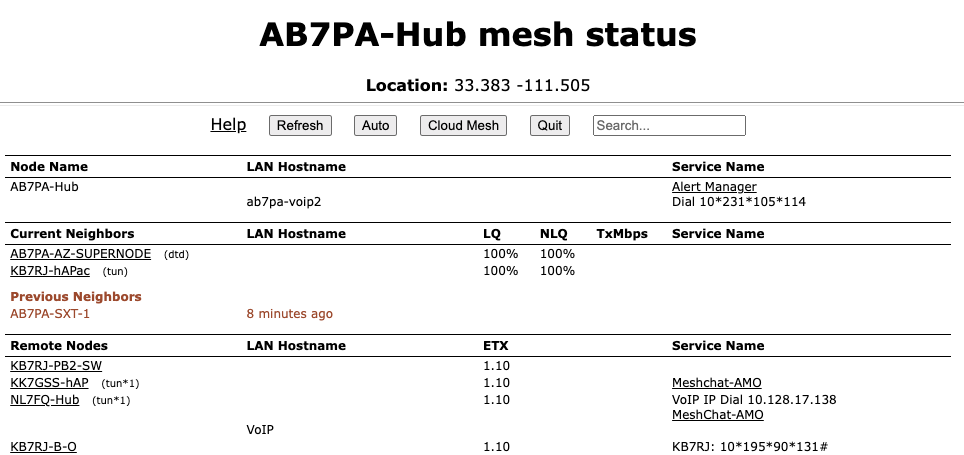

===================
Mesh Status Display
===================

The **Mesh Status** page lists mesh nodes, link quality information, and the advertised services on the mesh network.

----------

----------

Below the node name bar there are several controls.

Refresh
  This button refreshes the **Mesh Status** display with current information.

Auto
  This button sets the display to automatically refresh the node information every 10 seconds. To end auto-refresh mode, click **Stop** or **Quit**. **Stop** returns to the static *Mesh Status* display. **Quit** takes you back to the *Node Status* display, and clicking *Mesh Status* again from there will return you to auto-refresh mode on the *Mesh Status* display.

Quit
  This button returns you to the *Node Status* display.

Mesh Status Display Sections
^^^^^^^^^^^^^^^^^^^^^^^^^^^^

There are four sections on the **Mesh Status** display.

Local Hosts
  This shows your mesh node along with any connected hosts and the advertised services available on your node and hosts. Typically you may click the service name to open a new browser tab containing the features of that service. This will be true for any available services in the *Current Neighbors* or *Remote Nodes* sections.

  If you have any hosts for which you selected *Do Not Propagate* in the **DHCP Reservations List**, those hosts will be displayed in a light gray color only on that node's *Local Hosts* column. If you created any **DNS Aliases** for your hosts, those aliases will be displayed in a light orange color only on that node's *Local Hosts* column. All other hosts will be displayed in the default color for the theme that you are using.

Current Neighbors
  This shows a list of *Neighbor Nodes* that are directly connected with your node (1 hop). These nodes may be connected via :abbr:`RF (Radio Frequency)`, :abbr:`DtD (Device to Device)` link using an Ethernet cable, or a tunnel over an Internet connection. There are several link quality statistics displayed for each connected node.

  - ``LQ`` or Link Quality is your node's view of the percent of `OLSR (Optimized Link State Routing protocol) <https://en.wikipedia.org/wiki/Optimized_Link_State_Routing_Protocol>`_ packets received from the neighbor node. These packets exchange mesh routing and advertised services information, and they include a sequence number that is used to identify missing packets which is a measure of the quality of the link.

  - ``NLQ`` or Neighbor Link Quality is the neighbor node's view of the percent of :abbr:`OLSR (Optimized Link State Routing protocol)` packets received from your node. This measures the quality of the link from the neighbor's side.

  - ``TxMbps`` or Transmit Megabits per Second is a calculated estimate of the data rate achieved across the link with the neighbor node. This column may show zero if the data being transmitted between these nodes is not sufficient for the metric to be calculated.

  - ``Services`` is the column where any available services on the neighbor node will be displayed. You may click on the service link to navigate to the webpage for that service on the neighbor node.

  In addition to the neighbor node name, there may be a text abbreviation in parentheses that tells how the neighbor node is connected.

  - ``(dtd)`` indicates a *Device to Device* connection using an Ethernet cable between the nodes. The neighbor may be listed twice if both an :abbr:`RF (Radio Frequency)` and :abbr:`DtD (Device to Device)` path exist.

  - ``(tun)`` indicates the path to the neighbor node is over an Internet tunnel. ``(tun*?)`` next to a mesh node in the *Remote Nodes* column indicates the node has tunnel links over the Internet to connect mesh islands together. ``?`` is a number indicating the number of tunnel connections on that node.

  - ``(wan)`` indicates the node has been configured as a *Mesh Gateway*. Typically this is a gateway to the Internet, but it may also be to another isolated network.

Remote Nodes
  This section lists other nodes on the network that are two or more hops away. Advertised services on nodes and their attached hosts are also listed. Remote Nodes are sorted by their ``ETX`` or *Expected Transmission* metric. :abbr:`ETX (Expected TX metric)` is a calculated estimate of the number of :abbr:`OLSR (Optimized Link State Routing protocol)` packets that must be sent in order to receive a round trip acknowledgement, and it is often referred to as "link cost". When sending data the :abbr:`OLSR (Optimized Link State Routing)` protocol selects the least cost route based on the lowest :abbr:`ETX (Expected TX metric)` path in the direction of the final destination.

Previous Nodes
  This section lists any nodes which were recently connected to your node but are not currently connected. It shows the node name or IP address, as well as how long it has been since a node was actively connected to your node.
