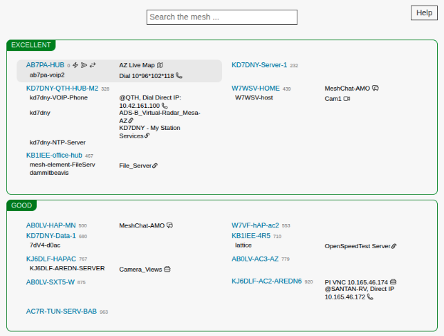
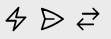

===================
Mesh Status Display
===================

|icon1| You navigate to the **mesh status** page by clicking the mesh icon in the left nav bar.

At the top of this page there is a search box which allows you to filter the mesh network display to include only those nodes, devices, and services which match the keywords you enter. As you type each character from your keyboard into the search field, the display will change to show only the entries that match your search string. The filter is case insensitive, so it will find both uppercase and lowercase entries for the characters you enter. To restore the original display, delete your search characters or refresh the page in the web browser. To the right of the search field there is a ``Help`` button which explains the use of the **mesh status** page.

The **mesh status** page is divided into several groups of devices based on the link quality. The top groups are more likely to be reachable by your node than are the devices in groups toward the bottom of the page.

Within each group the nodes are displayed side by side in two columns. The node in the upper left will have the best link quality, followed by the next best node to its right, then continuing down each row of the display. Hovering the cursor over the left or right column will display a gray background, making it easy to see which node you are focused on. Clicking the node name will navigate to the node status display of that node. Each node will show the node name followed by a number that represents the route cost to that node, with lower numbers representing better links. Nodes are put into groups based on their route cost.

When you are logged into your node, three icons are displayed to the right of a selected node name. The first will open the ``ping`` tool which provides network latency metrics. The second opens the ``traceroute`` tool which displays the network nodes traversed between two devices. The third opens the ``iperf3`` tool which provides network throughput metrics. Each of these tools is discussed in the *Tools* section of the **Node Admin** guide.

The **mesh status** display shows each node, any connected :abbr:`LAN (Local Area Network)` devices, and any advertised services available on the node or its hosts. Small icons appear to the right of each service which indicate the type of service, with the definition of these service types described in the *Local Services* section of the **Node Admin** guide. You can click any available web links to navigate to the nodes or services shown on the **mesh status** display.

