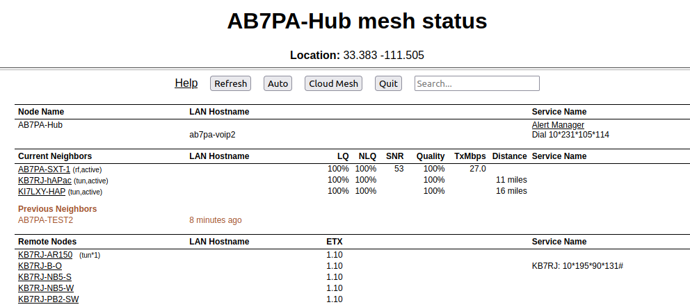

===================
Mesh Status Display
===================

The **Mesh Status** page lists mesh nodes and link quality information, along with any LAN hosts and advertised services available on the network. Below the node name bar there are several controls.

- The **Refresh** button refreshes the *Mesh Status* display with current information.

- The **Auto** button sets the display to automatically refresh the node information every 10 seconds. To end auto-refresh mode, click **Stop** or **Quit**. *Stop* returns to the static *Mesh Status* display. *Quit* takes you back to the *Node Status* display, but clicking *Mesh Status* again from there will return you to auto-refresh mode on the *Mesh Status* display.

- The **Cloud Mesh** button allows you to navigate to the *Mesh Status* display of the closest Supernode available to your device. Supernodes are a way to link multiple mesh island networks in a safe and efficient way. If your local node is part of a network with a Supernode, then you have the ability to view other nodes which are part of the Cloud Mesh network even if your local mesh is not otherwise linked to those networks. For further information see the *Supernode Architecture* description in the **Network Topologies** section of the **Network Design Guide**.

- The **Quit** button returns you to the *Node Status* display.

- The **Search** field allows you to filter the *Mesh Status* display by any keywords of your choice. The display will be limited to showing only nodes which match the keywords you enter. As you type each character from your keyboard into the search fields, the display will change to show only the entries that match your character or string. The filter is case insensitive, so it will find both upper and lower case entries for the characters you enter. If you press the **Refresh** button on the *Mesh Status* display, the search field will be cleared.

Mesh Status Display Sections
^^^^^^^^^^^^^^^^^^^^^^^^^^^^

|

Node Name
  This shows your node as well as any connected LAN hosts and the advertised services available on your node and hosts. You can click any available web links to navigate to the services on your node or LAN hosts. This will be true for any available services in the *Current Neighbors* or *Remote Nodes* sections, too. Each node will be highlighted as you hover your cursor over it. This gives a visual indicator for any column entries that are part of the row over which you are hovering.

  If you have any hosts for which you selected *Do Not Propagate* in the **DHCP Reservations List**, those hosts will be displayed in a light gray color only on your node's *LAN Hostname* column. If you created any **DNS Aliases** for your hosts, those aliases will be displayed in a light orange color only on your node's *LAN Hostname* column. All other hosts will be displayed in the default color for the theme that you are using.

Current Neighbors
  This shows a list of *Neighbor Nodes* that are directly linked with your node, meaning they are only one network "hop" distant. These nodes may be connected via :abbr:`RF (Radio Frequency)`, :abbr:`DtD (Device to Device)` link, or a tunnel over an Internet connection. It also shows any LAN hosts on your current neighbors as well as any advertised services available on those nodes and hosts.

  There are several link quality statistics displayed for each connected node.

  - ``LQ`` or Link Quality is your node's view of the percent of `OLSR (Optimized Link State Routing protocol) <https://en.wikipedia.org/wiki/Optimized_Link_State_Routing_Protocol>`_ packets received from the neighbor node. These packets exchange mesh routing and advertised services information, and they include a sequence number that is used to identify missing packets. For example, if 7 of 10 packets sent by the neighbor were received, then the probability for a successful packet transmission from this neighbor is 7/10 = 0.7 = 70%. Be aware that the *Quality* metric on the *Neighbor Status* display is calculated differently, so there may not be a perfect alignment when comparing the two quality metrics.

  - ``NLQ`` or Neighbor Link Quality is the neighbor node's view of the percent of :abbr:`OLSR (Optimized Link State Routing protocol)` packets received from your node. This indicates the quality of the link from the neighbor's side.

  - ``TxMbps`` or Transmit Megabits per Second is an estimate of the data rate achieved across any :abbr:`RF (Radio Frequency)` link with a neighbor node. This column may show zero if the data being transmitted between these nodes is not sufficient for the metric to be calculated.

  - ``Service Name`` is the column which displays any available services on the neighbor node or its LAN hosts. You can click on service links to navigate to the webpage for those services.

  In addition to the neighbor node name, there may be a text abbreviation in parentheses that tells how the neighbor node is connected.

  - ``(dtd)`` indicates a *Device to Device* connection (typically using an Ethernet cable) between the nodes.

  - ``(xlink)`` indicates a connection between the nodes that traverses cross-linked devices.

  - ``(tun)`` indicates the path to the neighbor node is over an Internet tunnel. ``(tun*?)`` next to a mesh node in the *Remote Nodes* column indicates the node has tunnel links over the Internet to connect mesh islands together. ``?`` is a number indicating the number of tunnel connections on that node.

  - ``(wan)`` indicates the node has been configured as a *Mesh Gateway*. Typically this is a gateway to the Internet, but it may also be to another isolated network.

Previous Neighbors
  If there were any Current Neighbors which disconnected within the last 24 hours they will be listed below any nodes that are currently connected. It shows the node name or IP address, as well as how long it has been since a node was actively connected to your node.

Remote Nodes
  This section lists the other nodes on the network that are two or more hops away from your node. Advertised services on nodes and their LAN hosts are also listed. Remote Nodes are sorted by their ``ETX`` or *Expected Transmission* metric. :abbr:`ETX (Expected TX metric)` is an estimate of the number of :abbr:`OLSR (Optimized Link State Routing protocol)` packets that must be sent in order to receive a round trip acknowledgement, and it is often referred to as *link cost*. When sending data the :abbr:`OLSR (Optimized Link State Routing)` protocol selects the least cost route based on the lowest :abbr:`ETX (Expected TX metric)` in the direction of the final destination.
