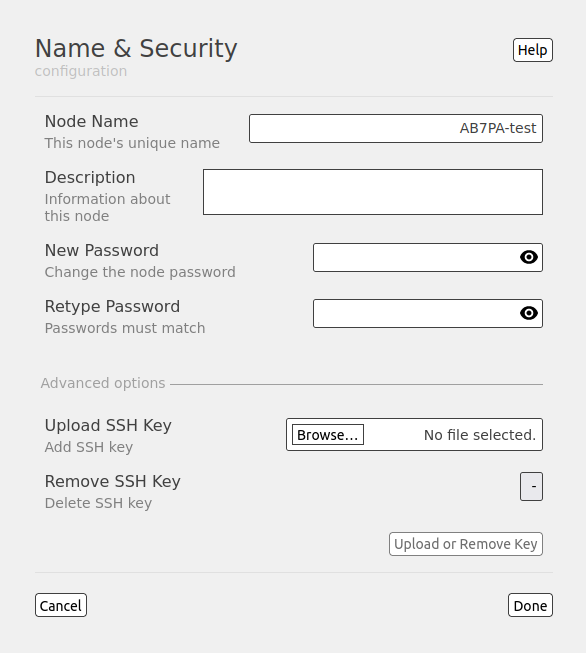
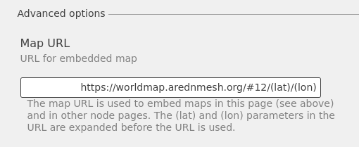
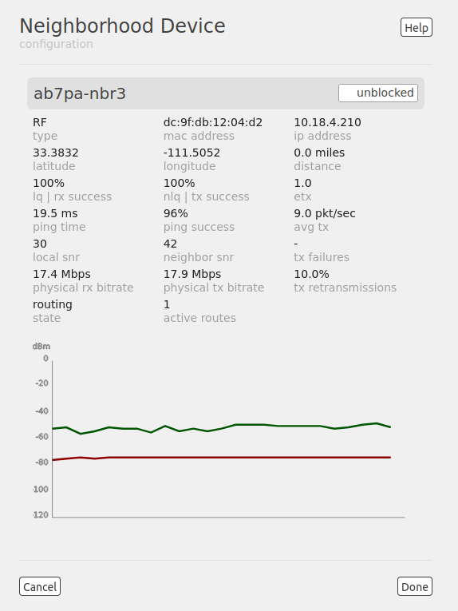
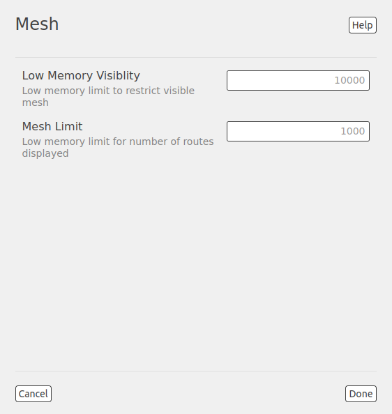

================
Node Admin Guide
================

You must login as the node administrator in order to perform node management tasks.

|icon1| Click the user icon at the far right of the top nav bar. Select ``login`` and enter your node's admin password (which was configured when you installed the AREDN |trade| firmware).

|icon2| Upon successful authentication you will see the admin icon, and the label to the right of your node name should say *admin*.

In *admin* mode the sections on the **node status** display become editable, and there is a new section of options that appears at the top of the center column. This document will start at the top left and work down each column of settings. When you hover the cursor over a section and a light gray background appears, this identifies that section as being configurable.

After making any changes on each display (as described below), click the ``Done`` button. You will then be returned to your node's *admin* view where you will see a new item in the top nav bar.

.. image:: _images/admin-chg-pending.png
  :alt: Admin change pending
  :align: center

|

Click the ``Commit`` button to apply the change(s) or the ``Revert`` button to ignore any changes and revert to the previous settings.

Node Name and Security
----------------------

The Name & Security section allows you to configure the following settings. Context-sensitive help is available by clicking the ``Help`` button.

|

Node Name
  Begin the node name with your callsign, followed by unique identifying information of your choice. Node names may contain up to 63 letters, numbers, and dashes, but cannot begin or end with a dash. Underscores, spaces, or any other characters are not allowed. Node names are not case sensitive, but the case will be preserved on the node status display. Amateur radio operators are required to identify all transmitting stations. The AREDN |trade| node name is beaconed automatically by the node every five minutes, so the node name must contain your callsign. Recommended names follow the (callsign)-(label) format, such as AD5BC-MOBILE or AD5BC-120SE. As a general rule node names should be kept as short as possible, while clearly and uniquely identifying the node.

Description
  This is not a required field, but it is a good place to describe the features or function of this device. Many operators use this field to list their contact information or the tactical purpose for the node. There are no character restrictions in the field, but the maximum length allowed is 210 characters.

Theme
  Click in the field at the right to select a theme from the dropdown list. Your node will immediately display your page in the selected theme.

Password
  Typically passwords may contain the characters ``a-z``, ``A-Z``, ``0-9``, period ``.``, dash ``-``, underscore ``_``, exclamation ``!``, and tilde ``~``. Avoid Linux-reserved characters, including but not limited to ``#``, ``$``, ``&``, ``*``, ``<``, ``>``. Enter the new password again in the *Retype Password* box to verify it is correct. You can click the *eye* icon at the right of the password fields to toggle between hidden and visible text. Be sure to remember or record the new password so you can use it for any future administrative tasks on the node.

By clicking **Advanced Options** you can configure additional settings.

Upload SSH Key
  Uploading SSH keys allows computers to connect to the node via SSH without having to know the password. The SSH keys are generated on your computer using built-in utilities or the `PuTTY <https://www.chiark.greenend.org.uk/~sgtatham/putty/latest.html>`_ program's *Key Generator*. Once you have the key files on your computer, you can upload the *public* key to your AREDN |trade| node. Click the ``Browse`` button and locate the *public* key file, then click the ``Upload Key`` button at the lower right. SSH keys are only valid if they contain a string in the form of ``<USER>@<SOMEWHERE>`` in the comment section of the key. SSH keys generated with the above tools add this comment by default.

  .. note:: If you plan to use ssh keys you may want to review **Use PuTTYGen to Make SSH Keys** in the **How-To Guide** section which describes this process in detail for users of Microsoft Windows computers.

Remove SSH Key
  To remove an existing SSH key, click in the field at the right and select the key from the dropdown list. Then click the ``Remove Key`` button at the lower right.

You can click the ``Cancel`` button to ignore any changes you made on this display. When you are finished with your changes, click the ``Done`` button. You will then be returned to your node's *admin* view where you will be able to ``Commit`` or ``Revert`` your changes.

Time Settings
-------------

Select your timezone from the dropdown list, where the default value is :abbr:`UTC (Coordinated Universal Time)`. You can also enter the hostname for a :abbr:`NTP (Network Time Protocol)` source if your node is connected to a network which has a network time server. In the *NTP Server* field you should enter a valid hostname for the network time source, for example ``us.pool.ntp.org`` or ``AD5BC-ntp.local.mesh``. You may also choose how often NTP will update the node’s clock by selecting a value from the *NTP Updates* dropdown list. The default is once per day [daily] but you may also select once per hour [hourly].

.. image:: _images/admin-time.png
  :alt: Admin Time
  :align: center

|

Context-sensitive help is available by clicking the ``Help`` button. You can click the ``Cancel`` button to ignore any changes you made on this display. When you are finished with your changes, click the ``Done`` button. You will then be returned to your node's *admin* view where you will be able to ``Commit`` or ``Revert`` your changes.

Firmware Settings
-----------------

The top field displays the currently installed version of firmware on your node. Context-sensitive help is available by clicking the ``Help`` button. There are three ways to update your node's firmware.

.. image:: _images/admin-firmware-1.png
  :alt: Admin Firmware
  :align: center

|

Download Firmware
  If your node has Internet access or access to a firmware repository on your local network, you can click the *refresh* icon on the right side of the field in order to update the list of available images. Select the image to download, click the ``Fetch and Update`` button, and wait for the firmware to download and be installed. A progress bar at the bottom of the display will show the status of the download and update.

Upload Firmware
  If you have a new firmware image that you already downloaded to your local computer from the AREDN |trade| website or a local firmware repository, click the ``Browse`` button and navigate to the location where you saved the firmware file. After selecting the firmware file, click the ``Fetch and Update`` button and wait for the firmware to upload and be installed. A progress bar at the bottom of the display will show the status of the process.

Sideload Local Firmware
  If you need to remotely upgrade the firmware on a node which has a marginal connection to the network, the standard web/http method may not reliably transfer the image to the node. In this situation you may want to use an independent means of uploading the firmware to the node before beginning the upgrade process. Choose an upload method such as ``scp`` (secure copy) with a long connection timeout, which may allow the file transfer to continue the upload in the event of a network interruption. Transfer the new firmware file to your node, place it in the ``/tmp/web`` folder, and name it ``local_firmware.bin``. Once the node detects the presence of ``/tmp/web/local_firmware.bin``, then the filename in the field at the right will be active. Click the ``Fetch and Update`` button and wait for the firmware to be installed. A progress bar at the bottom of the display will show the status of the process.

By clicking **Advanced Options** you can configure additional settings.

.. image:: _images/admin-firmware-2.png
  :alt: Admin Firmware Advanced Options
  :align: center

|

Keep Configuration
  This is enabled by default and will allow you to retain your existing configuration settings during the firmware upgrade process. If you do not want any existing configuration settings to be retained, you can ``disable`` this setting.

Dangerous Upgrade
  This setting allows you to disable the normal firmware compatibility safety checks that typically prevent you from loading the wrong firmware image on your node. The default setting is ``disabled`` which means that the safety checks remain active, and this setting should not be changed unless you have a specific reason to bypass the firmware compatibility checks. One example for using this setting would be if you mistakenly installed an incorrect firmware image and would like to correct that mistake by installing the correct firmware image.

Firmware URL
  This is the source URL that is queried by the *Download Firmware* process in order to refresh the list of available firmware for your node. The default value is ``https://downloads.arednmesh.org`` which allows your Internet-connected node to retrieve firmware from the AREDN |trade| website. You can also set this firmware URL to a local network server which provides firmware images.

When you are finished with your changes, click the ``Done`` button.

Package Settings
----------------

This display allows you to install or remove software packages on the node. When you install packages, your node will remember them in its package store. When you next upgrade your node's firmware, the package store will be retained. After the firmware upgrade your node will automatically reinstall any packages in its package store. If you *uploaded* the package to the node, then the package store keeps a copy of the package code itself. If you *downloaded* the package, then your node will attempt to re-download it. Also, if you later *remove* one of your extra packages, it will be automatically removed from the package store. Context-sensitive help is available by clicking the ``Help`` button.

.. image:: _images/admin-packages.png
 :alt: Admin Packages
 :align: center

|

Download Package
  If the node has a connection to the Internet, it can retrieve a package from the AREDN |trade| website. Click the *refresh* icon at the right of the field to update the list of packages available for download. Select the package you want to install, click the ``Fetch and Install`` button, and wait for the package to be installed. A progress bar at the bottom of the display will show the status of the process. A status message will appear at the top of the display to indicate whether the package was installed successfully.

Upload Package
  If you have a package file that you already downloaded to your local computer from a package repository, click the ``Browse`` button and navigate to the location where you saved the package file. After selecting the package, click the ``Fetch and Update`` button and wait for the package to be uploaded and installed. A progress bar at the bottom of the display will show the status of the upload and install. A status message will appear at the top of the display to indicate whether the package was installed successfully.

Remove Package
  Click in the field at the right to show a list of packages currently installed on the node. Select a package and click the ``Remove`` button to uninstall the selected package. You will only be able to remove packages that you have added to your node. A progress bar at the bottom of the display will show the status of the remove process. A status message will appear at the top of the display to indicate whether the package was removed successfully.

By clicking **Advanced Options** you can configure additional settings.

Package URL
  This field contains the URL which your node will use to download packages. The default value is ``https://downloads.arednmesh.org`` which allows your Internet-connected node to retrieve packages from the AREDN |trade| website. You can also set this package URL to a local network server which provides packages.

When you are finished with your changes, click the ``Done`` button.

Network Settings
----------------

This display allows you to update the network settings on your node. Context-sensitive help is available by clicking the ``Help`` button.

.. image:: _images/admin-network-1.png
 :alt: Admin Network
 :align: center

|

Mesh Address
  This is the primary IP address of your node. The AREDN |trade| firmware has been designed to simplify the process of configuring network interfaces. Network values are automatically calculated based on the unique :abbr:`MAC (Media Access Control)` addresses of your node. Normally you will not need to change this, so keep this value unless you fully understand how the mesh works and why the defaults may not be suitable for your situation.

LAN Size
  This allows you to set the number of devices your node will be able to host on its Local Area Network (LAN). Click in the field at the right to see the dropdown list of options for the size of your node's LAN. The default value is ``5`` hosts.

  It is important not to select a size that is larger than necessary because the chance of an IP address conflict on the mesh increases with the size of the subnet. The LAN subnet parameters are automatically calculated and depend on the IP address of the *Mesh* interface. If a conflict does occur it can be fixed by changing the *Mesh* IP address above.

  Since the LAN address space is automatically managed, you cannot configure network settings in *Direct* mode. The only option available in *Direct* mode is the size of the LAN subnet which can accommodate either 1, 5, 13, or 29 LAN hosts. A single host subnet can be useful for either a single server or a separate network router using its own NAT which is capable of more advanced routing functions than those available on a mesh node. In *Direct* mode every host on the LAN has direct access to and from the mesh. This mode was designed to minimize the amount of manual effort needed to provide services to the mesh, since many services do not work well if they are hosted behind a :abbr:`NAT (Network Address Translation)` router. In *Direct* mode the LAN shares the same address space as the mesh at large.

  Another choice is ``NAT`` and in this mode the LAN is isolated from the mesh. All outgoing traffic has its source address modified to be the *Mesh* IP address of the node itself. This is the same way that most home routers use an Internet connection, and all services provided by computers on the LAN can only be accessed through port forwarding rules.

  Finally, you may also ``disable`` your node's ability to provide a LAN network.

WAN Enable
  This switch allows you to enable or disable your node's WAN interface, which is typically used to connect to the Internet or some other external network. The WAN interface is ``enabled`` by default, and the *Mode* setting below will be displayed. If you ``disable`` the WAN interface, the *Mode* setting will not appear.

  WAN Mode
    This specifies how your node's WAN interface gets its IP address. The default is to use :abbr:`DHCP (Dynamic Host Control Protocol)`, so the WAN IP address is assigned to your node by your Internet router. If you select ``Static`` you will see several new fields which allow you to specify the IP address, netmask in dotted decimal format, and gateway IP address.

DNS
  These two fields allow you to enter the IP addresses of the :abbr:`DNS (Domain Name System)` servers of your choice. By default Google's DNS servers are listed because their name resolution servers are configured to detect error conditions properly and to report them correctly.

  When you connect a device to your node's LAN, not only should it have an IP address in the LAN IP address range, but it is best practice for LAN devices to obtain their DNS Server information automatically from the node. Be aware that if a LAN device does not use the DNS Server entry provided by the node to which it is connected, then that device will be unable to resolve hostnames on the mesh network. Also, hard-coding a device's DNS Server entry with the mesh node's IP address could result in unexpected failures if that device is moved to another mesh node or network.

By clicking **Advanced Options** you can configure additional settings.

.. image:: _images/admin-network-2.png
  :alt: Admin Network Advanced Options
  :align: center

|

WAN VLAN
  Many of the devices used as AREDN |trade| nodes have only one Ethernet port, but more than one type of network traffic must share that single port. The AREDN |trade| firmware implements :abbr:`VLANs (Virtual Local Area Network)` in order to accomplish this. Different types of traffic are tagged to identify the network to which they belong. By default the WAN uses an *untagged* VLAN on multi-port devices, and ``VLAN 1`` on single port devices. This can be changed if your network requires something different. Enter the VLAN number or leave the field blank for *untagged*. If you change this setting, do not use single digit identifiers or any number larger than can be supported by your network equipment. Different types of network equipment can support various numbers of VLANS, but the maximum number is limited by the `802.1Q standard <https://en.wikipedia.org/wiki/IEEE_802.1Q#Frame_format>`_ to no more than 4094.

  The following VLANs are preconfigured in the AREDN |trade| firmware:

  - VLAN 1: these packets will be identified as WAN traffic from the Internet or another external network.

  - VLAN 2: these packets will be identified as traffic from a :abbr:`DtD (Device to Device)` node directly connected to your node.

  - No VLAN tag: these packets will be identified as LAN traffic from devices on the local area network.

  It is important to understand AREDN |trade| VLANs when configuring network smart switches for Internet access, tunneling, or DtD linking of nodes. There are some useful tutorials available on the AREDN |trade| website for configuring VLAN-capable switches: `Video <https://www.arednmesh.org/content/understanding-vlans>`_ or `Text+Images <https://www.arednmesh.org/content/configuring-netgear-gs105e-switch-lanwan-ports>`_. Also, on the AREDN |trade| GitHub site there is more information about node VLANs that have been preconfigured in the firmware images for specific types of radio hardware (`Ethernet Port Usage <http://downloads.arednmesh.org/snapshots/readme.md>`_)

Mesh to WAN
  Enabling this switch will allow your node to route traffic from its Mesh interface to/from its WAN interface. This allows any device on the local mesh network to use the WAN on your node, typically for accessing the Internet. It is usually not desirable to route Internet traffic over your Mesh interface. AREDN |trade| is an FCC Part 97 amateur radio network, so be sure that any traffic which will be sent over the radio complies with FCC Part 97 rules. If you want local devices to have wireless Internet access, consider using an FCC Part 15 access point instead of your node's WAN gateway. The default value is ``disabled`` and it is recommended that you keep this default unless there is a special reason to enable it.

LAN to WAN
  The default value is ``enabled`` which allows devices on your node's LAN to access your node's WAN network. Setting this value to ``disabled`` will prevent LAN devices from accessing the WAN, which means that your LAN hosts will not be able to reach the Internet even if your node has Internet access via its WAN. You may need to disable WAN access if your device needs to be connected to two networks at once, such as an Ethernet connection to your node as well as a wifi connection to a local served agency network.

LAN default route
  Your node's DHCP server will provide routes to its LAN devices so they can access any available networks. A default route is required for WAN access, and that is provided automatically if **LAN to WAN** is *enabled* as discussed above. However, some LAN devices (such as certain IP cameras) may not support DHCP option 121, so they will require a default route in order to access the mesh network. Setting this value to ``enabled`` will provide a default route to those devices. If a LAN device is connected to two networks at once, such as an Ethernet connection to your node as well as a wifi connection to a local served agency network, care should be taken to understand how the device will deal with default routes to more than one network. The default value is ``disabled`` and you should not enable it unless you have a special reason to do so.

You can click the ``Cancel`` button to ignore any changes you made on this display. When you are finished with your changes, click the ``Done`` button. You will then be returned to your node's *admin* view where you will be able to ``Commit`` or ``Revert`` your changes.

Location Settings
-----------------

This display allows you to update the location settings on your node. Context-sensitive help is available by clicking the ``Help`` button.

.. image:: _images/admin-location-1.png
 :alt: Admin Location
 :align: center

|

Any values you enter should be in decimal format. Location information is used to determine the distance between your node and others, and it is required for optimizing connection latency and bandwidth. A Maidenhead grid square is a six character designation of a node's location. A grid square identifier consists of two uppercase letters, two digits, two lowercase letters. Each grid square is approximately 3x4 miles in size.

Using the displayed map you can change the GPS coordinates by clicking on the map and panning around to set your location. As you pan the map, the location values will follow your movements automatically.

By clicking **Advanced Options** you can configure additional settings.

|

Map URL
  The map URL is used to embed maps in your node's displays. The default value is ``https://worldmap.arednmesh.org/#12/(lat)/(lon)`` which attempts to get the map data from the AREDN |trade| server. The (lat) and (lon) parameters in the URL are substitutes with your GPS coordinates before the map is rendered.

You can click the ``Cancel`` button to ignore any changes you made on this display. When you are finished with your changes, click the ``Done`` button. You will then be returned to your node's *admin* view where you will be able to ``Commit`` or ``Revert`` your changes.

Internal Services
-----------------

When you are logged in as *admin* you will see an Internal Services status display. This shows the state of each of the listed services, which will be described below in more detail. The ``Metrics`` status simply indicates whether this node is being monitored by providing metrics to an external service (such as `Prometheus <https://en.wikipedia.org/wiki/Prometheus_(software)>`_). The ``Supernode`` status indicates whether this node is configured as a Supernode.

.. image:: _images/admin-internal-svc-1.png
 :alt: Admin Internal Services Status
 :align: center

|

The **Internal Services** configuration display allows you to manage the internal settings on your node. Context-sensitive help is available by clicking the ``Help`` button.

.. image:: _images/admin-internal-svc-2.png
 :alt: Admin Internal Services
 :align: center

|

Cloud Mesh
  This switch allows your node to use any available Supernode on your local mesh. Supernodes are a way to link multiple mesh island networks in a safe and efficient way. If your local node is part of a network with a Supernode then you have the ability to view other nodes which are part of the Cloud Mesh network. This feature is ``enabled`` by default. Clicking the Cloud Mesh icon will navigate to the mesh status display of the closest Supernode available to your device. For further information see the *Supernode Architecture* description in the **Network Topologies** section of the **Network Design Guide**.

  |icon5| You may connect to any node on the worldwide mesh by clicking your node's Cloud Mesh icon on the left nav bar. Disable this option if you never want your node to provide a method of accessing devices on the worldwide mesh network.

iPerf3 Server
  This switch enables the built-in iperf3 client and server tools on your node. This makes it easy to perform bandwidth tests between arbitrary nodes in the network. The client and server are only invoked on demand, so there is no performance impact on the node except when tests are performed. The default value is ``enabled``. Testing with iperf3 is described in the "Test Network Links with iperf3" section of the **How-To Guide**. If you do not want your node to participate in any remote iperf3 tests then you can ``disable`` its ability to respond to those queries.

Remote Logging
  The limited amount of memory for local node logs means that older information will roll off, and all log information is lost when your node is rebooted. By entering the URI for a remote log server, you can send your node's log info to a server using the syslog protocol. The format for this option is ``udp://ip-address:port`` or ``tcp://ip-adress:port``. Leave this field blank if no remote logging is desired.

WAN ssh
  This switch enables SSH access to your node on its WAN interface. Disabling this option will not prevent SSH access to your node from the Mesh and LAN interfaces.

WAN telnet
  This switch enables *telnet* access to your node on its WAN interface. Disabling this option will not prevent *telnet* access to your node from the Mesh and LAN interfaces.

WAN web
  This switch enables http/https access to your node on its WAN interface. Disabling this option will not prevent http/https access to your node from the Mesh and LAN interfaces.

Watchdog
  Watchdog is a background monitor that keeps track of core node processes. If any of the processes has issues, Watchdog will reboot the node. This feature is ``disabled`` by default. Currently the set of node processes that are monitored include olsrd, dnsmasq, telnetd, dropbear, uhttpd, and vtund (if tunneling is enabled). Any watchdog events are logged in the /tmp/manager.log file on your node. Because the watchdog is in the hardware, even if the kernel crashes, the device will still reboot itself. If Watchdog is enabled, the following two fields will also be displayed.

  Watchdog IP address
    You may also include one or more IP addresses, at least one of which should always be pingable. Your node will be rebooted if none of the IP addresses are reachable across the network. Enter IP addresses as a whitespace-delimited list.

  Daily Watchdog hour
    Enter an integer between 0 - 23 which represents the hour of each day that you would like Watchdog to automatically reboot your node. The default is an empty field, in which case Watchdog will not auto-reboot your node.

.. image:: _images/admin-internal-svc-3.png
 :alt: Admin Internal Services continued
 :align: center

|

Message Updates
  The AREDN |trade| development team may post messages which Internet-connected nodes will automatically download and display. You may also use a local message source to display messages on your node's status page. Enter an integer in this field for the number of hours you want your node to wait before refreshing its messages. The default value is ``1`` hour between updates.

Local Message URL
  This field allows you to enter the URL for a local message source. If you configure a local message server, then your nodes without Internet access can also receive alert messages pertinent to your local mesh. Enter the URL without a trailing backslash.

  A local message server can be configured on a mesh-connected web server which allows nodes to query the URL you entered. There is also a separate package called *AREDN Alert Message Manager* which allows the local message repository to be hosted on the node itself, rather than requiring a separate LAN-conneted web server. You can find out more about this application by reading *AREDN Alert Message Manager* in the **Applications and Services Guide** under the *Other Services* section.

Message Groups
  In addition to local messages addressed by node name, it is possible to subscribe to group messages. Multiple group names can be added to this field as a comma delimited list. Group messages are retrieved from the web server specified in the *Local Message URL* field. The following are example grouping ideas:

  - Geographic regions (State, county, ARRL section, neighborhood)
  - Connection types (backbone, leaf nodes, tunnels)
  - Infrastructure *Change Management* notices
  - Weather alerts
  - Wildfire, flooding, tsunami or volcano alerts
  - SKYWARN activations, DHS threat level

You can click the ``Cancel`` button to ignore any changes you made on this display. When you are finished with your changes, click the ``Done`` button. You will then be returned to your node's *admin* view where you will be able to ``Commit`` or ``Revert`` your changes.

DHCP Server ???
  If you choose to disable the DHCP server, you must manually configure the host IP addresses to be within the LAN network range. There should be only one DHCP server for each IP address scope or range, so you may need to disable your node's DHCP server if there is already another device providing DHCP services on your node's local area network. Click this link for additional information on `Dynamic Host Control Protocol <https://en.wikipedia.org/wiki/Dynamic_Host_Configuration_Protocol>`_.

Local Services
--------------

The **Node Services** display allows you to manage the services which will be available on your node. The purpose of the network is to transport data for the services which are being used. Network services may include keyboard-to-keyboard chat or email programs, document sharing applications, Voice over IP phone or video conferencing services, streaming video from surveillance cameras, and a variety of other network-enabled features. Services can run on the node itself or on any of its LAN-connected devices. Context-sensitive help is available by clicking the ``Help`` button.

.. image:: _images/admin-localsvc-1.png
 :alt: Admin Local Services
 :align: center

|

Adding a Service
  To add a service, click in the field to the right and select the type of service you want to add. Then click the [+] icon to add a row to your services list for the new service of the selected type. You may need to provide different parameters for the new entry based on the type of service selected.

  .. image:: _images/admin-localsvc-2.png
   :alt: Admin Local Services Generic Example
   :align: center

  For example, for a *Generic URL* service you should edit the *service name* field (currently called "Generic URL") to clearly identify your service. Click in the field to the right of the *service name* to select from the dropdown list the type of icon that will be displayed for this service (if any).

  In the *protocol* field on the next row, enter the `protocol to use <https://en.wikipedia.org/wiki/List_of_TCP_and_UDP_port_numbers>`_ for this service. Common protocols include ``http`` for website services and ``ftp`` for file transfer services. Other services may use other protocols. From the dropdown list in the next field, select the node or host on which this service is running. If you have defined *Host Aliases* (described below), you will see these host aliases in the dropdown list.

  In the next field enter the network port on which the host is listening for service connections. There may be several applications provided through a single web server on a node or host using a single port, and in that case a valid application *Path* must be entered after the port number. In other cases the network port alone may uniquely identify the application or program that is listening for user connections to that service. You can find additional information on ports at the following link: `Network Ports <https://en.wikipedia.org/wiki/Port_(computer_networking)>`_.

  You can click the ``Cancel`` button to ignore any changes you made on this display. When you are finished with your changes, click the ``Done`` button. You will then be returned to your node's *admin* view where you will be able to ``Commit`` or ``Revert`` your changes.

Viewing, Editing, and Deleting Services
  On the **Node Services** display your services are listed as a series of rows. You can change any of the fields for any of the services in this list. If you want to delete a service row, click the [-] icon on the right side of that row.

  You can click the ``Cancel`` button to ignore any changes you made on this display. When you are finished with your changes, click the ``Done`` button. You will then be returned to your node's *admin* view where you will be able to ``Commit`` or ``Revert`` your changes.

Managing Host Aliases
  *Host Aliases* provide a way for you to create a hostname alias for a device on your node's LAN. This can be useful if you want a computer or device on your LAN to be identified by something other than its actual hostname. Your Host Alias will be propagated across the network even if the actual hostname has *Do Not Propagate* checked in its DHCP Reservation, allowing you to hide the actual hostname while still advertising the alias on the mesh. Once an alias is defined, it will become available for creating local services (described above).

  .. image:: _images/admin-localsvc-3.png
   :alt: Admin Local Services Host Aliases
   :align: center

  To create an alias, click the [+] icon on the right and enter an alias name in the first field. The alias should be prefixed with your callsign in order to follow the naming convention used when defining any unique host on the network. Then use the dropdown selector to choose the name or IP Address of the existing host for which you are defining the alias. Once you have entered these values, you can change any of the fields in any of the aliases. If you want to delete an alias, click the [-] icon on the right side of that row.

  To delete an alias, click the [-] icon on the right of the existing row for the alias you wish to delete. You can click the ``Cancel`` button to ignore any changes you made on this display. When you are finished with your changes, click the ``Done`` button. You will then be returned to your node's *admin* view where you will be able to ``Commit`` or ``Revert`` your changes.

Port Forwarding
  There may be situations where your node must act as an intermediary, typically between a client device and a server device on your node's LAN network. More information can be found at this link for `Port Forwarding <https://en.wikipedia.org/wiki/Port_forwarding>`_.

  .. image:: _images/admin-localsvc-4.png
   :alt: Admin Local Services Port Forwarding
   :align: center

  To create a port forwarding rule, click the [+] icon on the right. In *Direct* mode port forwarding is only meaningful for WAN-connected nodes, so you will only be allowed to create rules for the WAN interface. For inbound port, enter a single port number or a range of ports separated by the dash character. Click in the *protocol* field to select TCP, UDP, or both. Use the switch on the right to enable or disable this port forwarding rule. On the next row, click in the IP address / hostname field to select from the dropdown list a LAN host to process the requests. In the next field, enter the *port* on that host which is listening for those requests.

  To delete a port forwarding rule, click the [-] icon on the right of the existing row for the rule you wish to delete. You can click the ``Cancel`` button to ignore any changes you made on this display. When you are finished with your changes, click the ``Done`` button. You will then be returned to your node's *admin* view where you will be able to ``Commit`` or ``Revert`` your changes.

Local Devices
-------------

Local Nodes
-----------

Neighborhood Nodes
------------------

As described in the **Node Status** documentation section, this area shows a list of neighbor devices that are directly connected to your node. In *admin* mode you will see a gray background when hovering over a neighbor node in that list. If you click in the neighbor row while the gray background is visible, the **Neighbor Device** display will appear. Context-sensitive help is available by clicking the ``Help`` button.

|

This display provides more detailed information about your node's connection to this neighbor device. To the right of the neighbor node's name there is a field that shows the current link status. Clicking in this field will give you several options for handling the link to this node, including the ability to block that node's traffic from reaching your node. The following details for this node's connection to your node are displayed (from top to bottom & left to right):

- :abbr:`type (RF, cross-link, tunnel)`, mac address, and ip address
- Latitude, Longitude, and Distance
- :abbr:`lq (link quality or receive success)`, :abbr:`nlq (neighbor link quality or transmit success)`, and :abbr:`etx (Expected Transmission metric)`
- ping time, ping success rate, and average packets per second
- local :abbr:`snr (signal to noise ratio)', neighbor :abbr:`snr (signal to noise ratio)`, and transmit failures
- physical receive bitrate, physical transmit bitrate, and retransmissions
- link state and active routes

These details should provide an excellent troubleshooting tool for diagnosing issues with node connections. Below the metrics is a graph of the signal level and noise level on this link over the last hour of history (approximately). Hovering over the graph lines will display the instantaneous values which were plotted at each point on the graph.

You can click the ``Cancel`` button to ignore any changes you made on this display. When you are finished with your changes, click the ``Done`` button. You will then be returned to your node's *admin* view where you will be able to ``Commit`` or ``Revert`` any changes.

Radios and Antennas
-------------------

The **Radios & Antennas** display allows you to configure the radios on your node. If your device has more than one radio, you can configure them separately. Context-sensitive help is available by clicking the ``Help`` button.

.. image:: _images/admin-radio-1.png
 :alt: Admin Radio Settings
 :align: center

Click in the first field on the right to set the radio's purpose. You can choose one of several different radio functions from the dropdown list.

Off
  Disables the radio.

Mesh Radio Settings
+++++++++++++++++++

This option configures the radio to link with other nodes via RF across the mesh network.

Channel
  Click in the field on the right to select a channel for mesh RF communication. Nodes communicate only with other nodes that use the same channel, channel width, and SSID. You can determine the correct settings by talking with other local node operators to find out which settings are required for joining their networks. The options in this list show the channel number as well as the center frequency of each channel.

  .. attention:: You are responsible for using frequencies, channels, bandwidths, and power levels that comply with your country’s Amateur radio license requirements.

Channel Width Setting
  Click in the field at the right to select from the channel widths supported on your device. Most hardware will support 5 MHz, 10 MHz, or 20 MHz channel widths.

  .. note:: Some AREDN |trade| devices will only support specific channel widths. If the choice of channel width is limited, the device will only show its supported widths in the dropdown list.

  As a general rule, a larger channel width will allow more data to be transferred, but it may only do so over shorter distances. One suggestion is to start with the largest channel width that yields a *Signal to Noise Ratio* (SNR) of at least 15 dB. There may be several reasons for reducing the channel width setting:

  - To achieve a better SNR on a marginal link.
  - To extend the usable distance between remote nodes.
  - To increase the number of available channels in a crowded RF coverage area.

  Please review the **Network Design** section for more information about designing a network that meets the specific requirements of your applications and services.

Transmit Power
  Click in the field at the right to select from the power settings that are supported on your device.

SSID Setting
  The default SSID is provided in the field at the right. Typically you will not need to change this default unless you have a specific reason for putting radios on a non-default SSID to isolate their traffic.

Minimum SNR
  This is the minimum Signal-to-Noise ratio that you require in order to reliably pass radio data between nodes. The default is 15 dB, but you can lower this value if you require your node to continue passing data even on links that have reduced signal characteristics.

Maximum Distance
  This is the maximum distance between nodes at which you can expect to achieve a usable radio link. Local conditions may dictate a shorter distance based, for example, on dense tree cover or other terrain features which impact line of sight communication. The default value is 50 miles / 80 kilometers, but you can adjust this setting if your node is only able to maintain a usable radio link with nearby nodes.

Minimum Quality
  This is the minimum link quality required in order to reliably pass data between nodes. This is calculated as the moving average of total sent packets over total sent packets plus retransmissions. For example, if a node must send every packet twice for it to be successfully received, the link quality would be 50%.

LAN Hotspot Radio Settings
++++++++++++++++++++++++++

This option configures the radio as a standard `802.11 <https://en.wikipedia.org/wiki/IEEE_802.11>`_ wifi hotspot for your node's LAN network. Any device that connects to your node using its wifi hotspot will receive an IP address on your node's LAN subnet.

.. image:: _images/admin-radio-2.png
 :alt: Admin Radio Settings 2
 :align: center

SSID
  A default SSID is provided, but you should change this value to a unique name that identifies the hotspot for potential users who will connect to it locally.

Channel
  Click in the field to the right to select a valid wifi channel. You are responsible for using a channel that complies with your region's wifi requirements (for example, FCC Part 15).

Encryption
  Click in the field to the right to select a wifi encryption method.

Password
  Click in the field to the right to enter a valid wifi password for accessing your node's hotspot.

WAN Client Radio Settings
+++++++++++++++++++++++++

This option configures the radio as a wifi WAN client to an available Internet gateway. This can be useful to provide Internet access for your node via wifi rather than requiring an Ethernet cable plugged into the node's WAN port. Enabling a radio as a *WAN Client* will disable VLAN1 on your node, so Internet access will no longer be possible through the physical WAN port.

.. image:: _images/admin-radio-3.png
 :alt: Admin Radio Settings 3
 :align: center

SSID
  Click in the field at the right to enter the SSID of the local wifi access point you are connecting to for Internet access.

Password
  Enter the authentication password for the wifi AP to which you are connecting. Your node uses *WPA2 PSK* encryption to connect to external wifi APs. The password length must be between zero and 64 characters. If the key length is 64, it is treated as hex encoded. If the length is 0, then no encryption will be used to connect to an open AP. A ``single quote`` character must not be used in the passphrase.

Antenna Settings
++++++++++++++++

The antenna type is provided automatically based on your hardware model. Various devices may have differing antenna configurations, so the appropriate fields will be displayed depending on your radio type.

.. image:: _images/admin-radio-4.png
 :alt: Admin Radio Settings 4
 :align: center

Azimuth
  Click in the field at the right to enter the direction (in degrees) toward which your directional antenna is aimed. This field will not appear if your device uses an omnidirectional antenna.

Height
  Click in the field at the right to enter a height in meters above ground level at which you have your antenna mounted.

Elevation
  Click in the field at the right to enter an angle (in degrees) of uptilt or downtilt that you have set on your antenna. Note that some omnidirectional antennas have a built-in downtilt, and that value can be entered here.

Advanced Radio Options
++++++++++++++++++++++

By clicking **Advanced Options** you can configure additional settings.

.. image:: _images/admin-radio-5.png
 :alt: Admin Radio Settings 5
 :align: center

|

LQM Enable
  This switch enables **Link Quality Manager** functionality on your node, and the default value is ``enabled``.

Minimum Distance
  The minimum distance that must exist between nodes in order for a link to be considered for activation. The default value is ``0``. This value can be increased if you do not want your node to pass traffic with nearby nodes, for example at a tower site with collocated backbone nodes each of which should have an RF link only with other distant nodes.

RTS Threshold
  The packet size in bytes triggering RTS/CTS when LQM detects hidden nodes. The default value is 1.

Maximum Packet Size
  The maximum size of a packet which is sent over wifi. The value is between 256 and 1500 with a default of ``1500`` bytes. Decreasing this value can improve link quality in some cases, especially in noisy environments with long distance connections.

SNR Margin
  The margin above the *Minimum SNR* that must be detected in order for a node to be returned to the active list based on signal level. The default value is ``1`` dB.

Quality Margin
  The margin above the *Minimum Quality* that must be detected in order for a node to be returned to the active list based on quality. The default value is ``1`` percent.

Ping Penalty
  The Link Quality penalty that is imposed on calculations if a remote node does not respond to a ping request. The default value is ``5`` percent. This setting may be helpful for cases when a link would otherwise be marked *active* but the remote node is currently unreachable on the network.

Default Distance
  The distance (in meters) to use when the actual distance between nodes cannot be calculated from their GPS coordinates. The default value is zero, which causes the node to treat nodes as being collocated.

Minimum Routes
  The minimum number of routes on a link that are required to disable blocking.

You can click the ``Cancel`` button to ignore any changes you made on this display. When you are finished with your changes, click the ``Done`` button. You will then be returned to your node's *admin* view where you will be able to ``Commit`` or ``Revert`` any changes.

Mesh Memory Settings
--------------------

As the number of nodes increases in a mesh network, the processing requirements also increase for displaying all of the mesh routes on your node's mesh status display. For older nodes with limited memory resources, the mesh status display may become sluggish on large mesh networks. These values allow you to set the low memory threshold and the maximum number of routes to be displayed. Currently the default low memory threshold is 10,000 KB, which if reached will limit the mesh status display to the 1,000 closest routes. These values can be adjusted to lower values if your node has limited memory. Context-sensitive help is available by clicking the ``Help`` button.

|

You can click the ``Cancel`` button to ignore any changes you made on this display. When you are finished with your changes, click the ``Done`` button. You will then be returned to your node's *admin* view where you will be able to ``Commit`` or ``Revert`` any changes.

DHCP Settings
-------------

By default each node runs a :abbr:`DHCP (Dynamic Host Control Protocol)` server to provide client IP addresses for devices joining its LAN network. LAN devices connecting to your node will be assigned an IP address automatically. Context-sensitive help is available by clicking the ``Help`` button.

.. image:: _images/admin-dhcp-1.png
 :alt: Admin DHCP Settings
 :align: center

|

Active Leases
  Devices which are currently connected to your node's LAN network will be displayed in the table of *Active Leases*. The first field displays the hostname, followed by the IP address that was assigned by your node's DHCP server. The third field displays the device's MAC address.

  Since DHCP leases are dynamic and can change over time, there may be a reason why a host's assigned IP address should be made permanent. This is especially useful if that host will provide an application, program, or service through your node to the mesh network at large. You can reserve that host's DHCP address by clicking the [+] icon at the right of the row. You will see that host now appears in the *Address Reservations* list.

Address Reservations
  Devices which were added to the *Address Reservations* list will display their hostname, IP address, and MAC address. The hostname of every device connected to the mesh at large should be unique. It is best practice to prefix your Amateur Radio callsign to the hostname of each of your devices in order to give it a unique name on the network.

  There may be some devices on which you are not able to set the hostname, so once you add that device to your *Address Reservations* you can edit the hostname by clicking in the *hostname* field. You may also want to assign a specific IP Address to the device by selecting it from the drop-down list. If you have a device which needs to be reachable on its host node, but which should not be accessed across the mesh network, click the *Do Not Propagate* checkbox to prevent OLSR from propagating that information across the mesh.

Advanced Options
  By clicking **Advanced Options** you can configure additional settings. This section allows you to specify DHCP option codes and values which are sent to devices on your node's LAN network. In addition to providing an IP address, the DHCP protocol is able to send a large number of options for device configuration. Any LAN client joining the network can request specific DHCP options in addition to its IP address. These *Advanced Options* are especially helpful for configuring and provisioning VoIP phones on your node's LAN.

  The `Internet Assigned Numbers Authority (IANA) <https://www.iana.org/assignments/bootp-dhcp-parameters/bootp-dhcp-parameters.xhtml>`_ is the source for information about all DHCP options. Specific vendor equipment may or may not support all of the options, so you should verify which options are supported by referring to the manufacturer's documentation for your LAN device.

  .. image:: _images/admin-dhcp-2.png
   :alt: Admin DHCP Advanced Options
   :align: center

  |

  Tags
    The tags for advanced DHCP options allow you to define labels for values that will be assigned to clients that match specific values or properties such as Vendor Class or MAC address. Click the [+] icon to add a new tag. Enter a tag label in the first field, then click in the second field to select a tag type from the dropdown list. Finally, enter a text string which will be used to match device's tag type, such as Vendor Class or MAC address. To delete an existing tag, click the [-] at the right side of the row you wish to remove.

  Options
    The options entries allow you to specify which devices will receive the DHCP options. Click in the first field to select whether you want this option to be sent to [all] clients or only to clients which match a specific tag. Option numbers can be entered directly in the second field or you can select one from the dropdowm list of well-known options. In the third field enter the specific value that will be sent in this option. A checkbox allows you to specify whether or not this option will always be sent.

  To delete a tag or option, click the [-] icon on the right of the existing row for the item you wish to delete. You can click the ``Cancel`` button to ignore any changes you made on this display. When you are finished with your changes, click the ``Done`` button. You will then be returned to your node's *admin* view where you will be able to ``Commit`` or ``Revert`` any changes.

Ethernet Ports and Xlinks
-------------------------

If you have a supported multiport device, then you will see an *Ethernet Ports and Xlinks* section. This provides a way for you to configure the ports on your multiport node. For more information on the AREDN |trade| VLANs being used, refer to the *VLAN* description in the **Network Settings** section above. Context-sensitive help is available by clicking the ``Help`` button.

.. image:: _images/admin-ports-xlinks.png
  :alt: Admin Ethernet Ports and Xlinks
  :align: center

|

Ports
  The *Ports* section at the top shows the available ports and the possible configurations along the left side. A typical configuration is as follows:

  - The first port is configured as a WAN port. The data entry field to the right of the *vlan* label can contain any valid vlan identifier if it is required, typically in the range between 1 and 4094. The default for these multiport devices is no vlan (untagged), so leave the default unless there is a specific reason why it is required in your situation.
  - The middle ports are configured as LAN ports with no vlan (untagged).
  - The last port is configured for DtD linking to another AREDN |trade| node using vlan2 (tagged).

  If you want to change a port's configuration, simply check or uncheck the settings desired on each port.

Xlinks
  A cross-link allows your node to pass AREDN |trade| traffic across non-AREDN |trade| point-to-point links. To add a cross-link click the [+] icon, enter an unused VLAN number for the link, the IP address of the near-side device, the IP address of the far-side device, a weighting factor, and the port to which the near-side device is connected on your node. The *Weight* will be used by `OLSR <https://en.wikipedia.org/wiki/Optimized_Link_State_Routing_Protocol>`_ to determine the best route for AREDN |trade| traffic. If you want to remove a cross-link, simply click the [-] icon on the right side of the row to remove it.

You can click the ``Cancel`` button to ignore any changes you made on this display. When you are finished with your changes, click the ``Done`` button. You will then be returned to your node's *admin* view where you will be able to ``Commit`` or ``Revert`` any changes.

Tunnel Settings
---------------

Admin Tools
-----------

Support Data
  There may be times when you want to view more detailed information about the configuration and operation of your node, or even forward this information to the AREDN |trade| team in order to get help with a problem. Click the *Support Data* icon to save a compressed archive file to your local computer.

Port Forwarding, DHCP, Services, and DNS Aliases
------------------------------------------------

Direct Mode Operation
+++++++++++++++++++++

.. image:: _images/ports-direct-mode.png
   :alt: Ports - Direct Mode Operation
   :align: center

|

In ``Direct`` mode the LAN hosts are directly accessible from the mesh since no address translation or port forwarding is involved.

DHCP Address Reservations
  If your node has its DHCP server enabled, it will automatically provide IP addresses to connected hosts. Look under the **Current DHCP Leases** heading to see the existing hosts and their assigned IP addresses.

  Once you have entered the values for your DHCP Reservation, click *Add* to add it to the list. You may also remove an existing reservation by clicking the *Del* button to delete it from the list. Click the **Save Changes** button to write your changes to the node's configuration.

Advertised Services

  Service Advertisement Process
    `OLSR (Optimized Link State Routing) <https://en.wikipedia.org/wiki/Optimized_Link_State_Routing_Protocol>`_ propagates service entries to other nodes across the network. Once every hour your node will verify that its own service entries are valid. Your node will **not** propagate services across the network if it finds any of these conditions:

    1. The host is not pingable across the network
    2. There is no service listening on the specified port
    3. The HTTP link does not return a *success* status code
    4. The package for this service is not yet installed

    The node's *Advertised Services* list will still show the defined service (with an alert icon and hover text marking it as non-advertised), but your node will not actually *advertise* that service to the network. If the service URL becomes reachable in the future or if the dependent package is later installed, then your node will resume advertising the service across the network.

NAT Mode Operation
++++++++++++++++++

.. image:: _images/ports-nat-mode.png
   :alt: Ports - NAT Mode Operation
   :align: center

|

If you are using ``NAT`` for your LAN mode, then hosts on the LAN are isolated from both the wifi and WAN interfaces by a firewall. This makes them inaccessible from either of these interfaces unless Port Forwarding is configured. In this mode all outgoing LAN traffic has its source address modified to be the Mesh IP address of the node. This is the same way that most home routers use an ISP Internet connection.

Port Forwarding
  Port forwarding rules can redirect inbound connections from the wifi, WAN, or both interfaces and forward them to an IP address and port on the LAN. The destination port need not be the same unless you are forwarding a range of ports as explained below.

  To create a port forwarding rule, select the network *Interface* on which the traffic will enter your node. Select the *Protocol Type* used by the incoming packets (TCP, UDP, or Both). Enter the *Outside Port* number that the external request is using to connect to your service. When your node receives traffic on the selected interface, protocol, and port then that request will be routed to the *LAN IP* address and *LAN Port* of the host which is listening for incoming requests for that service.

  Once you have entered these values, click *Add* to add the rule to the **Port Forwarding** list. You may also remove an existing rule by clicking the *Del* button to delete it from the list. Click the **Save Changes** button to write your port forwarding changes to the node's configuration.

  Example:
    On the LAN of a mesh node called ``ad5oo-mobile`` there is an IP camera with an IP address of 172.27.0.240 which is running its own web display. To make that camera available to everyone on the mesh, create a port forwarding rule on the wifi interface whose Outside Port is any unused port on your node (for example ``8100``) with an LAN IP of 172.27.0.240 and LAN Port of ``80``. This takes all connections to port ``8100`` on ``ad5oo-mobile`` and redirects them to port ``80`` on 172.27.0.240. In a web browser on a remote computer connected to the mesh you could go to ``http://ad5oo-mobile:8100`` to view the IP camera.

  If you want to forward a range of ports, the *Outside Port* field will accept a hyphen-separated range in the form "xxxx-xxxx". When doing this, set the LAN Port to the low value of the port range.

  If you want to forward every port that is not already in use to a single computer on the LAN, choose that host's IP Address from the **DMZ Server** dropdown. There can be only one DMZ Server. Be aware that this bypasses the firewall in the node, so the DMZ server should run its own firewall to prevent unauthorized access.

  Note that port forwarding to an FTP server, which uses both ports 20 and 21, can be done with a single rule using port 21 if the ftp client is capable of using passive ftp mode. Web browsers are able to do this and handle ftp downloads seamlessly.

Advertised Services
  In ``NAT`` mode Advertised Services will not be accessible until at least one port forwarding rule or a DMZ server has been defined as described above. Advertised Services are entered as they are for Direct mode, except that the URL field is always that of your node which is handling network address translation. The port number should be the one used as the *Outside Port* in the forwarding rule through which the service will be accessed. In the last field you can enter an optional path if needed, such as the name of a specific folder on a web server or a directory on an ftp server.

  Click *Add* to add the service to the **Advertised Services** list. You may also remove an existing service by clicking the *Del* button. Click the **Save Changes** button to write your changes to the node's configuration.

DHCP Address Reservations
  DHCP Address Reservations make a LAN device's IP address permanent so it can be used consistently when defining Port Forwarding rules, and they are added the same way as in Direct mode. If a LAN device is currently connected and has been given an IP address by DHCP then it will appear under *Current DHCP Leases*. If you click the *Add* button next to the lease then it will be added to the DHCP Reservations list. You may also remove an existing reservation by clicking the *Del* button to delete it from the list. Click the **Save Changes** button to write your changes to the node's configuration. When using ``NAT`` mode the IP addresses of LAN devices are **never** propagated across the mesh, so the *Do Not Propagate* checkbox will not appear on this page.

DNS Aliases
  DNS Aliases work differently in ``NAT`` mode. Aliases **cannot** be propagated across the mesh, and they **cannot** be used when defining an *Advertised Service*. They can only be used as an alternate name for a device on the nodes’ LAN.

Tunnel Links
------------

Tunnels are typically used as a means of connecting mesh islands if RF links cannot be established. Before using the AREDN |trade| tunnel feature, be aware of how this type of connection could impact your local mesh network. If your node participates in a local mesh, then adding one or more tunnel connections on that node will cause the nodes and hosts on the far side of the tunnel(s) to appear on your local *Mesh Status* display. This adds complexity and makes everyone's display a little more difficult to navigate. If you want to participate in remote mesh networks via tunnel, consider establishing those tunnels from one of your nodes that is *not* connected to your local mesh network. Also, remember that AREDN |trade| is first and foremost an emergency communication resource, so it's possible that Internet-dependent links and the assets they provide will not be available during a disaster.

Internet Connectivity Requirements
++++++++++++++++++++++++++++++++++
In order to run your node as either a *Tunnel Server* or *Tunnel Client*, you will need to configure Internet access. The following diagram shows an example of tunnel services between two nodes using the Legacy Tunneling Protocol described below.

.. image:: _images/tunneling-diagram.png
   :alt: Tunneling Diagram
   :align: center

|

If you are using *Mikrotik hAP ac* family devices or *GL.iNET* devices then these nodes have built-in switches with the appropriate VLANs preconfigured in the AREDN |trade| firmware. If you are using any other type of node, then you will need to configure a separate VLAN-capable switch. Set your VLAN-capable network switch to appropriately tag traffic from the Internet with "VLAN 1" before sending it to your node. This allows your node to properly identify the traffic as coming from the Internet connection on its WAN interface. See the equipment manual for your smart switch to determine how to configure these settings.

Tunnel Server
+++++++++++++

Click the **Tunnel Server** link to navigate to these settings. This section provides a way for you to configure node-to-node connections across the Internet. The heading area displays information for both types of tunneling protocols. The legacy tunneling service provides an *unencrypted* connection between the linked nodes, while the Wireguard tunneling service provides an *encrypted* connection over the Internet. Tunnel network address ranges are calculated automatically and it is not necessary to change these settings unless there is a specific reason why the defaults will not work for your situation. The *Tunnel Server DNS Name* is the public IP Address or the *Dynamic DNS* name by which Internet-connected nodes can reach your network.

.. image:: _images/tunnel-server.png
   :alt: Tunneling Server
   :align: center

|

Legacy Tunneling Protocol
  The top section is for entering tunnel clients for the AREDN |trade| legacy tunneling protocol which uses TCP and is unencrypted. In the *Client* field enter the exact node name of the client node that will be allowed to connect to your tunnel server. Do not include the "local.mesh" suffix. In the *Client Password* field enter a password that the client node will use to connect to your node over the tunnel. Use only uppercase and lowercase characters and numbers in your password. You may also enter other optional information in the *Contact Info/Comment* field. To allow the client to connect to your tunnel server, select the *Enabled* checkbox.

  Once these settings are correct, click *Add* to add the new client to the list of authorized tunnel clients. On the right of each entry there is an envelope icon which will automatically open your computer's email program and copy the client settings into a new email which allows you to quickly and easily send credentials to the owners of the client nodes.

  In order for your Internet-connected router/firewall to have a consistent way to forward traffic to your node, it is best practice to set a static IP address on your tunnel server node's WAN interface or to reserve its DHCP IP address in your router.

  On your Internet-connected router/firewall set the firewall rules to permit TCP traffic from the Internet on port ``5525``. Then configure a port forwarding rule to send any traffic from the Internet on port ``5525`` to the IP address of your node's WAN interface.

Wireguard Tunneling Protocol
  The bottom section of the *Tunnel Server* page is for entering tunnel clients that will use the Wireguard tunneling protocol which uses UDP and is encrypted over the Internet. In the *Client* field enter the exact node name of the client node that will be allowed to connect to your tunnel server. Do not include the "local.mesh" suffix. You may also enter other optional information in the *Contact Info/Comment* field. To allow the client to connect to your tunnel server, select the *Enabled* checkbox.

  Once these settings are correct, click *Add* to add the new client to the list of authorized tunnel clients. The entry for the *Key* field will be auto-generated when the *Add* button is pressed. You will also see the port which was assigned to the entry in the *Client* field at the end of the IP address. On the right of each entry there is an envelope icon which will automatically open your computer's email program and copy the client settings into a new email which allows you to quickly and easily send credentials to the owners of the client nodes.

  .. note:: If you change the *Client Name* on one of your existing Wireguard clients, the existing security key will be automatically retired and a new key will be generated. This may occur if the client node owner has changed its name, or if the Tunnel Server administrator needs to reuse/repurpose an existing line on the *Tunnel Server* display.

  In order for your Internet-connected router/firewall to have a consistent way to forward traffic to your node, it is best practice to set a static IP address on your tunnel server node's WAN interface or to reserve its DHCP IP address in your router.

  On your Internet-connected router/firewall set the firewall rules to permit UDP traffic from the Internet on an appropriate range of ports. The starting port should be ``5525``, which will provide for one wireguard tunnel connection. If you want to allow up to 10 wireguard tunnel links (for example), you would permit UDP traffic on the range of ports between ``5525-5534``. Then configure a port forwarding rule to send any traffic from the Internet on your range of ports to the IP address of your node's WAN interface.

Supernode Tunneling
  Supernode tunneling uses the Wireguard tunneling protocol, but the port range begins with port ``6526``. On your Internet-connected router/firewall set the firewall rules to permit UDP traffic from the Internet on an appropriate range of ports. The starting port should be ``6526``, which will provide for one supernode tunnel connection. If you want to allow up to 10 supernode tunnel links (for example), then you would permit UDP traffic on the range of ports between ``6526-6535``. Then configure a port forwarding rule to send any traffic from the Internet on your range of ports to the IP address of your node's WAN interface.

Once the client information has been entered, click the **Save Changes** button. When a tunnel connection becomes active, the cloud icon at the right of each row will change to indicate that the tunnel is active. Depending on the timing of the webpage refresh, you may need to press the **Refresh** button to see the active icon.

Tunnel Client
+++++++++++++

Click the **Tunnel Client** link to navigate to these settings. In this section you can configure your node to connect over the Internet to another node running as a *Tunnel Server*. You should already have your VLAN-capable network switch configured as explained in the *Internet Connectivity Requirements* section above, if it is needed.

Contact the amateur operator who controls the tunnel server and request client credentials by providing your specific node name. The tunnel server administrator will provide you with the public IP or :abbr:`DDNS (Dynamic Domain Name Service)` name for the tunnel server, the password/key you are to use, and the network IP address for your client node. Enter these values into the appropriate fields on your node and click *Add* to create a client entry in the list.

.. image:: _images/tunnel-client.png
   :alt: Tunnel Client Settings
   :align: center

|

If your tunnel server administrator used the envelope icon to create an email to send you the credentials, you can simply highlight/select the credentials from the email, copy the selection, and then paste that selection into any of the blank fields for a new Tunnel Client row. Your node will correctly populate each of the separate fields with the credentials you were sent.

To allow your client to connect to the tunnel server, select the *Enabled* checkbox and click the **Save Changes** button. When a tunnel connection becomes active, the cloud icon at the right of each row will change to indicate that the tunnel is active. Depending on the timing of the webpage refresh, you may need to press the **Refresh** button to see the active icon.

Advanced Network
----------------

PoE and USB Power Passthrough
+++++++++++++++++++++++++++++

.. image:: _images/advConfig-passthrough.png
  :alt: Advanced Configuration - passthrough
  :align: center

|

These rows will only appear in the table if you have node hardware which supports PoE or USB power passthrough. One example is the *Mikrotik hAP ac lite* which provides one USB-A power jack, as well as PoE power passthrough on Ethernet port 5. You are allowed to enable or disable power passthrough on nodes with ports that support this feature. Move the slider to **ON** and click *Save Setting* to enable power passthrough.

Tunnel Options
++++++++++++++

.. image:: _images/advConfig-tunnelOptions.png
  :alt: Advanced Configuration - tunnel options
  :align: center

|

Tunnel Weight
  This specifies the OLSR route cost of using a tunnel, with the default value set to ``1``. The higher the route cost weight, the less likely a tunnel will be chosen for routing traffic.

Tunnel WAN Only Setting
  This setting is enabled by default and it prevents tunnel traffic from being routed over the Mesh network. It limits tunnels to using the WAN interface, which is typically the intended route. If in your situation you need tunnel traffic to be routed over RF to a node with WAN access, then you can disable this setting to allow that traffic to pass.

Node Reset Button Actions
-------------------------

The reset button on an AREDN |trade| node has two built-in functions based on the length of time the button is pressed.

With the node powered on and fully booted:

* **Hold for 5 seconds to reset the password and DHCP service**
* **Hold for 15 seconds to return the node to “just-flashed” condition**

On some equipment models it may be possible to accomplish these reset procedures by pressing the *Reset* button on the PoE unit.

.. |icon1| image:: ../_icons/login.png
  :alt: Normal user view

.. |icon2| image:: ../_icons/login-auth.png
  :alt: Admin user view

.. |icon3| image:: ../_icons/status.png
  :alt: Node status view

.. |icon4| image:: ../_icons/mesh.png
  :alt: Local mesh view

.. |icon5| image:: ../_icons/cloudmesh.png
  :alt: Cloud mesh view

.. |icon6| image:: ../_icons/map.png
  :alt: World map view

.. |icon7| image:: ../_icons/tools.png
  :alt: Admin user view
