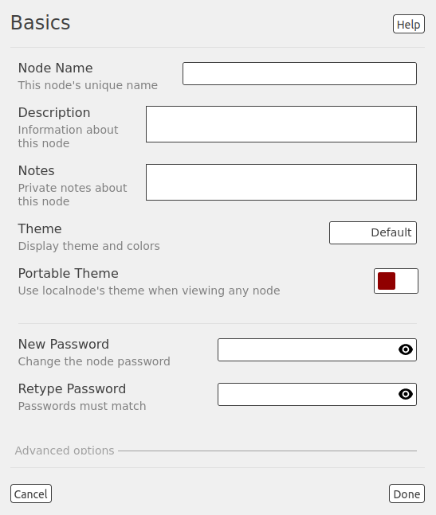
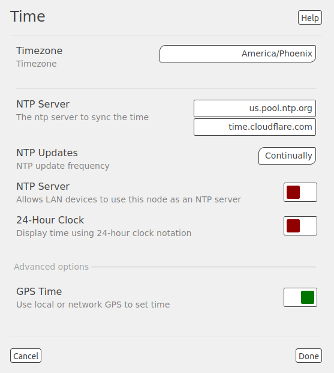
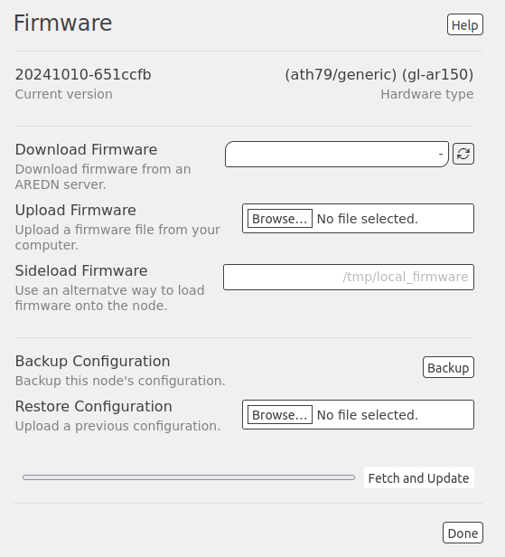
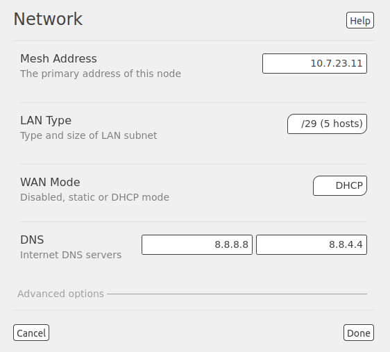
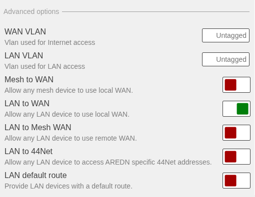
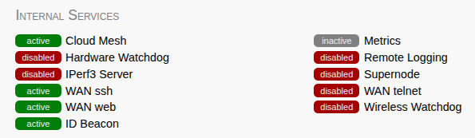
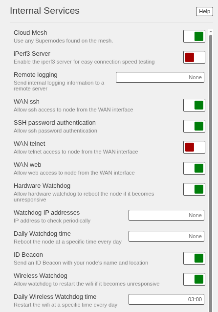
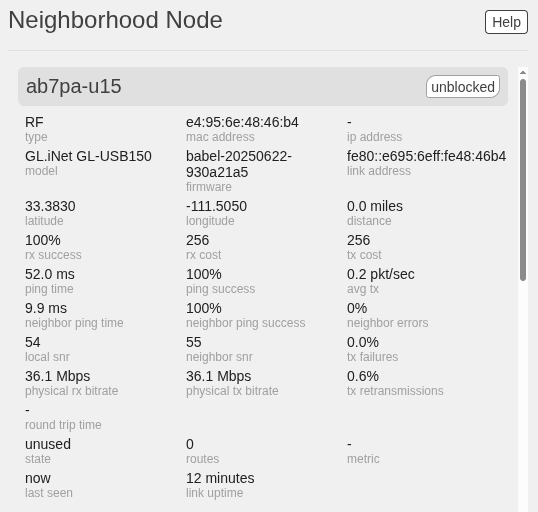
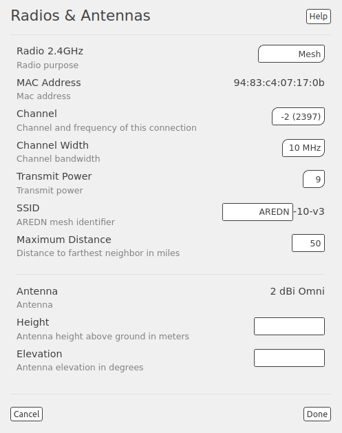
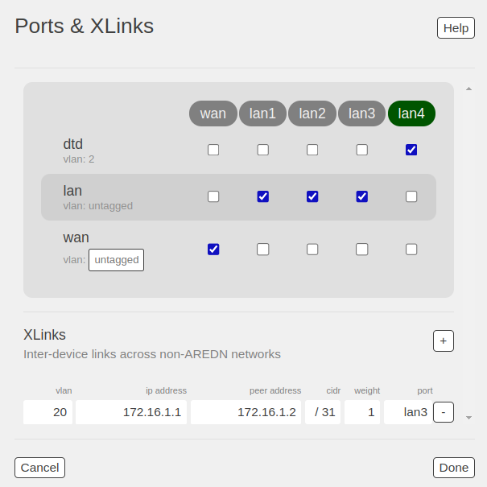

================
Node Admin Guide
================

You must login as the node administrator in order to perform node management tasks.

|icon1| Click the user icon at the far right of the top nav bar. Select ``login`` and enter your node's admin password (which was configured when you installed the AREDN® firmware).

|icon2| Upon successful authentication you will see the admin icon, and the label to the right of your node name should say *admin*.

Admin navigation & actions
--------------------------

In *admin* mode the sections on the **node status** display become editable and new sections with additional options will appear. When you hover the cursor over a section, a gray background appears which identifies that section as being configurable. When you click in a highlighted section, a new settings dialog display will be opened. The title at the top of the display tells you what settings you are configuring. There is also a ``Help`` button in the upper right corner which will enable extended context-sensitive descriptions of each option which has additional help text.

Settings can be edited or selected from dropdown lists by clicking in each of the fields. If a section has **Advanced Options** you can view and configure them by clicking the *Advanced Options* label to display those additional settings. After making any changes to the configuration settings on each display, you will typically click the ``Done`` button. Your changes have been recorded but they have not yet been committed or saved to your node. You may also click the ``Cancel`` button to discard any changes you have made and return to the *admin* view.

After clicking ``Done`` you will be returned to your node's *admin* view where you will see a new item in the top nav bar. Click the ``Commit`` button to apply your change(s) or the ``Revert`` button to ignore any change(s) and revert to the previous settings.

.. image:: _images/admin-chg-pending.png
  :alt: Admin change pending
  :align: center

|

For some configuration changes there may be additional action buttons that are displayed. For example, if you want to upload or remove an SSH security key you will press the ``Upload or Remove Key`` button. Or you can press the ``Fetch and Update`` button to install a firmware image, or press the ``Remove`` button to remove a package installed on your node. In some cases you may need to scroll down on the configuration display in order to see these buttons.

The sections of the **admin** display will be described below, beginning in the upper left corner of the left column and working down that column before moving to the center and right columns of the display, working from top to bottom on each column.

Basics
------

Starting at the top of the left column, highlight and click the section which contains the description and notes. This *Basics* section allows you to configure the following settings. Context-sensitive help is available by clicking the ``Help`` button.

|

Node Name
  Begin the node name with your CALLSIGN in all capital letters followed by a dash character and some unique identifying information of your choice. Node names may contain up to 63 letters, numbers, and dashes, but cannot begin or end with a dash. Underscores, spaces, or any other special characters are not allowed. Amateur radio operators are required to identify all transmitting stations, so your node name is beaconed automatically by the node every five minutes. Recommended names follow the (CALLSIGN)-(label) format, such as AD5BC-MOBILE or AD5BC-BLACKMTN. As a general rule node names should be kept as short as possible, while clearly and uniquely identifying the node.

Description
  This is not a required field, but it is a good place to describe the features or function of this device. Many operators use this field to list their contact information or the tactical purpose for the node. If you want to display information about your node, put that information here in the description rather than making it part of the node name. There are no character restrictions in this field, but the maximum length is 210 characters.

Notes
  This optional field allows you to enter notes about this node which are only visible to the node admin. For example, you may enter information about special settings or configurations for links to nearby devices.

Theme
  Click in the field at the right to select a theme from the dropdown list. Your node will immediately display your page in the selected theme.

Portable Theme
  This switch allows you to enable theme portability. When *Portable Theme* is enabled, the theme on your localnode will be the theme used when viewing any node on the mesh. By default this setting is disabled, which means that the remote node owner's theme will appear in your browser.

Password
  Typically passwords may contain the characters ``a-z``, ``A-Z``, ``0-9``, period ``.``, dash ``-``, underscore ``_``, exclamation ``!``, and tilde ``~``. Avoid Linux-reserved characters, including but not limited to ``#``, ``$``, ``&``, ``*``, ``<``, ``>``. Enter the new password again in the *Retype Password* box to verify it is correct. You can click the *eye* icon at the right of the password fields to toggle between hidden and visible text. Be sure to remember or record the new password so you can use it for any future administrative tasks on the node.

Additional options will be displayed when you click **Advanced Options**.

.. image:: _images/admin-name-security-2.png
  :alt: Admin Name and Security Advanced Options
  :align: center

|

Upload SSH Key
  Uploading SSH keys allows computers to connect to the node via SSH without having to know the password. The SSH keys are generated on your local computer using built-in utilities or the `PuTTY <https://www.chiark.greenend.org.uk/~sgtatham/putty/latest.html>`_ program's *Key Generator*. Once you have the key files on your computer, you can upload the *public* key to your AREDN® node. Click the ``Browse`` button and locate the *public* key file, then click the ``Upload Key`` button at the lower right.

  .. note:: If you plan to use ssh keys you may want to review **Use PuTTYGen to Make SSH Keys** in the **How-To Guide** section which describes this process for users of Microsoft Windows computers.

Remove SSH Key
  To remove an existing SSH key, click in the field at the right and select the key from the dropdown list. Then click the ``Remove Key`` button at the lower right.

You can click the ``Cancel`` button to ignore any changes you made on this display. When you are finished with your changes, click the ``Done`` button. You will then be returned to your node's *admin* view where you will be able to ``Commit`` or ``Revert`` your changes.

Time settings
-------------

Highlight and click the section displaying your node's time. Select your timezone from the dropdown list, where the default value is :abbr:`UTC (Coordinated Universal Time)`. Two fields are provided for entering the hostnames of :abbr:`NTP (Network Time Protocol)` servers if your node is connected to a network with network time services. You can enter valid hostnames in the *NTP Server* fields: for example ``us.pool.ntp.org`` or ``AD5BC-ntp.local.mesh``. You may also choose how often NTP will update the node’s clock by selecting a value from the *NTP Updates* dropdown list. The default is once per day [daily] but you may also select once per hour [hourly] or you can have your node run the NTP program [continuously]. If you have mesh-based NTP servers, advertise them as services to ensure time synchronization across your mesh network when the Internet is not available. Review the **Local Services** section below for instructions on advertising a local NTP server.

|

By default the time on your node will be shown as a 12-hour clock with *am/pm*. To display node time using a 24-hour clock, enable the *24-Hour Clock* switch.

Additional options are displayed when you click **Advanced Options**.

By default your node can use a local **GPS Time** source if one is available. To disable this behavior, slide the switch to the *off* position.

If you want your node to function as a GPS time *server* you will need to install the `WhereAndWhen <https://github.com/kn6plv/WhereAndWhen>`_ package. This third party package allows a node with adequate processing power and memory to have a USB GPS dongle connected so that it can provide GPS time for itself and other local DtD linked devices. Further information is available on the `WhereAndWhen <https://github.com/kn6plv/WhereAndWhen>`_ package website.

If you plan to use Wireguard tunneling, make sure that a GPS or NTP time source is reachable when the node boots so that the key exchange between the client and server will happen correctly. Without proper time synchronization, Wireguard will not establish tunnels.

Context-sensitive help is available by clicking the ``Help`` button. You can click the ``Cancel`` button to ignore any changes you made on this display. When you are finished with your changes, click the ``Done`` button. You will then be returned to your node's *admin* view where you will be able to ``Commit`` or ``Revert`` your changes.

Firmware settings
-----------------

Highlight and click the section displaying your node's firmware version. The top field displays the currently installed version of firmware on your node. Context-sensitive help is available by clicking the ``Help`` button. There are three ways to update your node's firmware.

|

Download Firmware
  If your node has Internet access or access to a firmware server on your local network, you can click the *refresh* icon on the right side of the field in order to update the list of available images. Select the image to install and click the ``Fetch and Update`` button to begin the process. You may need to scroll down in the display to see the ``Fetch and Update`` button.

Upload Firmware
  If you have a new firmware image that you already downloaded to your local computer from the AREDN® website or a local firmware repository, click the ``Browse`` button and navigate to the location where you saved the firmware file. Select the image to install and click the ``Fetch and Update`` button to begin the process. You may need to scroll down in the display to see the ``Fetch and Update`` button.

Sideload Local Firmware
  If you need to remotely upgrade the firmware on a node which has a marginal connection to the network, the standard web/http method may not reliably transfer the image to the node. In this situation you may want to use an independent means of uploading the firmware to the node before beginning the upgrade process. Choose an upload method such as ``scp`` (secure copy) with a long connection timeout, which may allow the file transfer to continue the upload in the event of a network interruption. Transfer the new firmware file to your node, place it in the ``/tmp`` folder, and name it ``local_firmware.bin``. Once the node detects the presence of ``/tmp/local_firmware.bin``, then the filename in the field at the right will become active. Click the ``Update`` button to begin the process. You may need to scroll down in the display to see the button.

Backup Configuration
  Once you have your node configured the way you want it, you can save those configuration settings by clicking the ``Backup`` button. This will create a compressed archive of the node's configuration settings and it will download the timestamped backup file to your local computer. This snapshot file can be used to restore your node's configuration to a known good point in time, and it also allows you to transfer a configuration to new hardware. It is also possible to generate a node backup file from the command line of your node:

  ::

    # /usr/local/bin/backup
    Generated backup file: /tmp/node-backup.backup

Restore Configuration
  Once you have generated and saved a backup configuration, you can restore that previous backup to your node. This will replace the node's configuration with the settings in the backup file. Be aware that no attempt is made to validate the backup file. Also, restoring to a different type of hardware could result in unexpected behavior.

A progress bar at the bottom of the display will show the status of your download or upload. Any error messages will also be displayed in a message bar at the top of this display. You should then see a display showing that the image is being installed, along with a timer and progress indicator.

Additional options will be displayed when you click **Advanced Options**.

.. image:: _images/admin-firmware-2.png
  :alt: Admin Firmware Advanced Options
  :align: center

|

Keep Configuration
  This is enabled by default and will allow you to retain your existing configuration settings during the firmware upgrade process. If you do not want any existing configuration settings to be retained, you can ``disable`` this setting and the node will come up in "firstboot" state.

Dangerous Upgrade
  This setting allows you to disable the normal firmware compatibility safety checks that typically prevent you from loading the wrong firmware image on your node. The default setting is ``disabled`` which means that the safety checks remain active, and this setting should not be changed unless you have a specific reason to bypass the firmware compatibility checks. One example for using this setting would be if you mistakenly installed an incorrect firmware image and would like to correct that mistake by installing the correct firmware image.

Firmware URL
  This is the source URL that is queried by the *Download Firmware* process in order to refresh the list of available firmware for your node. The default value is ``http://downloads.arednmesh.org`` which allows your Internet-connected node to retrieve firmware from the AREDN® website. You can also set this firmware URL to a local server which provides firmware images.

If you are only making changes to firmware settings, you will click the ``Done`` button. You are then be returned to your node's *admin* view where you will be able to ``Commit`` or ``Revert`` your changes. However, if you are updating the node's firmware as described in the previous sections, then the ``Fetch and Update`` process will begin immediately and you are not required to click the *Done* button.

Package settings
----------------

Highlight and click the section displaying your node's installed package count. This display allows you to install or remove software packages on the node. When you install packages, your node will remember them in its package store. When you next upgrade your node's firmware, the package store will be retained. After the firmware upgrade your node will automatically reinstall any packages in its package store. If you originally *uploaded* the package to the node, then the package store keeps a copy of the package code itself. If you originally *downloaded* the package, then your node will attempt to re-download it. Also, if you later *remove* one of your extra packages, it will be automatically removed from the package store. Context-sensitive help is available by clicking the ``Help`` button.

|

Download Package
  If the node has a connection to the Internet or to a local package server, it can retrieve a package from the AREDN® website or from the local server. Click the *refresh* icon at the right of the field to update the list of packages available for download. Select the package you want to install, click the ``Fetch and Install`` button, and wait for the package to be installed. A progress bar at the bottom of the display will show the status of the process. A status message will appear at the top of the display to indicate whether the package was installed successfully.

Upload Package
  If you have a package file that you already downloaded to your local computer from a package repository, click the ``Browse`` button and navigate to the location where you saved the package file. After selecting the package, click the ``Fetch and Update`` button and wait for the package to be uploaded and installed. A progress bar at the bottom of the display will show the status of the upload and install. A status message will appear at the top of the display to indicate whether the package was installed successfully.

Remove Package
  Click in the field at the right to show a list of packages currently installed on the node. Select a package and click the ``Remove`` button to uninstall the selected package. You will only be able to remove packages that you have added to your node. A progress bar at the bottom of the display will show the status of the remove process. A status message will appear at the top of the display to indicate whether the package was removed successfully.

Additional options will be displayed when you click **Advanced Options**.

Package URL
  This field contains the URL which your node will use to download packages. The default value is ``http://downloads.arednmesh.org`` which allows your Internet-connected node to retrieve packages from the AREDN® website. You can also set this package URL to a local server which provides packages.

If you are only making changes to package settings, you will click the ``Done`` button. You are then be returned to your node's *admin* view where you will be able to ``Commit`` or ``Revert`` your changes. However, if you are installing or removing a package as described in the previous sections, then the install or remove process will begin immediately and you are not required to click the *Done* button.

Network settings
----------------

Highlight and click the section displaying your node's network settings. This display allows you to update the network configuration on your node. Context-sensitive help is available by clicking the ``Help`` button.

|

Mesh
++++

The **Mesh Address** is the primary IP address of your node. The AREDN® firmware has been designed to simplify the process of configuring network interfaces. Network values are automatically calculated based on the unique :abbr:`MAC (Media Access Control)` addresses on your node. Normally you will not need to change this, so keep this value unless you fully understand how the mesh works and why the defaults may not be suitable for your situation.

LAN
+++

The **LAN Size** allows you to set the number of devices your node will be able to host on its Local Area Network (LAN). Click in the field at the right to see the dropdown list of options for the size of your node's LAN. The default value is ``5 hosts``. You may also ``disable`` your node's ability to provide a LAN network. If the LAN is disabled then the node's DHCP server will also be disabled.

It is important not to select a size that is larger than necessary because the chance of an IP address conflict on the mesh increases with the size of the subnet. The LAN subnet parameters are automatically calculated and depend on the IP address of the *Mesh* interface. If a conflict does occur it can be fixed by changing the *Mesh* IP address above.

The most common configuration is to have the LAN address space managed automatically for you. In this case the LAN shares the same address space as the mesh at large, and every host on the LAN has direct access to and from the mesh. You have the option of selecting the size of the LAN subnet which can accommodate either 1, 5, 13, or 29 LAN hosts. A single host subnet can be useful for either a single server or a separate network router using its own NAT which is capable of more advanced routing functions than those available on a mesh node. This design minimizes the amount of manual effort needed to provide services to the mesh, since many services do not work well if they are hosted behind a :abbr:`NAT (Network Address Translation)` router.

When you connect a device to your node's LAN, not only will it have an IP address in the LAN IP address range, but it is best practice for LAN device to obtain its DNS Server information automatically from the node. Be aware that if a LAN device does not use the DNS Server entry provided by the node to which it is connected, then that device will be unable to resolve hostnames on the mesh network. Also, hard-coding a device's DNS Server entry with the mesh node's IP address could result in unexpected failures if that IP address changes.

NAT Mode
  Another choice for *LAN Size* is ``NAT`` and in this mode the LAN is isolated from the mesh. All outgoing traffic has its source address modified to be the *Mesh* IP address of the node itself. This is the same way that most home routers use an Internet connection, and all services provided by computers on the LAN can only be accessed from the mesh using port forwarding rules.

  .. image:: _images/admin-network-nat.png
   :alt: Admin Network - NAT
   :align: center

  |

  In ``NAT`` mode you are responsible for managing the IP address space of your node's LAN network. Enter the LAN IP address and netmask in dotted decimal format. Specify the final octet of the IP address that your node's DHCP service will use as its *DHCP Start* address as well as the *DHCP End* address, which defines the IP address range that will be provided via DHCP for LAN devices.

WAN
+++

WAN Mode
  This specifies whether your node's WAN interface is enabled, and if so, how it gets its IP address. The default is to use :abbr:`DHCP (Dynamic Host Control Protocol)`, so the WAN IP address is assigned to your node by your Internet router. If you select ``Static`` you will see several new fields which allow you to specify the IP address, netmask in dotted decimal format, and gateway IP address.

DNS
  These two fields allow you to enter the IP addresses of the :abbr:`DNS (Domain Name System)` servers of your choice. By default Google's DNS servers are listed because their name resolution servers are configured to detect error conditions properly and to report them correctly.

Advanced Options
++++++++++++++++

Additional options will be displayed when you click **Advanced Options**.

|

WAN VLAN
  Many of the devices used as AREDN® nodes have only one Ethernet port, but more than one type of network traffic must share that single port. The AREDN® firmware implements :abbr:`VLANs (Virtual Local Area Network)` in order to accomplish this. Different types of traffic are tagged to identify the network to which they belong. By default the WAN uses an *untagged* VLAN on multi-port devices, and ``VLAN 1`` on single port devices. This can be changed if your network requires something different. Enter the VLAN number or leave the field blank for *untagged*. If you change this setting and want to use a single digit identifier, use numbers greater than three, but do not use any number larger than can be supported by your network equipment. Different types of network equipment can support various numbers of VLANS, but the maximum number is limited by the `802.1Q standard <https://en.wikipedia.org/wiki/IEEE_802.1Q#Frame_format>`_ to no more than 4094.

  The following VLANs are preconfigured in the AREDN® firmware:

  - VLAN 2 identifies traffic from a :abbr:`DtD (Device to Device)` node directly connected to your node.

  - No VLAN tag identifies LAN traffic from devices on the local area network.

  - *For single-port nodes:* A VLAN 1 tag identifies WAN traffic to your node from the Internet or another external network.

  It is important to understand AREDN® VLANs when configuring network smart switches for single-port nodes to access the Internet, tunneling, or DtD linking of nodes. There are some useful tutorials available on the AREDN® website for configuring VLAN-capable switches: `Video <https://www.arednmesh.org/content/understanding-vlans>`_ or `Text+Images <https://www.arednmesh.org/content/configuring-netgear-gs105e-switch-lanwan-ports>`_. Also, on the AREDN® GitHub site there is more information about node VLANs that have been preconfigured in the firmware images for specific types of radio hardware (`Ethernet Port Usage <http://downloads.arednmesh.org/snapshots/readme.md>`_)

Mesh to WAN
  Enabling this switch will allow your node to route traffic from its Mesh interface to/from its WAN interface. This allows any device on the mesh network to use the WAN on your node, typically for accessing the Internet. It is usually not desirable to route Internet traffic over your Mesh interface. AREDN® is an FCC Part 97 amateur radio network, so be sure that any traffic which will be sent over the radio complies with FCC Part 97 rules. If you want local devices to have wireless Internet access, consider using an FCC Part 15 access point instead of your node's WAN gateway. The default value is ``disabled`` and it is recommended that you keep this default unless there is a special reason to enable it.

LAN to WAN
  The default value is ``enabled`` which allows devices on your node's LAN to access your node's WAN network. Setting this value to ``disabled`` will prevent LAN devices from accessing the WAN, which means that your LAN hosts will not be able to reach the Internet even if your node has Internet access via its WAN. You may need to disable WAN access if your device needs to be connected to two networks at once, such as an Ethernet connection to your node as well as a wifi connection to a local served agency network.

LAN default route
  Your node's DHCP server will provide routes to its LAN devices so they can access any available networks. A default route is required for WAN access, and that is provided automatically if **LAN to WAN** is *enabled* as discussed above. However, some LAN devices (such as certain IP cameras) may not support DHCP option 121, so they will require a default route in order to access the mesh network. Setting this value to ``enabled`` will provide a default route to those devices. If a LAN device is connected to two networks at once, such as an Ethernet connection to your node as well as a wifi connection to a local served agency network, care should be taken to understand how the device will deal with default routes for more than one network. The default value is ``disabled`` and you should not enable it unless you have a special reason to do so.

You can click the ``Cancel`` button to ignore any changes you made on this display. When you are finished with your changes, click the ``Done`` button. You will then be returned to your node's *admin* view where you will be able to ``Commit`` or ``Revert`` your changes.

Location settings
-----------------

Highlight and click the section displaying your node's location. This display allows you to update the location settings on your node. Context-sensitive help is available by clicking the ``Help`` button.

|

Any values you enter should be in decimal format, and the values in these three fields are linked. Any changes made will automatically update the fields and the map thumbnail. You can also change the location information by clicking on the map and panning around to set your location. As you pan the map, the location values will follow your movements automatically.

Location information is used to determine the distance between your node and others, and it is required for optimizing connection latency and bandwidth. A Maidenhead grid square is a six character designation of a node's location. A grid square identifier consists of two uppercase letters, two digits, and two lowercase letters. Each grid square is approximately 3x4 miles in size.

Additional options will be displayed when you click **Advanced Options**.

By default your node will attempt to set its location from a local GPS source. If you want to disable this behavior, slide the **GPS Location** switch to the *off* position.

The **Map URL** is used to embed maps in your node's displays. The default value is ``https://worldmap.arednmesh.org/#12/(lat)/(lon)`` which attempts to get map data from the AREDN® server. The (lat) and (lon) parameters in the URL are substitutes with your GPS coordinates before the map is rendered. If there is a local map tile server available on your mesh network, then you can point your node to the local server for its map data.

You can click the ``Cancel`` button to ignore any changes you made on this display. When you are finished with your changes, click the ``Done`` button. You will then be returned to your node's *admin* view where you will be able to ``Commit`` or ``Revert`` your changes.

Internal Services
-----------------

When you are logged in as *admin* you will see an Internal Services status display at the top of the center column. This shows the state of each of the listed services, which will be described below in more detail. The ``Metrics`` status is informational only, and it simply indicates whether this node is being monitored by providing metrics to an external service (such as `Prometheus <https://en.wikipedia.org/wiki/Prometheus_(software)>`_). The ``Supernode`` status is informational only and indicates whether this node is configured as a Supernode.

|

Highlight and click the section displaying your node's **Internal Services**, which allows you to manage the internal settings on your node. Context-sensitive help is available by clicking the ``Help`` button.

|

Cloud Mesh
  This switch allows your node to use any available Supernode on your local mesh. Supernodes are a way to link multiple mesh island networks in a safe and efficient way. If your local node is part of a network with a Supernode then you have the ability to view other nodes which are part of the Cloud Mesh network. This feature is ``enabled`` by default. Clicking the Cloud Mesh icon will navigate to the mesh status display of the closest Supernode available to your device. For further information see the *Supernode Architecture* description in the **Network Topologies** section of the **Network Design Guide**.

  |icon5| You may connect to any node on the worldwide mesh by clicking your node's Cloud Mesh icon on the left nav bar. Disable this option if you never want your node to provide a method of accessing devices on the worldwide mesh network.

iPerf3 Server
  This switch enables the built-in iperf3 tools on your node. This makes it easy to perform throughput tests between nodes in the network. The client and server are only invoked on demand, so there is no performance impact on the node except during testing. The default value is ``enabled``. If you do not want your node to participate in any remote iperf3 tests then you can ``disable`` its ability to respond to those queries.

Remote Logging
  The limited amount of memory for local node logs means that older information will roll off, and all log history is lost when your node is rebooted. By entering the URI for a remote log server, you can send your node's log info to a server using the syslog protocol. The format for this option is ``udp://ip-address:port`` or ``tcp://ip-adress:port``. Leave this field blank if no remote logging is desired.

WAN ssh
  This switch enables SSH access to your node on its WAN interface. Disabling this option will not prevent SSH access to your node from the Mesh and LAN interfaces.

WAN telnet
  This switch enables *telnet* access to your node on its WAN interface. Disabling this option will not prevent *telnet* access to your node from the Mesh and LAN interfaces.

WAN web
  This switch enables http/https access to your node on its WAN interface. Disabling this option will not prevent http/https access to your node from the Mesh and LAN interfaces.

Hardware Watchdog
  Hardware watchdog is a background monitor that keeps track of core node processes. If any of the processes has issues, it will reboot the node. This feature is ``disabled`` by default. Currently the set of node processes that are monitored include olsrd, dnsmasq, telnetd, dropbear, uhttpd, and vtund. Hardware watchdog events are logged in the standard log on the node. Because the watchdog is part of the hardware, the device will still reboot itself even if the kernel crashes.

  .. attention:: Be aware that you must disable Hardware Watchdog and reboot your node before you can upgrade the firmware, since Watchdog may interfere with the normal upgrade process.

Wireless Watchdog
  This background monitor will restart the mesh radio if it becomes unresponsive. If Wireless Watchdog is enabled, the following fields will also be displayed.

  Daily Wireless Watchdog Time
    This field allows you to set a specific time of the day (between 00:00 and 23:59) to restart the wifi automatically.

  Wireless Watchdog LQM
    This switch enables restarting the Link Quality Manager (LQM) whenever the Wireless Watchdog restarts the radio. This feature is ``disabled`` by default.

PoE and USB Power Passthrough
  These settings will only appear if you have node hardware which supports PoE or USB power passthrough. One example is the *Mikrotik hAP ac lite* which provides one USB-A power jack (~5v) as well as PoE power passthrough on Ethernet port 5 (~22v). You are allowed to enable or disable power passthrough on nodes with ports that support this feature.

|

Message Updates
  The AREDN® development team may post messages which Internet-connected nodes will automatically download and display. You may also use a local message source to display messages on your node's status page. Enter an integer in this field for the number of hours you want your node to wait before refreshing its messages. Decimal fractions of an hour are allowed (for example, ``0.5`` for every 30 minutes). The default value is ``1`` hour between updates.

Local Message URL
  This field allows you to enter the URL for a local message source. If you configure a local message server, then even nodes without Internet access can receive alert messages pertinent to your local mesh. Enter the URL without a trailing backslash.

  A local message server can be configured on a mesh-connected web server which allows nodes to query the URL you entered. There is also a separate package called *AREDN® Alert Message Manager* which allows the local message repository to be hosted on the node itself, rather than requiring a separate LAN-conneted web server. You can find out more about this application by reading *AREDN® Alert Message Manager* in the **Applications and Services Guide** under the *Other Services* section.

Message Groups
  In addition to local messages addressed by node name, it is possible to subscribe to group messages. Multiple group names can be added to this field as a comma delimited list. Group messages are retrieved from the web server specified in the *Local Message URL* field. The following are example grouping ideas:

  - Geographic regions (State, county, ARRL section, neighborhood)
  - Connection types (backbone, leaf nodes, tunnels)
  - Infrastructure *Change Management* notices
  - Weather alerts
  - Wildfire, flooding, tsunami or volcano alerts
  - SKYWARN activations, DHS threat level

You can click the ``Cancel`` button to ignore any changes you made on this display. When you are finished with your changes, click the ``Done`` button. You will then be returned to your node's *admin* view where you will be able to ``Commit`` or ``Revert`` your changes.

Local Services
--------------

Highlight and click the section displaying your node's local services. The **Local Services** display allows you to manage the services which will be available on your node. The purpose of the network is to transport data for the services which are being used. Network services may include keyboard-to-keyboard chat or email programs, document sharing applications, Voice over IP phone or video conferencing services, streaming video from surveillance cameras, and a variety of other network-enabled features. Services can run on the node itself or on any of its LAN-connected devices. Context-sensitive help is available by clicking the ``Help`` button.

|

Adding a Service
  To add a service, click in the field to the right and select the type of service you want to add. Then click the [+] icon to add a row to your services list for the new service of the selected type. You will provide different parameters for the new entry based on the type of service selected.

  .. image:: _images/admin-localsvc-2.png
   :alt: Admin Local Services Generic Example
   :align: center

  Generic URL service template
    This template allows you to enter a descriptive *service name* to clearly identify your service ("Generic URL" is a placeholder). Click in the field to the right of the *service name* to select from the dropdown list the type of icon that will be displayed for this service (if any). The icon you choose will be displayed to the right of the service name on **mesh status** pages.

    .. image:: _images/admin-iconlist-by-name.png
     :alt: Admin Local Services Icons by Name
     :align: center

    In the *protocol* field on the next row, enter the `protocol to use <https://en.wikipedia.org/wiki/List_of_TCP_and_UDP_port_numbers>`_ for this service. Common protocols include ``http`` for website services and ``ftp`` for file transfer services. Other services may use other protocols. From the dropdown list in the next field, select the node or host on which this service is running. If you defined *Host Aliases* (described below), you will see these host aliases in the dropdown list.

    In the next field enter the network port on which the host is listening for service connections. There may be several applications provided through a single web server on a node or host using a single port, and in that case a valid application *Path* must be entered after the port number. In other cases the network port alone will uniquely identify the application or program that is listening for user connections to that service. You can find additional information on ports at the following link: `Network Ports <https://en.wikipedia.org/wiki/Port_(computer_networking)>`_.

  Simple text service template
    This template allows you to create an informational label which is not clickable. Enter a descriptive label ("Simple text" is a placeholder). Click in the field to the right of the text label to select from the dropdown list the type of icon that will be displayed for this label (if any). The icon you choose will be displayed to the right of the service name on **mesh status** pages. From the dropdown list in the next field, select the node or host with which this label is associated. If you defined *Host Aliases* (described below), you will see these host aliases in the dropdown list.

  Network time service template
    To advertise a local NTP server, select the *NTP Server* template. The required field values are all filled for you. You can change any of the defaults that are not appropriate for your situation.

  Additional service templates
    Additional templates have been created for common services, with the goal of making it easier to define these services on your nodes. These templates fill in some of the fields with typical values, while allowing you to customize the information appropriately. Templates exist for several types of IP cameras as well as Winlink, MeshChat, WeeWx, Mapping, Proxmox, and web-based services.

  You can click the ``Cancel`` button to ignore any changes you made on this display. When you are finished with your changes, click the ``Done`` button. You will then be returned to your node's *admin* view where you will be able to ``Commit`` or ``Revert`` your changes.

Viewing, Editing, and Deleting Services
  On the **Local Services** display your services are listed as a series of rows. You can change any of the fields for any of the services in this list. If you want to delete a service row, click the [-] icon on the right side of that row.

  You can click the ``Cancel`` button to ignore any changes you made on this display. When you are finished with your changes, click the ``Done`` button. You will then be returned to your node's *admin* view where you will be able to ``Commit`` or ``Revert`` your changes.

  .. admonition:: Service Advertisement Process

    `OLSR (Optimized Link State Routing) <https://en.wikipedia.org/wiki/Optimized_Link_State_Routing_Protocol>`_ propagates service entries to other nodes across the network. Once every hour your node will verify that its own service entries are valid. Your node will **not** propagate services across the network if it finds any of these conditions after three attempts:

    1. The LAN host is not pingable from your node
    2. There is no service listening on the specified port
    3. An HTTP service does not return a *success* status code

    The node's *Advertised Services* list will still show the defined service (with an alert icon and hover text marking it as non-advertised), but your node will not actually *advertise* that service to the network. If the service URL becomes reachable in the future or if the dependent package is later installed, then your node will resume advertising the service across the network.

Managing Host Aliases
  *Host Aliases* provide a way for you to create a hostname alias for a device on your node's LAN. This can be useful if you want a computer or device on your LAN to be identified by something other than its actual hostname. Your Host Alias will be propagated across the network even if the actual hostname has *Do Not Propagate* checked in its DHCP Reservation, allowing you to hide the actual hostname while still advertising the alias on the mesh. Once an alias is defined, it will become available for creating local services (described above).

  .. image:: _images/admin-localsvc-3.png
   :alt: Admin Local Services Host Aliases
   :align: center

  To create an alias, click the [+] icon on the right and enter an alias name in the first field. The alias should be prefixed with your callsign in order to follow the naming convention used when defining any unique host on the network. Then use the dropdown selector to choose the name or IP Address of the existing host for which you are defining the alias. Once you have entered these values, you can change any of the fields in any of the aliases. If you want to delete an alias, click the [-] icon on the right side of that row.

  You can click the ``Cancel`` button to ignore any changes you made on this display. When you are finished with your changes, click the ``Done`` button. You will then be returned to your node's *admin* view where you will be able to ``Commit`` or ``Revert`` your changes.

Port Forwarding
  There may be situations where your node must act as an intermediary, typically between a remote client device and a server device on your node's LAN network. More information can be found at this link for `Port Forwarding <https://en.wikipedia.org/wiki/Port_forwarding>`_.

  .. image:: _images/admin-localsvc-4.png
   :alt: Admin Local Services Port Forwarding
   :align: center

  To create a port forwarding rule, click the [+] icon on the right. Unless the LAN is in NAT mode, port forwarding is only meaningful for WAN-connected nodes so you will only be allowed to create rules for the WAN interface. If in NAT mode you may select the WAN, Mesh, or both Mesh & WAN interfaces when defining your port forwarding rule.

  For inbound port, enter a single port number or a range of ports separated by the dash character. Click in the *protocol* field to select TCP, UDP, or both. Use the switch on the right to enable or disable this port forwarding rule. On the next row, click in the IP address / hostname field to select from the dropdown list a LAN host to process the requests. In the next field, enter the *port* or the first port in the range on which that host is listening for those requests.

  To delete a port forwarding rule, click the [-] icon on the right of the existing row for the rule you wish to delete. You can click the ``Cancel`` button to ignore any changes you made on this display. When you are finished with your changes, click the ``Done`` button. You will then be returned to your node's *admin* view where you will be able to ``Commit`` or ``Revert`` your changes.

Local Devices
-------------

This section displays any devices that are directly connected to your node's LAN network. There is no *admin* action available.

Local Nodes
-----------

As described in **Node Status**, this section shows any local :abbr:`DtD (Device to Device)` nodes that are directly connected to your node. In order to be considered "local" the GPS coordinates entered in the *Location* section must be within 100 meters of the local neighbor. Context-sensitive help is available by clicking the ``Help`` button.

The node name of each Local Node is a clickable link which will navigate to that node's status page. When you hover over the row of any Local Node, a gray background appears which indicates that row is selected. If you click in the selected row (but not directly on the node name link), the **Local Node** popup will be displayed which provides more detailed information about your node's connection to the selected local node.

|

To the right of the node's name there is a field that shows the current link status. Clicking in this field will give you several options for handling the link to this node, including the ability to ``always block`` or ``never block`` that node's traffic from reaching your node. The following details may be displayed (if available) for this node's connection to your node -- from top to bottom & left to right:

- :abbr:`type (DTD)`, mac address, and ip address
- model and firmware version
- Latitude, Longitude, and Distance
- :abbr:`lq (link quality or receive success)`, :abbr:`nlq (neighbor link quality or transmit success rate)`, and :abbr:`etx (Expected Transmission metric)`
- ping time, ping success rate, and average packets per second
- link state and active routes

Neighborhood Nodes
------------------

As described in the **Node Status** section, this area shows a list of neighbor devices that are directly connected to your node. Context-sensitive help is available by clicking the ``Help`` button.

The node name of each Neighborhood Node is a clickable link which will navigate to that node's status page. When you hover over the row of any Neighborhood Node, a gray background appears which indicates that row is selected. If you click in the selected row (but not directly on the node name link), the **Neighborhood Node** popup will be displayed which provides more detailed information about your node's connection to the selected local node.

|

To the right of the neighbor node's name there is a field that shows the current link status. Clicking in this field will give you options for handling the link to this node. Select ``always block`` if you want LQM to disable the link. Select ``never block`` if you want LQM to keep it enabled even if the link is marginal.

The following details may be displayed (if available) for this node's connection to your node -- from top to bottom & left to right:

- :abbr:`type (RF, xlink, tunnel)`, mac address, and ip address
- Latitude, Longitude, and Distance
- :abbr:`lq (link quality or receive success)`, :abbr:`nlq (neighbor link quality or transmit success rate)`, and :abbr:`etx (Expected Transmission metric)`
- ping time, ping success rate, and average packets per second
- neighbor ping time, ping success, errors
- local :abbr:`snr (signal to noise ratio)`, neighbor snr, and transmit failure rate
- physical receive bitrate, physical transmit bitrate, and retransmissions
- link state and active routes
- For RF nodes there is a graph of the signal level and noise floor on this link over the last hour of history (approximately). Hovering over the graph lines will display the instantaneous values which were plotted at each point on the graph.

This provides an excellent troubleshooting tool for diagnosing issues with node connections, especially via RF.

You can click the ``Cancel`` button to ignore any changes you made on this display. When you are finished with your changes, click the ``Done`` button. You will then be returned to your node's *admin* view where you will be able to ``Commit`` or ``Revert`` any changes.

Radios & Antennas
-----------------

At the top of the right-hand column, highlight and click the section displaying your node's radio information. The **Radios & Antennas** display allows you to configure the radios on your node. Context-sensitive help is available by clicking the ``Help`` button.

If your device has two radios, you can configure them separately but you cannot put them both into the same mode. For example, you can use one radio for Mesh RF while the second radio functions as a LAN Hotspot or a WAN Client (as described below). Some devices may not have any available radios, but some of the radio options will still be shown if they are applicable to the device.

|

Click in the first field on the right to set the radio's purpose. You can choose one of several different radio functions from the dropdown list. ``Off`` disables the radio.

Mesh Radio settings
+++++++++++++++++++

This option configures the radio to link with other nodes via RF across the mesh network.

Channel
  Click in the field on the right to select a channel for mesh RF communication. Nodes communicate only with other nodes that use the same channel, channel width, and SSID. You can determine the correct settings by talking with other local node operators to find out which settings are required for joining their networks. The options in this list show the channel number as well as the center frequency of each channel.

  .. warning:: **You are responsible for using frequencies, channels, bandwidths, and power levels that comply with your country’s Amateur radio license requirements.**

Channel Width
  Click in the field at the right to select from the channel widths supported on your device. Most hardware will support 5 MHz, 10 MHz, or 20 MHz channel widths, but some devices will only support specific channel widths. If the choice of channel width is limited, the device will only show its supported widths in the dropdown list.

  As a general rule, a larger channel width will allow more data to be transferred, but it may only do this over shorter distances. One suggestion is to start with the largest channel width that yields a *Signal to Noise Ratio* (SNR) of at least 15 dB. There may be several reasons for reducing the channel width setting:

  - To achieve a better SNR on a marginal link.
  - To extend the usable distance between remote nodes.
  - To increase the number of available channels in a crowded RF coverage area.

  Please review the **Network Design** section for more information about designing a network that meets the specific requirements of your applications and services.

Transmit Power
  Click in the field at the right to select from the power settings that are supported on your device.

SSID Setting
  The default SSID is provided in the field at the right. Typically you will not need to change this default unless you have a specific reason for putting radios on a non-default SSID to filter their traffic. The SSID is analogous to a CTCSS tone; radios with different SSIDs but using the same channel may generate RF energy that causes interference, even though the radios will not be decoding each other's signals.

All of the following settings will be visible when LQM is enabled. If LQM is disabled, only the *Maximum Distance* setting will be visible.

Minimum SNR
  This is the minimum Signal-to-Noise ratio that you require in order to reliably pass radio data between nodes. The default is 15 dB, but you can lower this value if you require your node to continue passing data even on links with reduced signal characteristics.

Maximum Distance
  This is the maximum distance between nodes at which you can expect to achieve a usable radio link. The default value is 50 miles / 80 kilometers, but you can adjust this setting if your node is only able to maintain a usable radio link with nearby nodes. The distance can be limited in order to prevent distant nodes from intermittently connecting to your node due to changes in atmospheric (or other) conditions. Communicating with these distant nodes uses more radio time and can negatively impact local communications.

Minimum Quality
  This is the minimum link quality required in order to reliably pass data between nodes, and the default value is ``35%``. This is calculated as the moving average of total sent packets over total sent packets plus retransmissions. For example, if a node must send every packet twice for it to be successfully received, the link quality would be 50%.

LAN Hotspot Radio settings
++++++++++++++++++++++++++

This option configures the radio as a standard `802.11 <https://en.wikipedia.org/wiki/IEEE_802.11>`_ FCC Part 15 wifi hotspot for your node's LAN network. Any device that connects to your node using its wifi hotspot will receive an IP address on your node's LAN subnet.

SSID
  A default SSID is provided, but you should change this value to a unique name that identifies the hotspot to potential users who will connect to it locally.

Channel
  Click in the field to the right to select a valid wifi channel. You are responsible for using a channel that complies with your region's wifi requirements (for example, FCC Part 15).

Encryption
  Click in the field to the right to select a wifi encryption method.

Password
  Click in the field to the right to enter a valid wifi password for accessing your node's hotspot. You can click the *eye* icon at the right of the password fields to toggle between hidden and visible text.

WAN Client Radio settings
+++++++++++++++++++++++++

This option configures the radio as a wifi WAN client to an available Internet gateway. This can be useful for providing Internet access to your node via wifi rather than requiring an Ethernet cable plugged into the node's WAN port. Enabling a radio as a *WAN Client* will disable VLAN1 on your node, so Internet access will no longer be possible through the physical WAN port.

SSID
  Click in the field at the right to enter the SSID of the local wifi access point you are connecting to for Internet access. Set your node's WAN interface to receive an IP address via DHCP from the wifi AP which will provide Internet connectivity.

Password
  Enter the authentication password for the wifi AP to which you are connecting. Your node uses *WPA2 PSK* encryption to connect to external wifi APs. The password length must be between zero and 64 characters. If the key length is 64, it is treated as hex encoded. If the length is 0, then no encryption will be used to connect to an open AP. A single-quote character (``'``) must not be used in the passphrase. You can click the *eye* icon at the right of the password fields to toggle between hidden and visible text.

Antenna settings
++++++++++++++++

Various devices may have differing antenna configurations, so the appropriate fields will be displayed depending on your radio hardware. If there are multiple antenna types available for your hardware model, then you can select one from a dropdown list.

.. image:: _images/admin-radio-4.png
 :alt: Admin Radio Settings 4
 :align: center

Azimuth
  Click in the field at the right to enter the direction (in degrees) toward which your directional antenna is aimed. This field will not appear if your device uses an omnidirectional antenna.

Height
  Click in the field at the right to enter a height in meters above ground level at which you have your antenna mounted.

Elevation
  Click in the field at the right to enter an angle (in degrees) of uptilt or downtilt that you have set on your antenna. Note that some omnidirectional and sector antennas have a built-in downtilt, and that value can be entered here.

Advanced Radio Options
++++++++++++++++++++++

Additional options will be displayed when you click **Advanced Options**.

.. image:: _images/admin-radio-5.png
 :alt: Admin Radio Settings 5
 :align: center

|

LQM Enable
  This switch enables **Link Quality Manager** functionality on your node, and the default value is ``enabled``.

All of the following settings will be visible when LQM is enabled. If LQM is disabled, these settings will not be visible.

Minimum Distance
  The minimum distance that must exist between nodes in order for a link to be considered for activation. The default value is ``0``. This value can be increased if you do not want your node to pass traffic with nearby nodes, for example at a tower site with collocated backbone nodes each of which should have an RF link only with other distant nodes.

RTS Threshold
  The packet size in bytes triggering RTS/CTS when LQM detects hidden nodes. The default value is ``1`` which means all packets will trigger RTS/CTS.

Maximum Packet Size
  The maximum size of a packet which is sent over wifi. The value is between 256 and 1500 with a default of ``1500`` bytes. Decreasing this value can improve link quality in some cases, especially in noisy environments with long distance connections.

SNR Margin
  The margin above the *Minimum SNR* that must be detected in order for a node to be returned to the active list based on signal level. The default value is ``1`` dB.

Quality Margin
  The margin above the *Minimum Quality* that must be detected in order for a node to be returned to the active list based on quality. The default value is ``1`` percent.

Ping Penalty
  The Link Quality penalty that is imposed on calculations if a remote node does not respond to a ping request. The default value is ``5`` percent. This setting may be helpful for cases when a link would otherwise be marked *active* but the remote node is currently unreachable on the network.

Minimum Routes
  The minimum number of routes on a link that are required to disable blocking.

You can click the ``Cancel`` button to ignore any changes you made on this display. When you are finished with your changes, click the ``Done`` button. You will then be returned to your node's *admin* view where you will be able to ``Commit`` or ``Revert`` any changes.

LAN DHCP settings
-----------------

Highlight and click the section displaying your node's *LAN DHCP* settings. By default each node runs a `Dynamic Host Control Protocol <https://en.wikipedia.org/wiki/Dynamic_Host_Configuration_Protocol>`_ (DHCP) server to provide client IP addresses for devices joining its LAN network. LAN devices connecting to your node will be assigned an IP address automatically. Be aware that if your *LAN Size* is ``disabled`` in the **Network** settings, then your node's DHCP server is also ``disabled``. Context-sensitive help is available by clicking the ``Help`` button.

|

Address Reservations
  Devices which are added to the *Address Reservations* list will display their hostname, IP address, and MAC address. The hostname of every device connected to the mesh at large should be unique. It is best practice to prefix your Amateur Radio callsign to the hostname of each of your devices in order to give it a unique name on the network.

  You can create an *Address Reservation* by clicking the [+] icon to the right of the **Address Reservation** title. Click in the first field to enter the new device's hostname. In the second field select an unused IP address from the dropdown list. In the third field type the MAC address of the new device. If you have a device which needs to be reachable via your node, but which should not be accessed across the mesh network, click the *Do Not Propagate* checkbox to prevent OLSR from propagating that information across the mesh.

  There may be some devices on which you are not able to set the hostname, but once you add that device to your *Address Reservations* you can click in the *hostname* field to edit the hostname that will be propagated across the mesh. You may also want to assign a specific IP Address to the device by selecting it from the drop-down list. You can click the *Do Not Propagate* checkbox to prevent OLSR from propagating the new device's information across the mesh.

  In addition to adding an address reservation manually, you can also click the [+] icon at the right of any of the devices which have active DHCP leases as described below. You will then see that host appear in the *Address Reservations* list.

Active Leases
  Devices which are currently assigned an IP address by your node will be displayed in the table of *Active Leases*. The first field displays the hostname, followed by the IP address that was assigned by your node's DHCP server. The third field displays the device's MAC address.

  Since DHCP leases are dynamic and can change over time, there may be a reason why a host's assigned IP address should be made permanent. This is especially useful if that host will provide an application, program, or service through your node to the mesh network at large. As mentioned above, you can reserve that host's DHCP address by clicking the [+] icon at the right of the row. You will see that host now appear in the *Address Reservations* list.

Advanced Options
  Additional options will be displayed when you click **Advanced Options**. This section allows you to specify DHCP option codes and values which are sent to devices on your node's LAN network. In addition to providing an IP address, the DHCP protocol is able to send a large number of options for device configuration. Any LAN client joining the network can request specific DHCP options in addition to its IP address. These *Advanced Options* are especially helpful for configuring and provisioning VoIP phones on your node's LAN.

  The `Internet Assigned Numbers Authority (IANA) <https://www.iana.org/assignments/bootp-dhcp-parameters/bootp-dhcp-parameters.xhtml>`_ is a good source of information about DHCP options. Specific vendor equipment may or may not support all of the options, so you should verify which options are supported by referring to the manufacturer's documentation for your LAN device.

  .. image:: _images/admin-dhcp-2.png
   :alt: Admin DHCP Advanced Options
   :align: center

  |

  Tags
    The tags for advanced DHCP options allow you to define labels for values that will be assigned to clients which match specific properties such as Vendor Class or MAC address. Click the [+] icon to add a new tag. Enter a tag label in the first field, then click in the second field to select a tag type from the dropdown list. Finally, enter a text string which will be used to match a property on the device, such as the Vendor Class or MAC address. To delete an existing tag, click the [-] at the right side of the row you wish to remove.

  Options
    The options entries allow you to specify which devices will receive the DHCP options. Click in the first field to select whether you want this option to be sent to [all] clients or only to clients which match a specific tag. Option numbers can be entered directly in the second field or you can select them from the dropdowm list of well-known options. In the third field enter the specific value that will be sent in this option. A checkbox allows you to specify whether or not this option will always be sent.

  To delete a tag or option, click the [-] icon on the right of the existing row for the item you wish to delete. You can click the ``Cancel`` button to ignore any changes you made on this display. When you are finished with your changes, click the ``Done`` button. You will then be returned to your node's *admin* view where you will be able to ``Commit`` or ``Revert`` any changes.

Ethernet Ports & Xlinks
-----------------------

If you have a multiport node or one which supports xlinks, then the *Ethernet Ports & Xlinks* section will be displayed. This provides a way for you to configure the ports on your node and/or the configuration of xlinks. Context-sensitive help is available by clicking the ``Help`` button.

|

Ports (if available)
  The *Ports* section shows a table of the available port names at the top of each column, with configuration labels for each row along the left side, and checkboxes beneath the ports to show which settings have been assigned on each port. For more information about the standard AREDN® VLANs, refer to the *VLAN* description in the *Advanced Options* section of **Network** settings.

  The example configuration shown above is for a *Mikrotik hAP ac2/ac3*.

  - The first port is configured with the WAN checkbox selected. The data entry field to the right of the *vlan* label can contain any valid vlan identifier if it is required. The default for the multiport node in this example is no vlan (untagged). Leave the default value unless there is a specific reason why it must be changed for your situation.

  - The remaining ports in this example are identified as LAN ports. The middle ports have no special settings (untagged), but the last LAN port is configured as a DtD link port which will have an Ethernet cable connecting it to another AREDN® node.

  If you want to change a port's configuration, simply check or uncheck the settings desired on each port.

Xlinks
  A cross-link (xlink) allows your node to pass AREDN® traffic across non-AREDN® links. To add an xlink click the [+] icon, enter an unused VLAN number for the link. Enter the IP address of the near-side device, the IP address of the far-side device, the `CIDR <https://en.wikipedia.org/wiki/Classless_Inter-Domain_Routing>`_ netmask, and a weighting factor which will be used by `OLSR <https://en.wikipedia.org/wiki/Optimized_Link_State_Routing_Protocol>`_ to determine the best route for AREDN® traffic.

  In the example above on a multiport device, you also enter the port to which the near-side device is connected on your node. If you want to remove an xlink, simply click the [-] icon on the right side of the row to remove it.

You can click the ``Cancel`` button to ignore any changes you made on this display. When you are finished with your changes, click the ``Done`` button. You will then be returned to your node's *admin* view where you will be able to ``Commit`` or ``Revert`` any changes.

Tunnels
-------

Tunnels are typically used as a means of connecting mesh islands if RF links cannot be established. Before using the AREDN® tunnel feature, be aware of how this type of connection could impact your local mesh network. If your node participates in a local mesh, then adding one or more tunnel connections will cause the nodes and hosts on the far side of the tunnel(s) to appear as part of your local mesh network. This essentially joins the two networks into a single large network, increasing the total network traffic across the entire range of devices.

If you want to participate in remote mesh networks, consider using the *Cloud Mesh* network established through worldwide Supernodes. If your local network does not have a Supernode and you need to connect to another remote network, consider establishing a tunnel from a standalone node that is *not* connected to your local mesh. Remember that AREDN® is first and foremost an emergency communication resource, so it's possible that Internet-dependent links and the assets they provide will not be available during a disaster or deployment.

Internet Networking Requirements
++++++++++++++++++++++++++++++++

In order to run your node as either a *Tunnel Server* or *Tunnel Client*, you will need to configure Internet access. The following diagram shows an example of tunnel connectivity between two nodes using network port ``5525`` as an example.

|

If you are using *Mikrotik hAP ac* or *GL.iNET* devices, those multiport nodes have the appropriate VLANs preconfigured in the AREDN® firmware. If you are using any other type of node, then you will need to configure a separate VLAN-capable switch. Set your VLAN-capable network switch to appropriately tag traffic from the Internet with *VLAN 1* before sending it to your node. This allows your node to properly identify the traffic as coming from the Internet to its WAN interface. See the equipment manual for your smart switch to determine how to configure VLAN settings.

**Tunnels** allows you to configure connections for both types of tunneling protocols (Legacy *vtun* & Wireguard) as well as both tunnel directions (Client & Server). The legacy *vtun* protocol provides an *unencrypted* :abbr:`TCP (Transmission Control Protocol)` connection over the Internet, while the Wireguard tunneling protocol provides an *encrypted* :abbr:`UDP (User Datagram Protocol)` connection. Wireguard is preferred since it is more efficient and secure, and it only encrypts the traffic as it traverses the public Internet, so no encrypted traffic will be sent via radio in compliance with FCC Part 97 requirements.

Networking for Tunnel Servers
  In order for remote tunnel clients to reach your tunnel server node, your Internet-connected firewall must allow that traffic to enter your network and it must also forward that traffic to your tunnel server node. In order for your router/firewall to have a consistent way to forward traffic to your node, it is best practice to set a static IP address on your tunnel server node's WAN interface or to reserve its DHCP IP address in your router.

  On your Internet-connected router/firewall set the firewall rules to permit TCP/UDP traffic from the Internet on an appropriate range of ports. The starting port should be ``5525``, which will provide for one Wireguard tunnel client connection as well as multiple Legacy tunnel client connections. If you want to allow up to 10 Wireguard tunnel links (for example), you would permit UDP traffic on the range of ports between ``5525-5534``. Then configure a port forwarding rule to send any traffic from the Internet on your range of ports to the IP address of your node's WAN interface.

Tunnel settings
+++++++++++++++

Highlight and click the section displaying your node's **Tunnels** to open the tunnel configuration display as shown below. Context-sensitive help is available by clicking the ``Help`` button.

|

Tunnel Server
  This first setting is relevant if you will be using your node as a tunnel server. Otherwise you can skip to the next section. A tunnel server node must be reachable from the Internet. Enter the public IP address (obtained from your :abbr:`ISP (Internet Service Provider)`) or `DDNS <https://en.wikipedia.org/wiki/Dynamic_DNS>`_ hostname in the field at the right.

Add Tunnel
++++++++++

To add a tunnel connection, click in the field at the right to select from the dropdown list the type of tunnel you want to create. The newer Wireguard protocol is superseding the legacy *vtun* protocol because it is more efficient and secure. Be aware that without proper time synchronization, Wireguard will not establish tunnels. If you plan to use Wireguard tunneling, make sure that an NTP or GPS time source is reachable at boot time so that the key exchange between the client and server will happen correctly. If mesh based NTP servers are available, ask the owners to advertise them as services to ensure that time synchronization happens across your mesh network even if the Internet is not available. Review the **Local Services** section above for instructions on advertising a local NTP server.

For each tunnel definition there is a *Wgt* or tunnel weight field. The global default tunnel weight is configured under *Advanced Options* as described below, but you can override this value on a per tunnel basis. Leave this field empty to accept the global default, or enter a tunnel weight to override the default if you desire. Each tunnel definition also has a *Notes* field in which you may enter helpful notes about the tunnel link.

Wireguard Client
  Select *Wireguard Client* from the dropdown list and click the [+] icon. For tunnel client credentials, contact the Amateur Radio operator who controls the tunnel server you want to connect to and request client credentials by providing your specific node name. The tunnel server administrator will send you the public IP or hostname for the tunnel server field, the key you are to use, and the network IP address & port for your client node. If your client credentials were provided using the method described below for servers, you can highlight and copy the entire set of values, click into one of the fields on your tunnel client row, and when you paste into one of the fields then all of the credentials will be automatically entered into the correct fields for you. Otherwise, you can manually enter these values into the appropriate fields on your node.

Wireguard Server
  Select *Wireguard Server* from the dropdown list and click the [+] icon. In the ``Node Name`` field enter the exact node name of the client node that will be allowed to connect to your tunnel server. Do not include the "local.mesh" suffix. The security key, network, and port settings are automatically generated and displayed. Click the *copy* icon to the right of the *Notes* field to display all of the connection settings in a new web page. These settings can then be copied and pasted into an email or text file to provide the credentials to the owner of the client node.

Legacy Client
  Select *Legacy Client* from the dropdown list and click the [+] icon. For tunnel client credentials, contact the Amateur Radio operator who controls the tunnel server you want to connect to and request client credentials by providing your specific node name. The tunnel server administrator will send you the public IP or hostname for the tunnel server field, the password you are to use, and the network IP address & port for your client node. If your client credentials were provided using the method described for servers, you can highlight and copy the entire set of values, click into one of the fields on your tunnel client row, and when you paste into one of the fields then all of the credentials will be automatically entered into the correct fields for you. Otherwise, you can manually enter these values into the appropriate fields on your node.

Legacy Server
  Select *Legacy Server* from the dropdown list and click the [+] icon. In the ``Node Name`` field enter the exact node name of the client node that will be allowed to connect to your tunnel server. Do not include the "local.mesh" suffix. The network IP address is automatically generated and displayed. A default password will appear in the *Password* field, but you may change it as desired. Typically passwords may contain the characters ``a-z``, ``A-Z``, ``0-9``, period ``.``, dash ``-``, underscore ``_``, exclamation ``!``, and tilde ``~``. Avoid Linux-reserved characters, including but not limited to ``#``, ``$``, ``&``, ``*``, ``<``, ``>``. Click the *copy* icon to the right of the *Notes* field to display all of the connection settings in a new web page. These settings can then be copied and pasted into an email or text file to provide the credentials to the owner of the client node.

The switch on the right is ``enabled`` by default, but it appears gray until the tunnel connection is established, at which time it will be green.

Advanced Options
  The **Tunnel Server Network** address is displayed under *Advanced Options*. It is calculated automatically and should not be changed unless there is a specific reason why the default will not work for your situation. The **Tunnel Weight** is the weighting factor used by :abbr:`OLSR (Optimized Link State Routing Protocol)` to determine the link cost of sending traffic via the tunnel. This value is a global default, but you can override the tunnel weight by providing an individual per-tunnel value as described above.

You can click the ``Cancel`` button to ignore any changes you made on this display. When you are finished with your changes, click the ``Done`` button. You will then be returned to your node's *admin* view where you will be able to ``Commit`` or ``Revert`` any changes.

Tools
-----

|icon7| Click the **Tools** icon at the bottom of the left nav bar and select one of the tools from the popup menu.

For any tools with dropdown selection lists, you may filter the list by typing characters in the search box. This will limit the list to include only items which match the text you enter. As you type each character from your keyboard into the search field, the list will change to show only the entries that match your character string. The filter is case insensitive, so it will find both uppercase and lowercase entries for the characters you enter.

WiFi Scan
  This displays the *wifi scan* page which will show the results of the most recent scan (if any). It will only appear if the radio is in Mesh mode. Context-sensitive help is available by clicking the ``Help`` button.

  Click the ``Scan`` button in the lower right corner to initiate a new scan which looks for wifi signals that are using the same channel width as your node. It is best practice to scan on 5, 10, and 20 MHz channel widths to find any 802.11 signals within range. Several scans may be necessary to find as many local devices as possible.

  .. image:: _images/admin-wifi-scan.png
   :alt: WiFi Scan
   :align: center

  .. note:: The BSSID column shows the IEEE 802.11 wireless *Basic Service Set ID*. This is a 48-bit label that conforms to the MAC-48 convention, but it is not an actual MAC address. More information about the BSSID can be found `here <https://en.wikipedia.org/wiki/Service_set_(802.11_network)>`_.

  With some devices, a scan will momentarily disconnect the wifi from the mesh so the radio is available to perform the scan operation. It is recommended that you perform a scan when connected to the device in some other way than via WiFi. The most recent scan results are retained. When you are finished studying the scan results, click the ``Done`` button to return to the *admin* display.

WiFi Signal
  This displays :abbr:`RF (Radio Frequency)` signal information as a realtime line graph. It will only appear if the radio is in Mesh mode. The default view shows the average signal of all connected stations in realtime. Click in the field to the right of the *Node* label to select a specific neighborhood node from the dropdown list. The graph will be cleared and redrawn using signal data from that node. Context-sensitive help is available by clicking the ``Help`` button.

  .. image:: _images/admin-wifi-signal.png
    :alt: WiFi Signal
    :align: center

  |

  The colored bars on the left display the worst and best signal values that are seen during the monitoring interval. The instantaneous signal value is shown above the colored bars on the left. Both the local node and remote node view of the signal levels will be displayed on the bars and the graph. All of these values will be adjusted over time as new data is obtained.

  Below the line graph there are controls that allow you to enable an audio representation of the instantaneous signal value. Click in the field to the right of the *Sound* label and select ``OFF`` or ``ON`` to enable or disable the sound. You can control the volume and pitch of the tone using the horizontal sliders. The higher the pitch, the better the signal level. When you are finished studying the results, click the ``Done`` button to return to the status display.

Ping
  This tool allows you to perform a ping test between devices on your network. Context-sensitive help is available by clicking the ``Help`` button.

  .. image:: _images/admin-ping.png
    :alt: Ping Test
    :align: center

  |

  Target Address
    Click the down arrow icon at the right of the *Target Address* to select a target device from the dropdown list. If your desired device is not shown, you can click in the field to enter or edit the hostname or IP address that you want to use as the target. This can be any device or address which is capable of responding to pings.

  Source Address
    The *source* must always be an AREDN® node, and by default the current node name is automatically entered. Click the down arrow icon at the right of *Source Address* to select a node from the dropdown list. If your desired node is not shown, you can click in the field to enter or edit the node name that you want to use as the source.

  After selecting the *Target* and *Source*, click the ``Go`` button in the bottom right corner to view the results. You may want to test network connectivity in both directions by clicking the double-arrow icon to swap the *Target* and *Source* devices, remembering that your *source* must always be an AREDN® node. When you are finished studying the results, click the ``Done`` button to return to the status display.

Traceroute
  This tool allows you to perform a traceroute between two devices on your network. Context-sensitive help is available by clicking the ``Help`` button.

  .. image:: _images/admin-traceroute.png
   :alt: Traceroute Test
   :align: center

  |

  Target Address
    Click the down arrow icon at the right of the *Target Address* to select a target device from the dropdown list. If your desired device is not shown, you can click in the field to enter or edit the hostname or IP address that you want to use as the target.

  Source Address
    The *source* must always be an AREDN® node, and by default the current node name is automatically entered. Click the down arrow icon at the right of *Source Address* to select a node from the dropdown list. If your desired node is not shown, you can click in the field to enter or edit the node name that you want to use as the source.

  After selecting the *Target* and *Source*, click the ``Go`` button in the bottom right corner to view the results. You may want to test network connectivity in both directions by clicking the double-arrow icon to swap the *Target* and *Source* devices, remembering that your *source* must always be an AREDN® node. When you are finished studying the results, click the ``Done`` button to return to the status display.

iPerf3
  This tool allows you to perform throughput tests between two AREDN® nodes on your network using iPerf3. Context-sensitive help is available by clicking the ``Help`` button.

  .. image:: _images/admin-iperf3.png
   :alt: iPerf3 Test
   :align: center

  |

  Server Address
    Click the down arrow icon at the right of *Server Address* to select a node from the dropdown list. If your desired node is not shown, you can click in the field to enter or edit the node name that you want to use as the iperf3 server.

  Client Address
    By default the current node name is automatically entered as the client, but you can click the down arrow icon at the right to select any node from the dropdown list. If your desired node is not shown, you can click in the field to enter or edit the node name that you want to use as the client.

  After selecting the *Server* and *Client* nodes, click the ``Go`` button at the lower right corner to view the results. You may want to test network throughput in both directions by clicking the double-arrow icon to swap the *Server* and *Client* nodes. When you are finished studying the results, click the ``Done`` button to return to the status display.

Syslog
  This tool allows you to view the log file on your node. You can scroll up and down through the log entries as needed. When you are finished studying the results, click the ``Done`` button.

  .. image:: _images/admin-syslog.png
   :alt: View Syslog
   :align: center

|

Support Data
  There may be times when you want to view more detailed information about the configuration and operation of your node, or even forward this information to the AREDN® team in order to get help with a problem. Click the *Support Data* icon to save a compressed archive file to your local computer. It is also possible to generate a support data file from the command line of your node:

  ::

    # /usr/local/bin/supportdata
    Generated support data file: /tmp/supportdata.tar.gz

.. |icon3| image:: ../_icons/status.png
  :alt: Node status view

.. |icon4| image:: ../_icons/mesh.png
  :alt: Local mesh view

.. |icon5| image:: ../_icons/cloudmesh.png
  :alt: Cloud mesh view

.. |icon6| image:: ../_icons/map.png
  :alt: World map view

