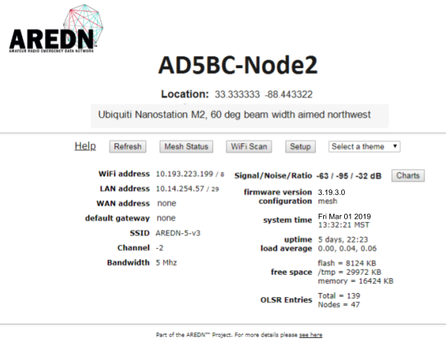
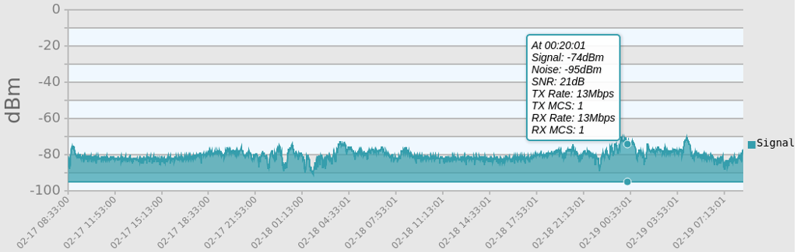
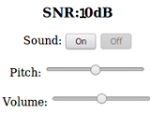
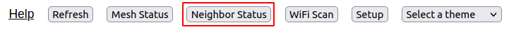

===================
Node Status Display
===================

Once you have completed the initial setup on your AREDN |trade| node, you can connect your computer to the LAN port on the :abbr:`PoE (Power over Ethernet)` and navigate to the following URL: ``http://localnode``. You will be redirected to the **Node Status** page as shown below.

|

Below the node name bar there are several controls.

Help
   Opens a new window or tab to display the node help page.

Refresh
   Updates the Node Status page with current data.

Mesh Status
   Opens the **Mesh Status** page showing the neighbor nodes and remote nodes visible on the mesh network, as well as what services are being provided by those nodes.

Neighbor Status
  If you have *Link Quality Manager* (LQM) enabled, you will also see a button which takes you to the **Neighbor Status** display. LQM is enabled/disabled from the **Advanced Configuration** page, and the settings for LQM are described in the **Configuration Deep Dive** section. The basic settings for *Link Quality Manager* are described below. The theory behind its operation is discussed in the AREDN |trade| *Link Quality Manager* section of the **How-To Guide**.

WiFi Scan
   Displays a list of other 802.11 signals that your node can see. The 802.11 signals may include Access Points, neighbor nodes, and other mesh networks (foreign ad-hoc networks).  WiFi Scan only finds devices on the same channel width as your node is configured to.  When installing at a new location, it is best practice to scan on 5, 10, and 20MHz channels to find all 802.11 signals in range.  This information will help to pick a channel clear of other interference.  When multiple ad-hoc networks are visible (with different SSIDs or channels), the ID of each 802.11 ad-hoc *network* is displayed but not the individual nodes. There is also an automatic scan mode, but running a Wifi Scan continuously is not recommended, particularly if the node is actively routing traffic.  The scan is passive, or only listens for other beacons through all channels, and risks loss of data on the assigned channel.  Wifi Scan does not transmit probes on every channel in passive mode, thus no risk of interfering with Radar stations on DFS channels, or other unintended transmissions.  Multiple attempts of Wifi Scan will be necessary to find all devices in range.

Setup
   Navigates to the **Setup** pages for your node. You will need to supply a username and password to access those pages. The username is always ``root``, while the password is the one you set during initial node setup. If the node has not yet been configured, the password is ``hsmm``.

Select Theme
   AREDN |trade| firmware has several built-in display themes. The default ``aredn`` theme has a gray background with black and red text. The ``black_on_white`` theme is often chosen because it provides the best screen contrast on a computer exposed to direct sunlight. ``red_on_black`` is much better suited for nighttime use since it helps preserve night vision.

Node Settings Summary
---------------------

The area under the display controls shows both configuration and network status information. The left column contains the IP address details for the network interfaces on this node, as well as the SSID, channel, and bandwidth settings.

The right column contains the Signal Strength readings and other attributes of your node. The **Signal/Noise/Ratio** shows the strongest neighbor radio signal strength in :abbr:`dBm (decibels relative to one milliwatt)` from all connected stations, and it is available only when the node is connected by :abbr:`RF (Radio Frequency)` to a mesh network. Click these links for further information about `Signal to Noise Ratio <https://en.wikipedia.org/wiki/Signal-to-noise_ratio>`_ and values measured in `decibels <https://en.wikipedia.org/wiki/Decibel>`_.

Below the Signal Strength readings are the node's **Firmware Version** and network type. The **System Time** is displayed, as well as the **Uptime**, or time since the last reboot. Nodes have no internal battery or realtime clock, so the time is reset every time the node is booted. If an Internet connection becomes available, the internal :abbr:`NTP (Network Time Protocol)` client will connect with a time server to sync the node's time.

The **Load Average** is the average number of processes that have been running on the node for the last 1, 5, and 15 minutes. **Free Space** tells you how much space is available on local storage devices. Flash is the internal non-volatile storage where the operating system, configuration files, and software packages are kept. /tmp is a filesystem in memory that stores the node's current status and various temporary files. **Memory** is the amount of :abbr:`RAM (Random Access Memory)` available for running processes on the node. The :abbr:`OLSR (Optimized Link State Routing protocol)` **Entries** show the total number of entries in the routing table, as well as the number of nodes currently connected to the mesh network.

Signal Charts
-------------

There is a **Charts** button next to the node's **Signal Strength** display, and clicking this button takes you to **Signal Charts**. This page shows :abbr:`RF (Radio Frequency)` signal information in both a realtime and an archived view. The default view shows the average signal of all connected stations in realtime.

At the top of the charts display there are several control buttons.

Archive
  This button shows the charts for any archived signal data on this node. Statistics are stored on the node in a circular buffer which holds about two days of data.

Realtime
  This button shows the charts for current signal data as seen from this node.

Quit
  This button exits the charts view and takes you back to the *Node Status* page.

Below these controls you can choose to view the signal strength statistics for individual nodes that are directly connected to your node. Choose the neighbor node from the **Selected Device** dropdown list. Changing the selected device will automatically reload the chart to show that node's information.

Hovering over data points within a chart will show additional information for each data point, including Time, Signal, Noise, :abbr:`SNR (Signal to Noise Ratio)`, TX Rate, TX :abbr:`MCS (Modulation Coding Scheme)`, RX Rate, and RX :abbr:`MCS (Modulation Coding Scheme)`. If no traffic is being routed to the neighbor, the Rate and MCS values may be zero until data is available. An MCS value of zero may indicate non-802.11n encoding schemes (ie. 802.11a/b/g).

The small icon with three vertical dots in the upper right corner of the chart allows you to download a snapshot of the chart to a graphic file on your local computer (jpeg or png).

Data shown in the **Archive** charts is not stored in permanent memory on the node. The node will store approximately two days of archived data, and all data is cleared when a node is rebooted.

If you click and drag your mouse across a region of the chart, the display will zoom into that selected area. This allows you to view data points for a specific time range of your choice. While zoomed, two additional icons will appear in the upper right of the chart. The **Pan** icon allows you to scroll and pan the zoomed portion of the chart. The **Reset** icon returns the chart to its normal display mode.

On the left of the Realtime Graph there is an **SNR Sound** control. Clicking the *On* button will cause your computer to emit a tone that corresponds to the relative SNR level, with higher pitch tones indicating better SNR. This feature was added in order to provide an audio queue to operators in the process of aligning directional antennas. When your antenna reaches a position at which the highest pitch tone is heard you can lock it down without having to look at the signal graph display, knowing that you are receiving the best signal available. You can also adjust the tone pitch and volume with the sliders on the sound control.

LQM Neighbor Status
-------------------

If you enabled *Link Quality Manager* (LQM), the *Neighbor Status* button will be visible and you can click it to navigate to the LQM *Neighbor Status* display.

*Neighbor Status* displays a table of neighbor nodes, their link quality metrics, and any actions *Link Quality Manager* has taken to improve the communication between nodes.

.. image:: _images/lqm-neigh-status.png
   :alt: LQM Neighbor Status display
   :align: center

|

RF Neighbor
  The neighbor node name with a clickable link to open that node's *Status* display.

SNR
  The Signal-to-Noise ratio in dB for both sides of the radio link.

Distance
  The calculated distance between your node and each listed node. This calculation is based on the GPS coordinates (Lat/Lon) that were entered on each node. If no GPS coordinates were entered, then the distance cannot be calculated and that metric will not be considered in the LQM improvement process.

Quality
  The Link Quality expressed as a percent. This is calculated as the moving average of total sent packets over total sent packets plus retransmissions. For example, if the node had to send every packet twice for it to be successfully received, the link quality would be 50%. An additional penalty is subtracted from Link Quality if the neighbor node is unpingable, which is explained in the *Advanced Configuration* section under "Ping Penalty".

Status
  The current status of each radio link. Valid status identifiers include:

  - *pending*: LQM is collecting data and evaluating the link.
  - *active*: LQM determined that the link is viable and can be used.
  - *idle*: LQM has determined that the link is usable and would be *active* but the node routing table does not yet have a route for sending traffic across the link.
  - *blocked*: LQM determined that the link is unusable and has blocked it from use.
  - *blocked - distance*: LQM determined that the remote node is either too close or too distant, based on the Min and Max Distance settings described in the *Advanced Configuration* section.
  - *blocked - signal*: LQM determined that the SNR on the link is too low to reliably pass data, based on the Min SNR setting described in the *Advanced Configuration* section.
  - *blocked - retries*: LQM determined that the retransmission rate was too high to reliably pass data.
  - *blocked - latency*: LQM determined that the link latency was to long to reliably pass data.
  - *blocked - dtd*: LQM blocks the RF interface on any nodes to which a DtD link also exists.
  - *blocked - dup*: LQM blocks a link in cases when your node has an RF link to other nodes which themselves connect to each other via DtD. This can occur when there are multiple radios at a site using the same channel. The best remote node is chosen as the RF link for your node but the other possible RF connections are blocked as duplicates.
  - *blocked - user*: LQM will block any node which you enter in the *User Blocked Nodes* field described in the *Advanced Configuration* section.
  - *disconnected*: This RF Neighbor is no longer online.

The *Neighbor Status* table will be refreshed automatically every minute as LQM evaluates your node's radio links on an ongoing basis. Links whose quality has improved may be activated, while links whose quality has worsened may be blocked. If an existing node link goes offline, it will age out of the list within about an hour. To refresh the neighbor list on demand you can click the **Refresh** button. If you want to return to the *Node Status* display, click the **Quit** button.

AREDN |trade| Alert Messages
----------------------------

The AREDN |trade| development team has the ability to post messages which Internet-connected nodes will automatically retrieve once every 12 hours by default. There are two types of messages: broadcast messages intended for all nodes, and directed messages which are only retrieved by individual nodes. Messages are displayed in a yellow banner on a node's webpages above the node name. Be aware that there is no guarantee of privacy for these messages, since anyone can view the message repository online.

.. image:: _images/aam-display.png
   :alt: AAM Display
   :align: center

Mesh nodes without Internet access also have the ability to display *Local Alerts*. The process for setting up a local message repository is described in the **Configuration Deep Dive** section. If a node has Internet access as well as local messages, then both types of messages will be displayed in the AREDN |trade| alerts banner as shown in the example above.
