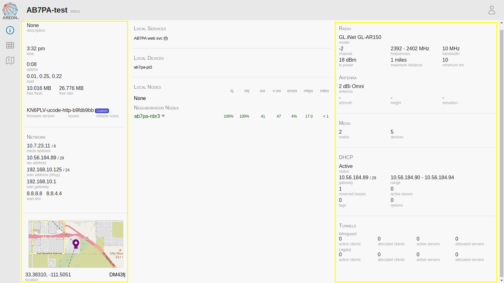

===================
Node Status Display
===================

Once you have completed the initial setup on your AREDN® node, you can connect your computer to a :abbr:`LAN (Local Area Network)` port on the device or the :abbr:`PoE (Power over Ethernet)` and use a web browser to navigate to the **node status** page.
``http://localnode.local.mesh`` or ``http://<your-nodename>.local.mesh``

|

This display has been designed to present all of the important information about your node in one place. Someone navigating to your node's status display will be able to see all of the key elements of interest without having to click to multiple pages. This display consists of a top bar, a left side bar, and three columns of information about your node.

Top Nav Bar
-----------

From left to right, after the AREDN® logo, the node name is displayed along with a label indicating whether you are viewing the *status* or *admin* display.

|icon1| At the far right is the default icon indicating that you are viewing the page as a normal user. Clicking this icon will open a dropdown menu that allows you to login as the node administrator.

|icon2| If this icon is displayed at the far right, then you are viewing the page as the node administrator. Clicking this icon will open a dropdown menu that allows you to logout, reboot the node, or display help.

Left Nav Bar
------------

Using the icons on the left side bar you can navigate to various displays.

|icon3| navigates to this **node status** display.

|icon4| navigates to the local mesh status page showing the nodes visible on the local mesh network, as well as any services are provided by those nodes.

|icon5| navigates to the *Cloud Mesh* view through the Supernode network (if available).

|icon6| navigates to the world map on the AREDN® website. This is only displayed if your node has valid latitude and longitude values, since this feature is designed to display your node in the center of the map. If your node has no latitude and longitude values, then this icon will not appear on the nav bar.

Left Column
-----------

Several sections of node information are presented here (listed from top to bottom).

Node Description
  This is not a required field, but node owners typically use it to list their contact information or the tactical purpose for the node.

Node Time, Uptime, Load Average, and Free Memory
  The node time is displayed, as well as the ``uptime``, which is the time since the last reboot. If an Internet connection or a local :abbr:`NTP (Network Time Protocol)` server is available, your node's NTP client will sync its time with that time source. The ``load`` is the average system utilization for the last 1, 5, and 15 minutes. ``free flash`` and ``free ram`` shows how much storage space is remaining on your node. ``flash`` is the internal non-volatile storage where the operating system, configuration files, and software packages are kept. ``ram`` is the amount of :abbr:`RAM (Random Access Memory)` available for running processes on the node.

Firmware Information
  This displays the node's current firmware version. A badge on the right indicates the status of the firmware, with valid values including ``Up to date``, ``Update available``, and ``Custom``. If your node has access to the Internet you can also click on the *issues* label below the firmware version, and this will open the AREDN® `Issues <https://github.com/aredn/aredn/issues>`_ page on GitHub. Clicking the *release notes* label will open the `Changelog <https://downloads.arednmesh.org/snapshots/CHANGELOG.md>`_ page on the AREDN® website.

Network Information
  The Mesh IP address/netmask is displayed using `CIDR <https://en.wikipedia.org/wiki/Classless_Inter-Domain_Routing>`_ notation, followed by the :abbr:`LAN (Local Area Network)` IP address/netmask. If the :abbr:`WAN (Wide Area Network)` interface is enabled, the WAN IP address/netmask is displayed along with whether this address was obtained via `DHCP <https://en.wikipedia.org/wiki/Dynamic_Host_Configuration_Protocol>`_ or assigned as a static IP address. The WAN gateway IP address is also displayed along with the IP(s) of the WAN `DNS servers <https://en.wikipedia.org/wiki/Domain_Name_System>`_.

Node Location Information
  At the bottom of the left column is the node location information. Initially there will be no location values since the latitude, longitude, and grid square have not yet been entered. After the latitude, longitude, and grid square have been entered (as described in the **Node Admin** guide), your node will attempt to display a thumbnail map with its location in the center. If your node has no access to the Internet or to a local map tile server, then the map will not be displayed. The latitude, longitude, and grid square values will be shown below the map thumbnail.

Center Column
-------------

The center column has three main sections (listed from top to bottom).

Local Services
  This section displays the service links for any mesh services on your node or its locally-connected devices. These service links are displayed side by side in two columns. Clicking any of the links will navigate to the selected service.

Local Devices
  This section displays any devices that are directly connected to your node. This includes devices that are connected to your node's :abbr:`LAN (Local Area Network)` via Ethernet cable (such as :abbr:`VoIP (Voice over IP)` phones, IP cameras, or service computers). Be aware that DHCP devices with *Do Not Propagate* checked will not be displayed under the *Local Devices* section.

  .. admonition:: Basic Link Quality Metrics

    Several link quality statistics can be displayed for different types of connections that are mentioned below. Before introducing those link types, here is a brief explanation of the link quality metrics that may be displayed.

    - ``lq`` or Link Quality is your node's view of the percent of `OLSR (Optimized Link State Routing protocol) <https://en.wikipedia.org/wiki/Optimized_Link_State_Routing_Protocol>`_ packets received from the neighbor node. These packets exchange mesh routing and advertised services information, and they include a sequence number that is used to identify missing packets. For example, if 7 of 10 packets sent by the neighbor were received, then the probability for a successful packet transmission from this neighbor is 7/10 = 0.7 = 70%.

    - ``nlq`` or Neighbor Link Quality is the neighbor node's view of the percent of :abbr:`OLSR (Optimized Link State Routing protocol)` packets received from your node.

    - ``snr`` or Signal-to-Noise Ratio is expressed in decibels (dB). This metric only applies to RF links and represents the level of signal which is detected above the noise floor. *SNR* is shown for both sides of the radio link (:abbr:`snr (signal to noise ratio)` and :abbr:`n snr (neighbor signal to noise ratio)`).

    - ``errors`` is calculated as the moving average of (total sent packets) divided by (total sent packets plus retransmissions) and expressed as a percent. For example, if the node had to send every packet twice for it to be successfully received, the error rate would be 50%. An additional penalty is subtracted if the neighbor node is unpingable.

    - ``mbps`` is a rolling average of the data rate achieved across any radio (RF) link. This column may show zero if the data being transmitted between these nodes is not sufficient for the metric to be calculated.

    - ``dist`` is the line of sight distance between your node and the remote node, calculated from the GPS coordinates if they are entered for both nodes.

Local Nodes
  This section displays any local :abbr:`DtD (Device to Device)` nodes that are directly connected to your node, typically via Ethernet cable. If you hover the cursor over the node name, a popup will appear showing the relative link quality of the connection to that node. Clicking the node name will navigate to that node's status page. For *Local Nodes* the snr, nsnr, mbps, and distance columns will always be blank.

Neighborhood Nodes
  This section displays any nodes that are direct neighbors of your node, whether via :abbr:`RF (radio frequency)`, an xlink, or a tunnel over an Internet connection. Each type of connection will display a different icon to the right of the node name, and this indicates the type of link (for example, the small radio signal icon in the screenshot above indicates an RF link). If a node is reachable from your node, you can click the node name to navigate to that node. Not all the columns for link quality statistics will be populated for *Neighborhood Nodes*. If you hover the cursor over the node name, a popup will appear showing the relative link quality of the connection to that node.

Right Column
------------

The right column displays additional details about your node (listed from top to bottom).

Radio section
  Your radio manufacturer and model are displayed at the top of the column. Next is the channel number and frequency range set on your radio, followed by the channel width (in :abbr:`MHz (Megahertz)`). Below that is the transmit power (in :abbr:`dBm (decibels in millivolts)`), the maximum distance (in miles), and the minimum :abbr:`snr (signal to noise ratio)` (in :abbr:`dB (decibels)`) set for communication with other :abbr:`RF (radio frequency)` nodes. Your node's antenna information is listed next, including the type of antenna, including the azimuth, height above ground level, and tilt angle / elevation (if directional).

Mesh section
  Next there are summary statistics showing how many nodes are currently visible on the network, as well as the total number of devices that exist on the mesh.

LAN DHCP section
  By default each node runs a `DHCP <https://en.wikipedia.org/wiki/Dynamic_Host_Configuration_Protocol>`_ server which is capable of automatically providing IP addresses for any LAN-connected devices. This section shows whether the :abbr:`DHCP (Dynamic Host Configuration Protocol)` server is enabled, and if so it displays the IP address/netmask of your node functioning as the gateway for its LAN-connected devices. It also shows the IP address range served by your node, any active leases, and any IP addresses that have been reserved for specific devices on its :abbr:`LAN (Local Area Network)`. In addition, counts are displayed for the number of active and reserved DHCP leases, as well as for the number of DHCP tags and options that are defined on your node.

Ethernet Ports & Xlinks
  If you have a multiport node or one which supports xlinks, then the *Ethernet Ports & Xlinks* section will be displayed. This shows the number of Ethernet ports on the device, as well as how many of them are actively in use. You will also see the number of xlinks that you have defined on this node.

Tunnels section
  This section displays statistics on any tunnel connections you may have on your node. The *Wireguard* section shows information for Wireguard tunnels, while the *Legacy* section shows information for the older vtun tunnels. Counts are displayed for active / allocated tunnel client connections as well as for active / allocated tunnel server connections on your node.

.. |icon1| image:: ../_icons/login.png
  :alt: Normal user view

.. |icon2| image:: ../_icons/login-auth.png
  :alt: Admin user view

.. |icon3| image:: ../_icons/status.png
  :alt: Node status view

.. |icon4| image:: ../_icons/mesh.png
  :alt: Local mesh view

.. |icon5| image:: ../_icons/cloudmesh.png
  :alt: Cloud mesh view

.. |icon6| image:: ../_icons/map.png
  :alt: World map view
