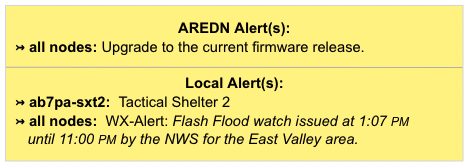

===================
Node Status Display
===================

Once you have completed the initial setup on your AREDN |trade| node, you can connect your computer to a LAN port on the device or the :abbr:`PoE (Power over Ethernet)` and use a web browser to navigate to the node status page.
``http://localnode.local.mesh`` or ``http://<your-nodename>.local.mesh``

.. image:: _images/node-status-columns.png
   :alt: Node Status display
   :align: center

This display consists of a top bar, a left side bar, and three columns of information about your node.

Top Nav Bar
-----------

From left to right, after the AREDN |trade| logo, the node name is displayed. At the far right is an icon indicating that you are viewing the page as a normal user. |icon1|

Left Nav Bar
------------

Using the icons on the left side bar you can navigate to various displays.

  |icon2| navigates to this node status display.

  |icon3| navigates to the local Mesh Status page showing the nodes visible on the local mesh network, as well as what services are being provided by those nodes.

  |icon4| navigates to the Cloud Mesh view through the Supernode network (if available).

Left Column
-----------

Several sections of node information are presented here (listed from top to bottom).

Node Description
  This is not a required field, but it is a good place to describe the features or function of this device. Many operators use this field to list their contact information, the radio model and antenna specifications, or the tactical purpose for the node. There are no character restrictions in the field, but the maximum length allowed is 210 characters.

Node Time, Uptime, Load Average, and Free Memory
  The node time is displayed, as well as the uptime, which is the time since the last reboot. If an Internet connection or a local :abbr:`NTP (Network Time Protocol)` server is available, your node's NTP client will sync its time with that time source. The load average is the average number of processes that have been running on the node for the last 1, 5, and 15 minutes. Free flash and free ram shows how much storage space is remaining on your node. *flash* is the internal non-volatile storage where the operating system, configuration files, and software packages are kept. *ram* is the amount of :abbr:`RAM (Random Access Memory)` available for running processes on the node.

Firmware Information
  This displays the node's current firmware version. A badge on the right indicates the status of the firmware.

Network Information
  The Mesh IP address/netmask is displayed using `CIDR <https://en.wikipedia.org/wiki/Classless_Inter-Domain_Routing>`_ notation, followed by the LAN IP address/netmask. If the WAN interface is enabled, the WAN IP address/netmask is displayed along with whether this address was obtained via `DHCP <https://en.wikipedia.org/wiki/Dynamic_Host_Configuration_Protocol>`_ or assigned as a static IP address. The WAN gateway IP address is also displayed along with the IP(s) of the WAN `DNS servers <https://en.wikipedia.org/wiki/Domain_Name_System>`_.

Node Location Information
  At the bottom of the left column is the node location information. If the latitude, longitude, and grid square have been entered for this node, a thumbnail map is displayed showing its location and coordinates.

Center Column
-------------

Right Column
------------

The right column displays additional information about your node.

Radio Information
  Your radio manufacturer and model are displayed at the top of the column. Next is the channel number and the frequency range which is set on your radio. 

The area under the control buttons shows both configuration and network status information. The left column contains the IP address and gateway details for the network interfaces on this node, as well as the SSID, channel, channel width, and frequency range if Mesh is enabled. If WAN Wifi Client is enabled it will also show the SSID and signal strength to the connected Access Point. If LAN AP is enabled then the LAN AP SSID will also be displayed.

The right column contains the Signal Strength readings and other attributes of your node. The **signal / noise / ratio** shows the strongest neighbor signal strength in :abbr:`dBm (decibels relative to one milliwatt)` from all connected stations, and it is available only when the node is connected to a neighbor node via :abbr:`RF (Radio Frequency)`. Click these links for further information about `Signal to Noise Ratio <https://en.wikipedia.org/wiki/Signal-to-noise_ratio>`_ and values measured in `decibels <https://en.wikipedia.org/wiki/Decibel>`_. There are many factors that impact the network throughput you can expect to achieve, but as a general rule the higher the Signal-to-Noise ratio the better the throughput for your RF links.

Below the Signal Strength readings are the node's **firmware version**, hardware **model**, and **antenna** info.  **host entries** shows the total number of devices seen on the network, and the total includes the AREDN |trade| nodes as well as any other networked devices such as computers, VoIP phones, PBX devices, cameras, and other hosts.

Signal Charts
-------------

There is a **Charts** button next to the node's **Signal Strength** display, and clicking this button takes you to **Signal Charts**. This page shows :abbr:`RF (Radio Frequency)` signal information in both a realtime and an archived view. The default view shows the average signal of all connected stations in realtime.

At the top of the charts display there are several control buttons.

Archive
  This button shows the charts for any archived signal data on this node. Statistics are stored on the node in a circular buffer which holds about two days of data.

Realtime
  This button shows the charts for current signal data as seen from this node.

Quit
  This button exits the charts view and takes you back to the *Node Status* page.

Below these controls you can choose to view the signal strength statistics for individual nodes that are directly connected to your node. Choose the neighbor node from the **Selected Device** dropdown list. Changing the selected device will automatically reload the chart to show that node's information.

Hovering over data points within a chart will show additional information for each data point, including Time, Signal, Noise, :abbr:`SNR (Signal to Noise Ratio)`, TX Rate, TX :abbr:`MCS (Modulation Coding Scheme)`, RX Rate, and RX :abbr:`MCS (Modulation Coding Scheme)`. If no traffic is being routed to the neighbor, the Rate and MCS values may be zero until data is available. An MCS value of zero may indicate non-802.11n encoding schemes (ie. 802.11a/b/g).

The small icon with three vertical dots in the upper right corner of the chart allows you to download a snapshot of the chart to a graphic file on your local computer (jpeg or png).

Data shown in the **Archive** charts is not stored in permanent memory on the node. The node will store approximately two days of archived data, and all data is cleared when a node is rebooted.

If you click and drag your mouse across a region of the chart, the display will zoom into that selected area. This allows you to view data points for a specific time range of your choice. While zoomed, two additional icons will appear in the upper right of the chart. The **Pan** icon allows you to scroll and pan the zoomed portion of the chart. The **Reset** icon returns the chart to its normal display mode.

.. image:: _images/snr-sound.png
   :alt: SNR Sound Control
   :align: left

On the left of the Realtime Graph there is an **SNR Sound** control. Clicking the *On* button will cause your computer to emit a tone that corresponds to the relative SNR level, with higher pitch tones indicating better SNR. This feature was added in order to provide an audio queue to operators in the process of aligning directional antennas. When your antenna reaches a position at which the highest pitch tone is heard you can lock it down without having to look at the signal graph display, knowing that you are receiving the best signal available. You can also adjust the tone pitch and volume with the sliders on the sound control.

WiFi Scan
---------

**WiFi Scan** initiates a *passive* scan for wifi signals that are within range, but it only reports devices on the same channel width as your node. When installing a node at a new location it is best practice to scan on 5, 10, and 20 MHz channel widths to find all other 802.11 signals in range. This information will help you to pick a channel clear of interference. Several scans may be necessary to find all devices in range. When multiple ad-hoc networks are visible (using different SSIDs or channels), the ID of each 802.11 *network* is displayed but not the individual nodes.

A passive scan does not transmit probes, so there is no risk that unintended transmissions will interfere with radar stations on DFS channels. Automatic scan mode is available, but running a scan continuously is not recommended if the node is actively routing traffic. Even though the auto-scan is passive and only listens for other beacons across all channels, there is a risk of data loss on the assigned channel.

.. attention:: With some devices, a scan will momentarily disconnect the wifi from the mesh so the radio is available to perform the scan operation. It is recommended that you perform a scan when connected to the device in some other way.

The scan results from your last scan are retained, along with the relative time since that scan was completed. If you only want to see the results from your last scan, you can go to the **Wifi Scan** page to view those results without having to initiate a fresh scan. Once a scan has finished, you can click the *Rescan* button to start a new scan. If you want your node to rescan continually you can click the *Auto* button. Click *Quit* to return to the **Node Status** display.

.. image:: _images/wifi-scan.png
   :alt: WiFi Scan
   :align: center

|

AREDN |trade| Alert Messages
----------------------------

AREDN |trade| Alert Messages are displayed in a yellow banner on a node's status page above the node name. There are three types of messages: broadcast messages intended for all nodes, group messages selected by labels in advanced settings and directed messages which are only retrieved by individual nodes. Individual nodes will attempt to pull the messages from the message repository URL once every 12 hours by default. Be aware that there is no guarantee of privacy for these messages, since anyone can view the message repository online. The AREDN |trade| development team also has the ability to post messages which Internet-connected nodes will automatically retrieve.

Mesh nodes without Internet access also have the ability to display *Local Alerts*. The process for setting up a local message repository is described in the **Configuration Deep Dive** section, which allows node owners to decide whether to opt in to receive local messages on each of their nodes. If a node has Internet access as well as local messages, then both types of messages will be displayed in the AREDN |trade| alerts banner as shown in the example above. There is also a web front-end application created by Gerard Hickey (WT0F) which runs directly on a node having adequate storage. You can find out more about this application in the **Applications and Services Guide** under the *Other Services* section.

------------------------

Channel and Channel Width
  Nodes communicate only with other nodes that use the same SSID, channel and channel width. You can determine the correct settings by talking with other local node operators to find out which settings are required for joining their networks.

See the **Configuration Deep Dive** section for more information about these and other settings in the *Mesh* column.

Power & Distance Settings
  If you have *Link Quality Manager* disabled, you will see the *Power & Distance* settings.

  - Use the dropdown list to select the maximum output power for this device. Remember that amateur operators are required to use the minimum power necessary to make contact with other stations.

  - Use the slider to select the maximum distance you estimate between your node and other neighboring nodes. The default value is *zero* which tells the node to automatically determine the correct distance value to the farthest neighbor node.

  - Some devices have max power levels that change depending on the channel or frequency being used, and in that case the max level may change when you save the settings. The output power will be capped at the max level supported by the hardware for that frequency.

Power & Link Quality Settings
  If you have *Link Quality Manager* enabled, you will see the *Power & Link Quality* settings.

  - Use the dropdown list to select the maximum output power for this device. Remember that amateur operators are required to use the minimum power necessary to make contact with other stations.

  - *Max Distance* is the maximum distance between nodes at which you can expect to achieve a usable radio link. The default value is 50 miles / 80 kilometers, but you can adjust this setting if your node is only able to maintain a usable radio link with nearby nodes.

  - *Min SNR* is the minimum Signal-to-Noise ratio that you require in order to reliably pass data between nodes. The default is 15 dB, but you can lower this value if you require your node to continue passing data even on links that have reduced signal characteristics.

  - *Min Quality* is the minimum Link Quality required in order to reliably pass data between nodes. This is calculated as the moving average of total sent packets over total sent packets plus retransmissions. For example, if the node had to send every packet twice for it to be successfully received, the link quality would be 50%.

Once you have entered, applied, and verified that your node settings are correct, click the **Save Changes** button. Your node will record the new configuration settings and automatically reboot.

Location Settings
  In this section you can enter your node's latitude and longitude, as well as the grid square designator. The values should be in decimal format (for example, 30.5432 and -95.1234). The node location settings are optional, but if you have *Link Quality Manager* enabled then the location becomes important for calculating the distance between linked nodes.

  .. image:: _images/basic-location.png
    :alt: Optional Settings - Location
    :align: center

There are several options for setting your node's location:

- If you are using a location-aware web browser, you can click the **Find Me** button to populate the latitude/longitude fields. This works well if you are viewing the *Basic Settings* page on a mobile device with built-in GPS.

- If your node has an Internet connection available, the **Show Map** and **Upload Data to AREDN Servers** buttons will become active. The **Show Map** button will display a map that allows you to click the position where your node is located or to drag an existing location marker to a different spot on the map. Both of these actions will automatically update the latitude/longitude fields on the page.

- The **Upload Data to AREDN Servers** button will send your node information to an AREDN |trade| server on the Internet. By submitting this information you are agreeing to allow AREDN |trade| to publish your node location on a public mapping service and utilize the information for other purposes such as statistical analysis. No sensitive data such as passwords are sent to the AREDN |trade| servers. If you wish to remove your node location from the public mapping service, simply clear or erase your latitude/longitude values, click *Apply Location Settings* and then *Upload Data to AREDN Servers*.

- **Antenna** information can also be entered for your node. The antenna type itself may be automatically populated based on your radio model. You may also enter the following deployment characteristics of your antenna: *Azimuth*, *Elevation* (up/down tilt), and *Height* (above ground level). Some values may not apply, such as azimuth and elevation if your node has an omnidirectional antenna.

- Click the **Apply Location Settings** button after entering new location information on this page. The new settings become active without clicking the *Save Changes* button.

Timezone and NTP Server
  Here you select the timezone for your node's system clock, and the default value is ``UTC``. You can also enter the hostname for a `Network Time Protocol (NTP) <https://en.wikipedia.org/wiki/Network_Time_Protocol>`_ source if your node is connected to a network which has a network time server. In the *NTP Server* field you should enter a valid hostname for the network time source, for example ``us.pool.ntp.org`` or ``AD5BC-ntp.local.mesh``. You may also choose how often NTP will update the node's clock by selecting a value from the dropdown list. The default is once per day [``daily``] but you may also select once per hour [``hourly``].

  .. image:: _images/basic-time.png
    :alt: Optional Settings - Time
    :align: center

  If your node is unable to connect to the NTP server specified here then it will briefly search for another NTP service which might be defined on your local mesh network. The node hosting that service must enter its Advertised Service with "NTP" as part of the service name. The protocol should be set to "ntp://", the hostname should point to the host providing the service, and the port should be set to "123", the standard NTP port. For example, ``ntp://ab7pa-box2.local.mesh:123`` would identify the NTP server portion of the Advertised Service. See the **Configuration Deep Dive** section for additional information about Advertised Services.

-------------------

.. |icon1| image:: _images/account-outline-custom.png
  :alt: Normal user account view

.. |icon2| image:: _images/information-outline-custom.png
  :alt: Node Information

.. |icon3| image:: _images/grid-custom.png
  :alt: Mesh View

.. |icon4| image:: _images/cloud-arrow-right-outline-custom.png
  :alt: Cloud Mesh View

.. |icon5| image:: _images/tools-custom.png
    :alt: Admin Tools
