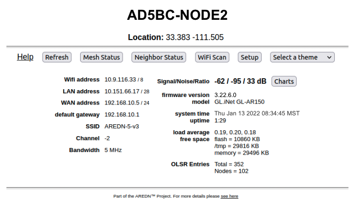
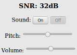

===================
Node Status Display
===================

Once you have completed the initial setup on your AREDN |trade| node, you can connect your computer to the LAN port on the :abbr:`PoE (Power over Ethernet)` and navigate to the following URL: ``http://localnode``. You will be redirected to the **Node Status** page as shown below.

----------

----------

Below the node name bar there are several controls.

**Help**
   Opens a new window or tab to display the node help page.

**Refresh**
   Updates the Node Status page with current data.

**Mesh Status**
   Opens the **Mesh Status** page showing the neighbor nodes and remote nodes visible on the mesh network, as well as what services are being provided by those nodes.

**WiFi Scan**
   Displays a list of other 802.11 signals that your node can see. The 802.11 signals may include Access Points, neighbor nodes, and other mesh networks (foreign ad-hoc networks), but only if they are using the same bandwidth settings as your node. When multiple ad-hoc networks are visible (with different SSIDs or channels), the *network* is displayed but not the individual nodes. There is also an automatic scan mode, but running a wifi scan continuously is not recommended because this will degrade mesh performance. A wifi scan transmits queries on all channels to discover other devices.

**Setup**
   Navigates to the **Setup** pages for your node. You will need to supply a username and password to access those pages. The username is always ``root``, while the password is the one you set during initial node setup. If the node has not yet been configured, the password is ``hsmm``.

**Select Theme**
   AREDN |trade| firmware has several built-in display themes. The default ``aredn`` theme has a gray background with black and red text. The ``black_on_white`` theme is often chosen because it provides the best screen contrast on a computer exposed to direct sunlight. ``red_on_black`` is much better suited for nighttime use since it helps preserve night vision.

Node Settings Summary
---------------------

The area under the display controls shows both configuration and network status information. The left column contains the IP address details for the network interfaces on this node, as well as the SSID, channel, and bandwidth settings.

The right column contains the Signal Strength readings and other attributes of your node. The **Signal/Noise/Ratio** shows the strongest neighbor radio signal strength in :abbr:`dBm (decibels relative to one milliwatt)` from all connected stations, and it is available only when the node is connected by :abbr:`RF (Radio Frequency)` to a mesh network. Click these links for further information about `Signal to Noise Ratio <https://en.wikipedia.org/wiki/Signal-to-noise_ratio>`_ and values measured in `decibels <https://en.wikipedia.org/wiki/Decibel>`_.

Below the Signal Strength readings are the node's **Firmware Version** and network type. The **System Time** is displayed, as well as the **Uptime**, or time since the last reboot. Nodes have no internal battery or realtime clock, so the time is reset every time the node is booted. If an Internet connection becomes available, the internal :abbr:`NTP (Network Time Protocol)` client will connect with a time server to sync the node's time.

The **Load Average** is the average number of processes that have been running on the node for the last 1, 5, and 15 minutes. **Free Space** tells you how much space is available on local storage devices. Flash is the internal non-volatile storage where the operating system, configuration files, and software packages are kept. /tmp is a filesystem in memory that stores the node's current status and various temporary files. **Memory** is the amount of :abbr:`RAM (Random Access Memory)` available for running processes on the node.

The :abbr:`OLSR (Optimized Link State Routing protocol)` **Entries** show the total number of entries in the routing table, as well as the number of nodes currently connected to the mesh network.

Signal Charts
-------------

There is a **Charts** button next to the node's **Signal Stength** display, and clicking this button takes you to **Signal Charts**. This page shows :abbr:`RF (Radio Frequency)` signal information in both a realtime and an archived view. The default view shows the average signal of all connected stations in realtime.

.. image:: _images/04-node-charts.png
   :alt: Node Charts
   :align: center

At the top of the charts display there are several control buttons.

**Archive**
  This button shows the charts for any archived signal data on this node.

**Realtime**
  This button shows the charts for current signal data as seen from this node.

**Quit**
  This button exits the charts view and takes you back to the *Node Status* page.

Below these controls you can choose to view the signal strength statistics for individual nodes that are directly connected to your node. Choose the neighbor node from the **Selected Device** dropdown list. Changing the selected device will automatically reload the chart to show that node's information.

Hovering over data points within a chart will show additional information for each data point, including Time, Signal, Noise, :abbr:`SNR (Signal to Noise Ratio)`, TX Rate, TX :abbr:`MCS (Modulation Coding Scheme)`, RX Rate, and RX :abbr:`MCS (Modulation Coding Scheme)`. If no traffic is being routed to the neighbor, the Rate and MCS values may be zero until data is available. An MCS value of zero may indicate non-802.11n encoding schemes (ie. 802.11a/b/g).

The small icon with three vertical dots in the upper right corner of the chart allows you to download a snapshot of the chart to a graphic file on your local computer (jpeg or png).

Data shown in the **Archive** charts is not stored in permanent memory on the node. The node will store approximately two days of archived data, and all data is cleared when a node is rebooted.

If you click and drag your mouse across a region of the chart, the display will zoom into that selected area. This allows you to view data points for a specific time range of your choice. While zoomed, two additional icons will appear in the upper right of the chart. The **Pan** icon allows you to scroll and pan the zoomed portion of the chart. The **Reset** icon returns the chart to its normal display mode.

On the left of the Realtime Graph there is an **SNR Sound** control. Clicking the *On* button will cause your computer to emit a tone that corresponds to the relative SNR level, with higher pitch tones indicating better SNR. This feature was added in order to provide an audio queue to operators in the process of aligning directional antennas. When your antenna reaches a position at which the highest pitch tone is heard you can lock it down without having to look at the signal graph display, knowing that you are receiving the best signal available. You can also adjust the tone pitch and volume with the sliders on the sound control.

.. |trade|  unicode:: U+00AE .. Registered Trademark SIGN
   :ltrim:
