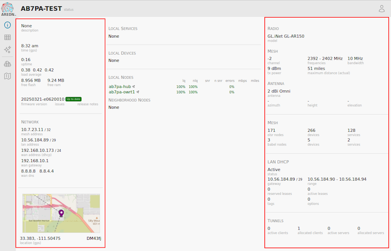
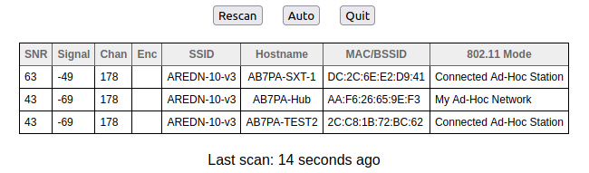

===================
Node Status Display
===================

Once you have completed the initial setup on your AREDN |trade| node, you can connect your computer to the LAN port on the :abbr:`PoE (Power over Ethernet)` and navigate to the following URL: ``http://localnode.local.mesh``. You will be redirected to the **Node Status** page as shown below.

|

Below the node name bar there are several controls.

Help
   Opens a new window or tab to display the node help page.

Refresh
   Updates the Node Status page with current data.

Mesh Status
   Opens the **Mesh Status** page showing the neighbor nodes and remote nodes visible on the mesh network, as well as what services are being provided by those nodes.

WiFi Scan
   Displays a list of other 802.11 signals within range of your node. The 802.11 signals may include Access Points, neighbor nodes, and other mesh networks (foreign ad-hoc networks). WiFi Scan is described in more detail below.

Setup
   Navigates to the **Setup** pages for your node. You will need to supply a username and password to access those pages. The username is always ``root``, while the password is the one you set during initial node setup. If the node has not yet been configured, the password is ``hsmm``.

Select Theme
   AREDN |trade| firmware has several built-in display themes. The default ``aredn`` theme has a gray background with black and red text. The ``black_on_white`` theme is often chosen because it provides the best screen contrast on a computer exposed to direct sunlight. ``red_on_black`` is much better suited for nighttime use since it helps preserve night vision.

Node Settings Summary
---------------------

The area under the control buttons shows both configuration and network status information. The left column contains the IP address and gateway details for the network interfaces on this node, as well as the SSID, channel, channel width, and frequency range if Mesh is enabled. If WAN Wifi Client is enabled it will also show the SSID and signal strength to the connected Access Point. If LAN AP is enabled then the LAN AP SSID will also be displayed.

The right column contains the Signal Strength readings and other attributes of your node. The **signal / noise / ratio** shows the strongest neighbor signal strength in :abbr:`dBm (decibels relative to one milliwatt)` from all connected stations, and it is available only when the node is connected to a neighbor node via :abbr:`RF (Radio Frequency)`. Click these links for further information about `Signal to Noise Ratio <https://en.wikipedia.org/wiki/Signal-to-noise_ratio>`_ and values measured in `decibels <https://en.wikipedia.org/wiki/Decibel>`_. There are many factors that impact the network throughput you can expect to achieve, but as a general rule the higher the Signal-to-Noise ratio the better the throughput for your RF links.

Below the Signal Strength readings are the node's **firmware version**, hardware **model**, and **antenna** info. The **system time** is displayed, as well as the **uptime**, which is the time since the last reboot. If an Internet connection or a local :abbr:`NTP (Network Time Protocol)` server is available, your node's NTP client will sync its time with that time source.

The **load average** is the average number of processes that have been running on the node for the last 1, 5, and 15 minutes. **available space** tells you how much storage space is remaining on your node. *flash* is the internal non-volatile storage where the operating system, configuration files, and software packages are kept. *memory* is the amount of :abbr:`RAM (Random Access Memory)` available for running processes on the node. **host entries** shows the total number of devices seen on the network, and the total includes the AREDN |trade| nodes as well as any other networked devices such as computers, VoIP phones, PBX devices, cameras, and other hosts.

Signal Charts
-------------

There is a **Charts** button next to the node's **Signal Strength** display, and clicking this button takes you to **Signal Charts**. This page shows :abbr:`RF (Radio Frequency)` signal information in both a realtime and an archived view. The default view shows the average signal of all connected stations in realtime.

.. image:: _images/node-charts.png
   :alt: Node Charts
   :align: center

At the top of the charts display there are several control buttons.

Archive
  This button shows the charts for any archived signal data on this node. Statistics are stored on the node in a circular buffer which holds about two days of data.

Realtime
  This button shows the charts for current signal data as seen from this node.

Quit
  This button exits the charts view and takes you back to the *Node Status* page.

Below these controls you can choose to view the signal strength statistics for individual nodes that are directly connected to your node. Choose the neighbor node from the **Selected Device** dropdown list. Changing the selected device will automatically reload the chart to show that node's information.

Hovering over data points within a chart will show additional information for each data point, including Time, Signal, Noise, :abbr:`SNR (Signal to Noise Ratio)`, TX Rate, TX :abbr:`MCS (Modulation Coding Scheme)`, RX Rate, and RX :abbr:`MCS (Modulation Coding Scheme)`. If no traffic is being routed to the neighbor, the Rate and MCS values may be zero until data is available. An MCS value of zero may indicate non-802.11n encoding schemes (ie. 802.11a/b/g).

The small icon with three vertical dots in the upper right corner of the chart allows you to download a snapshot of the chart to a graphic file on your local computer (jpeg or png).

Data shown in the **Archive** charts is not stored in permanent memory on the node. The node will store approximately two days of archived data, and all data is cleared when a node is rebooted.

If you click and drag your mouse across a region of the chart, the display will zoom into that selected area. This allows you to view data points for a specific time range of your choice. While zoomed, two additional icons will appear in the upper right of the chart. The **Pan** icon allows you to scroll and pan the zoomed portion of the chart. The **Reset** icon returns the chart to its normal display mode.

.. image:: _images/snr-sound.png
   :alt: SNR Sound Control
   :align: left

On the left of the Realtime Graph there is an **SNR Sound** control. Clicking the *On* button will cause your computer to emit a tone that corresponds to the relative SNR level, with higher pitch tones indicating better SNR. This feature was added in order to provide an audio queue to operators in the process of aligning directional antennas. When your antenna reaches a position at which the highest pitch tone is heard you can lock it down without having to look at the signal graph display, knowing that you are receiving the best signal available. You can also adjust the tone pitch and volume with the sliders on the sound control.

WiFi Scan
---------

**WiFi Scan** initiates a *passive* scan for wifi signals that are within range, but it only reports devices on the same channel width as your node. When installing a node at a new location it is best practice to scan on 5, 10, and 20 MHz channel widths to find all other 802.11 signals in range. This information will help you to pick a channel clear of interference. Several scans may be necessary to find all devices in range. When multiple ad-hoc networks are visible (using different SSIDs or channels), the ID of each 802.11 *network* is displayed but not the individual nodes.

A passive scan does not transmit probes, so there is no risk that unintended transmissions will interfere with radar stations on DFS channels. Automatic scan mode is available, but running a scan continuously is not recommended if the node is actively routing traffic. The auto-scan is passive and only listens for other beacons across all channels, but there is a risk of data loss on the assigned channel.

Once the scan has finished, you can click the *Refresh* button to start a new scan. If you want your node to rescan continually you can click the *Auto* button. Click *Quit* to return to the **Node Status** display.

|

AREDN |trade| Alert Messages
----------------------------

AREDN |trade| Alert Messages are displayed in a yellow banner on a node's status page above the node name. There are three types of messages: broadcast messages intended for all nodes, group messages selected by labels in advanced settings and directed messages which are only retrieved by individual nodes. Individual nodes will attempt to pull the messages from the message repository URL once every 12 hours by default. Be aware that there is no guarantee of privacy for these messages, since anyone can view the message repository online. The AREDN |trade| development team also has the ability to post messages which Internet-connected nodes will automatically retrieve.

.. image:: _images/aam-display.png
   :alt: AAM Display
   :align: center

Mesh nodes without Internet access also have the ability to display *Local Alerts*. The process for setting up a local message repository is described in the **Configuration Deep Dive** section, which allows node owners to decide whether to opt in to receive local messages on each of their nodes. If a node has Internet access as well as local messages, then both types of messages will be displayed in the AREDN |trade| alerts banner as shown in the example above. There is also a web front-end application created by Gerard Hickey (WT0F) which runs directly on a node having adequate storage. You can find out more about this application in the **Applications and Services Guide** under the *Other Services* section.
