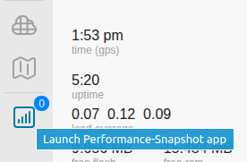

===================
Custom App Launcher
===================

There may be times when you want to create your own customer application to run on your node, and you would like to include a custom launcher icon in the left nav bar of the web interface. This can be accomplished using the following steps:

1. Create a subdirectory tree under your node's ``/www/`` directory to store your application executable. In the example below the name of the application is ``Performance-Snapshot``, so the directory path will be:

::

  # /www/cgi-bin/apps/Performance-Snapshot/

Copy your application executable into this directory and change the filename to ``user`` if you want the launcher to be visible to everyone. If you only want the launcher to be visible when logged in, change the application's filename to ``admin``.

2. Create a subdirectory tree under your node's ``/www/`` directory to store your application's launcher icon (SVG format only). Since the name of the application is ``Performance-Snapshot``, the directory path will be:

::

  # /www/apps/Performance-Snapshot/

Copy your application icon into this directory and change the filename to ``icon.svg``.

3. At this point you can reboot your node or simply restart ``uhttpd`` on your node. The new application launcher icon should be visible in the left nav bar, and clicking that icon should open a new browser window or tab for your application to run in.

