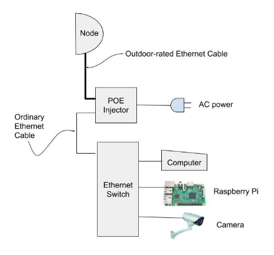

================
Beginner's Guide
================

*Contributor: Orv Beach W6BI*

What it’s all about
-------------------

By loading the AREDN® firmware in a outdoor wireless access point, you can join a ham radio network. It’s like the Internet but runs on ham radio frequencies, mostly in the 2.4, 3.4, and 5.8 GHz bands. By joining this network you can find and use all sorts of applications (known as “services”). Anything running on a server, like weather stations, web sites showing site conditions, and email servers can be provided as a service. There are also services that don’t rely on a browser: video streams, chat servers, and VOIP PBXes. The network can also be used to connect Winlink stations, Dstar and DMR repeaters, and Allstar devices. Pretty much any kind of service you can put on the Internet you can put on the AREDN® network, subject to the restrictions of the ham radio regulations (FCC “Part 97”).

RF access to the network
------------------------

How do you find out where the nearest network node is? There are several ways:

- Check the mesh map at arednmesh.org. If you don’t find one near your QTH, don’t despair; the map only shows a fraction of the nodes on the air. If you’re in any of these areas, there are realtime network maps that can help you determine if there’s a node in your area.

  - Central & Southern California: https://mapping.kg6wxc.net/meshmap
  - Yakima, WA: http://ka7hak.thatip.net:7773/meshmap
  - Oregon: https://arden.k9rcp.net/meshmap/map_display.php
  - San Franciso Bay Area: https://sfmap.xojs.org/
  - Hawaii: http://42561.noip.us:8888/meshmap

- Create an account on arednmesh.org and see if there’s a Regional Forum for your area. Ask there for local information. If you don’t find a regional forum for your area, get it started by asking the webmaster, Randy WU2S, to create one for you. Search for his callsign using the search function, and by finding it you’ll be able to drop him a note. Once it’s created, create a post mentioning you’d like to get started and asking if there’s any activity near you.

- Ask around your local ham club or on a local net.

These network nodes behave very much like handie-talkies. That is, they’re low power and line of sight, so you typically end up talking to a network node on a hilltop, mountaintop, or some other elevated location (e.g. water tower).
So if you determine there is a local node, how do you find out if you can reach it?

For these devices, line of sight is REALLY line of sight; they don’t do trees well at all. There are a number of on-line LOS calculators, ranging from simple to use to really complex. A simple one is at https://heywhatsthat.com. By entering your location, expected elevation of your node, and naming it, the site will generate a coverage plot for you. You can do this for your QTH and/or any existing local nodes. (See the *Network Design Guide* for other tools.)

Alternative to RF network access
++++++++++++++++++++++++++++++++

If after doing your research you find that you don’t have any RF path to the network, don’t despair; there is an alternative. The nodes have the capability of ‘tunneling’ over the Internet to another node. While this isn’t a radio connection, it will let you get on the network until such time as the network has grown into your area.

In order to establish a tunnel, you’ll need an additional piece of network equipment beyond the node itself. The current preferred device is the Mikrotik hAP AC Lite router which when running AREDN® firmware will provide your node access to the Internet (plus a host of other really useful features when running a ham network in your shack). Current price on Amazon is about $50.

Recommended equipment
---------------------

The following recommendations are for a home station. Recommendations for network nodes on hilltops are likely to be different and beyond the scope of this introductory article. In order to ensure good performance you need a strong RF link to the network. Like most other ham radio activities, more gain is better than less. And even if you have two nodes within range the node’s routing software will always pick the strongest one as your path into the network. Omnidirectional antennas are discouraged and dish antennas greatly preferred.

All of the equipment using dish antennas supported by AREDN® use electronics integrated into the feedpoint: two transceivers, two modems, and an embedded computer with RAM, ROM, and a network interface. They are all POE-enabled (Power Over Ethernet). This avoids having to run both a network cable and a power cable up a mast to the node. A web interface is used to control and configure the device.

Obviously your equipment will need to be on the same band as the node you want to connect to. If there are both 2 GHz and 5 GHz nodes equidistant from you with similar path characteristics, choose 5 GHz. That band is quieter, there’s more bandwidth, more channels, and the gear is about the same cost (and in some cases noticeably less).

Fortunately AREDN® now supports dozens devices (including new ones added in the nightly builds), so there are many options when choosing what to buy. The AREDN® team has flagged *Sunset devices* that are no longer recommended for new purchase in the `Supported Platform Matrix: <https://www.arednmesh.org/content/supported-devices-0>`_. The Mikrotik dishes may be slightly less durable than equivalent Ubiquiti dishes, so if you live where there’s severe icing choose more rugged equipment. Reportedly the Mikrotik receivers may be slightly more sensitive than Ubiquiti, and Mikrotik dishes are lighter, making them more suitable for portable work (e.g., go boxes), but both brands work well.

Important considerations
++++++++++++++++++++++++

- The older models of equipment have less flash memory and RAM than current versions. The latest AREDN® firmware runs on these devices but there are not enough resources to run services like tunnels. As time goes on the AREDN® firmware grows slowly, so at some point in time it will no longer fit in the available resources of older devices. Don’t buy any used equipment unless you know it has at least 16 MB of flash and 64 MB of RAM and is “MIMO”.

- Do not stand in front of the radio for extended periods of time when it’s powered on. NEVER look into the focus of the radio when it’s powered on. These small dishes have 80-100 watts of ERP at 5.8 Ghz! The Mikrotik Basebox 2 has 30 dBm of power output. When fed to a Mikrotik 30dB gain dish, that’s 1 KW of ERP. Use caution!

5 GHz Options
+++++++++++++

Ubiquiti
  Ubiquiti provides three models with dish antennas, having increasing amounts of gain. If you aren’t certain, choose the PBE-M5-400 for the additional gain, unless you think you need the additional gain of the 620 and can afford it. But it’s big and heavy and will strike fear into the hearts of your neighbors.

  - Powerbeam PBE-M5-300 (300 = dish diameter in millimeters) - 22 dBi gain, 2.65 pounds
  - Powerbeam PBE-M5-400 - 25 dBi gain, 3.87 pounds
  - Powerbeam PBE-M5-620 - 29 dBi gain, 14.11 pounds

Mikrotik
  Mikrotik has several models that work well for 5 GHz coverage.

  - RBLHG-5nD - Routerboard Lite Head Grid - 390 mm dish, 24.5 dBi gain, 1.3 pounds
  - RBLHG-5HPnD-XL - Routerboard Lite Head Grid High Power - 550 mm dish, 27 dBi gain, 2.1 pounds
  - QRT 5 - Flat panel antenna – Approx. 11” square, 24 dBi gain, 10° beamwidth
  - LDF 5 - Light Data Feed - By itself it only has 9 dBi gain, but it’s made to be mounted in a standard 40 mm satellite dish mount. Those typically will provide overall gain of 22-25 dBi. These are perfect if you live in an area with a restrictive HOA. Your neighbors will never notice the dish isn’t pointed up at some synchronous satellite. About $50-60 on Amazon, and the universal mount is available for about seven dollars from Amazon (https://amzn.to/34QCvSj).

2 GHz Options
+++++++++++++

If your only accessible local node is on 2 GHz, you still have several options. Because of the lower frequency, dishes will be larger for the same gain.

**Ubiquiti**

- Powerbeam PBE-M2-400 - 420 mm dish, 18 dBi gain, 3.96 pounds

**Mikrotik**

- Mikrotik RBLHG-2nD – 18 dBi gain, 1.25 pounds
- Mikrotik RBLHG-2nDXL – 21 dBi gain, 2.1 pounds

Indoor Radios
+++++++++++++

Mikrotik
  The *Mikrotik hAP ac lite (RB952Ui-5ac2nD)* is a five-port router. It provides a seamless method for integrating the ham radio network into your ham shack network. When running AREDN® firmware, it provides:

  - One port to connect to your outside node (a “DtD” - Device to Device port). POE power for the node can be enabled on this port.
  - One port to connect to your home router for Internet access (necessary if you need to tunnel your node to another node for network access).
  - Three ports that can be used to connect your shack PC to both the Internet and the mesh network, eliminating the need for two computers in the shack, one on each network. Two spare ports can be for things like cameras, VOIP phones or Raspberry Pi computers.

  Over and above those features, the *hAP ac lite* has two internal radios (2.4 and 5.8 GHz). Either can be configured for mesh RF or as a wireless access point. Having a wireless Part 15 access point on your shack’s ham network is very handy, since you can link your laptop or smartphone to it wirelessly and have access to both the Internet and the mesh network. Either of the internal radios can be configured as a wireless WAN access client, which is handy if you’re traveling and are in a hotel that charges for Internet access on a per-device basis.

GL-iNet
  There are several GL-iNet devices which work well as indoor nodes. Some of them are dual-band (both 2 GHz and 5 GHz).

Configuring your node
---------------------

After you have your equipment in hand, you need to install the AREDN® firmware, configure its settings, and put it up in the air. Installation and configuration of the firmware is covered in the **Installing AREDN® Firmware** and **Basic Radio Setup** sections of the *Getting Started Guide*.

Aiming High Gain Antennas
-------------------------

Note that the higher the gain, the narrower the beamwidth and the trickier it is to aim these dishes accurately. Fortunately, some aiming tools have been added to the AREDN® firmware that help in setting up the dish in the correct direction and elevation. Remember that the vertical beamwidth is as narrow as the horizontal beamwidth. Review the **Tips for Aiming Directional Antennas** document in the **How-To Guides** section for more information.

Typical Node Deployments
------------------------

Here are some typical deployment scenarios for connecting an AREDN® node with PoE power adapters and computers.

.. figure:: _images/orv-basic-install.png
  :alt: Basic Deployment
  :align: center

  Figure 1: Basic Installation

  Figure 2: Basic Installation with added Ethernet switch

  .. figure:: _images/orv-basic-install-hap.png
    :alt: Basic Deployment with Mikrotik hAP ac lite
    :align: center

    Figure 3: Basic Installation with Mikrotik hAP ac lite
