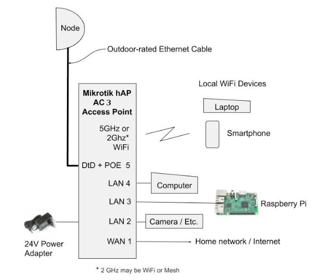
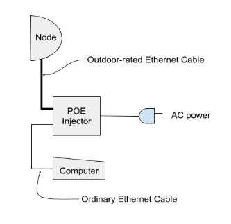

================
Beginner's Guide
================

*Contributor: Orv Beach W6BI*

What it’s all about
-------------------

By loading the AREDN® firmware in a outdoor wireless access point, you can join a ham radio network. It’s like the Internet but runs on ham radio frequencies, mostly in the 5.8 GHz band. The network is growing steadily, but the number of accessible nodes in your area can range from plentiful to none within hundreds of miles. By joining this network you can find and use all sorts of applications (known as “services”). Anything running on a server, like weather stations, web sites showing site conditions, and email servers can be provided as a service. There are also services that don’t rely on a browser: video streams, chat servers, and VOIP PBXes. The network can also be used to connect Winlink stations, Dstar and DMR repeaters, and Allstar devices. Pretty much any kind of service you can put on the Internet you can put on the AREDN® network, subject to the restrictions of the ham radio regulations (FCC “Part 97”).

RF access to the network
------------------------

**How do you find out where the nearest network node is?**

There are several ways:

- Check the worldwide map at `worldmap.arednmesh.org <https://worldmap.arednmesh.org/>`_.

- Create an account on arednmesh.org and see if there’s a Regional Forum for your area. Ask there for local information. If you don’t find a regional forum for your area, get it started by asking the webmaster, Randy WU2S, to create one for you. Search for his callsign using the search function, and by finding it you’ll be able to drop him a note. Once it’s created, create a post mentioning you’d like to get started and asking if there’s any activity near you.

- Ask around your local ham club or on a local net.

**If you determine there is a local node, how do you find out if you can reach it?**

For these devices, line of sight is REALLY line of sight; they don’t do trees well at all. There are a number of online LOS calculators, ranging from simple to use to really complex. A simple one is at https://heywhatsthat.com. By entering your location, expected elevation of your node, and naming it, the site will generate a coverage plot for you. You can do this for your QTH and/or any existing local nodes. (See the *Network Design Guide* for other tools.)

Alternative to RF access
++++++++++++++++++++++++

If after doing your research you find that you don’t have any RF path to the network, don’t despair; there is an alternative. The nodes have the capability of ‘tunneling’ over the Internet to another node. While this isn’t a radio connection, it will let you get on the network until such time as the network has grown into your area.

In order to establish a tunnel, you’ll need an additional piece of network equipment beyond the node itself. The current preferred device is the ``Mikrotik hAP ac3`` router which when running AREDN® firmware will provide your node access to the Internet, plus a host of other really useful features when running a ham network in your shack.

Recommended equipment
---------------------

The following recommendations are for a home station. Recommendations for network nodes on hilltops are likely to be different and beyond the scope of this introductory article. In order to ensure good performance you need a strong RF link to the network. Like most other ham radio activities, more gain is better than less. And even if you have two nodes within range the node’s routing software will always pick the strongest one as your path into the network. Omnidirectional antennas are discouraged and dish antennas greatly preferred.

All of the equipment using dish antennas supported by AREDN® use electronics integrated into the feedpoint: two transceivers, two modems, and an embedded computer with RAM, ROM, and a network interface. They are all POE-enabled (Power Over Ethernet). This avoids having to run both a network cable and a power cable up a mast to the node. A web interface is used to control and configure the device. Your equipment will need to be on the same band as the node you want to connect to. If there are both 2 GHz and 5 GHz nodes equidistant from you with similar path characteristics, choose 5 GHz. That band is quieter, there’s more bandwidth, more channels, and the gear is about the same cost.

Fortunately AREDN® now supports dozens devices (including new ones added in the nightly builds), so there are many options when choosing what to buy. The AREDN® team has flagged *Sunset devices* that are no longer recommended for new purchase in the `Supported Platform Matrix: <https://www.arednmesh.org/content/supported-devices-0>`_. The Mikrotik dishes may be slightly less durable than equivalent Ubiquiti dishes, so if you live where there’s severe icing choose more rugged equipment. Mikrotik dishes are lighter, making them more suitable for portable work (e.g., go boxes), but both brands work well.

Short haul options
++++++++++++++++++

- Mikrotik SXTsqG-5acD 16 dBi gain (~10-12 miles)
- Ubiquti Nanostation 5ac 16 dBi gain (~ 10-12 miles)

Long haul options
+++++++++++++++++

- Ubiquiti LiteBeam ac gen2 23 dBi gain
- Ubiquiti PowerBeam ac 500 25 dBi gain
- Mikrotik RBLHGG-5acD 24.5 dBi gain
- Mikrotik RBLHGG-5acD-XL 27 dBi gain

In the shack
++++++++++++

The **Mikrotik hAP ac3** (RBD53iG-5HacD2HnD) is a five-port router. It provides a seamless method for integrating the ham radio network into your ham shack network. When running AREDN® firmware, its ports can be configured to provide any of the following functions:

- DTD = Device to Device port to connect directly to another AREDN® node.
- WAN = to connect to your home router for Internet access.
- LAN = to connect your shack PC to both the Internet and the mesh network, eliminating the need for two computers in the shack, one on each network. Two spare ports can be for things like cameras, VOIP phones or Raspberry Pi computers.

Over and above those features, the *hAP ac3* has two internal radios (2.4 and 5.8 GHz). Either can be configured for mesh RF or as a wireless access point. Having a wireless Part 15 access point on your shack’s ham network is very handy, since you can link your laptop or smartphone to it wirelessly and have access to both the Internet and the mesh network.

Configuring your node
---------------------

After you have your equipment in hand, you need to install the AREDN® firmware, configure its settings, and put it up in the air. Installation and configuration of the firmware is covered in the **Installing AREDN® Firmware** and **Firstboot Node Setup** sections of the *Getting Started Guide*.

Aiming high gain antennas
-------------------------

Note that the higher the gain, the narrower the beamwidth and the trickier it is to aim these dishes accurately. Fortunately, some aiming tools have been added to the AREDN® firmware that help in setting up the dish in the correct direction and elevation. Remember that the vertical beamwidth is as narrow as the horizontal beamwidth. Review the **Tips for Aiming Directional Antennas** document in the **How-To Guides** section for more information.

Tools for planning your network
-------------------------------

The **Network Modeling** section of the *Network Design Guide* describes several external tools that may be helpful for planning your network. These include calculators for determining and visualizing a radio path, the Fresnel zone, and using computer modeling to estimate network coverage.

Example node deployments
------------------------

Here are some typical deployment scenarios for connecting an AREDN® node with PoE power adapters and computers.

  Figure 1: Basic Installation

  Figure 2: Basic Installation with added Ethernet switch
