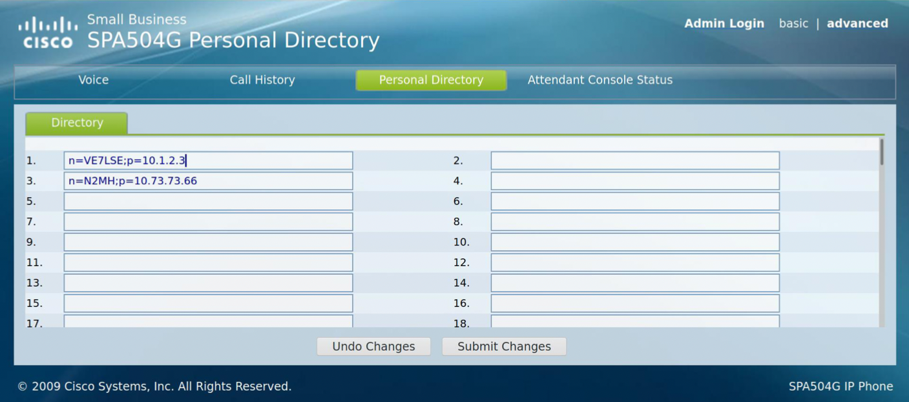

==========================
Cisco Phone Direct Calling
==========================

*Contributors: Mark N2MH, Rich VE7BEF, Devan VE7LSE*

This HowTo describes the process of configuring direct IP address dialing for Cisco SPA525G And SPA504G Phones.

SPA525G Phones
--------------

**General Notes**

* All steps are done as *Administrator* on the phone's *Advanced* webpage.
* This setup will configure the last extension and line key for direct IP-dial calls, leaving extension 1/line key 1 for PBX calls.
* It is good practice to ``Submit All Changes`` after each step even though it may be unnecessary.
* Outgoing calls may be placed from the personal directory, speed dial buttons, or the dial pad. When using the dial pad, end the ip address with a ``#`` character. This will send the call out immediately.
* If you like, you can publish your phone’s IP number on your node's *Mesh Status* page so others can see how to dial your phone directly.
* If you are replacing an existing speed dial button with the new direct dialing line, make sure to remove the existing info in the “Short Name” and “Extended Functions” boxes.

**Steps to Allow INCOMING Direct IP-Dialed Calls**

**Ext 1 tab** > SIP Settings > SIP Port: ``5070``

  .. image:: _images/cisco-voip-1.png
     :alt: Ext 1 Tab
     :align: center

**Ext 5 tab** (or any free Ext)

  * General > Line Enable: ``yes``
  * SIP Settings > SIP Port: ``5060``

  .. image:: _images/cisco-voip-2.png
     :alt: Ext 5 Tab
     :align: center

**Proxy and Registration**

  * Register: ``no``
  * Make Call Without Reg: ``yes``
  * Ans Call Without Reg: ``yes``
  * Subscriber Information > Display Name > Enter your Call and "DIRECT" as shown below

  .. image:: _images/cisco-voip-3.png
     :alt: Registration
     :align: center

**Dial Plan**

  * Dial Plan: ``(x.<*:.>x.<*:.>x.<*:.>x.)``
  * Enable IP Dialing: ``Yes``

  .. image:: _images/cisco-voip-4.png
     :alt: Dial Plan
     :align: center

**Phone tab**

  * Line Key 1 - Extension: ``1``
  * Line Key 5 - Extension: ``5`` (or your preferred Line Key and Short Name)
  * Make sure your line keys do not have anything entered for Extended Function

  .. image:: _images/cisco-voip-5.png
     :alt: Phone Tab
     :align: center

**Steps to Allow OUTGOING Direct IP-Dialed Calls**

**Add Direct IP Contacts to Personal Directory**

* Press your line key that is setup for direct dialing
* Dial IP of the phone you want to call. Use ``*`` as ``.`` (example: 10*10*123*123)
* Press “Dial” to make sure it works
* Press “Menu” button
* Navigate to “Call History”
* Navigate to “Placed Calls”
* Navigate to the call you just placed using the IP Address
* Press “Option”
* Navigate to “Add to Address Book”
* Enter the info to identify this entry and then press "Save"

The reason for this method is that the SPA525G does not recognize an IP address entered into the web interface when adding a directory entry. If anyone figures out a work around, please let us know.

**Add Direct IP Contacts to Speed Dial Buttons**

**ATT Console**

  * Cut and paste this example into a free “Unit 1 or Unit 2 Key”: ``vid=5;fnc=sd;ext=10.46.174.182;nme=VA7PF DIRECT``
  * ``vid=5`` refers to the line key previously configured for this direct dial.
  * Change the IP address and name to the correct one for your entry.

  .. image:: _images/cisco-voip-6.png
     :alt: Speed Dial Button Entry
     :align: center

**Phone Spare Speed Dial Button**

This example uses Line Key 3.

  * Extension: ``Disabled``
  * Short Name: ``VA7PF DIRECT`` (Change to the correct callsign for your entry)
  * Copy and paste example into “Extended Function”: ``vid=5;fnc=sd;ext=10.46.174.182``
  * ``vid=5`` refers to the line key previously configured for this direct dial.
  * Change the IP address to the correct one for your entry.

  .. image:: _images/cisco-voip-7.png
     :alt: Spare Speed Dial Buttons
     :align: center

----------

SPA504G Phones
--------------

**General Notes**

* All steps are done as *Administrator* on the phone's *Advanced* webpage.
* This setup will configure extension 4/line key 4 for direct IP-dial calls, leaving line 1/button 1 for PBX calls.
* It is good practice to ``Submit All Changes`` after each step even though it may be unnecessary.
* Outgoing calls may be placed from the personal directory, speed dial buttons, or the dial pad. When using the dial pad, end the ip address with a ``#`` character. This will send the call out immediately.
* If you like, you can publish your phone’s IP number on your node's *Mesh Status* page so others can see how to dial your phone directly.
* If you are replacing an existing speed dial button with the new direct dialing line, make sure to remove the existing info in the “Short Name” and “Extended Functions” boxes.

**Steps to Allow INCOMING Direct IP-Dialed Calls**

**Ext 1 tab** > SIP Settings > SIP Port: ``5070``

 .. image:: _images/cisco-voip-8.png
    :alt: Ext 1 Tab
    :align: center

**Ext 5 tab** (or any free Ext)

  * General > Line Enable: ``yes``
  * SIP Settings > SIP Port: ``5060``

  .. image:: _images/cisco-voip-9.png
     :alt: Ext 5 Tab
     :align: center

**Proxy and Registration**

  * Register: ``no``
  * Make Call Without Reg: ``yes``
  * Ans Call Without Reg: ``yes``
  * Subscriber Information > Display Name > Enter your Call and "DIRECT" as shown below

  .. image:: _images/cisco-voip-10.png
    :alt: Registration
    :align: center

**Dial Plan**

  * Dial Plan: ``(x.<*:.>x.<*:.>x.<*:.>x.)``
  * Enable IP Dialing: ``Yes``

  .. image:: _images/cisco-voip-11.png
    :alt: Dial Plan
    :align: center

**Phone tab**

  * Line Key 1 - Extension: ``1``
  * Line Key 4 - Extension: ``4`` (or your preferred Line Key and Short Name)
  * Make sure your line keys do not have anything entered for Extended Function

  .. image:: _images/cisco-voip-12.png
     :alt: Phone Tab
     :align: center

**Steps to Allow OUTGOING Direct IP-Dialed Calls**

**Add Direct IP Contacts to Personal Directory**

In each box, place a semi-colon separated entry for each desired phone. Use ``n`` for the name and ``p`` for the IP address. Examples:

* n=VE7LSE;p=10.1.2.3
* n=N2MH;p=10.73.73.66

Click ``Submit Changes`` to save the entries.

----------

**ATT Console**

  * Cut and paste this example into a free “Unit 1 or Unit 2 Key”: ``vid=4;fnc=sd;ext=10.46.174.182;nme=VA7PF DIRECT``
  * ``vid=4`` refers to the line key previously configured for this direct dial.
  * Change the IP address and name to the correct one for your entry.

**Phone Spare Speed Dial Button**

This example uses Line Key 3.

  * Extension: ``Disabled``
  * Short Name: ``VA7PF DIRECT`` (Change to the correct callsign for your entry)
  * Copy and paste example into “Extended Function”: ``vid=4;fnc=sd;ext=10.46.174.182``
  * ``vid=4`` refers to the line key previously configured for this direct dial.
  * Change the IP address to the correct one for your entry.

  .. image:: _images/cisco-voip-14.png
     :alt: Spare Speed Dial Buttons
     :align: center

----------
