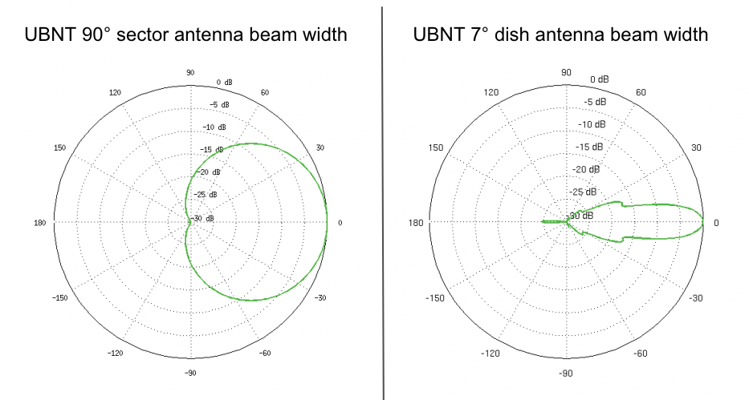
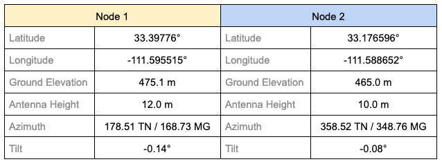

====================================
Tips for Aiming Directional Antennas
====================================

*Contributor: Brett Popovich KG7GDB*

AREDN |trade| nodes with directional antennas can be challenging to align, especially if they have very narrow beam widths. The goal is to achieve the closest alignment in order to pass RF signals efficiently.

Practice with Nearby Nodes
--------------------------

If you can drive to within 1/4 mile of an active node, you should be able to pass signals well. At close range the aiming may not be as critical and you could even place a NanoStation or SXTsq panel on your dashboard. Find a public park, open parking lot, or street parking where you have line of sight to a remote node that uses the same frequency as your portable node. Here are some steps you can follow to practice aiming your node.

* In your vehicle, power up your node and plug in your laptop. Disable the wifi interface so the laptop gets its IP address from the node. Open a web browser and use *localnode.local.mesh:8080* to load your node's home page. You will need to have your user name (root) and password to authenticate to the *Setup* display.
* Enter the SSID, Channel, and Channel Width that matches the remote node you are surveying. Regarding the "Distance to Farthest Neighbor" setting, refer to the node help page or the *Configuration Deep Dive > Mesh RF Column > Distance Setting* section in the **Getting Started Guide** for information. On short paths the zero-distance (automatic setting) may not work well, so you should adjust the slider to a setting close to the estimated distance between your nodes. If you changed any of these settings, click ``Save Changes`` followed by ``Reboot``.
* Now you can do a ``WiFi Scan`` from your node's home page. Put the scan on ``Auto`` refresh and the screen will refresh the scan every ten seconds. The scan list will show remote nodes along with their signal strength, channel number, and SSID. If you have chosen the correct SSID and channel, you should see a connected status if the signal is -87 or stronger. If the channel or SSID doesn't match, you will see a "foreign network" status. There may be other devices on different channels at a particular location. Pick the strongest one and use that channel.
* Once you have a connection with the remote node, quit the WiFi scan and click the ``Charts`` button. You will see a moving graph for the average of all connected stations. In the dropdown menu, choose the remote node you are connected to. Click the *Sound:* ``On`` button, and the pitch of the tone you hear will get higher with greater Signal-to-Noise Ratio (SNR). You may want to adjust the level of the starting tone as well as the tone volume using the sliders below the sound button. You will see the SNR updated every second above the sound button.
* To get the highest tone pitch and the best SNR, turn your radio slowly or even change the car position by driving forward or back a few feet. If the tone stays at one frequency and the chart is no longer changing, you may have lost the signal. Quit the chart and start again.
* Once you have the highest SNR at your test location, quit the chart and click the ``Mesh Status`` button. You should see the remote node in the list of *Current Neighbors* on the right. There will also be percent values for LQ based on the signal your node hears, as well as NLQ based on the signal the remote node hears. Right-click the neighbor node link and open it in a new tab on your browser. In the new tab you can see the remote node's view of your connection.
* On the remote node's home page, click the ``Chart`` button and follow the same procedure as in the step above. This time choose your own node from the dropdown menu, since that remote node may be connected to other stations too. You can turn on the audio tone if you want to hear the relative strength of your node's signal from the perspective of the remote node.
* Now you can turn your node's antenna a little at a time in order to get the highest possible SNR that's being received by the remote node. You will probably notice less variation in the chart with small movements making it easier to adjust for strongest SNR.
* Quit the chart once you have the best signal level. If you hover your mouse over the chart you can also view the individual data points that show the specific transmit and receive signal levels (dBm). Check both your *Mesh Status* page and the neighbor's *Mesh Status* page for the LQ and NLQ values. Try to achieve 100/100 percent on each side.

Aligning Distant Nodes
----------------------

Distant fixed nodes can be aligned with the same tools you used in the previous section. Different antennas will have different beam widths depending on the model. Check the manufacturer specifications to determine the beam width of your antennas. This will give you a clue as to how precise your aim should be in order to send/receive signals effectively.

For example, Mikrotik LHG5 and Ubiquiti RocketDish5 antennas are very narrow, with beam widths between 5° and 7°. Mikrotik QRT panels and Ubiquiti Powerbeam antennas have beam widths between 10° and 12°. Mikrotik SXTsq5 panels and Ubiquiti AirGrid antennas have beam widths between 20° and 23°. Ubiquiti NanoStations and Mikrotik SXTsq2 panels have beam widths between 45° and 60°. Sector antennas have typical beam widths of 90° or 120°, while omnidirectional antennas cover 360° with various degrees of downtilt.

|

While it is helpful to know the antenna pattern for the nodes at both ends, the key is knowing the exact coordinates of the two locations so you can determine their topographical relationship to each other (horizontal and vertical azimuth). There are several computer tools for modeling radio links that were mentioned in the **Network Design Guide** under the *Network Modeling* section. One of the most useful is `VE2DBE's Radio Mobile <http://www.ve2dbe.com/rmonline.html>`_ which provides all of the required details for aiming directional antennas between two locations, including both true and magnetic bearings for both sides of the link.

Another invaluable tool mentioned in the **Applications and Services Guide** under *Other Services* is `KG6WXC's MeshMap Network Visualizer <https://gitlab.kg6wxc.net/mesh/meshmap>`_. This program automatically discovers live nodes on a mesh network and periodically polls them to display their location, configuration, services, and link information. It also has a ruler tool that displays the distance and true bearing (not magnetic) between any two points you select on the map.

Studying the types of maps mentioned above may allow you to discover other sites where you could place intermediate nodes that might link two distant locations. Google Earth can help you identify visible landmarks before aiming. Obvious tall objects such as water towers or multi-story buildings can be added as markers. Nearby objects such as church steeples or park features can be useful as visual reference points during the aiming procedure: for example, "I need to aim over the skate park to the left of the church to hit the remote node." Google Earth also provides a ruler tool which shows the bearing between map locations, and you can look at the Profile View to see whether there are features which may block your signal. Another tool mentioned in the **Network Design Guide** under the *Network Modeling* section is `Radio Fresnel <http://www.radiofresnel.com>`_ which generates a Google Earth KMZ file that identifies ground features which may block the Fresnel Zone along your link path.

|

The chart above shows typical link details that are provided by `Radio Mobile <http://www.ve2dbe.com/rmonline.html>`_. It is very helpful to know these kinds of details and to have an accurate compass before you begin the antenna aiming process. If you use magnetic bearings you will need to know the declination for your location, and be sure your phone or compass is not influenced by nearby metal objects.

Some antennas are easier to aim than others. Large metal dishes are heavy and may require two people to aim, whereas lighter dishes like the Mikrotik LHG units are easier to manipulate. Often only a slight change in position can make a large difference in SNR and link quality. Be sure to avoid trees and be sure your link's first Fresnel Zone is clear of obstructions in order to achieve the best link quality. See the **Network Design Guide** on *Radio Spectrum Characteristics* for examples of ground clearance at different frequencies to ensure the Fresnel Zone is clear.
