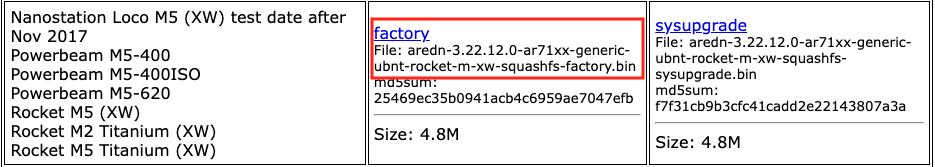

===========================
Tips for Handling Firmware
===========================

Uploading firmware to an AREDN® node is usually a straightforward process. Follow the procedures documented in the **Downloading AREDN® Firmware** section to ensure you have the correct firmware version from the AREDN® website to install on your node. If you experience issues uploading firmware, the following tips may be helpful.

Web browser cache and sessions
  One issue can occur when installing firmware using a web browser. Your computer's browser cache stores data for the URLs that have been visited, but IP addresses and other parameters may change during the install process. It is possible for the cache to contain information that doesn’t match the latest settings for the URL, so the browser may block the connection. Clearing your computer's web browser cache will allow the latest URL settings to be registered so you can continue with the install process. During AREDN® firmware installs you can usually resolve a the issue with one or more of the following things:

  - Refresh or Reload the URL for your node.
  - Clear your browser cache and delete cookies.
  - Close your browser and restart a new session.
  - Use a different web browser program or a *Safe Mode / Incognito* browser window.
  - Unplug and reconnect the Ethernet cable from your computer to ensure that your machine has received a new DHCP IP address on the same subnet as the node's updated IP.

PXE Server
  If you are using a `PXE <https://en.wikipedia.org/wiki/Preboot_Execution_Environment>`_ server to provide your device with an IP address and a new firmware image, be sure to allow the PXE server through your computer's firewall. If the PXE server does not display any activity when you begin your firmware install, check your firewall settings. On the Windows control panel, for example, click *Advanced Settings* and look through the "Inbound Rules" to see if a rule exists for the PXE server. If a rule exists, make sure to "allow connection" for both private and public networks. If no rule exists, create a new rule allowing connection for both public and private networks.

Tips for Upgrading Firmware
---------------------------

Upgrading an AREDN® node is accomplished on the *Firmware* page. Follow the procedures documented in the **Downloading AREDN® Firmware** section to ensure you have the correct firmware version from the AREDN® website to install on your node.

.. note:: Currently there are a few Mikrotik devices which require that the standard firmware compatibility checks be disabled in order to upgrade from version 3.22.12.0 or older to a newer firmware version. This is a "one time" issue which will migrate these devices from the legacy *ar71xx* firmware architecture to the current *ath79* architecture. The specific devices are shown in the **Supported Devices** list on the AREDN® website (see footnote). You must first install the `Dangerous Upgrade package <https://github.com/kn6plv/DangerousUpgrade/>`_ (the **ipk** file) which will disable the firmware compatibility checks. After this package is installed on your node you can perform a normal firmware upgrade (for example) from 3.22.12.0 to 3.24.x.x and above.

In rare cases the upgrade process may fail due to lack of node resources, but such a failure will leave the node running its previous firmware version.

Try to Sideload Firmware
  The **Sideload Firmware** option is described in the *Node Admin* guide. This involves using a file copy utility on your computer to copy the firmware file to a specific directory and filename on your node. Once the new firmware file is available on the node, you can click the *Update* button to start the install process.

  .. attention:: If you try to initiate a firmware install from your node's command line, do not use the legacy OpenWRT ``sysupgrade`` utility. That no longer accomplishes all of the correct steps to flash an AREDN® node. Instead you must use ``/usr/local/bin/aredn_sysupgrade`` to install a local firmware image from your node's command line.

Tips for Downgrading Firmware
-----------------------------

Downgrading AREDN® firmware is typically accomplished using the same procedure as for uploading firmware to your node. You are simply uploading a previous version of the firmware rather than the latest version. If you are downgrading firmware on a node which previously used a different target architecture (``ar71xx`` vs. ``ath79``) or which previously ran a Babel-only firmware but you want to run OLSR+Babel firmware, you will need to do a fresh *First Install* using the appropriate firmware for that device.

Use the `AREDN® Firmware Selector <http://downloads.arednmesh.org/afs/www/>`_ to download the previous release's install files. For example, if your Ubiquiti Rocket M5 XW is currently running version ``3.23.4.0``, then download the files required for release ``3.22.12.0`` (as shown below).

|

To do a fresh install of the firmware, review the **Installing AREDN® Firmware** documentation and follow the steps for the install procedure that is appropriate for your node model.

- For Ubiquiti and TP-LINK models you will be uploading the *FACTORY* firmware.

- For Mikrotik models you will boot using the *KERNEL* file (which you rename to *rb.elf*) and then immediately apply the *SYSUPGRADE* firmware image.

- For GL.iNet devices you will use the `recovery procedure <https://docs.gl-inet.com/en/3/tutorials/debrick/>`_ to upload the *SYSUPGRADE* firmware image.

After downgrading your node's firmware you will then continue the process for entering your callsign and configuring the node's settings.
