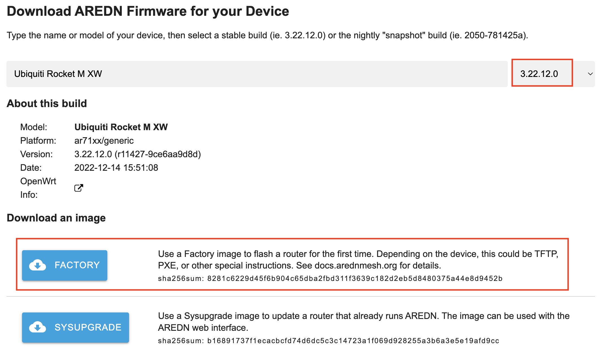

===========================
Tips for Uploading Firmware
===========================

Uploading firmware to an AREDN® node is usually a straightforward process. Follow the procedures documented in the **Downloading AREDN Firmware** section to ensure you have the correct firmware version from the AREDN® website to install on your node. If you experience issues uploading firmware, the following tips may be helpful.

Error message when uploading firmware
  If you see an error message displayed when uploading new firmware to your node, verify that you are loading the correct file by referring to the `AREDN Firmware Selector (AFS) <http://downloads.arednmesh.org/afs/www/>`_, then you can safely ignore the warning. The file naming standard recently changed from a non-standard naming convention to the standard naming convention used by OpenWRT.

Web browser cache and sessions
  One common issue can occur when installing firmware using a web browser. Your computer's browser cache stores data for the URLs that have been visited, but IP addresses and other parameters may change during the install process. It is possible for the cache to contain information that doesn’t match the latest settings for the URL, so the browser may block the connection setup and display an ERR_CONNECTION_RESET message. Clearing your computer's web browser cache will allow the latest URL settings to be registered so you can continue with the install process.

  Instead of a *Connection Reset* message, sometimes a *Bad Gateway* message may appear. This is an `HTTP Status Code <https://www.iana.org/assignments/http-status-codes/http-status-codes.xhtml>`_ that can mean any of several things. Often it indicates a network communication issue between a web browser and a web server. During AREDN® firmware installs you can usually resolve a *Bad Gateway* issue by doing one or more of the following things:

  - Refresh or Reload the URL for your node.

  - Clear your browser cache and delete cookies.

  - Close your browser and restart a new session.

  - Use a different web browser program or a *Safe Mode / Incognito* browser window.

  - Unplug and reconnect the Ethernet cable from your computer to ensure that your machine has received a new DHCP IP address on the same subnet as the node's updated IP.

PXE Server
  If you are using a `PXE <https://en.wikipedia.org/wiki/Preboot_Execution_Environment>`_ server to provide your device with an IP address and a new firmware image, be sure to allow the PXE server through your computer's firewall. If the PXE server does not display any activity when you begin your firmware install, check your firewall settings.  On the Windows control panel, for example, click *Advanced Settings* and look through the "Inbound Rules" to see if a rule exists for the PXE server. If a rule exists, make sure to "allow connection" for both private and public networks. If no rule exists, create a new rule allowing connection for both public and private networks.

Tips for Upgrading Firmware
---------------------------

Upgrading an AREDN® node is accomplished using the *Setup > Administration > Firmware Update* feature on the node's web interface. Follow the procedures documented in the **Downloading AREDN Firmware** section to ensure you have the correct firmware version from the AREDN® website to install on your node.

.. note:: Currently there are a few Mikrotik devices which require that the standard firmware compatibility checks be disabled in order to upgrade from version 3.22.12.0 or older to a newer firmware version. This is a "one time" issue which will migrate these devices from the legacy *ar71xx* firmware architecture to the current *ath79* architecture. The specific devices are shown in the **Supported Devices** list on the AREDN® website (see footnote 1). You must first install the `Dangerous Upgrade package <https://github.com/kn6plv/DangerousUpgrade/>`_ (the **ipk** file) which will disable the firmware compatibility checks. After this package is installed on your node you can perform a normal firmware upgrade (for example) from 3.22.12.0 to 3.24.4.0.

In rare cases the upgrade process can fail due to lack of node resources, but such a failure will leave the node running its previous firmware version. The following tips help ensure that memory utilization is at a minimum on the node.

Try to Load Local Firmware
  The **Load Local Firmware** option is described in the *Configuration Deep Dive > Administration* documentation. This involves using a file copy utility on your computer to copy the firmware file to a specific directory and filename on your node. Once the new firmware file is available on the node, you can click the *Load Local Firmware* button to start the install process.

Tips for legacy nodes with low memory (32mb)
  Legacy equipment with only 32mb of memory may require more effort to upgrade. Be sure not to use these types of devices at sites which are difficult to access.

  - Before starting the firmware upgrade on low memory devices, it may be necessary to stop, disable, or uninstall extra packages such as MeshChat, SNMP, and IperfSpeed. The goal of this step is to keep those processes from using RAM memory and to free as much RAM as possible before the upgrade. Rebooting the node before beginning the upgrade will ensure that RAM utilization is at a minimum.

  - You may also want to stop node programs or services that are not needed during the upgrade. For example, you can telnet or ssh to the node and type the command ``wifi down`` to free the memory used by this driver.

  - You may need to try the sysupgrade procedure several times before it succeeds. Be patient and keep trying.

  - Get everything ready to do the upgrade, then do a fresh reboot of the node and immediately start the sysupgrade process before the node has time to initialize services which use memory.

  - Use command line access to copy the *sysupgrade.bin* image to the /tmp directory on the node, then run the sysupgrade process manually from the command line on the node. Note that AREDN® nodes use port 2222 for secure copy and secure shell access.

    Execute the following commands from a Linux computer:

    ::

      my-computer:$ scp -P 2222 aredn-firmware-filename.bin root@192.168.1.1:/tmp
      my-computer:$ ssh -p 2222 root@192.168.1.1
      ~~~~~~~ after logging into the node with ssh ~~~~~~~
      node:# sysupgrade /tmp/aredn-firmware-filename.bin

    To transfer the image from a Windows computer you can use a *Secure Copy* program such as `WinSCP <https://winscp.net>`_. Then use a terminal program such as `PuTTY <https://www.chiark.greenend.org.uk/~sgtatham/putty/>`_ to connect to the node via ssh or telnet in order to run the sysupgrade command shown as the last line above.

  - As a last resort, use the First Install procedure to load the *factory.bin* firmware image to the node. This procedure is described in the *First Install* sections of **Installing AREDN Firmware**.

Tips for Downgrading Firmware
-----------------------------

Downgrading AREDN® firmware is typically accomplished using the same procedure as for uploading firmware to your node. You are simply uploading a previous version of the firmware rather than the latest version.

However, there is a difference if you are downgrading the firmware on a node which previously used a different target architecture. As explained in the **Downloading AREDN Firmware** section, the legacy ``ar71xx`` target has been retired and replaced by the ``ath79`` target. For example, you may have a node that was previously running an ``ar71xx`` firmware version but you installed the latest Stable Release or Nightly Build which upgraded it to an ``ath79`` firmware target. In this case you will need to do a fresh First Install using the legacy architecture's firmware.

1. Use the `AREDN Firmware Selector <http://downloads.arednmesh.org/afs/www/>`_ to download the previous release's install files. For example, if your Ubiquiti Rocket M5 XW is currently running version ``3.23.4.0``, then download the files required for a First Install from release ``3.22.12.0`` which used *ar71xx* (as shown below).

|

2. Review the **Installing AREDN Firmware** documentation and follow the steps for the *First Install* procedure that is appropriate for your node model.

- For Ubiquiti and TP-LINK models you will be uploading the *FACTORY* firmware.
- For Mikrotik models you will boot using the *KERNEL* file (which you rename to *rb.elf*) and then immediately apply the *SYSUPGRADE* firmware image.
- For GL.iNet models you will use the `recovery procedure <https://docs.gl-inet.com/en/3/tutorials/debrick/>`_ to upload the *SYSUPGRADE* firmware image.

Another possible way to downgrade firmware between architectures is to enable **Dangerous Upgrade** under the *Advanced Configuration* settings. Setting this to *ON* will disable the normal firmware compatibility checks that are done automatically during the firmware install process. This should allow your node to install a firmware image that uses a legacy architecture.

After downgrading your node's firmware you will then continue the process for entering your callsign and configuring the node's settings, as explained in the **Basic Setup** section.
