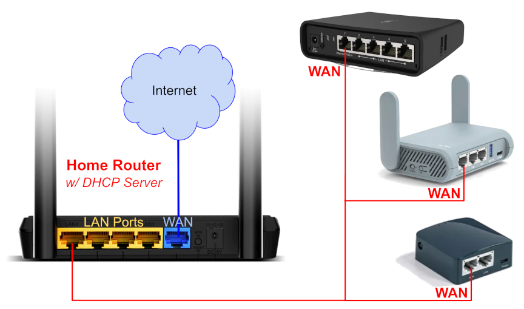

================================
Connecting Nodes to Home Routers
================================

There are several indoor AREDN® nodes that have more than one Ethernet port. The AREDN® firmware running on these types of nodes has the WAN port preconfigured for connecting to the Internet. You can get the latest information about the specific port configured as the node's WAN port from the AREDN® website here: `Ethernet Port Usage <http://downloads.arednmesh.org/snapshots/readme.md>`_. It is recommended that you use a label maker to clearly identify the ports on your multiport devices.

When you connect the node's WAN port to one of the LAN ports on your home router, the node's WAN should receive an IP address on your home network from the router's `DHCP <https://en.wikipedia.org/wiki/Dynamic_Host_Configuration_Protocol>`_ server. Alternatively you can reserve an IP address in your home network range and assign the static IP to the node's WAN through the **Basic Settings** page on your node. There are many sources of information about basic `home networking <https://en.wikipedia.org/wiki/Home_network>`_ which will not be duplicated here, but feel free to familiarize yourself with IP networking through reading and research.

Once you have connected your node to your home router, Internet access will be available to the node itself as well as to any of the devices connected to the node's LAN network. It is not recommended to allow Internet access through your node from mesh nodes. You can verify that mesh devices are not allowed to use your node's Internet (WAN) by disabling "Mesh to WAN" under the *Advanced Options* in the **Network** admin section.
