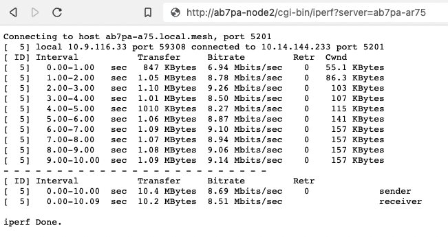
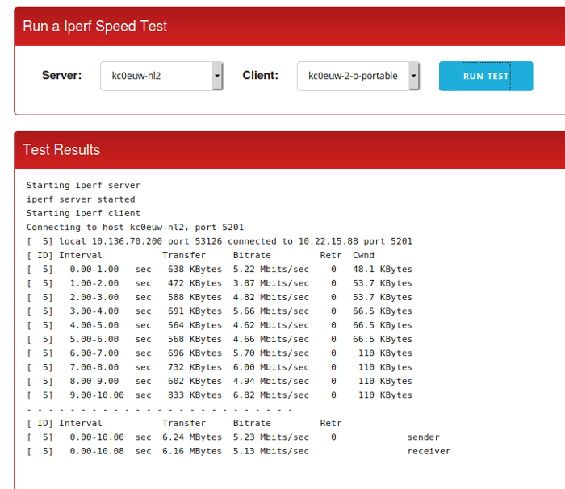

==============================
Test Network Links with iperf3
==============================

`iperf3 <https://en.wikipedia.org/wiki/Iperf>`_ is an open source network throughput testing tool which is now included in the AREDN |trade| firmware by default. It is a client-server utility, so it must be available on both nodes that participate in the test scenario. The iperf3 client node generates traffic which is sent to the server node. Network throughput is measured and an estimate of the network speeds between that client and server is displayed.

Understand the impact to your network before using iperf3. During the test period iperf3 will generate a significant amount of traffic in order to determine the capacity of the link between the client and server nodes. Try to run your iperf3 testing during times when you know that there will be minimal impact to the routine traffic between the nodes.

One of the many uses for iperf3 is to validate and optimize your node's *Distance* setting on the **Basic Setup** page. Try different *Distance* settings and note the network throughput using iperf3, with the goal of choosing a *Distance* setting which yields the best network performance.

Using the Onboard iperf URL Feature
-----------------------------------

There is a simple, lightweight CGI interface that can be used to run an iperf3 test between two nodes which have firmware with this feature. From any computer connected to the network you can open a new web browser tab or window and type an iperf testing URL having the following format.

``http://<client_node_name>/cgi-bin/iperf?server=<server_node_name>&protocol=<tcp|udp>``

*Client Node Name* is the fully qualified node name for the client/sender node. If you do not include the "local.mesh" suffix then it will be added for you.

*Server Node Name* is the fully qualified node name for the server/receiver node. If you do not include the "local.mesh" suffix then it will be added for you.

The *Protocol* parameter is optional. If no protocol is specified, then a TCP test will be started. If you want to eliminate the typical TCP handshaking overhead on your network then you can run a connectionless UDP test by adding ``&protocol=udp`` after the server parameter.

Once you activate the URL in your web browser an iperf3 server will be started on the node you selected as the server, and the client node will initiate the iperf3 test using the protocol you specified (if any). Once the test has completed you will see the collected data summarized by time interval, and at the bottom of the display is the overall average from the perspective of the sender (client) and the receiver (server).

|

Installing and Using IperfSpeed
-------------------------------

The **IperfSpeed** package provides a web-based control interface for running network tests between nodes, and it was written by Trevor Paskett K7FPV using the Perl programming language. With the project to retire Perl on AREDN |trade| nodes, there is now an alternative *IperfSpeed* package which uses the Lua programming language. The original Perl and new Lua packages are available at the following links:

- `Original Perl version of IperfSpeed <https://aredn.s3.amazonaws.com/iperfspeed_0.5.1_all.ipk>`_

- `New Lua version of IperfSpeed <https://github.com/kn6plv/iperfspeed>`_

Select the *IperfSpeed* service on one of the nodes to open its web interface in a new browser tab or window. From the dropdown lists, select a node as the iperf3 server and also one as the iperf3 client. Click the *Run Test* button to begin the network throughput test.

|

Once the test has completed you will see the results displayed in the *IperfSpeed* interface. *IperfSpeed* also tracks previous tests that have been run, and it allows you to rerun any of the previous tests by clicking the *Re-Test* button.
