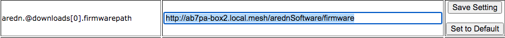

===============================
Creating a Local Package Server
===============================

There may be cases where your mesh nodes have no way to access the AREDN |trade| servers for installing new packages. One way to resolve this is to create your own package server on the local mesh and then point your nodes to this local service. The following sections describe the high-level tasks required to implement such a package service. In order to accomplish this, you may need to consult with someone who has System Administration skills for the specific platform you will be using to host your local package repository.

Configure your Package Server
=============================

Your package server must be connected to the mesh as a host on your local node's LAN network, preferably using a node that also has Internet access via its WAN interface. You should add this host to the node's *DHCP Reservation List*. You do not need to add the package host to the *Advertised Services List* of the node it is connected to. The package server should be given a hostname that is unique on your mesh, typically prefixed with the callsign of the server owner. You can use any operating system platform you desire *(Windows, Linux, Mac),* as long as it has the ability to function as a web server. The following are the two main tasks required of the local package server:

* Obtain the set of AREDN |trade| package files from ``downloads.arednmesh.org``
* Make those files available via your computer's web server so nodes can query the package URLs

There are several ways to accomplish these tasks, and the best approach may vary depending on the platform you implement for your package server. Downloading the AREDN |trade| package files can be done manually as needed, or the process could be automated and executed on a regular schedule. Tools that could be used for this task include `HTTrack <https://en.wikipedia.org/wiki/HTTrack>`_ and `Wget <https://en.wikipedia.org/wiki/Wget>`_, both of which support recursive copying. You should try to make your local repository mirror the AREDN |trade| downloads directory tree as closely as possible, so it contains any of the package files you want to have available to your local mesh nodes.

Once you have downloaded the AREDN |trade| package files, you need to make them available to network nodes via your web server. The steps for accomplishing this task will vary based on the specific web server software you are using. For example, Sys Admins using the `Apache Web Server <https://en.wikipedia.org/wiki/Apache_HTTP_Server>`_ might put the package files under their web server's *DocumentRoot*, or they might create an ``Alias`` to allow web access to parts of the filesystem that are not under the Apache *DocumentRoot* (as described `here <https://http
d.apache.org/docs/2.4/urlmapping.html>`_). Once the package files have been made available via the web server, you should be able to enter that URL to navigate the entire package tree as shown below.

These tasks are all that should be required on your local package host. Once the package tree is available via its web server, you can begin pointing the nodes to the new package location.

Point Nodes to the New Server
=============================

To point a node to the local package repository, you must navigate to **Setup > Advanced Configuration**. The table on this webpage has a row for each package type that can be installed on AREDN |trade| nodes. A typical default URL is shown below:

::

  http://downloads.arednmesh.org/snapshots/trunk/packages/mips_24kc/base

Simply replace this URL with the one that you configured on your local package host. For example, the new entry for *Base* packages might look like the one below:

::

  http://kc0euw-box2.local.mesh/snapshots/trunk/packages/mips_24kc/base

It is good practice to use the `fully qualified domain name (FQDN) <https://en.wikipedia.org/wiki/Fully_qualified_domain_name>`_ so the node will be able to resolve the domain portion of the URL to the mesh host's IP address. The URL you enter should match exactly with the alias or path you created and tested on your web server as described in the previous section of this document.

After you have entered the new URL, click the **Save Setting** button to activate the new entry.

Once the node has been pointed to the local package repository, you can navigate to **Setup > Administration**. In the *Package Management* section, click the **Refresh** button to get the list of available packages from the local package repository.

The following example shows the type of information returned when you click the **Refresh** button:

::

  Package Management

  Downloading http://kc0euw-box2.local.mesh/snapshots/trunk/packages/mips_24kc/base/Packages.gz
  Updated list of available packages in /var/opkg-lists/aredn_base
  Downloading http://kc0euw-box2.local.mesh/snapshots/trunk/packages/mips_24kc/base/Packages.sig
  Signature check passed.
  Downloading http://kc0euw-box2.local.mesh/snapshots/trunk/packages/mips_24kc/arednpackages/Packages.gz
  Updated list of available packages in /var/opkg-lists/aredn_arednpackages
  Downloading http://kc0euw-box2.local.mesh/snapshots/trunk/packages/mips_24kc/arednpackages/Packages.sig
  Signature check passed.
  Downloading http://kc0euw-box2.local.mesh/snapshots/trunk/packages/mips_24kc/luci/Packages.gz
  Updated list of available packages in /var/opkg-lists/aredn_luci
  Downloading http://kc0euw-box2.local.mesh/snapshots/trunk/packages/mips_24kc/luci/Packages.sig
  Signature check passed.
  ...

You can click the **Select Package** dropdown list to see the packages that are available for download to your node. In the example below, the *tcpdump* package was selected and the **Download** button was clicked. Status information will appear showing the actions that were taken to install the package from the local package host.

There is a message that a reboot is required to refresh and restart all services, but this is a normal status message and does not indicate an error condition.

---------------

The same basic tasks described in this document could also be used to create a local *firmware* repository. This would allow nodes to download and install firmware images that are hosted within their own mesh network.

.. |trade|  unicode:: U+00AE .. Registered Trademark SIGN
   :ltrim:
