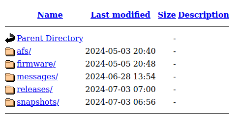
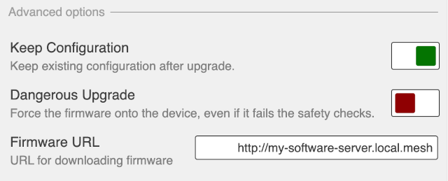

==============================================
Creating a Local AREDN® Software Server
==============================================

There may be cases where your mesh nodes have no way to access the AREDN® servers for installing new software. One way to resolve this is to create your own software server on the local mesh and then point your nodes to this local service. The following sections describe the high-level tasks required to implement such a software service. In order to accomplish this, you may need to consult with someone who has System Administration skills for the specific platform you will be using to host your local software repository.

Configure your software server
==============================

Your software server must be connected to the mesh as a host on your local node's LAN network, using a node that also has Internet access via its WAN interface. The reason this node is connected to the Internet is to allow the web server to download updated files from the AREDN® downloads server. You should add this host to the node's *DHCP Reservation List*. You do not need to add the software host to the *Advertised Services List* of the node to which it is connected. The software server should be given a hostname that is unique on your mesh, typically prefixed with the callsign of the server owner. You can use any operating system platform you desire *(Windows, Linux, Mac)*, as long as it has the ability to function as a web server. The following are the two main tasks required of the local software server:

- Obtain the set of AREDN® software files from ``downloads.arednmesh.org``

- Make those files available via its web server so nodes can query the software URLs

There are several ways to accomplish these tasks, and the best approach may vary depending on the platform you implement for your software server. Downloading the AREDN® software files can be done manually as needed, or the process could be automated and executed on a regular schedule. The recommended method is to use the `rsync <https://en.wikipedia.org/wiki/Rsync>`_ program which supports recursive copying of only the changed files on the source. An example *rsync* command is shown below:

::

  /usr/bin/rsync -rv --delete --size-only downloads.arednmesh.org::aredn_firmware /var/www/html/arednSoftware/

Once you have a local duplicate of the AREDN® files, you need to verify that your copy of the files have the correct path pointing to your local software repository. In the example above, the local repository was placed in /var/www/html/arednSoftware, so you will navigate to that directory.

::

  cd /var/www/html/arednSoftware

Under this directory you should see the ``afs`` subdirectory which contains all of the information used by the AREDN® Firmware Selector. Navigate into the ``afs/www`` subdirectory and use the editor of your choice to edit the ``config.js`` file. Locate the *Image download URL* section and change the default value of the *image_url* variable to point to your local download server. The default value is ``image_url: "http://downloads.arednmesh.org"`` and the example below shows the line edited to point to our example server.

::

  image_url: "http://ab7pa-box2.local.mesh/arednSoftware/",

Once the ``config.js`` file has the correct local URL, you must write the new path into all of the firmware selection entries. You accomplish this by running a `Python3 <https://en.wikipedia.org/wiki/Python_(programming_language)>`_ script that ensures all of the files receive the current configuration settings from ``config.js``. Navigate to the top level directory where you stored your copy of the arednmesh files (in our example the local repository was placed in /var/www/html/arednSoftware) and run the ``collect.py`` script to update the local URL path. It resides in the ``afs/misc`` directory and requires two arguments.

1. the path to the top level directory where you stored the arednmesh files (in our example: /var/www/html/arednSoftware)
2. the path to the AFS www directory (in our example: /var/www/html/arednSoftware/afs/www)

Since you will already be in the *arednSoftware* directory, you can use relative paths as in the example below.

::

  cd /var/www/html/arednSoftware
  ./afs/misc/collect.py  .  ./afs/www/

Now your local AREDN® software source is configured to serve its files to any local nodes which want to update their firmware from your repository.

Next make these files available to network nodes via your web server. The steps for accomplishing this task will vary based on the specific web server software you are using. For example, using the `Apache Web Server <https://en.wikipedia.org/wiki/Apache_HTTP_Server>`_, you could store the software files under the web server's *DocumentRoot* (as in the example above) or you could create an *Alias* to allow web access to parts of the filesystem that are not under the Apache *DocumentRoot* (as described `here <https://http
d.apache.org/docs/2.4/urlmapping.html>`_). Once the software has been made available via the web server, you should be able to enter that URL in a web browser to see the entire software tree as shown in the example below.

|

Once the software is available via your web server, you can begin pointing the nodes to your local software repository.

Point nodes to the local server
===============================

To point a node to the local software repository while in *admin* mode, navigate to the *firmware* section and click on *Advanced Options*. The default Firmware URL is ``http://downloads.arednmesh.org`` so you must change this to the URL of your local software server. It is good practice to use the `fully qualified domain name (FQDN) <https://en.wikipedia.org/wiki/Fully_qualified_domain_name>`_ so the node will be able to resolve the domain portion of the URL to the mesh host's IP address. The URL you enter should match the alias or path you created and tested on your web server as described in the previous section and shown in the example below.

|

When you are finished with your changes, click the ``Done`` button. You will then be returned to your node’s admin view where you will be able to ``Commit`` or ``Revert`` your changes. Once the node has been pointed to the local software server, you can navigate to the *firmware* section and click the *refresh* icon to select and install the available software from your local software repository.
