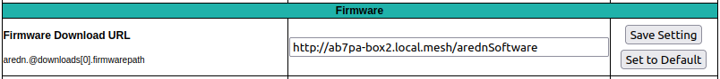
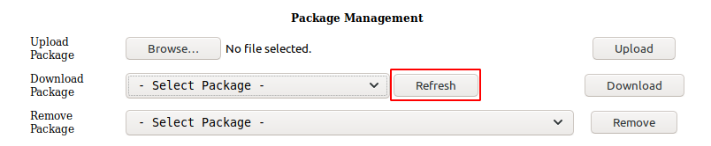

==============================================
Creating a Local AREDN |trade| Software Server
==============================================

There may be cases where your mesh nodes have no way to access the AREDN |trade| servers for installing new software. One way to resolve this is to create your own software server on the local mesh and then point your nodes to this local service. The following sections describe the high-level tasks required to implement such a software service. In order to accomplish this, you may need to consult with someone who has System Administration skills for the specific platform you will be using to host your local software repository.

Configure your software server
==============================

Your software server must be connected to the mesh as a host on your local node's LAN network, using a node that also has Internet access via its WAN interface. The reason this node is connected to the Internet is to allow the web server to download updated files from the AREDN |trade| downloads server. You should add this host to the node's *DHCP Reservation List*. You do not need to add the software host to the *Advertised Services List* of the node to which it is connected. The software server should be given a hostname that is unique on your mesh, typically prefixed with the callsign of the server owner. You can use any operating system platform you desire *(Windows, Linux, Mac)*, as long as it has the ability to function as a web server. The following are the two main tasks required of the local software server:

- Obtain the set of AREDN |trade| software files from ``downloads.arednmesh.org``

- Make those files available via its web server so nodes can query the software URLs

There are several ways to accomplish these tasks, and the best approach may vary depending on the platform you implement for your software server. Downloading the AREDN |trade| software files can be done manually as needed, or the process could be automated and executed on a regular schedule. The recommended method is to use the `rsync <https://en.wikipedia.org/wiki/Rsync>`_ program which supports recursive copying of only the changed files on the source. An example *rsync* command is shown below:

::

  /usr/bin/rsync -r downloads.arednmesh.org::aredn_firmware /var/www/html/arednSoftware/

Once you have downloaded the AREDN |trade| files, you need to make them available to network nodes via your web server. The steps for accomplishing this task will vary based on the specific web server software you are using. For example, using the `Apache Web Server <https://en.wikipedia.org/wiki/Apache_HTTP_Server>`_, you could store the software files under the web server's *DocumentRoot* (as in the example above) or you could create an ``Alias`` to allow web access to parts of the filesystem that are not under the Apache *DocumentRoot* (as described `here <https://http
d.apache.org/docs/2.4/urlmapping.html>`_). Once the software has been made available via the web server, you should be able to enter that URL to navigate the entire software tree as shown below.

.. image:: _images/view-software-repo.png
   :alt:  View the local software repository
   :align: center

|

These tasks are all that should be required on your local software host. Once the software tree is available via its web server, you can begin pointing the nodes to your local software repository.

Point nodes to the local server
===============================

To point a node to the local software repository, navigate to **Setup > Advanced Configuration**. The table on this webpage has a row for each type of software that can be installed on AREDN |trade| nodes. It might be a good idea to take a screenshot of these settings so you can refer to them later. A typical default URL for *firmwarepath* is shown below:

::

  http://downloads.arednmesh.org/firmware

Simply replace this URL with the one that you configured on your local software host, then click the *Save Setting* button on that row. For example, the new entry for *firmwarepath* might look like the one below:

::

  http://ab7pa-box2.local.mesh/arednSoftware/firmware

It is good practice to use the `fully qualified domain name (FQDN) <https://en.wikipedia.org/wiki/Fully_qualified_domain_name>`_ so the node will be able to resolve the domain portion of the URL to the mesh host's IP address. The URL you enter should match exactly with the alias or path you created and tested on your web server as described in the previous section.

|

After you have entered the new URL, click the **Save Setting** button to activate the new entry. To restore the default entry, click the **Set to Default** button.

Once the node has been pointed to the local software repository, you can navigate to **Setup > Administration**. In the firmware and package sections, you can click the **Refresh** button to get the list of available software from the local software repository.

|

The following example shows the type of information returned when you click the **Refresh** button:

::

  Package Management

  Downloading http://ab7pa-box2.local.mesh/arednSoftware/snapshots/packages/mips_24kc/base/packages.gz
  Updated list of available packages in /var/opkg-lists/aredn_base
  Downloading http://ab7pa-box2.local.mesh/arednSoftware/snapshots/packages/mips_24kc/base/packages.sig
  Signature check passed.
  Downloading http://ab7pa-box2.local.mesh/arednSoftware/snapshots/packages/mips_24kc/arednpackages/packages.gz
  Updated list of available packages in /var/opkg-lists/aredn_arednpackages
  Downloading http://ab7pa-box2.local.mesh/arednSoftware/snapshots/packages/mips_24kc/arednpackages/packages.sig
  Signature check passed.
  Downloading http://ab7pa-box2.local.mesh/arednSoftware/snapshots/packages/mips_24kc/luci/packages.gz
  Updated list of available packages in /var/opkg-lists/aredn_luci
  Downloading http://ab7pa-box2.local.mesh/arednSoftware/snapshots/packages/mips_24kc/luci/packages.sig
  Signature check passed.
  ...

Click the **Select firmware** or **Select package** dropdown lists to see the software available for download from the local software server. Select a firmware image or package and click the **Download** button. Status information will appear showing the actions that were taken to install the software from the local software host. A message may appear that a reboot is required to refresh and restart all services, but this is a normal status message and does not indicate an error condition.
