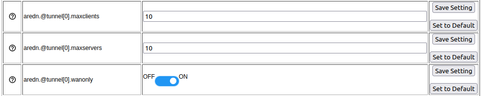

============================
Changing Tunnel Max Settings
============================

By default a node is allowed to host up to 10 clients in its *Tunnel Server* display and connect with up to 10 servers in its *Tunnel Client* display. The *maxclients* and *maxservers* values on the **Advanced Configuration** page provide a method for adjusting the default settings.

|

.. warning:: Use caution when increasing the *maxclients* or *maxservers* values. Enter only *zero* or positive integers up to a maximum value for the number of active connections your node hardware can handle, since each active tunnel connection consumes system resources that the node may need for normal operation.

A node's CPU and memory utilization will increase with every additional tunnel connection. If you have node hardware with a faster CPU and more total memory, you may be able to host more clients or connect with more servers than on a node with a slower CPU and less total memory. Tuning these settings to their optimum value for your specific node hardware may involve some experimentation, as described below.

  **Free Memory:**  Each active connection consumes almost 1500 KB of memory on your node. You can see the current amount of free memory on the *Node Status* page, but actual memory utilization fluctuates constantly. The less free memory a node has available, the greater the chance that normal operational events could cause some processes to fail unpredictably. Monitor the node's *Free Memory* over a period of time to estimate the resources required during normal operation. Then be sure to allow some memory headroom to account for occasional bursts of high demand. Once you understand how much memory your node typically requires (min/avg/max), and you know how much free memory headroom you want to reserve, you could divide the remaining free memory by 1500 KB to estimate the maximum number of active tunnels your node might support without suffering unpredictable failures.

  **CPU Utilization:**  Each active tunnel also consumes some fraction of the CPU, depending on the instantaneous amount of traffic in the tunnel. Activities such as *Meshchat* and VoIP phone calls generate less traffic than video streams and large file transfers. Even when there is no user traffic, mesh protocols themselves create a small continuous load that grows with the size of your network. If you use *telnet* or *ssh* to log into your node, you can run the *top* program from the command line to watch CPU utilization. Observe the effect as you transfer a large file, visit a complex web page, or view a video stream. Entirely saturating the CPU is unlikely to cause the node to fail, but it may cause other unexpected behavior. As with free memory, be sure to plan for a reasonable amount of idle CPU headroom.

If the *maxclients* or *maxservers* values are increased, then the *Add* row will allow more clients or servers to be added. If the values are decreased then the *Add* row will disappear when you have an existing number of rows greater than or equal to the new maximum value. Existing rows beyond the maximum value will still be displayed in order to retain any previously assigned credentials. If more credentials are *Enabled* than are allowed, then only the maximum number of tunnels allowed will be activated, beginning with the first *Enabled* row in the table. A warning message will be displayed if the number of *Enabled* tunnels exceeds the current value of *maxclients* or *maxservers*. While this warning is displayed, the system will not allow configuration changes to be saved. The warning can be cleared either by increasing the limit or by unchecking enough *Enabled* boxes to reduce the number of enabled tunnels to the limit.

These settings are runtime values, which means that if you change them you will see the effect immediately in the *Tunnel Server* and *Tunnel Client* displays without the need to reboot your node. If you adjust the *maxclients* or *maxservers* settings to values that change the number of allowable active connections, then when you navigate to the Tunnel Server or Tunnel Client pages you can click the *Save Changes* button in order to see the effect of your change on the existing active connections.

If you set the *maxclients* or *maxservers* value to zero, then the corresponding Tunnel Server or Tunnel Client display will not allow any rows to be added. This may be useful if you want to provide a tunnel server but you also want to remove the ability to connect with other servers as a tunnel client. The same is true if you want to connect to other tunnel server nodes as a client but you do not want provide any tunnel server capabilities on your node.

As stated above, use caution when increasing the *maxclients* or *maxservers* values. Enter only *zero* or positive integers up to a maximum value for the number of active connections your node hardware can handle, since each active tunnel connection consumes system resources that the node may need for normal operation.
