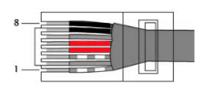

=========================
Power over Ethernet (PoE)
=========================

The phrase `Power over Ethernet <https://en.wikipedia.org/wiki/Power_over_Ethernet>`_ (PoE) encompasses any of several different standards and methods for passing DC power over twisted-pair Ethernet cabling. The advantage of PoE is that it allows a single cable to carry both data and power to your devices, and several AREDN |trade| supported devices can be powered using PoE.

This section of the documentation provides a high-level overview for those who are not already familiar with this concept. You do not need to be an expert in *Power over Ethernet* technology, but it may help to be aware of a few concepts in case you run into these terms when researching PoE switches or injectors.

Passive PoE
-----------

At the present time, all of the PoE radios supported by AREDN |trade| require the use of **Passive PoE**. In a *Passive PoE* system the power source does not negotiate voltage or wattage requirements with the powered device. *Passive PoE* power sources simply supply a specific voltage constantly, up to the maximum current limit that the power source allows.

The primary message of this section is to encourage you to read the manufacturer's data sheet carefully for the hardware that you will be deploying. Pay particular attention to the specifications for **Input Voltage** and **Maximum Power Consumption**. The allowed voltage ranges and maximum power consumption for AREDN |trade| radios will vary by hardware model as shown in the comparison below.

**Example Data Sheet Info**

=====================  ========================  =========================
..                     Mikrotik LHG-5nD          Ubiquiti PowerBeam-M5-400
=====================  ========================  =========================
**Input Voltage**      11 - 30 vdc Passive PoE   11 - 28 vdc Passive PoE
**Power Consumption**  6W                        6W
=====================  ========================  =========================

You simply need to determine what voltage range your equipment accepts and then use a power source that constantly supplies a voltage within that range. For example, the Mikrotik device in the table above can accept a range between 11 and 30 volts, while Ubiquiti devices typically accept between 11 and 28 volts. This means that you could use either a 12v or 24v source to power these devices because both are within the acceptable voltage range for these radios.

In this example, both models have a *Maximum Power Consumption* of 6W. This means that you can expect a maximum current draw of approximately 500mA if you use a 12v battery to power them. If you use a 24v source then you would expect a maximum current draw of only 250mA.

**Passive PoE** commonly uses the same Ethernet cable wires as are used in the IEEE 802.3af `Mode B standard <https://en.wikipedia.org/wiki/Power_over_Ethernet#Pinouts>`_, but that is the only similarity between *Passive PoE* and that standard. *Passive PoE* uses separate wire pairs to carry data or power as shown below. DC positive is carried on pins 4-5, DC negative is carried on pins 7-8, while data is carried on pins 1-2 and 3-6.

===========  ========  ========
Cable Pins   Wire Pair Usage
-----------  ------------------
..           Data      Power
===========  ========  ========
Pin 1        RX+
Pin 2        RX-
Pin 3        TX+
Pin 4                  DC+
Pin 5                  DC+
Pin 6        TX-
Pin 7                  DC-
Pin 8                  DC-
===========  ========  ========

You should not need to concern yourself with the various IEEE 802.3 standards that may be used for other types of PoE equipment. The radios currently supported by AREDN |trade| do not use standards such as *802.3af, 802.3at, 802.3bt, PoE+, 4PPoE, or Ultra PoE*. There is a wealth of information on the Internet if you decide to learn more about these other standards.

Be aware that it should not damage your AREDN |trade| device if you connect it to an 802.3af/at switch or :abbr:`PSE (power sourcing equipment)`. The only consequence would be that the device will not be powered, since switches using the other standards will not send power if they do not detect a compatible device.
