===================================================================================
How-to Use PuTTYGen on Windows to Make SSH Keys and Use Them on AREDN |trade| Nodes
===================================================================================

This How-to will show you a method for generating SSH key pairs on a Windows computer, saving them to a USB flash drive, installing the SSH key on an AREDN |trade| node and using the SSH keys with a PuTTY terminal session.

The use of Secure Shell (SSH) keys when using PuTTY or another SSH client is a useful aid to managing a group of AREDN |trade| nodes.

First, obtain the PuTTY suite of applications from the `PuTTY Download Page <https://www.chiark.greenend.org.uk/~sgtatham/putty/latest.html>`_ and install them on your computer.

Second, obtain and prepare to use a text editor such as `Notepad++ <https://notepad-plus-plus.org/download/>`_ that does not insert unwanted characters and metadata into a text file.

Next, follow the steps below.

1. Start the PuTTYGen application. Confirm that you are going to generate an SSH-2 RSA key.

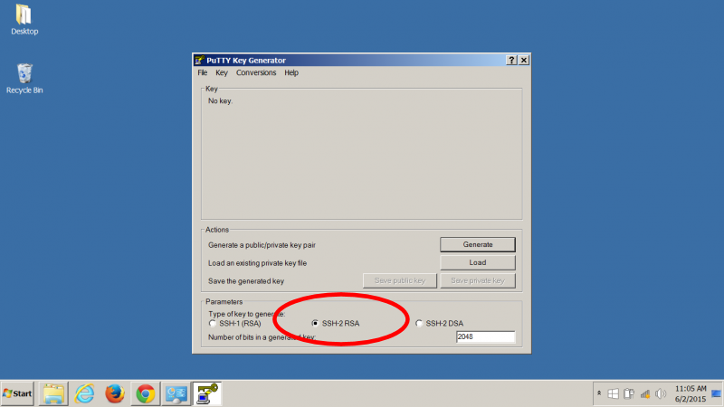

2. Select the *Generate* button to get the prompt asking you to make some random mouse movements. After a short while you get a message asking you to wait while the keys are generated. It finishes and you now have a new key pair.

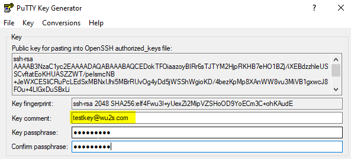

3. Give the key pair a suitable comment so that you will remember what the keys are used for. Here we just entered testkey@wu2s.com for an example. Whatever you enter in the "Key Comment" field must look like an email address with no spaces and the "@" present as in *callsign@example.com*. Also enter a suitable passphrase to use when accessing the private key. Record this passphrase so you will remember it for future use.

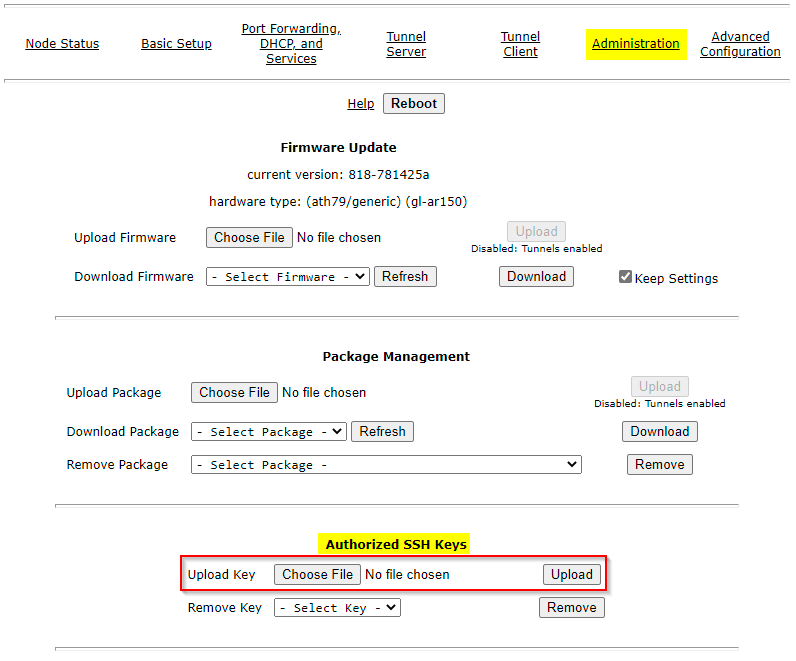

4. Now copy and save the public key. Open Notepad++ and confirm that the End Of Line (EOL) format is set to UNIX/OSX Format. This will ensure that there are no extraneous characters in the public key file.

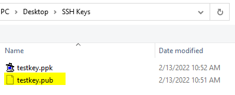

5. Back in your PuTTYGen window, select and copy (Control-C) the complete text in the boxed labeled “Public key for pasting into OpenSSH authorized keys file”

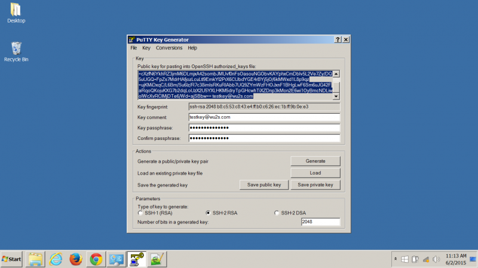

6. Switch back to your Notepad++ window and Paste (Control-V) the public key text you just copied from PuTTYGen.

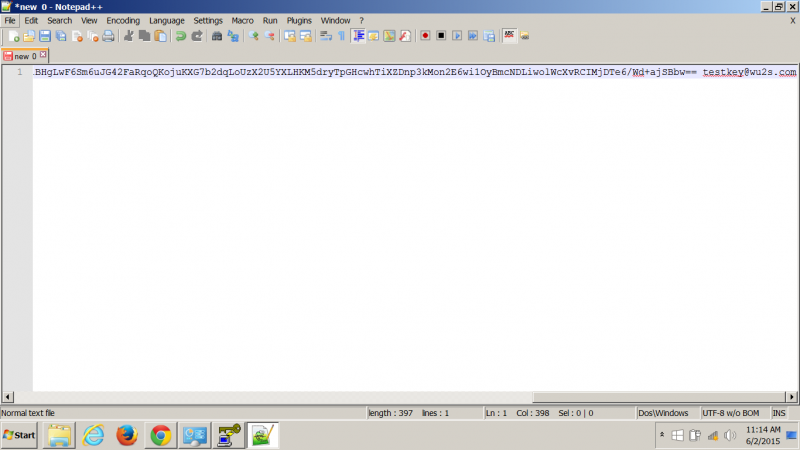

7. From the Notepad++ menu bar, select File -> Save As to save the public key to a suitable location. Many people save their keys on a USB flash drive to maintain physical possession of them at all times. Give the public key file a suitable name. You can exit Notepad++ now since you will not need it again.

.. image:: _images/10-puttygen.png
   :alt: Save public key
   :align: center

8. Switch back to the PuTTYGen window again and select the “Save Private Key” button. This will let you save the private key just as you did in the previous step with the public key. You are finished generating and saving your SSH keys. Exit PuTTYGen.

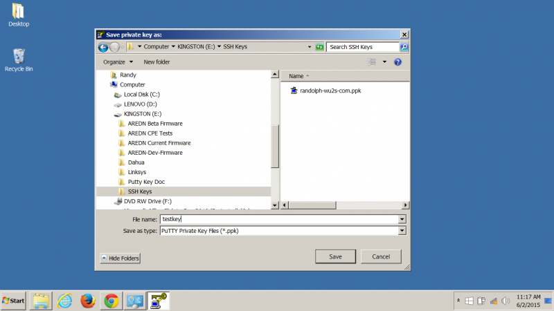

9. In order to use your new SSH key pair, login to your AREDN |trade| node and go to the *Setup -> Administration* screen. At the bottom you will see the Authorized SSH Keys section where you will install the public keys to use on this node.

.. image:: _images/12-puttygen.png
   :alt: Node Administration page
   :align: center

10. When you press the Select File button you see a dialog box which enables you to locate the public SSH key that you want to install.

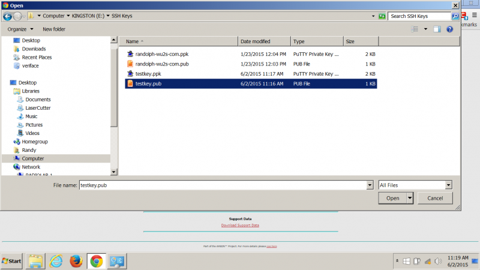

11. After choosing the desired public key file. Select the *Upload* button to install the key on the AREDN |trade| node.

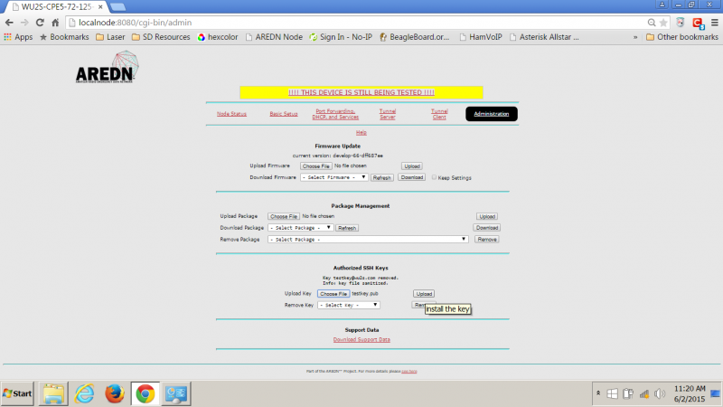

12. After installing the new public key, confirm that it is ready for use by looking in the dropdown list at the *Remove Key* section. If your SSH key filename appears, then it is installed properly. DO NOT remove it. In the example below there are two SSH keys currently installed on this node.

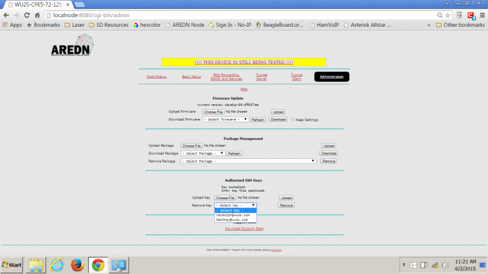

13. To use your SSH keys, open a new PuTTY session. In the Hostname box enter *localnode* and in the Port box enter 2222. It is helpful to save this session definition as something you will remember. Select the Save button.

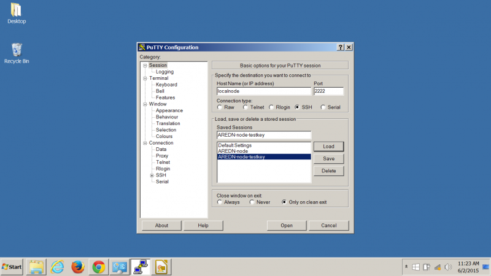

14. Now, using the menu at the left, go to the SSH section and then select the *Auth* item. This shows a number of Options. The only one we need is the very last – the location of the Private key file for authentication. Browse for it and select the correct filename as before. Remember that the PRIVATE key files end in .ppk  Go back to top of the menu on the left and select *Session*.
SAVE the session definition again.

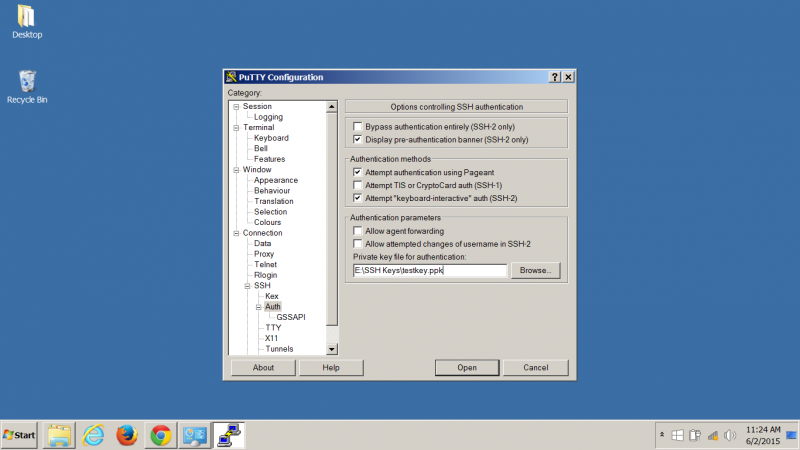

15. Now you can use the session information you saved by clicking the *Load* or *Open* button in the main PuTTY session screen. This will open a terminal session box as shown below. Login to the AREDN |trade| node as `root`.

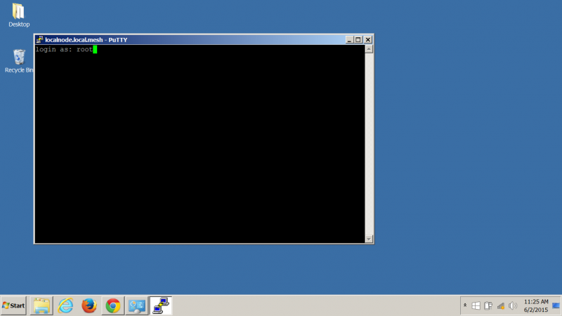

16. If you configured the PuTTY session correctly, it will find your private key file and ask you for the passphrase. If PuTTY cannot find the private key file, it will revert to prompting you for the `root` password that you normally use on the node.

17. The correct passphrase was entered. The node’s banner appears in the terminal session window and you can now do any command line tasks on the node.

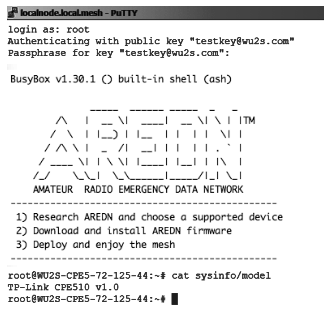

.. |trade|  unicode:: U+02122 .. TRADE MARK SIGN
   :ltrim:
