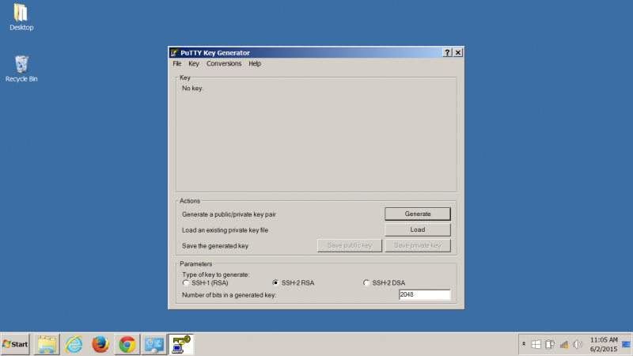
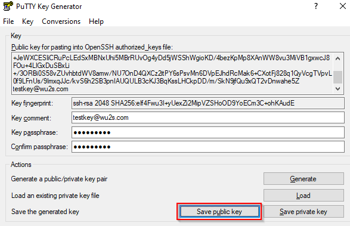
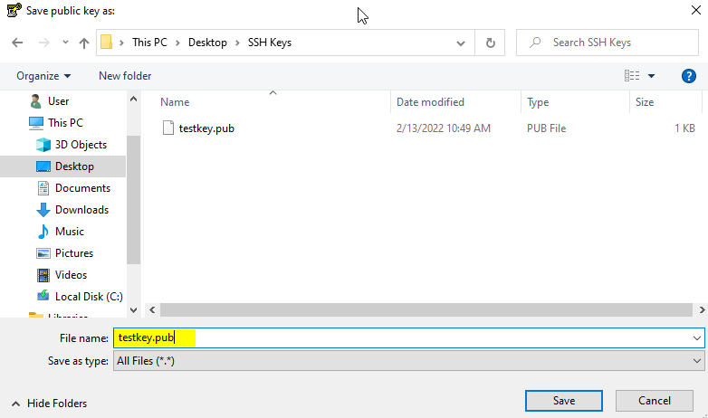
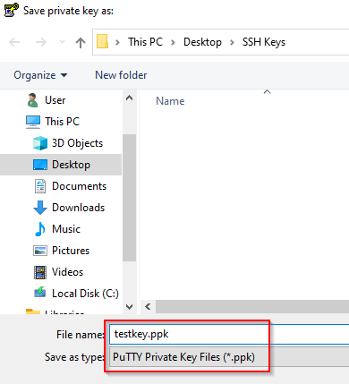

=============================
Use PuTTYGen to Make SSH Keys
=============================

*Contributor: Randy Smith WU2S*

This How-to will show you a method for generating SSH key pairs on a Windows computer, saving them to a USB flash drive, installing the SSH key on an AREDN |trade| node and using the SSH keys with a PuTTY terminal session.

The use of Secure Shell (SSH) keys when using PuTTY or another SSH client is a useful aid to managing a group of AREDN |trade| nodes.

First, obtain the PuTTY suite of applications from the `PuTTY Download Page <https://www.chiark.greenend.org.uk/~sgtatham/putty/latest.html>`_ and install them on your computer.

Next, follow the steps below.

1. Start the PuTTYGen application. Confirm that you are going to generate an SSH-2 RSA key.

2. Select the *Generate key pair* menu item or click the *Generate* button and you will be asked to make some random mouse movements. After a short while you get a message asking you to wait while the keys are generated. Once it finishes you now have a new key pair.

3. Give the key pair a suitable comment so that you will remember what the keys are used for. Here we just entered testkey@wu2s.com for an example. Whatever you enter in the "Key Comment" field must look like an email address with no spaces and the "@" present as in *callsign@example.com*. Also enter a suitable passphrase to use when accessing the private key. Record this passphrase so you will remember it for future use.

.. image:: _images/02-puttygen.png
   :alt:  Label key pair and create pass phrase
   :align: center

4. Click the *Save Public Key* button to save the public key to a suitable location. Many people save their keys on a USB flash drive to maintain physical possession of them at all times.

5. Give the public key a suitable filename with the **.pub** file extension.

6. You can save your private key the same way by clicking the *Save Private Key* button. Give your private key a suitable filename with the **.ppk** file extension. Now you are finished generating and saving your SSH keys, so you can exit PuTTYGen.

7. In order to use your new SSH key pair, login to your AREDN |trade| node and go to the **Setup -> Administration** screen. At the bottom you will see the *Authorized SSH Keys* section where you will install the public keys to use on this node.

.. image:: _images/06-puttygen.png
   :alt: Node Administration page
   :align: center

8. Press the *Choose File* button to locate the *public* SSH key you want to install. After choosing the desired *public* key file, click the *Upload* button to install the key on the AREDN |trade| node.

.. image:: _images/07-puttygen.png
   :alt: Select key to install
   :align: center

9. You will see a message asking you to reboot your node. After installing the new public key, you can confirm that it is ready for use by looking in the dropdown list under the *Remove Key* section. If your SSH key filename appears, then it is installed properly.

.. image:: _images/08-puttygen.png
   :alt: Upload and install key
   :align: center

10. To use your SSH keys, open a new PuTTY session. In the *Hostname* box enter *localnode* and in the *Port* box enter 2222. It may be helpful to save this session definition using a name that identifies the specific node you are connecting to. Enter your identifier and click the *Save* button.

.. image:: _images/10-puttygen.png
   :alt: Create new Putty session
   :align: center

11. Now, using the menu at the left, go to the SSH section and then select the *Auth* item. This shows a number of Options. The only one we need is the very last – the location of the Private key file for authentication. Browse for it and select the correct filename as before. Remember that the PRIVATE key files end in .ppk  Go back to top of the menu on the left and select *Session*.
SAVE the session definition again.

.. image:: _images/11-puttygen.png
   :alt: Session definition, location of private key
   :align: center

12. Now you can use the session information you saved by clicking the *Load* or *Open* button in the main PuTTY session screen. This will open a terminal session box as shown below. Login to the AREDN |trade| node as `root`.

.. image:: _images/12-puttygen.png
   :alt: Login as root
   :align: center

13. If you configured the PuTTY session correctly, it will find your private key file and ask you for the passphrase. If PuTTY cannot find the private key file, it will revert to prompting you for the `root` password that you normally use on the node.

.. image:: _images/13-puttygen.png
   :alt: Enter passphrase to use SSH key
   :align: center

14. The correct passphrase was entered. The node’s banner appears in the terminal session window and you can now do any command line tasks on the node.

.. image:: _images/14-puttygen.png
   :alt: Logged into node
   :align: center
