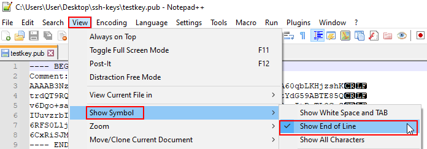

=============================
Use PuTTYGen to Make SSH Keys
=============================

*Contributor: Randy Smith WU2S*

This How-to will show you a method for generating SSH key pairs on a Windows computer, saving them to a USB flash drive, installing the SSH key on an AREDN |trade| node and using the SSH keys with a PuTTY terminal session. The use of Secure Shell (SSH) keys when using PuTTY or another SSH client is a useful aid to managing a group of AREDN |trade| nodes.

* First, obtain the PuTTY suite of applications from the `PuTTY Download Page <https://www.chiark.greenend.org.uk/~sgtatham/putty/latest.html>`_ and install them on your computer.

* Second, obtain and prepare to use a text editor such as `Notepad++ <https://notepad-plus-plus.org/downloads/>`_ that allows you to remove unwanted characters and metadata from your key file.

* Finally, follow the steps below to create, edit, and install your SSH keys.

1. Start the PuTTYGen application. Confirm that you are going to generate an SSH-2 RSA key.

.. image:: _images/01-puttygen.png
   :alt:  Confirm SSH-2 RSA key
   :align: center

----------

2. Select the *Generate key pair* menu item or click the *Generate* button and you will be asked to make some random mouse movements. After a short while you get a message asking you to wait while the keys are generated. Once it finishes you now have a new key pair.

.. image:: _images/02-puttygen.png
   :alt:  Label key pair and create pass phrase
   :align: center

----------

  Give the key pair a suitable comment so that you will remember what the keys are used for. Here we just entered testkey@wu2s.com for an example. Whatever you enter in the "Key Comment" field must look like an email address with no spaces and the "@" present. Normally this field is used to identify a specific *username@hostname*. You can also password protect the SSH login by providing a passphrase if you desire. Record this passphrase so you will remember it for future use.

3. In PuTTYGen you can save your new keys to separate files for later use. To save the public key to a suitable location, click the *Save Public Key* button and enter a filename with a **.pub** extension. Then click the *Save Private Key* button to save your private key to the same location. Give your private key a **.ppk** file extension. Many people save their keys on a USB flash drive to maintain physical possession of them at all times.

.. image:: _images/03-puttygen.png
   :alt: Save key files
   :align: center

----------

4. In order for your new public key to be installed on an AREDN |trade| node you will need to verify that there are no extra characters which Windows typically adds to text files. You can accomplish this using a text editor which allows you to view and remove the unwanted characters. This example shows opening `Notepad++ <https://notepad-plus-plus.org/downloads/>`_ and navigating to *View > Show Symbol > Show End of Line*. Now you can see the line termination characters inserted by Windows.

----------

  If you saved your public key file by clicking the *Save Public Key* button in PuTTYGen you may notice that it contains a header, footer, and lots of end of line characters. Your AREDN |trade| node will not accept the file with these extra characters. The easiest way to resolve this is to go back to PuTTYGen and highlight/select the entire contents of the text area titled "Public key for pasting into OpenSSH authorized_keys file." Copy this text using the CTRL-C keys on your keyboard.

  .. image:: _images/04b-puttygen.png
    :alt: Puttygen copy key text
    :align: center

----------

  Now go to Notepad++ and paste the copied text into a new window. You should see your public key text on a single line without any header/footer or line termination characters.

  .. image:: _images/04c-puttygen.png
    :alt: Puttygen copy key text
    :align: center

----------

  Save this Notepad++ window to a suitable filename with the **.pub** file extension.

  .. image:: _images/04d-puttygen.png
    :alt: Save the public key
    :align: center

----------

5. In order to use your new SSH key pair, login to your AREDN |trade| node and go to the **Setup -> Administration** screen. At the bottom you will see the *Authorized SSH Keys* section where you can install the public keys to use on this node.

.. image:: _images/05-puttygen.png
   :alt: Node Administration page
   :align: center

----------

6. Press the *Choose File* button to locate the *public* SSH key you want to install. After choosing the desired *public* key file, click the *Upload* button to install the key on the AREDN |trade| node.

.. image:: _images/06-puttygen.png
   :alt: Select key to install
   :align: center

----------

7. You will see a message asking you to reboot your node. After rebooting you can confirm that the new key was installed by looking in the dropdown list under the *Remove Key* section. Your SSH key will appear in the list if it is installed. (You are verifying that the key was installed, but do not click the *Remove* button unless you want to remove it.)

.. image:: _images/07-puttygen.png
   :alt: Upload and install key
   :align: center

----------

8. To use your SSH keys, open a new PuTTY session. In the *Hostname* box enter *localnode* and in the *Port* box enter 2222. It may be helpful to save this session definition using a name that identifies the specific node you are connecting to. Enter your identifier and click the *Save* button.

.. image:: _images/08-puttygen.png
   :alt: Create new Putty session
   :align: center

----------

9. Now, using the menu at the left, go to the SSH section and then select the *Auth* item. This shows a number of Options. The only one we need is the very last – the location of the Private key file for authentication. Browse for it and select the correct filename as before. Remember that the PRIVATE key files end in .ppk  Go back to top of the menu on the left and select *Session*.
SAVE the session definition again.

.. image:: _images/09-puttygen.png
   :alt: Session definition, location of private key
   :align: center

----------

10. Now you can use the session information you saved by clicking the *Load* or *Open* button in the main PuTTY session screen. This will open a terminal window as shown below. Login to the AREDN |trade| node as `root`. If you configured the PuTTY session correctly, it will find your private key file and ask you for the passphrase (if any). If PuTTY cannot find the private key file, it will revert to prompting you for the `root` password that you normally use to login on the node.

.. image:: _images/10-puttygen.png
   :alt: Enter passphrase to use SSH key
   :align: center

----------

11. The correct passphrase was entered. The node’s banner appears in the terminal session window and you can now do any command line tasks on the node.

.. image:: _images/11-puttygen.png
   :alt: Logged into node
   :align: center
