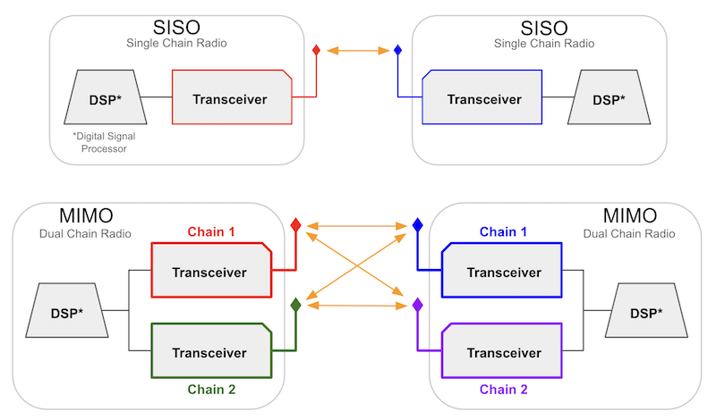
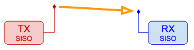
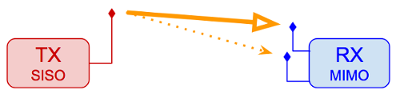
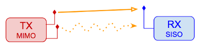

================================
Comparing SISO and MIMO Hardware
================================

SISO (Single Input Single Output) device hardware has a single transceiver-antenna chain, while `MIMO (Multiple Input Multiple Output) <https://en.wikipedia.org/wiki/MIMO>`_ devices have multiple chains coordinated through the `Digital Signal Processor (DSP) <https://en.wikipedia.org/wiki/Digital_signal_processor>`_. The MIMO devices supported by AREDN |trade| have dual chains for both transmit and receive, and they support dual data streams [2x2:2].

Both SISO and MIMO devices use `OFDM (Orthogonal Frequency Division Multiplexing) <https://en.wikipedia.org/wiki/Orthogonal_frequency-division_multiplexing>`_, which inherently handles poor RF conditions such as `multipath interference <https://en.wikipedia.org/wiki/Multipath_propagation#Interference>`_ or fading. The rate selection algorithm in the wireless driver adapts to changing RF conditions so that the optimal :abbr:`MCS (Modulation and Coding Scheme)` `rate <https://en.wikipedia.org/wiki/IEEE_802.11n-2009#Data_rates>`_ is always used. The selected :abbr:`MCS (Modulation and Coding Scheme)` includes the appropriate modulation, forward error correction, and number of data streams.

SISO Device Hardware
--------------------

By design SISO devices transmit all of their RF power on a single polarization. While it may seem like an advantage to have full power concentrated on a single polarization, there are specific limitations to SISO devices. A single chain device can only transmit one data stream at a time, and SISO devices do not have the ability to process and enhance multiple signals received simultaneously.

SISO devices are also limited in the data throughput they can achieve on their single chain. For example, a SISO device is limited to the 802.11n :abbr:`MCS7 (Modulation and Coding Scheme)` `protocol rate <https://en.wikipedia.org/wiki/IEEE_802.11n-2009#Data_rates>`_ of 32.5 Mbps with Long Guard Interval (LGI), while a MIMO device using :abbr:`MCS15 (Modulation and Coding Scheme)` can achieve up to 65 Mbps. In this regard SISO is at a definite disadvantage since it lacks sophisticated signal combining and the multiple simultaneous data streams that are possible with MIMO.

MIMO Device Hardware
--------------------

One of the advantages of MIMO devices is their ability to exploit multipath signals, achieving a better Signal to Noise Ratio (SNR) by combining multiple received transmissions. This is accomplished using `802.11n <https://en.wikipedia.org/wiki/IEEE_802.11n-2009>`_ technologies such as `Polarization Diversity <https://en.wikipedia.org/wiki/Diversity_scheme>`_ and `Maximal Ratio Combining <https://en.wikipedia.org/wiki/Maximal-ratio_combining>`_.

On MIMO devices the total transmit power is split between its two polarizations, which means that MIMO signals have lower `EIRP <https://en.wikipedia.org/wiki/Effective_radiated_power>`_ per polarization. It is possible that SISO devices on both ends of a link could have SNR values that match those of MIMO devices using 802.11n :abbr:`MCS0 (Modulation and Coding Scheme)` to :abbr:`MCS7 (Modulation and Coding Scheme)` on that same link. However, a MIMO device using MCS0 to MCS7 will transmit its data stream on both chains simultaneously, providing a distinct advantage on the receiving end where the MIMO device uses `MRC <https://en.wikipedia.org/wiki/Maximal-ratio_combining>`_ to enhance the signal. MRC is used when multiple antennas receive the same data stream, which applies only for MCS0 to MCS7. With MCS8 to MCS15 `Spatial Multiplexing <https://en.wikipedia.org/wiki/Spatial_multiplexing>`_ achieves multiple simultaneous data streams.

Given the same channel width and link characteristics, MIMO tends to out-perform SISO in both reliability and throughput. A good test to verify this would be to compare the performance of SISO vs. MIMO between the same endpoints. MIMO can attain double the throughput because it is capable of using twice the :abbr:`MCS (Modulation and Coding Scheme)` rate. In the final analysis, the technology limitations of SISO will not allow it to match the throughput levels that are possible with MIMO.

SISO - MIMO Combinations
------------------------

Today's mesh networks are likely to contain a mixture of single and multiple chain devices, so it is important to understand how different combinations of devices might perform.

SISO to SISO
  All transmit power is sent using a single polarization, but multipath signal combining does not occur. Only one data stream at a time can be sent at a rate that is limited by the protocol.

----------

SISO to MIMO
  All transmit power is sent using a single polarization, and the MIMO receiver will enhance reception by combining multipath signals using `MRC <https://en.wikipedia.org/wiki/Maximal-ratio_combining>`_. Only one data stream at a time can be sent at a rate that is limited by the protocol.

----------

MIMO to SISO
  The total transmit power is shared between MIMO chains, so the RF energy which is 90 degrees off-polarization from the receiving antenna may be lost. The SISO receiver cannot enhance multipath signals using `MRC <https://en.wikipedia.org/wiki/Maximal-ratio_combining>`_. Only one data stream at a time can be sent at a rate that is limited by the protocol.

----------

MIMO to MIMO
  The total output power is shared between MIMO chains, but the full power from both polarizations can be processed by the receiver so that nothing is lost. The MIMO receiver can enhance reception by combining multipath signals using `MRC <https://en.wikipedia.org/wiki/Maximal-ratio_combining>`_. Simultaneous data streams can be sent using spatial multiplexing, effectively doubling data throughput.

Troubleshooting Tips
--------------------

* Whenever possible try not to mix device types on radio links. As a general rule, use MIMO-to-MIMO for most types of RF links.

* If you have a marginal SISO-to-SISO link and you must replace one of the radios, either install another SISO radio or replace both ends with MIMO devices. A marginal but usable link between SISO devices may become unusable if only one is replaced with a MIMO device.

Additional information on the operation of SISO and MIMO devices can be found in references such as this: `MIMO for Dummies <https://www.halper.in//pubs/mimo_for_dummies.pdf>`_.
