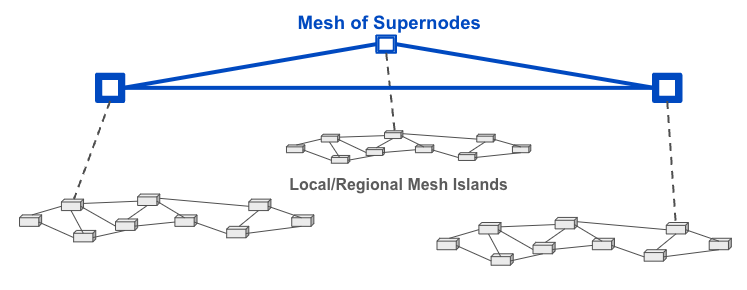
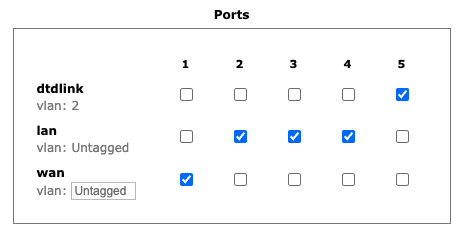

=======================
Configuring a Supernode
=======================

**Supernodes** are a way to link multiple mesh island networks in a safe and efficient way. Supernodes are configured as a "super-mesh" with mesh island sub-networks linked by their Supernode. If your local node is part of a Supernode network then it has the ability to view other nodes which are part of the wider Supernode network.

|

Typically a Supernode is configured on a dedicated *Mikrotik hAP ac2*. It's sole task is to serve as a node on the Supernode mesh. The local sub-mesh network is linked to the Supernode using a :abbr:`DtD (Device to Device)` link on one of its LAN ports which is configured for *dtdlink* on the *Advanced Network* display.

|

Setting up a Supernode
----------------------

The following steps are required to configure a Supernode.

- Start with an *hAP ac2* device that is newly flashed with firmware ≥ Nightly Build 20230921

- Set up the Supernode with a nodename prefixed with your callsign and followed by a location identifier as well as the word "SUPERNODE." For example you could use ``AB2CD-NYC-SUPERNODE`` or ``AB6CD-LAX-SUPERNODE``

- Ensure that *Mesh RF* is ``disabled``

- Provide a reserved or static IP address for the Supernode's WAN connection to your Internet routing device.

- *Save Changes* and *Reboot* the new Supernode

- Login to the Supernode via *ssh* or *telnet* to get a command line prompt, and then manually type and execute each of these commands:

  - ``# uci -c /etc/config.mesh set aredn.@supernode[0].enable=1``
  - ``# uci -c /etc/config.mesh commit aredn``
  - ``# /usr/local/bin/node-setup -a mesh``
  - ``# reboot``

Your node should now be functioning as a Supernode. The next step is to connect to another Supernode using a tunnel. The easiest way to do this is to ask another Supernode owner for a set of tunnel client credentials. Your node can use either a client or server tunnel link - it’s up to you. Supernode tunnels use port ``5526`` rather than the usual tunnel port of ``5525``.
