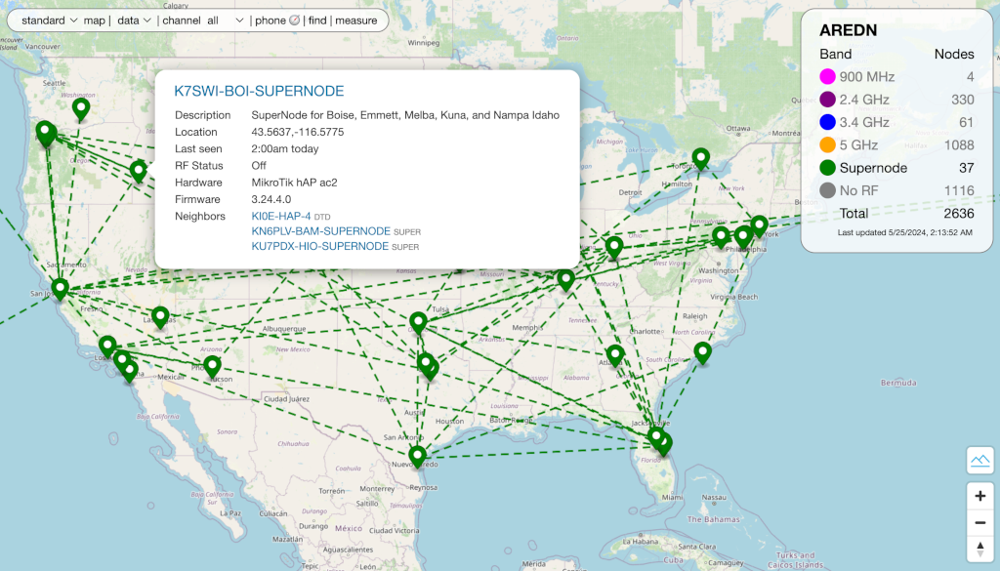

=======================
Configuring a Supernode
=======================

**Supernodes** are a way to link multiple mesh island networks in a safe and efficient way. A Supernode network is a high-level mesh network --- **super** meaning *"above or higher."* The Supernode network sits above the isolated mesh networks and provides connectivity without increasing the routing load on the local networks. Supernodes do not merge networks into one big mesh but instead isolate connections between discrete meshes. For further information see the *Supernode Architecture* section of the **Network Topologies** topic in the **Network Design Guide**.

.. image:: ../_images/supernode-mesh.png
   :alt: Supernode mesh diagram
   :align: center

|

Typically a Supernode is configured on a dedicated *Mikrotik hAP ac2*. Its sole task is to serve as a node on the Supernode network. The local sub-mesh network is linked to the Supernode using a :abbr:`DtD (Device to Device)` link on one of its LAN ports which is configured for *dtdlink* on the *Advanced Network* display (Port 5 by default).

.. image:: _images/supernode-localDTD.png
   :alt: DtD Link Example
   :align: center

|

Setting up a Supernode
----------------------

The following steps are required to configure a Supernode.

#. Start with a **Mikrotik hAP ac2** device that is newly flashed with the latest Nightly Build (≥ 20230930). If the node has been previously configured or used beforehand, please reflash and start fresh in order to avoid problems later in the setup process.

#. Configure the Supernode with a nodename prefixed with your callsign followed by a location identifier as well as the word "SUPERNODE." For example you could use ``AB2CD-NYC-SUPERNODE`` or ``AB6CD-LAX-SUPERNODE``

#. Ensure that *Mesh RF* is ``disabled``

#. Provide a reserved or static IP address for the device's WAN connection to your Internet routing device.

#. Do not add any other configuration settings at this point or you may encounter problems later in this process. At this point simply *Save Changes* and *Reboot* the device.

#. Login to the rebooted device via *ssh* or *telnet* to get a command line prompt, and then manually type and execute each of these commands:

  ::

    # uci -c /etc/config.mesh add aredn supernode
    # uci -c /etc/config.mesh set aredn.@supernode[0].enable=1
    # uci -c /etc/config.mesh commit aredn
    # /usr/local/bin/node-setup -a mesh
    # reboot

Your node should now be functioning as a Supernode. To validate this you can do the following:

- Login to the Supernode vi *ssh* or *telnet* and type the following command:

  ::

    cat /etc/config/aredn

- Toward the end of the file which will be shown on the screen you should find the following lines:

  ::

    config supernode
	    option enable '1'

If somehow you do not see these lines, please start this process again from the beginning and make sure to follow every step in the sequence.

Things to Avoid
  Here are several things **NOT** to do when configuring your Supernode.

  - Your Supernode must **not** use any Cross-links (Xlinks) to other nodes
  - Your Supernode must **not** have tunnel links to any non-Supernode devices
  - Your Supernode must **not** have its *Mesh RF* interface ``enabled`` -- *Mesh RF* must be ``disabled`` as noted above

Before proceeding, make sure all the previous steps have been completed successfully. Now you should be able to connect to another Supernode using a tunnel. The easiest way to do this is to ask another Supernode owner for a set of tunnel client credentials. Your node can use either a client or server tunnel link. Supernode tunnels use port ``5526`` rather than the usual tunnel port of ``5525``. Supernode owners can be identified from the `Supernode Network Map <https://arednmap.xojs.org>`_

|

Coordinating Supernode Deployments
----------------------------------

Because Supernodes use the `OLSR (Optimized Link State Routing) <https://en.wikipedia.org/wiki/Optimized_Link_State_Routing_Protocol>`_ protocol, multiple Supernodes can be connected to each other, each operating as a peer of the others. A local network can be connected to multiple Supernodes, but a single Supernode should only be connected to a single local network, although it may be connected at multiple points.

By having only a single local network connected to each Supernode, the owners of each local network are responsible for their own Supernodes. This simplifies management and maintenance. There is also some fault isolation as a failed Supernode will only affect the link to one local network.

The number of messages a Supernode receives will scale linearly with the total number of nodes in all connected local networks. A Supernode receives a management message from every node in the network (all nodes in all local networks) every 5 seconds. With a typical message size of 100 bytes, a Supernode receives about 20 bytes per second per node. At the time of initial testing, there were 4,300 AREDN |trade| nodes registered world-wide, so a Supernode for this network would receive ``84 KB/s`` or ``0.7 Mb/s``, which is a manageable bandwidth requirement.

As more Supernodes are deployed linking more local networks, the overall performance of the *Cloud Mesh* will be impacted. Therefore, it is a good idea to coordinate the deployment of Supernodes among the Supernode owners at the time when tunnel links are requested for the *Cloud Mesh*.
