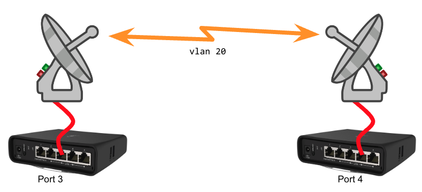

============
Using Xlinks
============

*Contributor: Tim Wilkinson KN6PLV*

A cross-link (xlink) allows you to pass AREDN® traffic across non-AREDN® network links. Tunnels and xlinks both connect two nodes together, so they are the same in that respect. However, they do it in very different ways.

Tunnels
  Tunnels are a simple to use, all in one feature, which operates over your regular Internet to connect two AREDN® nodes. There is a bit of configuration information to exchange, but it is all fairly easy to set up. Tunnels *only work* over your **WAN** connection, you use the IP address given by the server, and there is very little else to configure.

Xlinks
  Xlinks, on the other hand, are much more basic and flexible. The configuration lets you choose IP addresses yourself, as well as setting a VLAN and *port* on which xlink traffic leaves the device. The IP addresses let the system route the data, but unlike a tunnel you can set these addresses any way you desire. You choose any unused VLAN number yourself, and the *port* determines how you want the data to be physically sent into or out of the node. How the data is moved to the peer device is not defined in any way, and deliberately so. Maybe you want to connect that *port* directly to a non-AREDN® PtP radio. Maybe you feed it into a switch then use some other tunneling technology to get it where it needs to go. Maybe it is just a bit of Ethernet cable. It is entirely up to you. Personally, I use tunnels to connect nodes over the Internet, but I use xlinks to connect nodes over Point-to-Point radios which are not running AREDN® firmware.

Configure the AREDN® nodes at both ends
---------------------------------------

You can use either a *Mikrotik hAP ac2* or *ac3* as the AREDN® device on each end of the xlink. Navigate to the **Ethernet Ports & Xlinks** page of the node on one side of the link. To add an xlink click the *plus* icon, enter an unused VLAN number for the link, an IP address for the near-side device, an IP address for the far-side device, a weighting factor, the available port to which the near-side device is connected on your node, and the `CIDR <https://en.wikipedia.org/wiki/Classless_Inter-Domain_Routing>`_ netmask. The *Weight* will be used by the routing protocol to determine the best route for AREDN® traffic.

.. image:: ../arednGettingStarted/_images/admin-ports-xlinks.png
  :alt: Ethernet Ports & Xlinks
  :align: center

In this example VLAN ``20`` is not in use anywhere else on the network. We assigned an *IP Address* of ``172.16.1.1`` for the near-side node, and we assigned ``172.16.1.2`` as the *Peer Address* for the node on the other side of the link. The xlink knows nothing about the details or configuration of the intermediate transport devices. The *Weight* is set to ``1`` which is the same weight as would be used by a tunnel connection, but this can be increased if you want the cross-link to be chosen at a lower priority for routing traffic on the mesh. *Port* ``lan3`` was chosen because it is an open port on this node. After entering these values, click ``Done`` and ``Commit`` your changes. Now you can cable your near-side transport device to port 3 on your AREDN® node.

Next, open the **Ethernet Ports & Xlinks** page on the node for the other side of the link. Set the *IP Address* for that node to ``172.16.1.2`` and the *Peer Address* to ``172.16.1.1``. The *Weight* is set to ``1`` and the *Port* is set to ``lan4`` because that is an open port on this node. After entering these values, click ``Done`` and ``Commit`` your changes. Now you can cable your far-side transport device to port 4 on that AREDN® node.

Configure the intermediate transport link
----------------------------------------------

How data is moved between the peer devices is not restricted or defined. There are many types of intermediate transport products that can be used to establish an AREDN® xlink. Refer to your manufacturer's documentation for the best way to ensure that network packets can be successfully transferred between the two endpoint devices. The easiest way to accomplish this is to bridge the traffic directly between the peer devices.
