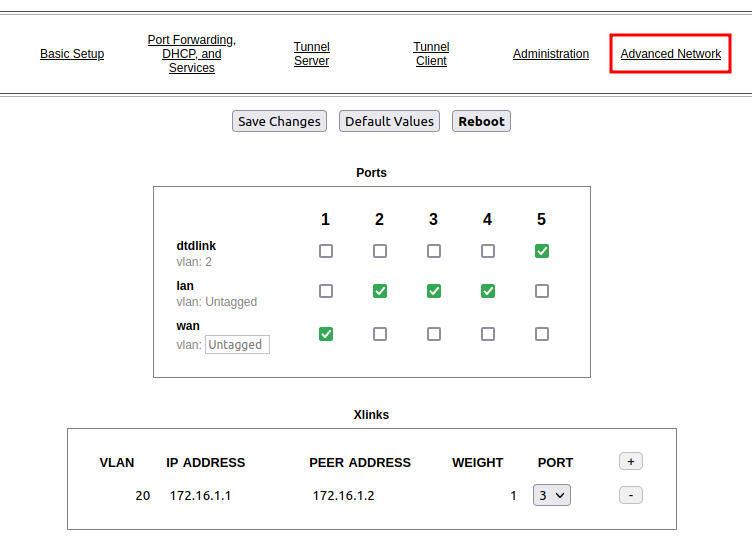

=================
Using Cross Links
=================

*Contributor: Tim Wilkerson KN6PLV*

A cross-link allows your node to pass AREDN |trade| traffic across non-AREDN |trade| Point-to-Point (PtP) links.

Configure the AREDN |trade| nodes at both ends
----------------------------------------------

You can use either a *Mikrotik hAP ac2* or *ac3* as the AREDN |trade| device on each end of the cross-link. Navigate to the **Administration > Advanced Network** page of the node on one side of the link. To add a cross-link click the *plus* icon, enter an unused VLAN number for the link, an IP address for the near-side radio, an IP address for the far-side radio, a weighting factor, and the available port to which the near-side radio is connected on your node. The *Weight* will be used by `OLSR <https://en.wikipedia.org/wiki/Optimized_Link_State_Routing_Protocol>`_ to determine the best route for AREDN |trade| traffic.

In this example we chose VLAN ``20`` because it is not in use anywhere else on our network. We assigned an *IP Address* of ``172.16.1.1`` for the PtP radio attached to this node, and we assigned ``172.16.1.2`` as the *Peer Address* for the PtP radio on the other side of the link. The *Weight* is set to ``1`` which is the same weight as would be used by a tunnel connection, but this can be increased if you want the cross-link to be chosen at a lower priority for routing traffic on the mesh. *Port* ``3`` was chosen because it is an open port on this device. After entering your values, click *Save Changes* to save the new cross-link information. Now you can cable your near-side PtP device to port 3 on your AREDN |trade| node.

Next, open the **Administration > Advanced Network** page on the node for the other side of the PtP link. Set the *IP Address* for the PtP radio attached to this node to ``172.16.1.2`` and the *Peer Address* for the PtP radio on the other side of the link to ``172.16.1.1``. The *Weight* is set to ``1`` which is the same weight as would be used by a tunnel connection, but this can be increased if you want the cross-link to be chosen at a lower priority for routing traffic on the mesh. In our example we are setting the *Port* to ``4`` because it is an open port on this device. After entering your values, click *Save Changes* to save the cross-link configuration for this side of the PtP link. Now you can cable your far-side PtP device to port 4 on your AREDN |trade| node.

Configure the intermediate Point-to-Point Link
----------------------------------------------

There are many types of vendor-specific Point-to-Point products that can be used to establish an AREDN |trade| cross-link. Refer to your manufacturer's documentation for the best way to ensure that network packets can be successfully transferred between the two endpoint devices. The easiest way to accomplish this is to bridge the traffic directly between the peer devices.
