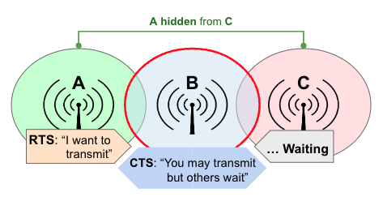
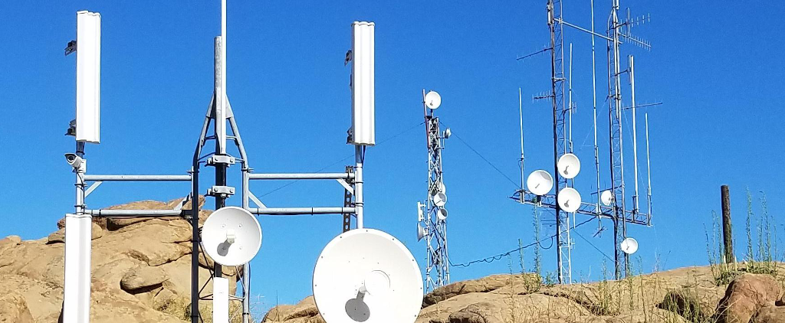
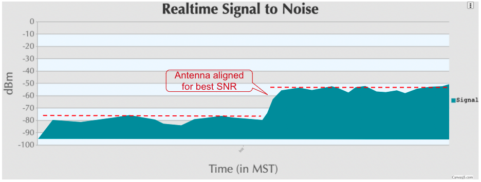

================
Channel Planning
================

The previous section identified the different channels in each frequency band which are available for AREDN |trade| networking. Devices on each side of a radio link must use the same frequency band, channel, and channel width. Beyond that requirement, however, you have quite a bit of freedom to select the radio channels that will ensure the highest signal quality for your network.

In a basic AREDN |trade| *meshnet* with individual nodes spread across a limited geographical area, all of the nodes may use the same frequency, channel, and channel width. This allows them to establish a network and route data to any of the sites as needed. However, as more nodes join the network or when several nodes are :abbr:`collocated (sharing the same physical site)`, it is possible for them to interfere with each other. In order for an AREDN |trade| network to scale up in size and complexity, channel planning becomes increasingly important.

Some amount of data traffic is required for :abbr:`OLSR (Optimized Link State Routing protocol)` to maintain and operate the mesh network. Having a growing number of nodes on the same channel will increase the amount of :abbr:`OLSR (Optimized Link State Routing protocol)` handshaking, which can lead to more latency for data traffic across the network. Any application, program, or service that is sensitive to latency (especially voice or video services) may experience difficulty or even become unusable.

Another case is when there is one poor quality link over which all traffic must be routed. The handshaking and data retransmissions may cause all the other links to wait. The entire network can be impacted by one low quality path which becomes a single bottleneck. If at all possible you should increase the signal quality of that vital link, or establish a better link as an alternate path.

Channel Contention
------------------

In any wireless network there will be nodes which are not within radio range of each other. In the example below, **A** can hear **B** but cannot hear **C**. Since **A** and **C** are hidden from each other, they may try to transmit on the same channel at the same time without knowing it. Collision detection mechanisms will not help because the nodes have no way to communicate except through node **B**, so collision avoidance mechanisms must be used instead.

AREDN |trade| firmware follows `IEEE 802.11a/b/g/n standards <https://en.wikipedia.org/wiki/IEEE_802.11n-2009>`_ and uses `Carrier Sense Multiple Access / Collision Avoidance (CSMA/CA) <https://en.wikipedia.org/wiki/Carrier-sense_multiple_access>`_ for determining whether a channel is busy.  Optionally AREDN |trade| firmware also employs `Request to Send / Clear to Send (RTS/CTS) messages <https://en.wikipedia.org/wiki/IEEE_802.11_RTS/CTS>`_ to negotiate the use of a channel. Decreased network throughput is one side effect of this, because several nodes may be negotiating or waiting to use the channel.

For `hidden nodes <https://en.wikipedia.org/wiki/Hidden_node_problem>`_, two approaches may help to minimize this issue. You may be able to make the hidden nodes visible to each other, for example by increasing their signal strength. The alternative is to isolate the nodes completely by placing them onto different bands or channels. Since nodes using directional antennas are nearly invisible to others not positioned in the antenna's beam, directional antennas should be used with care when sharing a channel. It may be more appropriate to create a separate link between the sites and to put the radios on a different band or channel.

Route Flapping
--------------

This is another issue that can lead to performance problems on a network. You may have parallel paths between two *Remote Nodes*, and these paths have similar :abbr:`ETX (Expected Transmit metric)` values which indicates that the cost of using either route is comparable. These two paths may appear to be functioning well most of the time.

However, when a bandwidth-intensive application such as video conferencing begins sending traffic across one of the paths, you may notice that link getting bogged down and the :abbr:`ETX (Expected Transmit metric)` will drop below that of the other path. At this point :abbr:`OLSR (Optimized Link State Routing protocol)` switches to the alternate path which now has a lower cost. The video stream then bogs down its new path, which lowers the :abbr:`ETX (Expected Transmit metric)`, and :abbr:`OLSR (Optimized Link State Routing protocol)` switches back to the original link whose :abbr:`ETX (Expected Transmit metric)` is better again. This situation may continue indefinitely, with neither path being able to deliver the traffic adequately.

This issue can happen on multi-hop links with similar :abbr:`ETX (Expected Transmit metric)` which seem to work fine until they are loaded with traffic. Then packet loss begins to occur, connections time out, and neither path is reliable during that cycle. One solution might be to improve the multi-hop link cost by increasing the signal quality of the links along one of the paths. Conversely, you could also turn down the power on the alternate path to increase its cost. If bandwidth-intensive traffic must be passed between two remote endpoints, the best approach would be to design a more robust path between those two endpoints to meet that need.

Collocated Nodes
----------------

At some sites there may be several devices mounted on the same building or structure. The photo on the right shows many nodes collocated on a single tower. Network problems can occur if these nodes share an RF band and channel. For example, when two sector antennas are collocated and share the same channel, the network throughput for that site will be reduced by half or more. If you have collocated nodes then it makes sense to allow the devices to pass traffic over their Ethernet interface rather than forcing them to use their radio channel.

Device to Device (DtD) Linking
++++++++++++++++++++++++++++++

In its most basic configuration for two collocated nodes, an Ethernet cable is connected between the PoE *LAN* port of each device. :abbr:`OLSR (Optimized Link State Routing protocol)` will assign a very low "link cost" (0.1) to the DtD connection and automatically route traffic between the nodes over Ethernet rather than causing the RF channel to become busy.

One added benefit of DtD linking is that you can link nodes which are operating on different bands and channels. Nodes that are using *Channel Separation* to avoid interfering with each other can still pass data at high speeds through their DtD link and be members of a single network. At a tower site like the one shown here, you could link 2.4 GHz, 3.4 GHz, and 5.8 GHz nodes to the same *meshnet*. In fact, at a busy site like this it is best practice to use DtD linking, because otherwise RF channel contention could make the network unusable.

Ideally you should configure your collocated nodes to use different bands and channels, then set up DtD links between the nodes to ensure that traffic is routed efficiently without generating RF contention or delays. :abbr:`OLSR (Optimized Link State Routing protocol)` will always choose the DtD path first when passing traffic between linked nodes. Each AREDN |trade| node recognizes incoming packets tagged with :abbr:`VLAN (Virtual Local Area Network)` 2 as DtD traffic.

.. image:: _images/dtd-linking.png
   :alt: DtD Linking
   :align: center

In the simple example above, the smart switch will share all traffic across all ports and every node will receive it on its DtD link. If this is not what is desired, you can configure additional VLANs on the switch to isolate port traffic so that only the nodes which should receive specific traffic will see it. For example, you may have a video surveillance system (5) or a :abbr:`VoIP (Voice over IP)` phone system (6) and traffic from those devices should only be passed to a specific set of links as shown in the diagram below.

.. image:: _images/vlan-isolation.png
   :alt: Traffic Isolation with VLANs
   :align: center

Antenna Polarization
++++++++++++++++++++

Most of the latest AREDN |trade| devices use dual polarity antennas and :abbr:`MIMO (Multiple Input - Multiple Output)` features in the radios that  exploit multipath propagation. However, if you are using single polarity antennas with "single chain" radios, another way to achieve signal separation for collocated devices is to orient the site's antennas so that one is vertically polarized and the other is horizontally polarized. This can result in a signal separation of up to 20 dB. Vertical polarization is usually preferred because it tends to be less susceptible to reflections and rain fade, but horizontal polarization still provides adequate signal with clear line of sight. Note that the antennas on both sides of a radio link must be oriented the same way.

Aligning Link Nodes
-------------------

The AREDN |trade| web interface provides information that is helpful when aligning two nodes that are being installed to form a link. On the **Node Status** page, click the **Charts** button to view the *Realtime Signal to Noise* graph. Slowly turn and tilt your antenna, pausing to view the signal metrics. Once you see the best signal, as shown below, you can lock your antenna into position. If you want to focus on the antenna position without having to view the SNR graph, you can also enable the *SNR Sound* feature and align the antenna to the highest pitch tone. Depending on the implementation, a Signal to Noise Ratio of 15 dB is adequate to pass data at speeds in the range of 5 to 20 :abbr:`Mbps (Megabits per second)`.

Channel Planning Tips
---------------------

.. sidebar:: Avoid Network Scalability Issues

   If there are two towers or cell coverage areas within range of each other, configure them with different channels to avoid poor performance.

You may experience poor network performance if there are too many nodes using the same band and channel. Here is a simple example to illustrate the issue: a three-hop path from QTH1 to Tower1 to Tower2 to QTH2. If all links are using the same channel, then only one link at half-duplex can send data at a time. This instantly cuts the throughput by one-third or more and increases latency with protocol overhead. To improve performance you can configure each link to use a different channel, allowing simultaneous transmissions. In the first case with channel sharing, it might be possible to have one HD video stream and one VoIP call with frequent dropouts. In the second case using different link channels, you could have three HD video streams and several VoIP calls simultaneously with few dropouts.

Based on the purpose for your network, try to create reliable paths to the locations where data is needed. Use channel separation and DtD linking of collocated nodes to avoid RF channel contention. The 3.4 GHz and 5.8 GHz bands provide the most unshared channels for use in AREDN |trade| networks.

* If you need broad local coverage for a high profile area you can install sector antennas on a tower site: for example, three panels with 120 degree beam width each. DtD link the sectors at the tower site, and use different channels for each sector in order to avoid channel contention issues.

* Consider putting each local *meshnet* on its own channel to minimize the interaction between coverage areas, similar to how cellular network "cells" are planned and deployed.

* If you are installing long distance point to point links to connect mesh islands, be sure to use a separate band or channel for the backbone link. This type of link has a single purpose: to carry as much data as quickly as possible from one end to the other. Eliminate any type of channel contention so that these links can focus on throughput without distractions.

* Remember that a multi-hop path through the network must have good signal quality on each leg of the journey. You cannot expect adequate performance through a series of poor quality links. For example, if you traverse three links having :abbr:`LQ (Link Quality)` metrics of 65%, 45%, and 58%, your aggregate :abbr:`LQ (Link Quality)` will be 17% which is unusable. The aggregate :abbr:`LQ (Link Quality)` should be at least 50% to have a usable path.

.. |trade|  unicode:: U+00AE .. Registered Trademark SIGN
   :ltrim:
