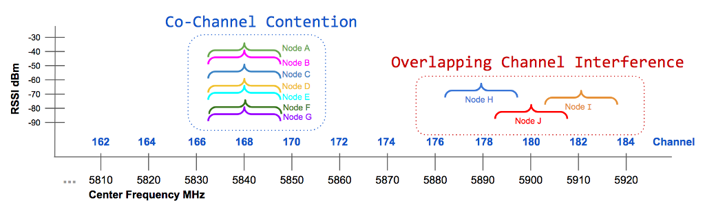
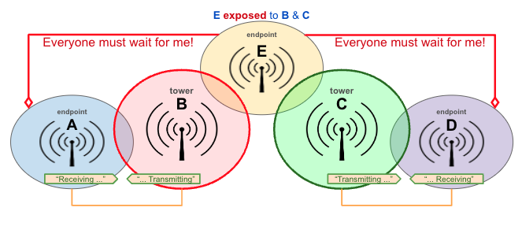

================
Channel Planning
================

The previous section identified the different channels in each frequency band which are available for AREDN |trade| networking. Devices on each side of a radio link must use the same frequency band, channel, channel width, and SSID. Beyond that requirement, however, you have quite a bit of flexibility to select the radio channels that will ensure the highest signal quality and throughput for your network. In a basic AREDN |trade| network with several nodes spread across a limited geographical area, all of the nodes may use the same band, channel, and channel width. This allows them to establish network routing to any of the sites as needed.

However, as more nodes join the network or when several nodes are :abbr:`collocated (same physical site)` and share the same channel, it is possible for overall network performance to degrade. In order for an AREDN |trade| network to scale up in size and complexity, frequency coordination and channel planning become increasingly important. To plan for future growth, local AREDN |trade| groups may need to partition use different network topologies and to allocate different channels for specific geographic areas or types of links in order to ensure the network will be able to support the expected services.

Wireless Network Operation
--------------------------

A wireless network is a shared half-duplex medium on which only one station at a time should transmit. In that sense wireless operations are analogous to other types of radio transmissions. If two stations key up their transmitters at the same time, they will interfere with each other to the extent that neither of them will receive the other's message. That is why net control procedures are implemented to ensure controlled access to a radio channel during emergency communication.

AREDN |trade| firmware automatically mediates station access to the wireless medium by implementing `IEEE 802.11a/b/g/n <https://en.wikipedia.org/wiki/IEEE_802.11n-2009>`_ standards and `Carrier Sense Multiple Access / Collision Avoidance (CSMA/CA) <https://en.wikipedia.org/wiki/Carrier-sense_multiple_access>`_. This listen-before-talk technology helps nodes to determine whether a channel is busy. Each node performs a *Clear Channel Assessment (CCA)* as well as using `Request to Send / Clear to Send (RTS/CTS) <https://en.wikipedia.org/wiki/IEEE_802.11_RTS/CTS>`_ messages to negotiate access to a channel. A negligible amount of network traffic is also required for `OLSR (Optimized Link State Routing protocol) <https://en.wikipedia.org/wiki/Optimized_Link_State_Routing_Protocol>`_ to maintain routes for the network as a whole, but this OLSR traffic is a very small fraction of the total.

In a single-channel wireless network, any node that needs to transmit will automatically coordinate with the other nodes for a clear channel. This is by design, but as more devices try to gain access to the same channel there is an increased potential for each node to wait longer for its chance to transmit. This can result in increased latency and decreased network throughput as the number of network nodes increases.

Channel Contention
++++++++++++++++++

The concept of *Overlapping Channel Interference* is illustrated on the right side of the following channel scan diagram. *Overlapping Channel Interference* is very serious, but it can be eliminated by selecting non-overlapping channels for all of the devices accessing your network. A second issue related to how wireless networks operate is illustrated on the left side of the diagram. It is commonly called *Co-channel Interference* but is more accurately described as *Co-channel Contention* or *Co-channel Cooperation*.

In this example several nodes must share a single channel, so they all negotiate for the opportunity to transmit. Any node that needs to transmit will use listen-before-talk technology to determine whether the medium is busy. If the channel seems clear, the node will attempt to transmit data. If the channel is busy, the node will defer transmission until the channel seems clear. In a high-density network where a large number of nodes share a single channel, the normal negotiation processes may result in significant performance degradation. From an end-user perspective, an overloaded channel can make the network seem sluggish or even unusable.

This example is not meant to show that having only seven nodes will overload a channel. There is no established rule of thumb for channel sharing that specifies how many nodes are too many. The answer depends on the number of nodes, the bandwidth in use to support required services, the link signal qualities, and other network characteristics. Based on these parameters one shared channel may perform well with many dozens of nodes, while another network may see performance degradation with significantly fewer nodes sharing a channel. Many factors interact to influence network performance, but it will soon become obvious to users whether the network is behaving as expected.

Several tools are available for testing network performance such as *ping* to measure latency, *traceroute* to identify how traffic is being routed, and *iperf3* to estimate network throughput. Periodic measurements along with user perceptions can be helpful in determining whether channel separation would be of benefit. It is an expected by-product of how wireless networks normally operate, but performance can be enhanced by planning the assigned channels for your mesh devices as described in the **Channel Plans** section below.

Hidden and Exposed Nodes
++++++++++++++++++++++++

In any wireless network there will be nodes that are not within radio range of each other but which share the same channel. In the `Hidden Node <https://en.wikipedia.org/wiki/Hidden_node_problem>`_ example below, **A** can reach **B** but cannot reach **C**. Since **A** and **C** are hidden from each other, they may try to transmit on the shared channel at the same time without knowing it. Because of their relative locations and any associated network delays, each node may think it has a clear channel for transmitting.

.. image:: _images/hidden-node.png
   :alt: Hidden Node Problem
   :align: center

|

In the `Exposed Node <https://en.wikipedia.org/wiki/Exposed_node_problem>`_ example below, **A** can reach **B** but cannot reach **C** or **D**. However, if **A** and **B** are communicating, then **C** will detect that the channel is not clear and will prevent **D** from transmitting even though **D**'s transmission would not interfere with the conversation between **A** and **B**. This increases the network wait time which impacts overall throughput.

|

`Request to Send / Clear to Send (RTS/CTS) <https://en.wikipedia.org/wiki/IEEE_802.11_RTS/CTS>`_ messages can be used by AREDN |trade| nodes to minimize these issues. For example, node **A** broadcasts a short RTS message with a proposed timeslot/duration for transmitting its complete data stream. Node **B** receives that request and broadcasts a CTS for that time slot. Node **C** could not hear the original RTS but will hear the CTS message and defer its transmissions during that time slot.

Other approaches may alleviate these issues. You may be able to make hidden nodes visible to each other, for example by increasing their signal strength. Another alternative would be to isolate the nodes completely by placing them onto different bands or channels. Since nodes using directional antennas are nearly invisible to others not positioned in the antenna's beam, directional antennas should be used with care when sharing a channel. It may be more appropriate to create a separate link between the sites and to put the radios on different bands or channels.

Another case is when there is one poor quality link over which all traffic must be routed. The handshaking and data retransmissions may cause all the other nodes to wait. The entire network can be impacted by one low quality path which becomes a bottleneck. If at all possible you should increase the signal quality of that vital link or install a better link as an alternate path.

Route Flapping
++++++++++++++

This is another issue that can lead to performance problems on a network. You may have parallel paths between two *Remote Nodes*, and these paths have similar :abbr:`ETX (Expected Transmit metric)` values which indicates that the cost of using either route is comparable. These two paths may appear to be functioning well most of the time.

However, when a bandwidth-intensive application such as video conferencing begins sending traffic across one of the paths, you may notice that link getting bogged down and the :abbr:`ETX (Expected Transmit metric)` will drop below that of the other path. At this point :abbr:`OLSR (Optimized Link State Routing protocol)` switches to the alternate path which now has a lower cost. The video stream then bogs down its new path, which lowers the :abbr:`ETX (Expected Transmit metric)`, and :abbr:`OLSR (Optimized Link State Routing protocol)` switches back to the original link whose :abbr:`ETX (Expected Transmit metric)` is better again. This situation may continue indefinitely, with neither path being able to deliver the traffic adequately.

This issue can happen on multi-hop links with similar :abbr:`ETX (Expected Transmit metric)` which seem to work fine until they are loaded with traffic. Then packet loss begins to occur, connections time out, and neither path is reliable during that cycle. One solution might be to improve the multi-hop link cost by increasing the signal quality of the links along one of the paths. Conversely, you could also turn down the power on the alternate path to increase its cost. If bandwidth-intensive traffic must be passed between two remote endpoints, the best approach would be to design a more robust path between those two endpoints to meet that need.

Channel Plans and Frequency Coordination
----------------------------------------

You may experience poor network performance if there are too many nodes using the same band and channel. Here is a simple example to illustrate the issue: a three-hop path from QTH1 to Tower1 to Tower2 to QTH2. If all links are using the same channel, then only one node at a time can send data. This instantly cuts the throughput by one-third or more and increases latency with protocol overhead. To improve performance you could configure each link to use a different channel, allowing simultaneous transmissions. For example, the collocated tower nodes could be DtD linked via Ethernet, with QTH1 and Tower1 using 5 GHz channel 172 while QTH2 and Tower2 use channel 176. Before this channel plan is implemented it might be possible to have one HD video stream and one VoIP call with frequent dropouts. After the channel plan is implemented it should be possible to have three HD video streams and several VoIP calls simultaneously with few dropouts.

Depending on the frequency band you are using, there are varying options available for assigning non-overlapping channels to your mesh devices. For example, in the 5.8 GHz band using even-numbered 10 MHz channels, there are 25 non-overlapping channels. Ideally, RF coverage zones (sometimes called "cells") should use different channels. Overlapping cell coverage can provide broader connectivity, but the overlapping coverage zones should not use overlapping RF frequencies.

|

The example coverage map shows that four different channels have been assigned to achieve broad coverage by segmenting specific areas into zones to reduce co-channel contention. It should be noted that even a channel reuse plan such as this may not eliminate all instances of contention. For example, if a node is at the outer edges of a coverage zone or is elevated well above ground level, its transmissions may propagate into a distant cell using the same channel. The radios in the other cell will defer if they hear the original node's transmissions, even though they originate in a different cell. Some degree of experimentation may be required in order to minimize contention and maximize network throughput.

Collocated Nodes
----------------

At some sites there may be several devices mounted on the same building or structure. This photo shows many nodes collocated on a mountaintop.

.. image:: _images/collocated-nodes.png
   :alt: Collocated Nodes
   :align: center

|

Network performance degradation can occur if these nodes share an RF band and channel. For example, when two sector antennas are collocated and share the same channel, the network throughput for that site will be reduced by half or more. If you have collocated nodes then it makes sense to allow the devices to pass traffic over their Ethernet interface (as described below) rather than forcing them to use their radio channel.

Device to Device (DtD) Linking
++++++++++++++++++++++++++++++

In its most basic configuration for two collocated nodes, an Ethernet cable is connected between the PoE *LAN* port of each device. :abbr:`OLSR (Optimized Link State Routing protocol)` will assign a very low "link cost" (0.1) to the DtD connection and automatically route traffic between the nodes over Ethernet rather than causing the RF channel to become busy.

.. image:: _images/dtd-linking.png
   :alt: DtD Linking
   :align: right

One added benefit of DtD linking is that you can link nodes which are operating on different bands and channels. Nodes that are using *Channel Separation* to segment traffic can still pass data at high speeds through their DtD link and be members of a single network. At a tower site like the one shown here, you could link 2.4 GHz and 5.8 GHz nodes to the same network. In fact, at a busy site like this it is best practice to use DtD linking, because otherwise RF channel contention could make the network unusable.

Ideally you should configure your collocated nodes to use different bands and channels, then set up DtD links between the nodes to ensure that traffic is routed efficiently without generating RF contention or delays. :abbr:`OLSR (Optimized Link State Routing protocol)` will always choose the DtD path first when passing traffic between linked nodes. Each AREDN |trade| node recognizes incoming packets tagged with :abbr:`VLAN (Virtual Local Area Network)` 2 as DtD traffic. In the simple example shown here, the switch will share all traffic across all ports and every node will receive it on its DtD link.

If you want to partition traffic even further, you can configure VLANs on a managed switch to isolate port traffic so that only the nodes which should receive specific traffic will see it. For example, you may have a video surveillance system (5) or a :abbr:`VoIP (Voice over IP)` PBX system (6), and traffic from those devices should only be passed to a specific set of links as shown in the diagram below. The port-based VLANs will ensure that traffic is controlled and routed, rather than being broadcast across every link.

.. image:: _images/vlan-isolation.png
   :alt: Traffic Isolation with VLANs
   :align: center

|

Antenna Polarization
++++++++++++++++++++

Most of the latest AREDN |trade| devices use dual polarity antennas and :abbr:`MIMO (Multiple Input - Multiple Output)` features in the radios that  exploit multipath propagation. However, if you are using single polarity antennas with "single chain" radios, another way to achieve signal separation for collocated devices is to orient the site's antennas so that one is vertically polarized and the other is horizontally polarized. This can result in a signal separation of up to 20 dB. Because of the predominance of vertical polarization in commercial WiFi devices, single chain AREDN |trade| nodes may achieve slightly better performance using horizontal polarization with clear line of sight. You can test both polarizations to see which one yields better performance dealing with the man-made noise in your specific environment. Note that the antennas on both sides of a radio link must be oriented the same way.

Aligning Linked Nodes
+++++++++++++++++++++

The AREDN |trade| web interface provides information that is helpful when aligning two nodes that are being installed to form a link. On the **Node Status** page, click the **Charts** button to view the *Realtime Signal to Noise* graph. Slowly turn and tilt your antenna, pausing to view the signal metrics. Once you see the best signal, as shown below, you can lock your antenna into position. If you want to focus on the antenna position without having to watch the SNR graph, you can also enable the *SNR Sound* feature and align the antenna to the highest pitch tone. Depending on the implementation, a Signal to Noise Ratio of 15 dB is adequate to pass data at speeds in the range of 5 to 20 :abbr:`Mbps (Megabits per second)`. See "Tips for Aiming Directional Antennas" in the **How-To Guides** section for additional information.

.. image:: _images/align-nodes.png
   :alt: Aligning Nodes for Best SNR
   :align: center

|

Channel Planning Tips
---------------------

.. sidebar:: Network Scalability Tip

   If there are two towers or cell coverage areas within range of each other, configure the nodes with different channels to avoid poor performance.

Based on the purpose for your network, try to create reliable paths to the locations where data is needed. Use channel separation and DtD linking of collocated nodes to avoid RF channel contention.

- If you need broad local coverage for a high profile area you can install sector antennas on a tower site: for example, three panels with 120 degree beam width each. DtD link the sectors at the tower site, and use different channels for each sector to avoid channel contention.

- Consider putting each local coverage area on its own channel to minimize the interaction between zones. Be sure to allow adequate RF separation between zones where channels are being reused.

- If you are installing long distance point-to-point links to connect network islands, be sure to use a separate band or channel for the backbone link. This type of link has a single purpose: to carry as much data as quickly as possible from one end to the other. Eliminate any type of channel contention so that these links can achieve high throughput.

- Remember that a multi-hop path through the network must have good signal quality on each leg of the journey. You cannot expect adequate performance through a series of poor quality links. For example, if you traverse three links having :abbr:`LQ (Link Quality)` metrics of 65%, 45%, and 58%, your aggregate :abbr:`LQ (Link Quality)` will be 17% which is unusable. Ideally the aggregate :abbr:`LQ (Link Quality)` should be at least 80% to have a link that supports the applications and services you require.
