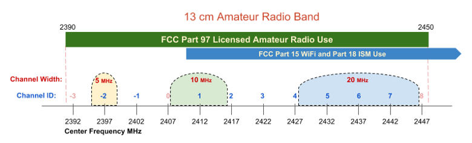
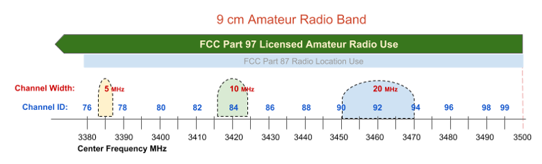
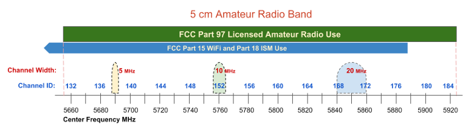

==============================
Radio Spectrum Characteristics
==============================

AREDN |trade| networks operate in the microwave radio spectrum, and licensed amateur radio operators have unique access to many of these frequencies. For bands in which amateur operators share the spectrum, there is an increased chance for RF interference which may make certain frequencies unusable for AREDN |trade| data networking. All of the 33 cm band is shared with other FCC authorized users. All of the upper channels on the 13 cm band are shared with standard FCC Part 15 :abbr:`WiFi (IEEE 802.11x)` and FCC Part 18 :abbr:`ISM (Industrial, Scientific, Medical)` users, as are all of the lower channels on the 5 cm band. The only frequency range which amateur operators do not currently share with non-licensed users is the 9 cm band, in which the US military may occasionally operate radio location units. The following table lists each amateur radio band, frequency range, usable channel width, and the number of channels that are available for AREDN |trade| networking.

=======  =================  ==============  ========
Band     Frequency Range    Usable Width    Channels
=======  =================  ==============  ========
33 cm    902-928   MHz      25 MHz          5
13 cm    2390-2450 MHz      45 MHz          9
9  cm    3300-3500 MHz      120 MHz         24
5  cm    5650-5925 MHz      260 MHz         52
=======  =================  ==============  ========

The table above shows that the 9 cm band has the most available bandwidth in its unshared channels, while the 5 cm band has the next largest amount of available bandwidth in unshared channels. The choice of a frequency band for AREDN |trade| networking depends on several different factors, but you can "mix and match" bands in your network design as long as both sides of a radio link use the same band, channel, and channel width. The advantages and disadvantages of each frequency range are explained in the sections below.

900 MHz Characteristics
-----------------------

**Disadvantages**
  The entire 33 cm band is shared between several FCC authorized radio services. The disadvantage of using this band for AREDN |trade| networking is that in all but the most remote areas the RF noise floor may be very high, which reduces the :abbr:`SNR (Signal to Noise Ratio)` and results in packet loss, retransmission delays, and lower usable link quality.

  Another disadvantage is that the required antenna system and support structures may be larger and heavier than those of higher frequency systems, and the equipment can be more expensive than devices that operate in the 2.4 and 5.8 GHz bands. Also the entire band is quite narrow (25 MHz) which means that only one, two, or five radio channels can exist in this shared frequency range, depending on the channel width that is selected.

**Advantages**
  The advantage of this frequency band is that its longer wavelength makes it better suited for penetrating some types of obstructions and foliage which would normally block signals at higher frequencies. Its :abbr:`NLOS (Non Line of Sight)` propagation characteristics may be exactly what is needed in order to establish an RF link between two difficult locations.

2.4 GHz Characteristics
-----------------------

**Disadvantages**
  The upper channels of the 13 cm band are shared with several other FCC authorized services. Depending on local RF conditions it may not be possible to use these shared channels because of the high noise floor which reduces :abbr:`SNR (Signal to Noise Ratio)` and decreases signal quality. This leaves licensed amateur operators only two unshared channels with a possible bandwidth of 10 MHz each.

  One concern with all of the higher frequency bands is that there must be clear line of sight between the nodes on each side of the link. This means that not only do the nodes need to have an unobstructed direct path, but the Fresnel Zone between the nodes must also be clear. The diameter of the Fresnel Zone depends on the frequency and the distance between nodes. For example, on a link in the 13 cm band with 10 miles between nodes, the first Fresnel Zone radius will be 72 feet. If less than 20% of the Fresnel Zone is obstructed there is little signal loss, but any blockage beyond 40% will cause significant signal loss and could make the path unusable. In the 13 cm band the 60% no blockage radius is approximately 43 feet, which is often higher than most *Intermediate* or *Last Mile* nodes have been installed. Careful consideration must be given to node height and the terrain between nodes in order to minimize obstructions.

**Advantages**
  Within the available frequency range you have the option of selecting channel widths of either 5, 10, or 20 MHz, but only the 5 and 10 MHz widths should be used on the unshared lower channels. A larger channel width will provide higher data rates. However, one effect of reducing the channel width is to increase the :abbr:`SNR (Signal to Noise Ratio)` to improve signal quality. For example, changing from a 20 MHz to a 5 MHz channel width will result in a 6 dB signal gain and could make the difference between a marginal link and a usable one.

  One advantage for the 13 cm band is that radio equipment and antenna systems are more readily available and less costly due to higher consumer demand. There is a wide variety of equipment from several manufacturers which supports the AREDN |trade| firmware and operates in this band. Radio and antenna systems for this band are often smaller in size and less difficult to install. With clear line of sight and well-tuned antennas, 2.4 GHz signals can propagate across very long distances.

3.4 GHz Characteristics
-----------------------

**Disadvantages**
  As mentioned above, there must be clear line of sight and the Fresnel Zone between nodes also must be clear. For a link in the 9 cm band with 10 miles between nodes the first Fresnel Zone radius will be 62 feet, which is less than the 13 cm band discussed above. However, the 60% no blockage radius is still about 37 feet. Consider node :abbr:`AGL (height Above Ground Level)` and terrain in order to minimize obstructions.

  Equipment for the 9 cm band is less readily available and is typically more expensive due to less consumer demand. Care must be taken when selecting radios so as not to confuse them with the more common :abbr:`WiMAX (IEEE 802.16)` devices which are designed for the 3.65 GHz range.

**Advantages**
  The main advantage for using the 9 cm band is that it has more available bandwidth for use in unshared channels than any other band. You can select channel widths of 5, 10, or 20 MHz, with larger channel widths providing higher data rates. Remember that reducing the channel width will increase the :abbr:`SNR (Signal to Noise Ratio)` to improve signal quality if that is an issue for a particular link. Equipment in the 9 cm band is well-suited for *Backbone Links* since there is little possibility for interference from other devices sharing these frequencies at tower sites. With clear line of sight and well-tuned antennas, 3.4 GHz signals can propagate across very long distances.

5.8 GHz Characteristics
-----------------------

**Disadvantages**
  As mentioned previously, there must be clear line of sight and the Fresnel Zone between nodes also must be unobstructed. For a link in the 5 cm band with 10 miles between nodes the first Fresnel Zone radius will be 46 feet, which is much less than the frequency bands discussed above. However, the 60% no blockage radius in the 5 cm band is still about 28 feet. Be sure to account for node :abbr:`AGL (height Above Ground Level)` and terrain in order to achieve clear line of sight between nodes.

**Advantages**
  One advantage for using the 5 cm band is that it contains 52 channels, and many of them at the upper end of the band are under-utilized with less chance of interference. You can choose channel widths of 5, 10, or 20 MHz, with larger channel widths providing higher data rates. Remember that reducing the channel width will increase the :abbr:`SNR (Signal to Noise Ratio)` to improve signal quality if that is an issue for a problem link.

  The radio equipment and antenna systems for this band are readily available and are less expensive due to greater consumer demand. There is a wide variety of equipment from several manufacturers which supports the AREDN |trade| firmware and operates across the 52 available channels. Radio and antenna systems for this band are often smaller in size and less difficult to install. Devices in the 5 cm band are also well-suited for *Backbone Links* since there is little chance for RF interference from other radios sharing these frequencies at high profile sites. With clear line of sight and well-tuned antennas, 5.8 GHz signals can propagate across very long distances.

----------

Different frequency ranges are available to connect the mesh nodes that are required in order to fulfill the purposes for your network. As you plan the frequencies to be deployed at specific locations, it may be helpful to use a *spectrum analyzer* for identifying ranges that are already in use. The ultimate goal is to have a reliable data network that accomplishes its purpose for providing services to the intended destinations and users.

.. |trade|  unicode:: U+02122 .. TRADE MARK SIGN
   :ltrim:
