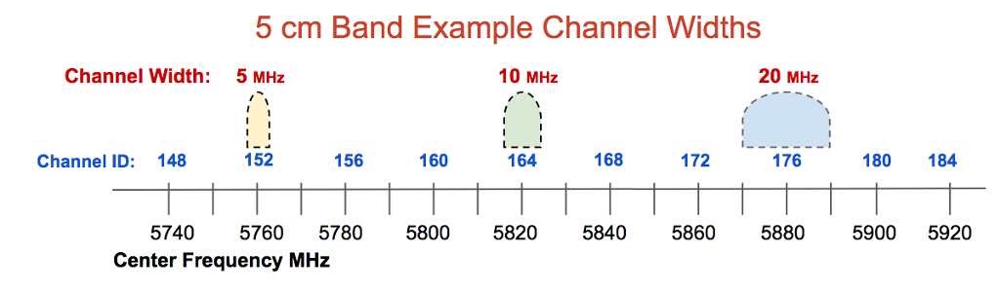
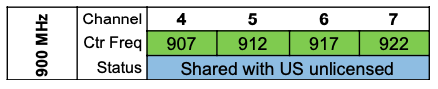
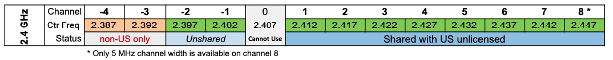
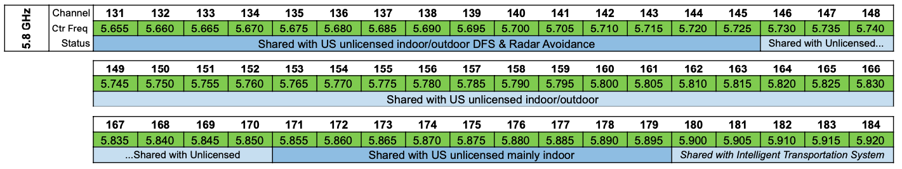

==============================
Radio Spectrum Characteristics
==============================

AREDN |trade| networks operate in the microwave radio spectrum, and licensed amateur radio operators have unique access to some of these frequencies. For bands in which amateur operators share the spectrum, there is an increased chance for RF interference which may make some frequencies unusable for AREDN |trade| data networking. For best results, select frequencies that are not being heavily used within the coverage area.

Each band is divided into channels, each of which consists of a 5 MHz frequency offset identified by the center frequency of the channel and assigned a numerical label. In the example below you can see that a selected channel may use more or less of the frequency range based on the chosen channel width. The wider the channel, the more overlap there will be with adjacent channels. Wide channels have the effect of reducing the number of non-overlapping or non-interfering channels that will be available for use. When selecting channels and widths, be sure to use non-overlapping channels. Devices using channels or channel widths that overlap will interfere with one another and cannot communicate to coordinate the sharing of bandwidth.

Some or all of the bands shown below are shared with other FCC authorized users. For example, all of the upper channels on the 13 cm band are shared with standard FCC Part 15 :abbr:`WiFi (IEEE 802.11x)` users. The following table lists each amateur radio band, frequency range, and the number of channels that are available for AREDN |trade| networking. [footnote]_

=======  =================  ========
Band     Frequency Range    Channels
=======  =================  ========
33 cm    902-928   MHz      4
13 cm    2390-2450 MHz      13
5  cm    5650-5925 MHz      54
=======  =================  ========

The choice of a frequency band for AREDN |trade| networking depends on several different factors, but you can "mix and match" bands in your network design as long as both sides of a radio link use the same band, channel, and channel width.

You have the option of selecting the channel width for each link. When using channels at the top or bottom of a band, be certain that your chosen width will not transmit outside of the FCC Part 97 allocation for that band. Different channel widths may yield better throughput than others. In some areas operators use different channels to isolate links, so they may need to use 10 MHz rather than 20 MHz channels in order to ensure they have enough available channels. Also, long distance links simply have better performance using 10 MHz vs. 20 MHz or 5 MHz channel widths. Test the performance of your links using various channel widths to ensure that they are optimized.

Some of the advantages and disadvantages of each frequency range are explained in the sections below.

900 MHz Characteristics
-----------------------

Disadvantages
  The entire 33 cm band is shared between several FCC authorized radio services. The disadvantage of using this band for AREDN |trade| networking is that in all but the most remote areas the RF noise floor may be very high, which reduces the :abbr:`SNR (Signal to Noise Ratio)` and results in packet loss, retransmission delays, and lower usable link quality.

  Another disadvantage is that the equipment can be more expensive than devices that operate in the 2.4 and 5.8 GHz bands. Also the entire band is quite narrow (25 MHz) which means that only one, two, or four radio channels can exist in this shared frequency range, depending on the channel width that is selected.

Advantages
  The advantage of this frequency band is that its longer wavelength makes it better suited for penetrating some types of obstructions and foliage which would normally block signals at higher frequencies. Its :abbr:`NLOS (Non Line of Sight)` propagation characteristics may be exactly what is needed in order to establish an RF link between two difficult locations.

2.4 GHz Characteristics
-----------------------

Disadvantages
  The upper channels of the 13 cm band are shared with several other FCC authorized services. Depending on local RF conditions it may not be possible to use these shared channels because of the high noise floor which reduces :abbr:`SNR (Signal to Noise Ratio)` and decreases signal quality. This leaves licensed amateur operators only two unshared channels with a possible bandwidth of 10 MHz each.

  One concern with all of the higher frequency bands is that there must be clear line of sight between the nodes on each side of the link. This means that not only do the nodes need to have an unobstructed direct path, but the Fresnel Zone between the nodes must also be clear. The diameter of the Fresnel Zone depends on the frequency and the distance between nodes. For example, on a link in the 13 cm band with 10 miles between nodes, the first Fresnel Zone radius will be 72 feet. If less than 20% of the Fresnel Zone is obstructed there is little signal loss, but any blockage beyond 40% will cause significant signal loss and could make the path unusable. In the 13 cm band the 60% no blockage radius is approximately 43 feet, which is often higher than most *Intermediate* or *Last Mile* nodes have been installed. Careful consideration must be given to node height and the terrain between nodes in order to minimize obstructions.

Advantages
  Within the available frequency range you have the option of selecting channel widths of either 5, 10, or 20 MHz. A larger channel width will provide higher data rates. However, one effect of reducing the channel width is to increase the :abbr:`SNR (Signal to Noise Ratio)` to improve signal quality. For example, changing from a 20 MHz to a 10 MHz channel width will result in a 3 dB signal gain and could make the difference between a marginal link and a usable one. Just remember that when you cut the channel width in half you are also reducing your maximum throughput by half. Carefully test your links to ensure optimal performance.

  One advantage for the 13 cm band is that radio equipment and antenna systems are more readily available and less costly due to higher consumer demand. There is a wide variety of equipment from several manufacturers which supports the AREDN |trade| firmware and operates in this band. With clear line of sight and well-tuned antennas, 2.4 GHz signals can propagate across very long distances.

5.8 GHz Characteristics
-----------------------

Disadvantages
  As mentioned previously, there must be clear line of sight and the Fresnel Zone between nodes also must be unobstructed. For a link in the 5 cm band with 10 miles between nodes the first Fresnel Zone radius will be 46 feet, which is much less than the frequency bands discussed above. However, the 60% no blockage radius in the 5 cm band is still about 28 feet. Be sure to account for node :abbr:`AGL (height Above Ground Level)` and terrain in order to achieve clear line of sight between nodes.

Advantages
  One advantage for using the 5 cm band is that it contains 54 channels, and many of them may be under-utilized with less chance of interference. You can choose channel widths of 5, 10, or 20 MHz, with larger channel widths providing higher data rates. Remember that reducing the channel width will increase the :abbr:`SNR (Signal to Noise Ratio)` to improve signal quality if that is an issue for a problem link.

  The radio equipment and antenna systems for this band are readily available and are less expensive due to greater consumer demand. There is a wide variety of equipment from several manufacturers which supports the AREDN |trade| firmware and operates across the 54 available channels. Radio and antenna systems for this band which are similar in size to those for other bands will often have higher gain. Devices in the 5 cm band are also well-suited for *Backbone Links* since there is little chance for RF interference from other radios sharing these frequencies at high profile sites. With clear line of sight and well-tuned antennas, 5.8 GHz signals can propagate across very long distances.

Different frequency ranges are available to connect the mesh nodes that are required in order to fulfill the purposes for your network. As you plan the frequencies to be deployed at specific locations, it may be helpful to use a *spectrum analyzer* for identifying ranges that are already in use. The ultimate goal is to have a reliable data network that accomplishes its purpose for providing services to the intended destinations and users.

----------

.. [footnote] Late in 2020 the `FCC ruled <https://docs.fcc.gov/public/attachments/FCC-20-138A1.pdf>`_ to sunset secondary Amateur allocations in the 9 cm *(3.3-3.5 GHz)* band. Although existing Amateur operations *"may continue while the Commission finalizes plans to reallocate spectrum,"* investing in or implementing new AREDN |trade| devices in this band is not recommended.
