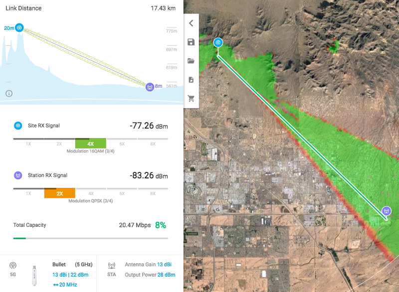
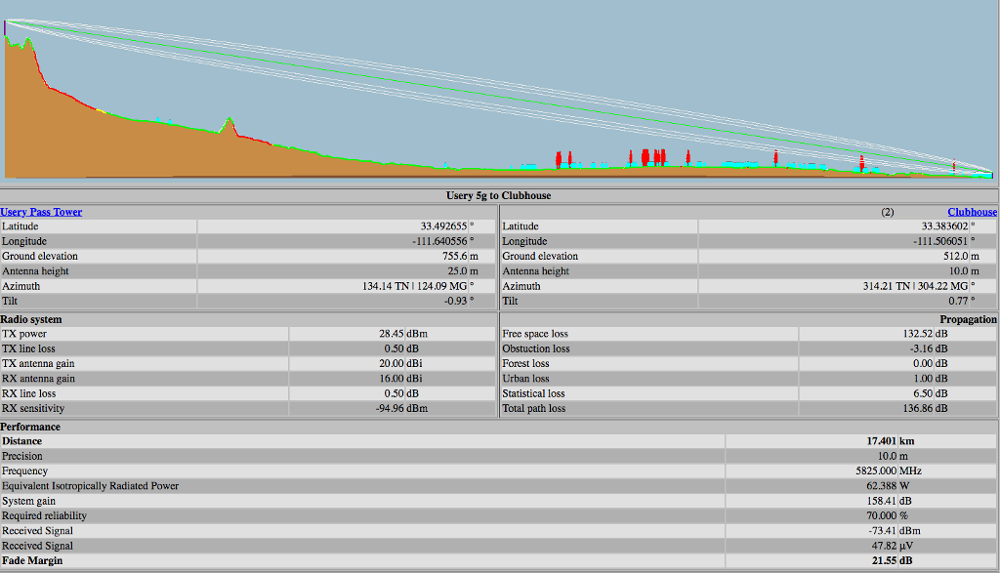
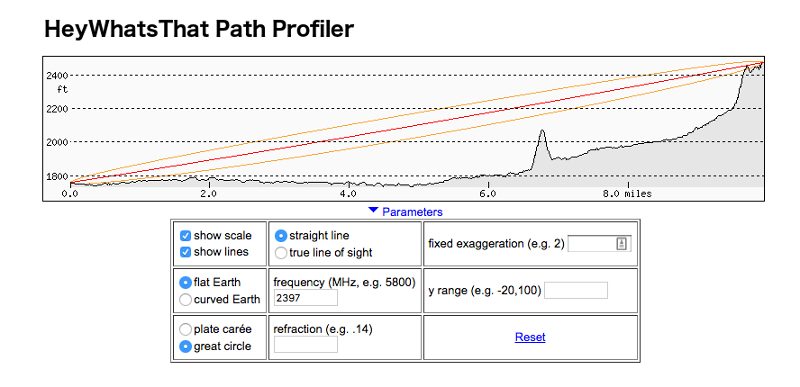
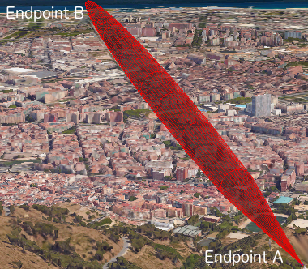
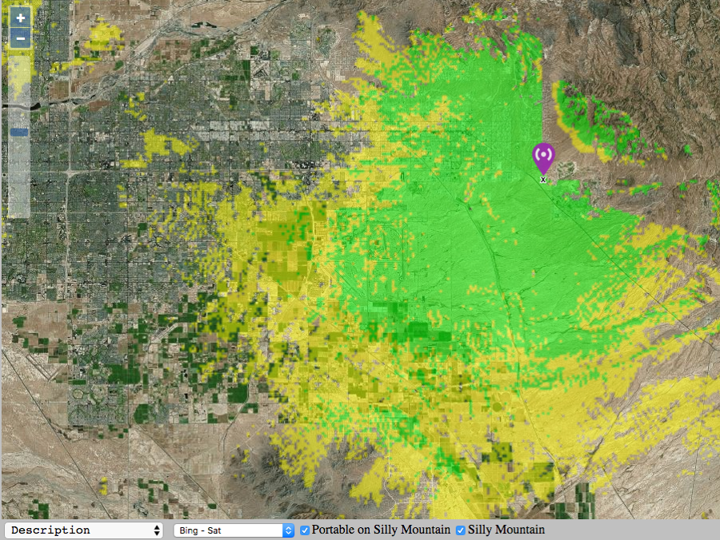

================
Network Modeling
================

As you design your AREDN |trade| network it is often helpful to estimate ahead of time whether a node or link might accomplish your goals for the network. One way to get this information is to use computer modeling programs that predict the performance of RF devices. There are many types of computerized tools that you can use, ranging from relatively expensive commercial software to freely available open source programs. You should select and become familiar with the tool that best fits your aptitude, experience, and budget.

In this section some free tools will be used to illustrate how to determine your network's available paths and overall coverage. Keep in mind that a computer modeling tool only provides a prediction and does not guarantee that two sites will be able to communicate when actually deployed.

Creating a Path Profile
-----------------------

Path profiles are very helpful for determining whether a link between two nodes will have clear line of sight and acceptable signal levels. In order to create a path profile you will need to have the following information for both of your node endpoints:

* Latitude and Longitude
* Antenna :abbr:`AGL (height Above Ground Level)`
* Frequency
* Transmit Power
* Line Loss
* Antenna Gain
* Receiver Sensitivity

Most computer modeling software will be able to estimate the link characteristics given this information.

Ubiquiti AirLink Tool
+++++++++++++++++++++

If you are using Ubiquiti radios there is a free modeling tool available on the Ubiquiti website (http://link.ubnt.com). This tool will ask you to locate your node endpoints by clicking on a map display. It allows you to select the radio frequency and model from a dropdown list, as well as having you specify the antenna heights, antenna gain, and transmit power. With this information it will calculate and display the coverage area and the link quality.

The path profile is color coded to indicate whether the link quality is adequate. It displays the link distance, line of sight, as well as the Fresnel Zone and 60% clearance area. It also estimates the signal levels at each endpoint and the predicted throughput for the link. An example *AirLink* path profile is shown below.

----

----

VE2DBE's Radio Mobile Tool
++++++++++++++++++++++++++

Whether or not you are using Ubiquiti devices, you can create detailed path profiles using VE2DBE's *Radio Mobile* software. This program is available for download, but it is very easy to use the web-based version: http://www.ve2dbe.com/rmonline.html

With *Radio Mobile* you must first create a *Site* for each of your endpoints. Then you can select the endpoints from your *Site* dropdown to generate a path profile between any of the listed locations. Once you enter the radio and antenna information in the link display, *Radio Mobile* will create your path profile. There are several metrics displayed here which may not be available in the Ubiquiti tool, including free space path loss, obstruction loss, forest loss, urban loss, and fade margin. This additional information may help you determine why a path is not working, and it may assist you with choosing alternate sites for node locations. Typically a fade margin of 15 dB or greater is adequate for a usable link. An example *Radio Mobile* path profile is shown below.

----

----

HeyWhatsThat Path Profiler
++++++++++++++++++++++++++

Another web-based tool will generate a path profile from points selected on a map. HeyWhatsThat Path Profiler is available here: http://heywhatsthat.com/profiler.html

Simply click on the map at the bottom of the webpage to add an endpoint for each side of your link. Once an endpoint has been added, it can be moved by clicking and holding the endpoint while dragging it to the new location on the map. After adding your endpoints you will see the path profile displayed at the top of the webpage. You can click the *Parameters* link under the path display to specify additional items for the path calculation. If you specify the frequency then the Fresnel zone for the path will be added to the display.

----

----

Radio Fresnel Tool
++++++++++++++++++

This web-based tool will generate a KML file which can be viewed as a 3D path profile using *Google Earth* software. Radio Fresnel is available here: http://www.radiofresnel.com

Simply enter the required site information into the online form and click the *Get KML* button at the bottom of the webpage. There is a sample KML file as well as a video tutorial for how to use the tool.

----

----

Determining Node or Network Coverage
------------------------------------

In many cases it would be helpful to know ahead of time what area could potentially be covered with the signal generated by a particular node. Creating a coverage plot will show the predicted coverage on any of several types of base map.

An example *Radio Mobile* coverage plot is shown below. After entering the site, radio, and antenna characteristics the software produces a color coded map that predicts the areas of best, marginal, or no signal. One useful feature of *Radio Mobile* allows you to overlay several site coverage plots onto a single map so you can see the extent of coverage provided by multiple nodes in your network. Coverage maps such as these can show you the areas of adequate signal, as well as the "holes" which you may need to fill if you require more comprehensive coverage.

