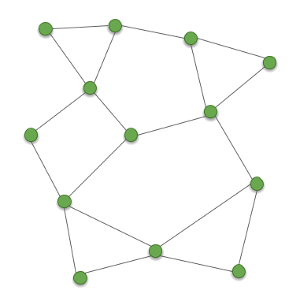
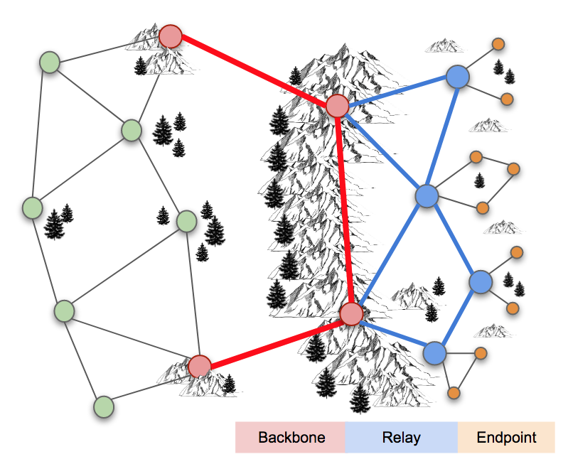

==================
Network Topologies
==================

Every AREDN |trade| node is capable of automatically joining an AREDN |trade| mesh network which is operating with the same SSID, channel, and bandwidth. A *Mesh* topology consists of independent nodes which each explore their surroundings by broadcasting their identity and listening for their neighbors' responses. Once nodes identify others within radio range, they share this information so that each node has a picture of the network topology. Periodic updates adjust the routes based on changes in signal quality or loss of a link, allowing the network to adapt to changing conditions. Since there are usually several possible routes between nodes, and since network disruptions typically effect only part of the network, a *Mesh* topology can be self-healing.

This automatic ability to form a mesh network is built into the AREDN |trade| firmware on each node. Every node within radio range of other nodes will be able to participate in the network to extend its reach, provide route redundancy, or host services needed on the network at large. This basic network may serve its purpose perfectly for a short-term network deployment in support of a local event, or even for more permanent communication between nodes which are always within radio range.

Types of Links
--------------

A variety of factors could isolate groups of mesh nodes from each other. For example, distance, terrain, structures, or foliage may prevent some of the nodes from communicating via RF. For long-term or permanent deployments there may be a need for special types of network links that connect what are called mesh "islands." A *link* consists of both sides of a radio path, including the two devices that communicate back and forth across that path.

Backbone Links
  As the name implies, these links form the backbone or superhighway along which large amounts of data can travel for long distances at relatively high speed. Typically backbone or "backhaul" links are permanent installations on mountain peaks, tall buildings, or high towers. They are usually point-to-point links with large high-gain antenna systems running on reliable power sources. In some cases these links are designed with redundant radios which help ensure path protection. Backbone links can operate over distances between 10 to 30+ miles.

Relay Links
  Relay links bridge the gaps between endpoint nodes. Their primary purpose is to pass network data, but there may be cases where they also serve as mesh access nodes for users. Sometimes these links are called "mid-mile", "distribution", or "intermediate" nodes. They are usually installed on medium-height towers or buildings in order to achieve high signal quality with good line of sight to other relay nodes. Depending on conditions, intermediate links may operate over distances between 3 to 10+ miles.

Endpoint Links
  Endpoint links are used to connect destination nodes to the mesh network. Sometimes these links are call "last mile", "tactical", or "terminal" nodes. Usually these nodes serve either as the originator or the final destination for network traffic. Depending on local conditions, endpoint links typically operate over distances of 3 miles or less.

Different types of radio links may be needed to connect all of the mesh nodes that are required in order to fulfill the purposes for your network. The ultimate goal is to have a reliable data network that accomplishes its purpose for providing services to the intended destinations and users.
