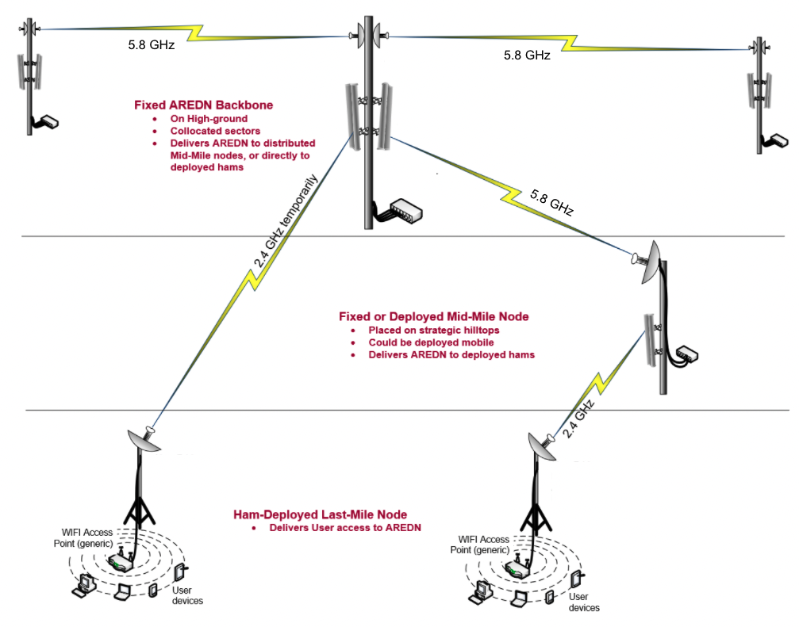
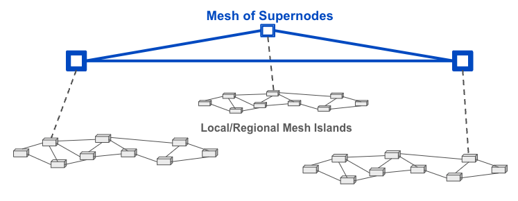

==================
Network Topologies
==================

Every AREDN® node is capable of automatically joining an *ad hoc* mesh network which is operating with the same SSID, channel, and bandwidth. New nodes will each explore their surroundings by broadcasting their identity and listening for their neighbors' responses. Once nodes identify others within radio range, they share this information so that each node has a picture of the network topology. Periodic updates adjust the network routes based on changes in signal quality or loss of a link, allowing the network to adapt to changing conditions. Since there can be several possible routes between nodes, and since network disruptions typically effect only part of the network, a mesh topology can provide redundancy for network links.

Every AREDN® node within radio range of other nodes will be able to participate in the network to extend its reach, provide route redundancy, or host services needed on the network at large. This simple mesh topology may serve its purpose perfectly for a short-term network deployed in support of a local event, or even for more permanent communication between nodes which are always within radio range. However, as mentioned in the previous chapter, the most important consideration for you network design is, *"What is the purpose for this particular network?"* The specific requirements of your mission should drive the design of your data network.

Types of Topologies
-------------------

Although AREDN® nodes are capable of forming a simple mesh network, it is more common for operators to use different topologies in order to accomplish their data communication goals in growing networks. Typical network designs include Point-to-Point, Hub-and-Spoke, Tree or hybrid topologies.

Point-to-Point Topology
  Point-to-Point topologies are best suited for moving data between the far endpoints, potentially using one or more intermediate nodes in order to traverse different types of terrain or to overcome obstacles in the network path.

  .. image:: _images/point-to-point.png
     :alt: Point-to-Point Topology
     :align: center

Hub-and-Spoke Topology
  Hub-and-Spoke topologies work well in situations where the data communication to outlying nodes should be coordinated or funneled through a central location. Even if a remote node becomes unreachable, the rest of the network can continue to operate; but if the central node goes offline, the network will not function.

  .. image:: _images/hub-and-spoke.png
     :alt: Point-to-Point Topology
     :align: center

Tree Topology
  A tree topology can be used to segment or partition network traffic, keeping specific data within a localized area while also allowing for links to remote parts of the network. The tree topology uses a parent-child hierarchy to structure the paths that data can take. This design can be easily scaled up or down to meet the specific requirements of the mission, but it does create "single points of failure". If nodes go offline within the hierarchy then entire branches of the tree can become unreachable.

  .. image:: _images/tree-topology.png
     :alt: Tree Topology
     :align: center

|

Types of Links
--------------

A *link* consists of both sides of a radio path, including the two devices that communicate back and forth across that path. Depending on the specific goals and the RF environment, there may be a need for special types of network links that connect the areas where data communication is required to fulfill your mission.

Backbone Links
  As the name implies, these links form the backbone or superhighway along which large amounts of data can travel for long distances at relatively high speed. Typically backbone or "backhaul" links are permanent installations on mountain peaks, tall buildings, or high towers. They are usually point-to-point links with large high-gain antenna systems running on reliable power sources. In some cases these links are designed with redundant radios which help ensure path protection. Backbone links can operate over distances between 10 to 30+ miles.

Relay Links
  Relay links bridge the gaps between endpoint nodes. Their primary purpose is to pass data efficiently, but there may be cases where they also serve as network access points for users. Sometimes these links are called "mid-mile", "distribution", or "intermediate" nodes. They are usually installed on medium-height towers or buildings in order to achieve high signal quality with good line of sight to other relay or backbone nodes. Depending on conditions, intermediate links may operate over distances between 3 to 10+ miles.

Endpoint Links
  Endpoint links are used to connect destination nodes to the network. Sometimes these links are called "last mile", "tactical", or "terminal" links. Usually the nodes at the far end will serve either as the originators or the final destinations for network traffic. Depending on local conditions, endpoint links typically operate over distances of 3 miles or less.

Different types of radio links may be needed to connect all of the nodes that are required in order to fulfill the purposes for your network. The ultimate goal of your network topology is to have a reliable data network that accomplishes its purpose for providing services to the intended destinations and users.

Supernode Architecture
----------------------

Once several local or regional networks have been created, there may be a need for access between these "mesh islands." In the past, node owners used direct Internet tunnel connections to accomplish this. However, this has the effect of merging the mesh islands into a single network with all of the routing traffic traversing all of the member networks. Many nodes were unable to handle the increased load.

A more efficient solution is to use the Supernode network to provide access across mesh islands, without sharing all of the local routing traffic across the linked networks. The Supernode network is a high-level mesh network --- ``super`` meaning *"above or higher."* The Supernode network sits above the isolated mesh networks and provides connectivity while insulating the local networks from the normal routing load.

Example Usage
  If you need access to a service that is running on a remote network, click the Cloud mesh icon |icon1| to view services available across the Supernode network. You can use the search box at the top of the page to limit the display to a specific search string (such as a callsign or a service name). Once you have located the remote service you can click its link to open that service or node. This allows you to have full interaction with the remote service without requiring a dedicated network link between your mesh and the remote network.

A Supernode is a specialized node whose sole purpose is to link with other Supernodes and to shield each local network from the aggregate routing traffic. **Cudy TR3000** or **OpenWRT One** hardware is recommended for Supernodes, along with an Internet connection that provides robust bandwidth. It is also possible to implement a Supernode on a *Mikrotik hAP ac2/ac3* or a Virtual Machine running AREDN® firmware. For more information, refer to *Configuring a Supernode* in the **How-To** section of the documentation.

.. |icon1| image:: ../_icons/cloudmesh.png
  :alt: Cloud mesh view
