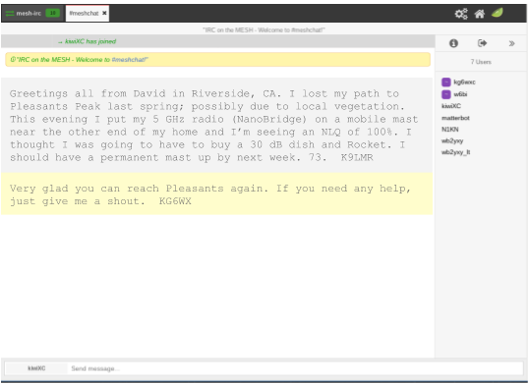
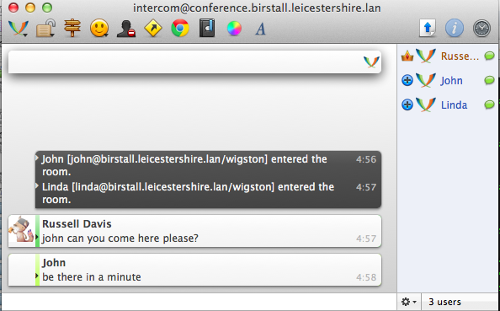
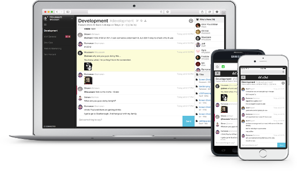
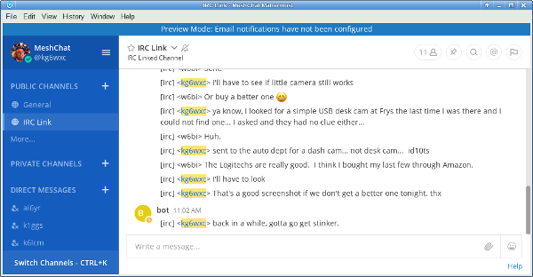
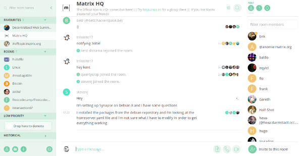

=============
Chat Programs
=============

`Online chat <https://en.wikipedia.org/wiki/Online_chat>`_ software includes any program which transmits short text messages between the sender and receiver. These realtime keyboard-to-keyboard messages create an environment similar to a spoken conversation. A chat session may involve one-to-one communication or group meetings. These programs are valuable for quick question/answer interactions where immediate replies are important. Timestamped conversation history is typically saved for future reference.

Chat programs are one of the least network-intensive types of communication programs, so they are a good candidate as low impact services on a mesh network. Many chat programs also offer file sharing, which allows you to get two functions within a single program. The following list is not comprehensive or complete but represents a sample of the types of chat programs that might be available for you to use as services on your mesh network. Only programs with open source licenses were included in this list, although commercial chat software can also be used.

MeshChat
--------

MeshChat has become the primary chat service for AREDN |trade| networks because it was written specifically for mesh communication. Users access MeshChat via web browser, and the service runs on the mesh node itself or on a LAN-connected Raspberry Pi computer. After logging in by entering a call sign, send a message by typing into a text box and clicking the *Submit* button. The list of active users is displayed, and every message is visible to all participants on the chat service. Multiple *Zones* and *Channels* are supported for categorizing and separating message traffic.

The message database is stored on every device where MeshChat is running. Nodes may have intermittent network connectivity, but as long as at least one node is available the MeshChat database remains intact. Once nodes come online they immediately catch up by retrieving a full copy of the message database. If any new messages are found, they are appended to the local message database.

In addition to the keyboard-to-keyboard chat feature, MeshChat also allows files to be shared between nodes. Files may be uploaded from or downloaded to the user's computer at any time. If MeshChat is running on a radio node then the file storage is limited to 500 kb, but if running on an external computer the file storage is limited only by the size of the disk that is allocated for MeshChat files.

MeshChat *Action Scripts* also provide for functional extensions, such as sending messages to an SMS gateway for external distribution. It is also possible for action scripts to periodically save the message database for archive purposes or integration with external tools. For additional information about MeshChat, visit this link: `MeshChat <http://www.trevorsbench.com/meshchat-messaging-for-mesh-networks/>`_

.. image:: _images/meshchat.png
   :alt: MeshChat Web Interface
   :align: center

Internet Relay Chat
-------------------

Several implementations of `Internet Relay Chat <https://en.wikipedia.org/wiki/IRCd>`_ are available, either as open source software or in proprietary versions. The Internet Relay Chat Daemon (IRCd) is a server program that listens for connections from IRC client programs and brokers the communication between the connected clients. With this client-server architecture, the IRC server must be available on a network link with sufficient bandwidth in order for the clients to function.

A wide variety of features and functions are available with these and similar chat programs, including various zones, channel types, and user roles. For additional information about IRC services, visit these links: `IRC Servers <https://en.wikipedia.org/wiki/Comparison_of_Internet_Relay_Chat_daemons>`_ and `IRC Clients <https://en.wikipedia.org/wiki/Comparison_of_Internet_Relay_Chat_clients>`_

Jabber/XMPP
-----------

Originally known as Jabber, `XMPP <https://en.wikipedia.org/wiki/XMPP>`_ servers have been around for a long time but are fully compliant with modern messaging standards thanks to a large community of developers worldwide. These servers provide one-to-one messaging as well as group chat sessions. User lists have activity and presence indicators, and chat history can be archived for later use. There are dozens of feature modules available for XMPP servers which can extend the functionality as needed.

Two of the most popular XMPP servers are eJabberd and Prosody, but there are many others. For additional information about these services, visit the following links: `eJabberd <https://ejabberd.im/>`_ and `Prosody <https://prosody.im/>`_

Let's Chat
----------

*Let's Chat* is an open source messaging service for small teams. It provides one-to-one communication between `XMPP <https://en.wikipedia.org/wiki/XMPP>`_ users as well as group messaging and @mentions in a variety of chat rooms. Searchable conversation history is available, in addition to text and image pasting, user activity notifications, and file uploads. User self-registration is configurable on the server. For additional information about Let's Chat, visit this link: `Let's Chat <https://github.com/sdelements/lets-chat>`_

Mattermost
----------

The *Mattermost Team Edition* is an open source platform that supports mobile and desktop messaging apps. It provides one-to-one and group messaging, file sharing, and message history with search capabilities. It is often described as an open source alternative to the commercial *Slack* communication tool.

Mattermost supports @mentions, and channels are available for organizing conversations which can be topic-based, group-based, or event-based. Notifications indicate user presence and activity. File sharing is provided for PDF and text files, as well as audio, video, and image files. For additional information about Mattermost, visit this link: `Mattermost <https://mattermost.com/>`_

Matrix - Synapse
----------------

*Synapse* is the "homeserver" implementation of the *Matrix* communication platform. As with a traditional client-server architecture, every user runs a Matrix client that connects to a Synapse server which stores the personal chat history and user account information. However, these servers communicate with each other on the network, which creates a distributed content architecture that minimizes single points of failure.

Matrix services can provide one-to-one communication channels as well as group chats in a variety of rooms. User presence and typing notifications are supported, as well as chat history and read receipts. Although the Matrix platform is intended to provide end-to-end encryption, it can be run without cryptographic signing. Matrix can also integrate with :abbr:`IRC (Internet Relay Chat)` services, as well as :abbr:`VoIP (Voice over IP)` and video conferencing solutions via `WebRTC <https://en.wikipedia.org/wiki/WebRTC>`_. For additional information about Matrix-Synapse, visit these links: `Matrix Home <https://matrix.org/blog/home/>`_ and `Synapse <https://github.com/matrix-org/synapse>`_

Example Chat Service Comparison
-------------------------------

Platform abbreviations:
  win=MS Windows, mac=Apple, lin=Linux, rpi=Raspberry Pi

===========  =============  ============  ====  ===============  ======
Program      Architecture   Network Load  Age   Platform         Effort
===========  =============  ============  ====  ===============  ======
MeshChat     mesh aware     small         new   node/rpi         easy
IRCd server  client-server  small         old   lin/mac/rpi/win  medium
Jabber/XMPP  client-server  small         old   lin/mac/rpi/win  medium
Let's Chat   client-server  small         new   lin/mac/rpi/win  medium
Mattermost   client-server  medium        new   linux            expert
Matrix       distributed    medium        new   linux/mac        expert
===========  =============  ============  ====  ===============  ======

.. |trade|  unicode:: U+02122 .. TRADE MARK SIGN
   :ltrim:
